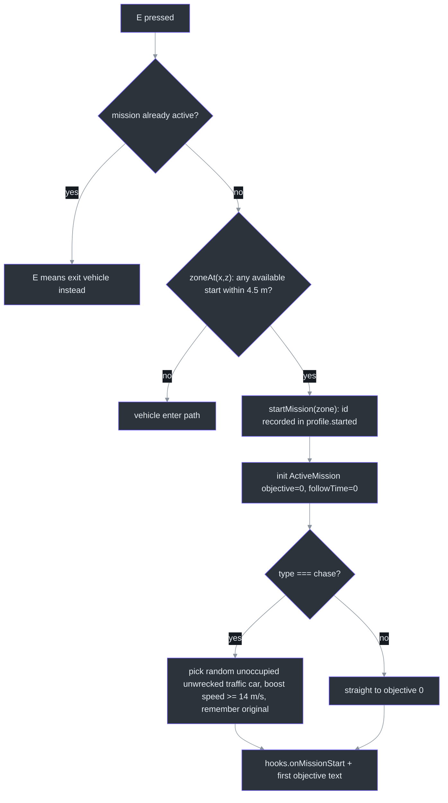
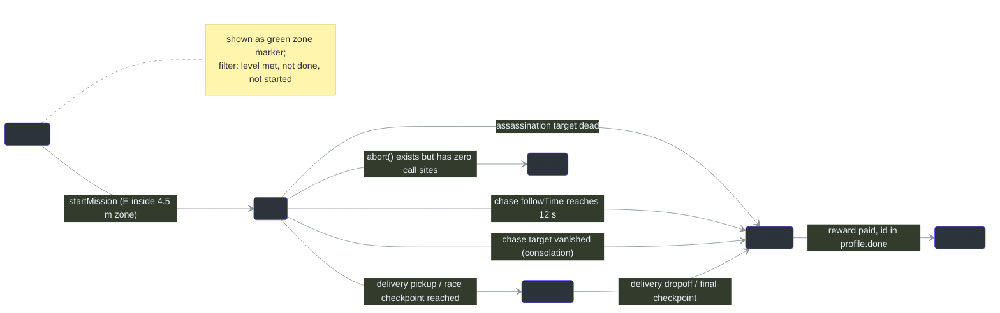
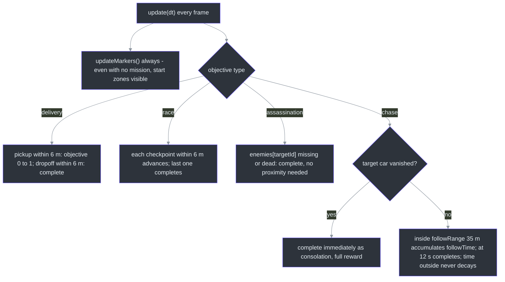

# MissionSystem — 4 Missions, Markers & XP Progression

## Overview

`MissionSystem` is the data-driven mission layer: world start zones, exactly **four** objective definitions covering all four types (delivery / race / assassination / chase), 3D waypoint markers with minimal per-frame churn, and a money/XP/level progression profile persisted to localStorage ([class doc](https://github.com/noiz354/arena-city-try/blob/main/src/systems/MissionSystem.ts#L39-L43)). Anchor: [src/systems/MissionSystem.ts:44](https://github.com/noiz354/arena-city-try/blob/main/src/systems/MissionSystem.ts#L44).

Why data-driven: adding a fifth *mission* is one `MissionDef` appended to the array — the four objective types are handled generically in three switch sites; only a new *type* requires touching logic ([src/data/missions.ts:27](https://github.com/noiz354/arena-city-try/blob/main/src/data/missions.ts#L27)).

### At a glance

| Aspect | Value | Source |
|---|---|---|
| Start zone radius | `MISSION_START_DIST = 4.5` m (squared compare) | [`src/data/missions.ts:83`](https://github.com/noiz354/arena-city-try/blob/main/src/data/missions.ts#L83) |
| Waypoint reach radius | `WAYPOINT_DIST = 6` m | [`src/data/missions.ts:84`](https://github.com/noiz354/arena-city-try/blob/main/src/data/missions.ts#L84) |
| XP per level | 100 (`level = floor(xp/100)+1`) | [`src/systems/MissionSystem.ts:36`](https://github.com/noiz354/arena-city-try/blob/main/src/systems/MissionSystem.ts#L36) |
| Chase tuning | followRange 35 m (squared check), followTime 12 s to complete | [`src/data/missions.ts:79-81`](https://github.com/noiz354/arena-city-try/blob/main/src/data/missions.ts#L79-L81) |
| Chase boost | target traffic car sped up to ≥ 14 m/s, original restored on end | [`src/systems/MissionSystem.ts:99-108`](https://github.com/noiz354/arena-city-try/blob/main/src/systems/MissionSystem.ts#L99-L108) |
| Marker colors | green `0x2ecc71` available zone y=1.2; yellow `0xffd166` active waypoint y=1.4 | [`src/systems/MissionSystem.ts:208-219`](https://github.com/noiz354/arena-city-try/blob/main/src/systems/MissionSystem.ts#L208-L219) |

## The four missions

From [src/data/missions.ts:27-81](https://github.com/noiz354/arena-city-try/blob/main/src/data/missions.ts#L27-L81):

| id | Name | Type | Start (x,z) | Reward | XP | Req. lvl | Specifics |
|---|---|---|---|---|---|---|---|
| `delivery_1` | PIZZA DELIVERY | delivery | −60, 60 | $150 | 60 | 1 | pickup (−62,58), dropoff (92,−64) |
| `race_1` | MIDTOWN SPRINT | race | 82, −52 | $250 | 90 | 1 | 6 checkpoints around map perimeter |
| `assassination_1` | THUG CLEANUP | assassination | −92, −84 | $400 | 150 | 2 | `targetId: 3` (index into enemies array) |
| `chase_1` | TAIL THE TARGET | chase | 104, 64 | $350 | 120 | 2 | followRange 35 m, followTime 12 s |

## Architecture

### Mission start flow

[ModeController](../gameplay-core/mode-controller.md) polls `zoneAt(x, z)` on E press — on foot at [src/systems/ModeController.ts:115-118](https://github.com/noiz354/arena-city-try/blob/main/src/systems/ModeController.ts#L115-L118), driving using the car position at [`:159-163`](https://github.com/noiz354/arena-city-try/blob/main/src/systems/ModeController.ts#L159-L163):



<!-- Sources: src/systems/MissionSystem.ts:81-111; src/systems/ModeController.ts:115-127,159-168 -->

Availability filter: level met AND not done AND not started ([src/systems/MissionSystem.ts:68-73](https://github.com/noiz354/arena-city-try/blob/main/src/systems/MissionSystem.ts#L68-L73)); `startMission` no-ops while a mission is already active.

### Mission lifecycle



<!-- Sources: src/systems/MissionSystem.ts:90-111,155-242 -->

### Objective checks per frame

`update(dt)` runs every frame from [src/game/Game.ts:425](https://github.com/noiz354/arena-city-try/blob/main/src/game/Game.ts#L425):



<!-- Sources: src/systems/MissionSystem.ts:155-202 -->

Marker diffing keeps this cheap: `updateMarkers` recomputes `markerPositions()` every frame but only *rebuilds* meshes when count or color changed (mission start/complete/objective transitions); otherwise it copies positions onto existing groups — moving waypoints reposition without allocation or geometry disposal ([src/systems/MissionSystem.ts:254-271](https://github.com/noiz354/arena-city-try/blob/main/src/systems/MissionSystem.ts#L254-L271)). Each marker is a 14 m vertical light beam (opacity 0.5), a floating rotated ring box 1.6³ (opacity 0.9), and an emissive base plate 2.2×0.15×2.2 ([`makeMarker`, :320-349](https://github.com/noiz354/arena-city-try/blob/main/src/systems/MissionSystem.ts#L320-L349)).

### Completion & progression

```mermaid
%%{init: {"theme": "base", "themeVariables": {"background": "#0d1117", "primaryColor": "#2d333b", "primaryBorderColor": "#6d5dfc", "primaryTextColor": "#e6edf3", "lineColor": "#8b949e", "actorBkg": "#2d333b", "actorBorder": "#6d5dfc", "actorTextColor": "#e6edf3", "signalColor": "#8b949e", "signalTextColor": "#e6edf3"}}}%%
sequenceDiagram
    autonumber
    participant MS as MissionSystem.complete
    participant P as Profile
    participant G as Game hooks
    participant SM as SaveManager
    MS->>P: restore chase car original speed (if any)
    MS->>P: addReward(money, xp), level = floor(xp/100)+1
    MS->>P: append mission id to done; clear active state
    MS->>G: onMissionComplete(def, reward)
    G->>SM: autosave triggered (30 s cadence also applies)
```

<!-- Sources: src/systems/MissionSystem.ts:61-66,221-233; src/game/Game.ts:213-222,572-585 -->

The profile `{ money, xp, level, done[], started[] }` is the only serialized state ([src/systems/MissionSystem.ts:13-19](https://github.com/noiz354/arena-city-try/blob/main/src/systems/MissionSystem.ts#L13-L19)); SaveManager stores it as its `profile` string field ([src/systems/SaveManager.ts:13](https://github.com/noiz354/arena-city-try/blob/main/src/systems/SaveManager.ts#L13)). `deserialize` is tolerant — corrupt input silently ignored, level recomputed from xp ([`:302+`](https://github.com/noiz354/arena-city-try/blob/main/src/systems/MissionSystem.ts#L302)).

## Public API

| Member | Signature | Behavior | Source |
|---|---|---|---|
| `addReward` | `(money, xp) => void` | Credits profile + recomputes level | [`src/systems/MissionSystem.ts:61`](https://github.com/noiz354/arena-city-try/blob/main/src/systems/MissionSystem.ts#L61) |
| `availableMissions` | `() => MissionDef[]` | Level met AND not done AND not started | [`src/systems/MissionSystem.ts:68`](https://github.com/noiz354/arena-city-try/blob/main/src/systems/MissionSystem.ts#L68) |
| `zoneAt` | `(x, z) => MissionDef \| null` | Start zone under position (4.5 m) | [`src/systems/MissionSystem.ts:81`](https://github.com/noiz354/arena-city-try/blob/main/src/systems/MissionSystem.ts#L81) |
| `startMission` | `(def) => void` | Ignored while a mission is active; chase target selection + speed boost | [`src/systems/MissionSystem.ts:90`](https://github.com/noiz354/arena-city-try/blob/main/src/systems/MissionSystem.ts#L90) |
| `objectiveText` | `() => string` | Live text incl. distances/timer (active! non-null asserted) | [`src/systems/MissionSystem.ts:114`](https://github.com/noiz354/arena-city-try/blob/main/src/systems/MissionSystem.ts#L114) |
| `waypoint` | `() => Vector3 \| null` | Current goal position; null for dead assassination targets | [`src/systems/MissionSystem.ts:133`](https://github.com/noiz354/arena-city-try/blob/main/src/systems/MissionSystem.ts#L133) |
| `markerPositions` | `() => Array<{pos, color}>` | Minimap + 3D source of truth | [`src/systems/MissionSystem.ts:208`](https://github.com/noiz354/arena-city-try/blob/main/src/systems/MissionSystem.ts#L208) |
| `complete` / `abort` | `() => void` | Complete pays reward; abort restores chase speed but has zero call sites | [`src/systems/MissionSystem.ts:221`](https://github.com/noiz354/arena-city-try/blob/main/src/systems/MissionSystem.ts#L221), [`:235`](https://github.com/noiz354/arena-city-try/blob/main/src/systems/MissionSystem.ts#L235) |
| `serialize` / `deserialize` | JSON profile round-trip | Tolerant parse; level recomputed from xp | [`src/systems/MissionSystem.ts:298`](https://github.com/noiz354/arena-city-try/blob/main/src/systems/MissionSystem.ts#L298) |

Consumers: Game feeds the minimap with `waypoint()` + `markerPositions()` ([src/game/Game.ts:531-532](https://github.com/noiz354/arena-city-try/blob/main/src/game/Game.ts#L531-L532), rendered in [src/systems/MinimapSystem.ts:73-82](https://github.com/noiz354/arena-city-try/blob/main/src/systems/MinimapSystem.ts#L73-L82)); HUD shows mission name/objective plus compass arrow and distance to `waypoint()` ([src/ui/hud.ts:150-174](https://github.com/noiz354/arena-city-try/blob/main/src/ui/hud.ts#L150-L174)); pause stats read the profile ([`:607-608`](https://github.com/noiz354/arena-city-try/blob/main/src/game/Game.ts#L607-L608)).

## Tuning constants

| Constant | Value | Effect | Source |
|---|---|---|---|
| `MISSION_START_DIST` | 4.5 m | E-key start zone radius | [`src/data/missions.ts:83`](https://github.com/noiz354/arena-city-try/blob/main/src/data/missions.ts#L83) |
| `WAYPOINT_DIST` | 6 m | Checkpoint/pickup/dropoff reach radius | [`src/data/missions.ts:84`](https://github.com/noiz354/arena-city-try/blob/main/src/data/missions.ts#L84) |
| XP per level | 100 XP | `xpToLevel` basis for all four missions' progression | [`src/systems/MissionSystem.ts:36`](https://github.com/noiz354/arena-city-try/blob/main/src/systems/MissionSystem.ts#L36) |
| Chase boost floor | 14 m/s | Target car sped up at mission start | [`src/systems/MissionSystem.ts:106`](https://github.com/noiz354/arena-city-try/blob/main/src/systems/MissionSystem.ts#L106) |
| Marker geometry | beam 14 m, ring 1.6³ m, base 2.2×0.15×2.2 m | Waypoint visuals | [`src/systems/MissionSystem.ts:320-349`](https://github.com/noiz354/arena-city-try/blob/main/src/systems/MissionSystem.ts#L320-L349) |

## Known quirks

- **No way to fail or abandon**: `abort()` exists but has zero call sites ([src/systems/MissionSystem.ts:235-242](https://github.com/noiz354/arena-city-try/blob/main/src/systems/MissionSystem.ts#L235-L242)); combined with `startMission`'s early return, a stuck mission soft-locks progression until page reload.
- **Assassination target drift**: `targetId: 3` indexes the shared [EnemySystem](../gameplay-core/enemy-system.md) array; cop insertion/removal by the wanted system can silently shift which thug is targeted.
- **`startTime` stored, never read** — no time-bonus logic despite the race description "fastest line wins".
- **Consolation full reward**: starting a chase when every traffic car is occupied/wrecked completes instantly and pays in full.
- **Chase timer freezes on escape**: accumulation is proximity-gated rather than penalized; driving away pauses progress (the loop itself is paused with the game — updates skipped while paused).

## Related Pages

| Page | Relationship |
|------|-------------|
| [ModeController](../gameplay-core/mode-controller.md) | E-key zone entry wins arbitration in both modes |
| [EnemySystem](../gameplay-core/enemy-system.md) | Assassination watches a target index in its shared pool |
| [PickupSystem](./pickup-system.md) | Sibling action-layer system sharing Game hook wiring |
| [WeaponSystem](./weapon-system.md) | Combat layer players typically use to finish assassination missions |


