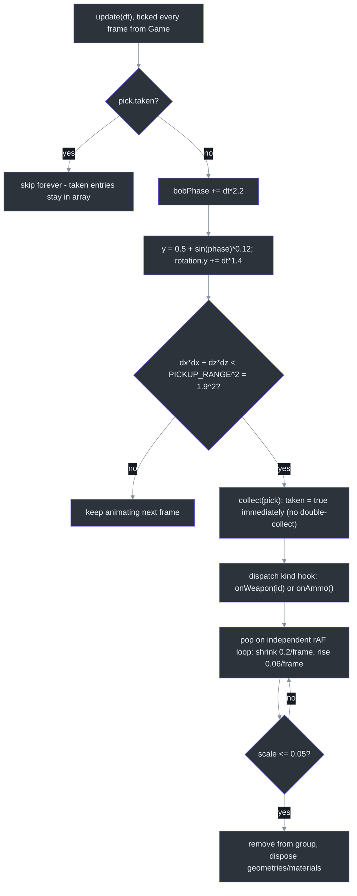
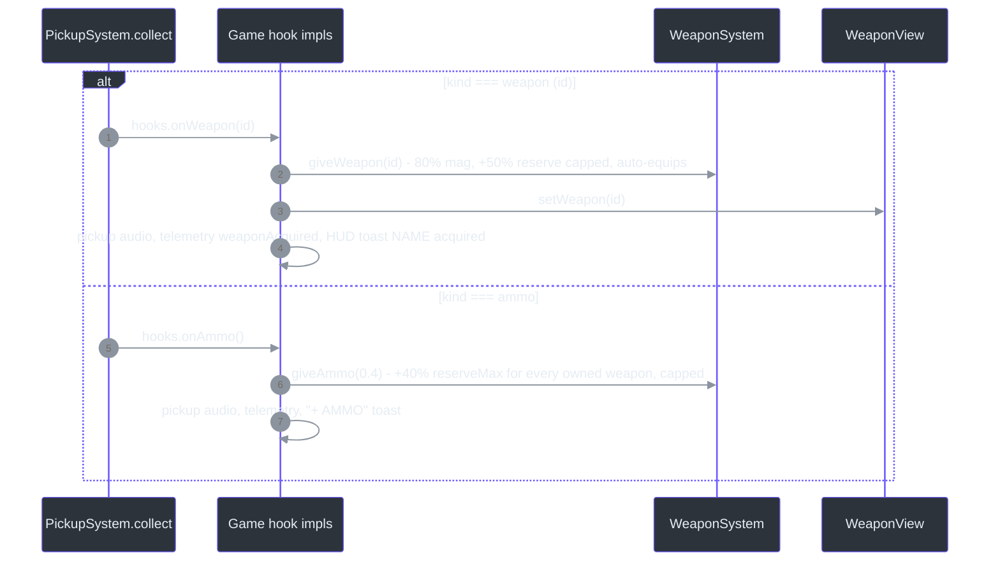
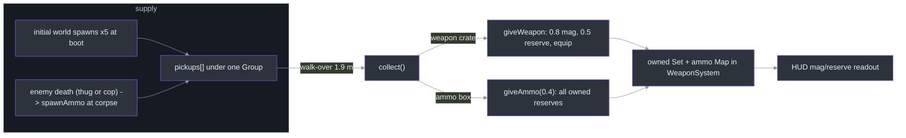
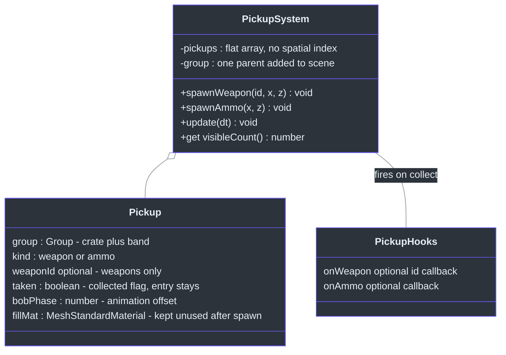

# PickupSystem — Radius, Bob Animation & Weapon Hooks

## Overview

`PickupSystem` handles ground pickups: weapon crates (color-coded band per weapon) and ammo boxes dropped by dead enemies ([src/systems/PickupSystem.ts:20-24](https://github.com/noiz354/arena-city-try/blob/main/src/systems/PickupSystem.ts#L20-L24)). Walk-over collection with bob/rotate animation and a scale-down "pop" removal. Anchor: [src/systems/PickupSystem.ts:25](https://github.com/noiz354/arena-city-try/blob/main/src/systems/PickupSystem.ts#L25).

Why so simple: pickups are the *only* economy faucet besides mission rewards, so the system deliberately has no persistence, no respawn logic, and no spatial index — a flat array with linear scan is plenty for ~5 world spawns plus combat drops ([src/systems/PickupSystem.ts:26](https://github.com/noiz354/arena-city-try/blob/main/src/systems/PickupSystem.ts#L26)). Its constructor takes a structural `{ add, remove }` scene contract rather than a full `Scene` type, making it testable headless ([`:29-35`](https://github.com/noiz354/arena-city-try/blob/main/src/systems/PickupSystem.ts#L29-L35)).

### At a glance

| Aspect | Value | Source |
|---|---|---|
| Collection radius | `PICKUP_RANGE = 1.9` m, XZ-only squared compare | [`src/systems/PickupSystem.ts:4`](https://github.com/noiz354/arena-city-try/blob/main/src/systems/PickupSystem.ts#L4), [`:98-100`](https://github.com/noiz354/arena-city-try/blob/main/src/systems/PickupSystem.ts#L98-L100) |
| Bob / spin | phase +2.2 rad/s, hover ±0.12 m around y=0.5, spin +1.4 rad/s | [`src/systems/PickupSystem.ts:94-96`](https://github.com/noiz354/arena-city-try/blob/main/src/systems/PickupSystem.ts#L94-L96) |
| Pop animation | shrink −0.2 scale & rise +0.06 y per rAF frame until scale ≤ 0.05, then dispose | [`src/systems/PickupSystem.ts:113-129`](https://github.com/noiz354/arena-city-try/blob/main/src/systems/PickupSystem.ts#L113-L129) |
| Weapon grant | `giveWeapon(id)` = 80% mag + 50% reserve capped, auto-equips | wiring [`src/game/Game.ts:282-288`](https://github.com/noiz354/arena-city-try/blob/main/src/game/Game.ts#L282-L288), grants [`src/systems/WeaponSystem.ts:114-122`](https://github.com/noiz354/arena-city-try/blob/main/src/systems/WeaponSystem.ts#L114-L122) |
| Ammo grant | `giveAmmo(0.4)` = +40% of every owned weapon's reserveMax, capped | [`src/game/Game.ts:289-294`](https://github.com/noiz354/arena-city-try/blob/main/src/game/Game.ts#L289-L294), [`src/systems/WeaponSystem.ts:124-128`](https://github.com/noiz354/arena-city-try/blob/main/src/systems/WeaponSystem.ts#L124-L128) |
| Initial spawns | SMG (−14,14), shotgun (14,−14), rifle (45,−30), ammo (−20,−20), ammo (30,40) | [`src/game/Game.ts:611-617`](https://github.com/noiz354/arena-city-try/blob/main/src/game/Game.ts#L611-L617) |

## Architecture

### Per-frame update & collection

<!-- Sources: src/systems/PickupSystem.ts:90-130 -->

The player position comes from an injected closure `() => this.player.position` ([src/game/Game.ts:280](https://github.com/noiz354/arena-city-try/blob/main/src/game/Game.ts#L280)) — it tracks the *player entity*, so pickups are effectively not collectible while driving unless driven over precisely.

### Spawn builders

| Builder | Visuals | Notes | Source |
|---|---|---|---|
| `spawnWeapon(id, x, z)` | brown crate 0.8×0.6×0.8 (`0x6b5638`, roughness 0.7, castShadow) at y=0.5 + thin band 0.84×0.14×0.84 tinted with `WEAPONS[id].color`; random `bobPhase ∈ [0, 2π)` desyncs animation | silently returns if id not found in the `WEAPONS` table ([src/data/weapons.ts:23-92](https://github.com/noiz354/arena-city-try/blob/main/src/data/weapons.ts#L23-L92)) | [`src/systems/PickupSystem.ts:37-63`](https://github.com/noiz354/arena-city-try/blob/main/src/systems/PickupSystem.ts#L37-L63) |
| `spawnAmmo(x, z)` | smaller box 0.5×0.3×0.5, dark gold `0xb8860b` with emissive `0x4a3600` @ 0.4, y=0.35 + bright `0xffd166` band | called for every enemy corpse via the `onEnemyDeath` callback declared on EnemySystem ([src/systems/EnemySystem.ts:260](https://github.com/noiz354/arena-city-try/blob/main/src/systems/EnemySystem.ts#L260)) | [`src/systems/PickupSystem.ts:65-88`](https://github.com/noiz354/arena-city-try/blob/main/src/systems/PickupSystem.ts#L65-L88) |

Band color-coding is what makes crates identifiable before collection: each band reuses the weapon's data-table color, the same `def.color` WeaponView paints gun metal with — see [WeaponView](./weapon-view.md).

### Collection hooks

<!-- Sources: src/systems/PickupSystem.ts:106-130; src/game/Game.ts:282-294; src/systems/WeaponSystem.ts:114-129 -->

## The ammo economy

<!-- Sources: src/game/Game.ts:278-301,611-617; src/systems/WeaponSystem.ts:57-59,114-129 -->

Dead enemies drop ammo through `enemies.onEnemyDeath` — thug or cop alike ([src/game/Game.ts:297-298](https://github.com/noiz354/arena-city-try/blob/main/src/game/Game.ts#L297-L298)); see [EnemySystem](../gameplay-core/enemy-system.md). Weapon pickups never respawn; once taken, only enemy ammo drops replenish supply.

## Data structures

<!-- Sources: src/systems/PickupSystem.ts:6-18,25-35 -->

## Public API

| Member | Signature | Behavior | Source |
|---|---|---|---|
| constructor | `(scene: {add, remove}, playerPos: () => Vector3, hooks = {})` | Minimal scene contract, not a full `Scene` type — testable headless | [`src/systems/PickupSystem.ts:29-35`](https://github.com/noiz354/arena-city-try/blob/main/src/systems/PickupSystem.ts#L29-L35) |
| `spawnWeapon` | `(id, x, z) => void` | No-op for unknown ids; color-banded crate | [`src/systems/PickupSystem.ts:37`](https://github.com/noiz354/arena-city-try/blob/main/src/systems/PickupSystem.ts#L37) |
| `spawnAmmo` | `(x, z) => void` | Emissive gold box with bright band | [`src/systems/PickupSystem.ts:65`](https://github.com/noiz354/arena-city-try/blob/main/src/systems/PickupSystem.ts#L65) |
| `update` | `(dt) => void` | Animation + walk-over collection loop | [`src/systems/PickupSystem.ts:90`](https://github.com/noiz354/arena-city-try/blob/main/src/systems/PickupSystem.ts#L90) |
| `visibleCount` getter | `() => number` | Count of untaken pickups; re-filters per access | [`src/systems/PickupSystem.ts:132-134`](https://github.com/noiz354/arena-city-try/blob/main/src/systems/PickupSystem.ts#L132-L134) |

## Tuning constants

| Constant | Value | Effect | Source |
|---|---|---|---|
| `PICKUP_RANGE` | 1.9 m (squared compare) | Walk-over collection radius, XZ-only | [`src/systems/PickupSystem.ts:4,100`](https://github.com/noiz354/arena-city-try/blob/main/src/systems/PickupSystem.ts#L4) |
| Bob speed / amplitude | 2.2 rad/s · ±0.12 m around y=0.5 | Idle animation | [`src/systems/PickupSystem.ts:94-95`](https://github.com/noiz354/arena-city-try/blob/main/src/systems/PickupSystem.ts#L94-L95) |
| Spin speed | 1.4 rad/s | Y rotation | [`src/systems/PickupSystem.ts:96`](https://github.com/noiz354/arena-city-try/blob/main/src/systems/PickupSystem.ts#L96) |
| Pop shrink / rise | −0.2 scale & +0.06 y per rAF frame | Removal animation (~5 frames) | [`src/systems/PickupSystem.ts:116-117`](https://github.com/noiz354/arena-city-try/blob/main/src/systems/PickupSystem.ts#L116-L117) |
| Ammo grant fraction | 0.4 of reserveMax per owned weapon | `giveAmmo` default | [`src/game/Game.ts:290`](https://github.com/noiz354/arena-city-try/blob/main/src/game/Game.ts#L290), [`src/systems/WeaponSystem.ts:124`](https://github.com/noiz354/arena-city-try/blob/main/src/systems/WeaponSystem.ts#L124) |
| Initial spawns | smg(−14,14), shotgun(14,−14), rifle(45,−30), ammo(−20,−20),(30,40) | Boot layout | [`src/game/Game.ts:612-616`](https://github.com/noiz354/arena-city-try/blob/main/src/game/Game.ts#L612-L616) |

Extension points: new pickup kinds need a `kind` union member, a `spawn*` builder, and a hook ([src/systems/PickupSystem.ts:15-18](https://github.com/noiz354/arena-city-try/blob/main/src/systems/PickupSystem.ts#L15-L18)).

## Known quirks

- **Array grows forever**: collected entries are skipped but never removed ([src/systems/PickupSystem.ts:93](https://github.com/noiz354/arena-city-try/blob/main/src/systems/PickupSystem.ts#L93)) and `visibleCount` re-filters each access — negligible now, unbounded if enemies die en masse.
- **Y is ignored in collection** ([`:98-100`](https://github.com/noiz354/arena-city-try/blob/main/src/systems/PickupSystem.ts#L98-L100)): a pickup within 1.9 m horizontally still collects regardless of height — harmless at ground level.
- **Pop runs outside the game loop**: raw `requestAnimationFrame` means the pop finishes while paused and disposes materials the render loop could still be drawing that frame ([`:113-129`](https://github.com/noiz354/arena-city-try/blob/main/src/systems/PickupSystem.ts#L113-L129)).
- **No respawn**: weapon crates are one-shot per session.

## Related Pages

| Page | Relationship |
|------|-------------|
| [WeaponSystem](./weapon-system.md) | Receives `giveWeapon`/`giveAmmo(0.4)` grants from collection hooks |
| [WeaponView](./weapon-view.md) | `setWeapon` called when a crate equips its weapon |
| [EnemySystem](../gameplay-core/enemy-system.md) | Every enemy corpse drops an ammo pickup via `onEnemyDeath` |
| [MissionSystem](./mission-system.md) | The other reward faucet (money/XP) in the action layer |

