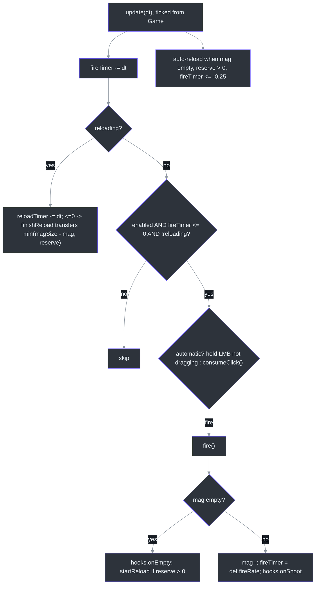
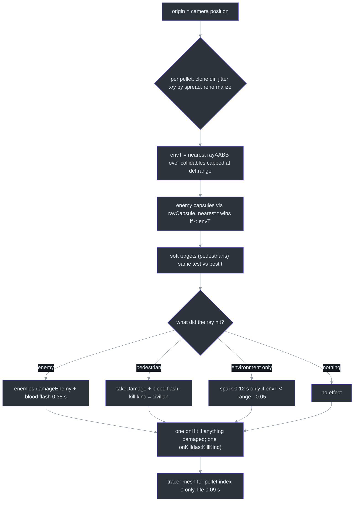
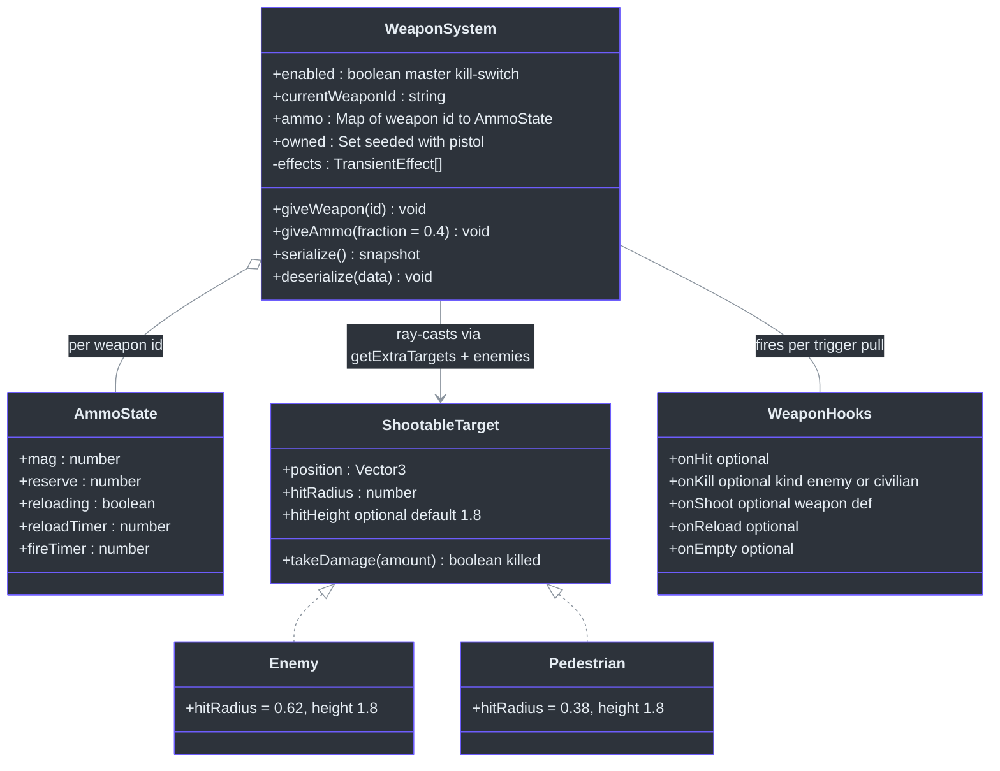

# WeaponSystem — Hitscan Shooting & Ammo Economy

## Overview

`WeaponSystem` is the player's gun layer: camera-crosshair raycasts against environment AABBs, enemy capsules and pedestrian "soft targets", with data-driven weapon definitions, per-weapon mag/reserve ammo, timed reloads, auto-fire for automatic weapons, auto-reload on empty, plus self-managed transient tracer/impact/blood effects (header comment notes the lineage as the "bloodwave shooting.js pattern", [src/systems/WeaponSystem.ts:48-54](https://github.com/noiz354/arena-city-try/blob/main/src/systems/WeaponSystem.ts#L48-L54)). The core anchor is [src/systems/WeaponSystem.ts:55](https://github.com/noiz354/arena-city-try/blob/main/src/systems/WeaponSystem.ts#L55).

Why hitscan instead of projectiles: every shot resolves in a single frame against simple math shapes — slab-method AABBs ([src/utils/raycast.ts:9-35](https://github.com/noiz354/arena-city-try/blob/main/src/utils/raycast.ts#L9-L35)) and 4-sphere capsule approximations ([src/utils/raycast.ts:61-81](https://github.com/noiz354/arena-city-try/blob/main/src/utils/raycast.ts#L61-L81)) — so there is no bullet simulation to keep in sync, at the cost of no travel time and no damage falloff anywhere in the file.

### At a glance

| Aspect | Value | Source |
|---|---|---|
| Shot origin/direction | live camera position + `getWorldDirection` — shots go where the crosshair points, not where the gun model points | [`src/systems/WeaponSystem.ts:208-209`](https://github.com/noiz354/arena-city-try/blob/main/src/systems/WeaponSystem.ts#L208-L209) |
| Starting inventory | pistol only, full `AmmoState` seeded for all `WEAPONS` | [`src/systems/WeaponSystem.ts:57-59`](https://github.com/noiz354/arena-city-try/blob/main/src/systems/WeaponSystem.ts#L57-L59), [`:73-81`](https://github.com/noiz354/arena-city-try/blob/main/src/systems/WeaponSystem.ts#L73-L81) |
| Auto-reload delay | 0.25 s after last shot (empty click first) | [`src/systems/WeaponSystem.ts:189-191`](https://github.com/noiz354/arena-city-try/blob/main/src/systems/WeaponSystem.ts#L189-L191) |
| Drag threshold | 8 px mouse travel before orbit-drag suppresses firing | [`src/utils/InputManager.ts:132-134`](https://github.com/noiz354/arena-city-try/blob/main/src/utils/InputManager.ts#L132-L134) |
| Damage model | flat within range; no falloff, headshots or friendly-fire checks | [`src/systems/WeaponSystem.ts:251-266`](https://github.com/noiz354/arena-city-try/blob/main/src/systems/WeaponSystem.ts#L251-L266) |
| Tracer rule | only pellet index 0 gets one — shotgun shows one beam, not six | [`src/systems/WeaponSystem.ts:268`](https://github.com/noiz354/arena-city-try/blob/main/src/systems/WeaponSystem.ts#L268) |

## Architecture

### Per-frame update & fire gating



<!-- Sources: src/systems/WeaponSystem.ts:173-194,196-206,275-282 -->

The drag threshold matters on desktop: orbiting the camera never fires because `InputManager` accumulates 8 px of travel before declaring a drag ([src/utils/InputManager.ts:132-134](https://github.com/noiz354/arena-city-try/blob/main/src/utils/InputManager.ts#L132-L134)). ModeController flips `weapons.enabled = false` while driving, making this whole branch dead in cars ([src/systems/ModeController.ts:149](https://github.com/noiz354/arena-city-try/blob/main/src/systems/ModeController.ts#L149)).

### Shot resolution (`fire()`)



<!-- Sources: src/systems/WeaponSystem.ts:196-273 -->

Precision details verified in source:

| Step | Fact | Source |
|---|---|---|
| Spread axes | jitter applied on world X/Y pre-normalization, not camera-space — cone shape varies slightly with aim direction | [`src/systems/WeaponSystem.ts:215-219`](https://github.com/noiz354/arena-city-try/blob/main/src/systems/WeaponSystem.ts#L215-L219) |
| Capsule approximation | 4 spheres at axis fractions [0.08, 0.38, 0.68, 0.95], radius inflated ×1.15 to close gaps | [`src/utils/raycast.ts:61-81`](https://github.com/noiz354/arena-city-try/blob/main/src/utils/raycast.ts#L61-L81) |
| Environment provider | buildings + parked/stolen vehicles via constructor callback | wiring [`src/game/Game.ts:243`](https://github.com/noiz354/arena-city-try/blob/main/src/game/Game.ts#L243) |
| Pedestrian priority | nearest of {environment, enemy, pedestrian} wins; a ped hit clears any enemy hit | [`src/systems/WeaponSystem.ts:239-248`](https://github.com/noiz354/arena-city-try/blob/main/src/systems/WeaponSystem.ts#L239-L248) |
| Default body height | unspecified target height defaults to 1.8 m | [`src/systems/WeaponSystem.ts:35-36`](https://github.com/noiz354/arena-city-try/blob/main/src/systems/WeaponSystem.ts#L35-L36) |
| Hook coalescing | one `onHit`/`onKill` per trigger pull even for shotgun's 6 pellets; civilian kind wins ties since assigned last | [`src/systems/WeaponSystem.ts:271-272`](https://github.com/noiz354/arena-city-try/blob/main/src/systems/WeaponSystem.ts#L271-L272) |

### Hook chain per shot

```mermaid
%%{init: {"theme": "base", "themeVariables": {"background": "#0d1117", "primaryColor": "#2d333b", "primaryBorderColor": "#6d5dfc", "primaryTextColor": "#e6edf3", "lineColor": "#8b949e", "actorBkg": "#2d333b", "actorBorder": "#6d5dfc", "actorTextColor": "#e6edf3", "signalColor": "#8b949e", "signalTextColor": "#e6edf3"}}}%%
sequenceDiagram
    autonumber
    participant WS as WeaponSystem
    participant G as Game hook impls
    WS->>G: onShoot(def)
    G->>G: audio.playShoot(weapon)
    G->>G: weaponView.kick()
    G->>G: pedestrians.panicNear(playerPos, 40)
    G->>G: if cop alive within 55 m: wanted.reportCrime(1, p)
    WS->>G: onHit (once per trigger pull)
    G->>G: HUD hit-marker flash + audio.playHit
    WS->>G: onKill(kind) (once; civilian wins ties)
    G->>G: kills++, audio.playKill, telemetry
    alt kind === civilian
        G->>G: wanted.reportCrime(2, playerPos)
    end
    WS->>G: onReload / onEmpty -> audio cues
```

<!-- Sources: src/systems/WeaponSystem.ts:40-46; src/game/Game.ts:245-272 -->

## Data structures



<!-- Sources: src/systems/WeaponSystem.ts:17-38,40-46,56-62; src/systems/EnemySystem.ts:30-31; src/systems/PedestrianSystem.ts:46-47 -->

The duck-typed `ShootableTarget` contract ([src/systems/WeaponSystem.ts:32-38](https://github.com/noiz354/arena-city-try/blob/main/src/systems/WeaponSystem.ts#L32-L38)) is why pedestrians are shootable without the weapon system importing them — Game supplies `() => this.pedestrians.alive` as `getExtraTargets` ([src/game/Game.ts:274](https://github.com/noiz354/arena-city-try/blob/main/src/game/Game.ts#L274)).

## Public API

| Member | Behavior | Source |
|---|---|---|
| `enabled` | Master kill-switch; false while driving | [`src/systems/WeaponSystem.ts:56`](https://github.com/noiz354/arena-city-try/blob/main/src/systems/WeaponSystem.ts#L56), [`src/systems/ModeController.ts:149`](https://github.com/noiz354/arena-city-try/blob/main/src/systems/ModeController.ts#L149) |
| `giveWeapon(id)` | Ignores unknown ids; raises mag to `max(mag, floor(magSize*0.8))`; adds `floor(reserveMax*0.5)` reserve capped at max; auto-equips | [`src/systems/WeaponSystem.ts:114-122`](https://github.com/noiz354/arena-city-try/blob/main/src/systems/WeaponSystem.ts#L114-L122) |
| `giveAmmo(fraction = 0.4)` | Refills **all** weapons' reserves by `floor(reserveMax * fraction)` capped at max — called by ammo pickups | [`src/systems/WeaponSystem.ts:124-129`](https://github.com/noiz354/arena-city-try/blob/main/src/systems/WeaponSystem.ts#L124-L129), pickup wiring [`src/game/Game.ts:290`](https://github.com/noiz354/arena-city-try/blob/main/src/game/Game.ts#L290) |
| `serialize/deserialize` | Save snapshot; validates ids against `WEAPONS`, clamps counts, force-clears reload state | [`src/systems/WeaponSystem.ts:131-153`](https://github.com/noiz354/arena-city-try/blob/main/src/systems/WeaponSystem.ts#L131-L153) |
| `switchWeapon(id)` | No-op unless owned and different; cancels in-progress reload without refunding progress | [`src/systems/WeaponSystem.ts:155-163`](https://github.com/noiz354/arena-city-try/blob/main/src/systems/WeaponSystem.ts#L155-L163) |
| `startReload()` | No-op if reloading/reserve empty/mag full; sets timer, fires `onReload` | [`src/systems/WeaponSystem.ts:165-171`](https://github.com/noiz354/arena-city-try/blob/main/src/systems/WeaponSystem.ts#L165-L171) |
| `reloadProgress` getter | 1 − reloadTimer/reloadTime; always 0 when not reloading | [`src/systems/WeaponSystem.ts:104-108`](https://github.com/noiz354/arena-city-try/blob/main/src/systems/WeaponSystem.ts#L104-L108) |

Persistence round-trip runs through autosave every 30 s and on destroy, restored at boot ([src/game/Game.ts:572-589](https://github.com/noiz354/arena-city-try/blob/main/src/game/Game.ts#L572-L589)); HUD reads `currentDef.name`, `mag`, `reserve`, `reloading`, `reloadProgress` each frame on foot ([src/ui/hud.ts:110-119](https://github.com/noiz354/arena-city-try/blob/main/src/ui/hud.ts#L110-L119)).

## Weapon stat table

All values from the data table ([src/data/weapons.ts:24-91](https://github.com/noiz354/arena-city-try/blob/main/src/data/weapons.ts#L24-L91)):

| Weapon | Damage | Mag / Reserve | Reload | Fire rate | Auto | Spread | Range | Key |
|---|---|---|---|---|---|---|---|---|
| Pistol | 34 | 12 / 60 | 1.1 s | 0.28 s | semi | 0.012 | 120 m | '1' |
| SMG | 18 | 30 / 120 | 1.6 s | 0.085 s (~11.8 rps) | full-auto | 0.028 | 100 m | '2' |
| Shotgun | 16 ×6 pellets | 8 / 40 | 2.6 s | 0.9 s | semi | 0.09 | 45 m | '3' |
| Rifle | 30 | 24 / 96 | 2.0 s | 0.11 s | full-auto | 0.018 | 160 m | '4' |

**Ammo cross-check** (documented runtime fact): pistol HUD reading **11/48** is consistent with these paths — start 12/60 → dump 12 rounds → auto-reload moves 12 from reserve (60→48, mag 12) → fire once → 11/48.

## Tuning constants

| Constant | Value | Effect | Source |
|---|---|---|---|
| Auto-reload delay | 0.25 s after last shot | Lets empty-click audio play first | [`src/systems/WeaponSystem.ts:189`](https://github.com/noiz354/arena-city-try/blob/main/src/systems/WeaponSystem.ts#L189) |
| Pickup grant fractions | 0.8 mag / 0.5 reserve | `giveWeapon` grants | [`src/systems/WeaponSystem.ts:119-120`](https://github.com/noiz354/arena-city-try/blob/main/src/systems/WeaponSystem.ts#L119-L120) |
| Ammo pickup fraction | 0.4 | `giveAmmo` default | [`src/systems/WeaponSystem.ts:124`](https://github.com/noiz354/arena-city-try/blob/main/src/systems/WeaponSystem.ts#L124) |
| Effect lifetimes | tracer 0.09 s, blood 0.35 s, spark 0.12 s | Transient effect durations | [`src/systems/WeaponSystem.ts:297`](https://github.com/noiz354/arena-city-try/blob/main/src/systems/WeaponSystem.ts#L297), [`:253,258`](https://github.com/noiz354/arena-city-try/blob/main/src/systems/WeaponSystem.ts#L253), [`:265`](https://github.com/noiz354/arena-city-try/blob/main/src/systems/WeaponSystem.ts#L265) |
| Effect fade/growth | fade ×0.9; grow 1.2× only when maxLife > 0.2 (blood grows, sparks/tracers don't) | Visual polish rules | [`src/systems/WeaponSystem.ts:330-335`](https://github.com/noiz354/arena-city-try/blob/main/src/systems/WeaponSystem.ts#L330-L335) |
| Spark suppression margin | `range − 0.05` | No sparks for rays hitting nothing | [`src/systems/WeaponSystem.ts:264-266`](https://github.com/noiz354/arena-city-try/blob/main/src/systems/WeaponSystem.ts#L264-L266) |

Extension points: new weapons need a `WEAPONS` entry plus a `WeaponView.buildModel` case ([src/systems/WeaponView.ts:113-141](https://github.com/noiz354/arena-city-try/blob/main/src/systems/WeaponView.ts#L113-L141)); new soft targets implement `ShootableTarget` and arrive via `getExtraTargets` ([src/systems/WeaponSystem.ts:71](https://github.com/noiz354/arena-city-try/blob/main/src/systems/WeaponSystem.ts#L71)).

## Known quirks

- **`WeaponDef.recoil` is dead data**: declared per weapon (shotgun 0.05 vs SMG 0.008, [src/data/weapons.ts:53,70](https://github.com/noiz354/arena-city-try/blob/main/src/data/weapons.ts#L53)) but never read — camera pitch kick is unimplemented; only fixed-magnitude [WeaponView](./weapon-view.md) kick exists.
- **Per-shot allocations**: effects allocate fresh geometry/material and dispose on expiry ([src/systems/WeaponSystem.ts:291-294,324-327](https://github.com/noiz354/arena-city-try/blob/main/src/systems/WeaponSystem.ts#L291-L294)) — sustained SMG fire churns GPU resources; pooling like ParticleSystem would remove it.
- **World-axis spread**: effective cone shape varies slightly with aim direction.
- **No falloff/headshots/friendly-fire**: damage is flat within range; shooting civilians has only wanted-level consequences.

## Related Pages

| Page | Relationship |
|------|-------------|
| [WeaponView](./weapon-view.md) | Cosmetic viewmodel kicked by this system's `onShoot` hook |
| [PickupSystem](./pickup-system.md) | Feeds this system via `giveWeapon`/`giveAmmo(0.4)` hooks |
| [MissionSystem](./mission-system.md) | XP/money progression independent of combat, but enemies are targets |
| [PedestrianSystem](../gameplay-core/pedestrian-system.md) | Soft ray targets; kills classified `'civilian'` |
| [WantedSystem](../gameplay-core/wanted-system.md) | Receives severity-1/2 crimes from this system's hooks |

