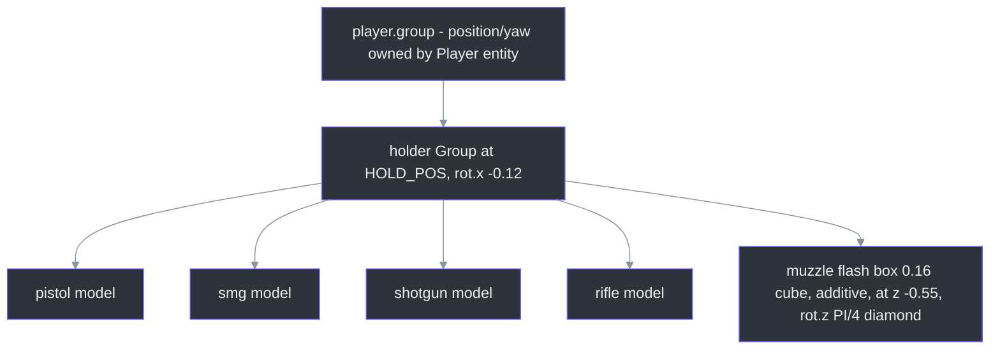
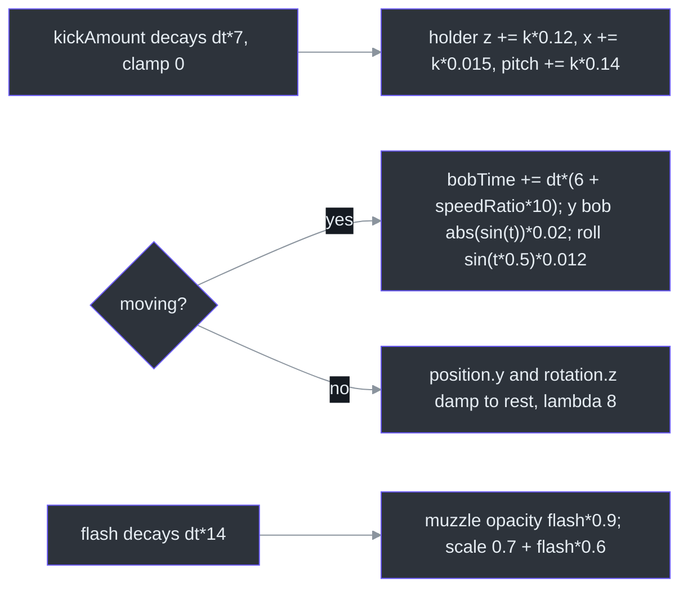
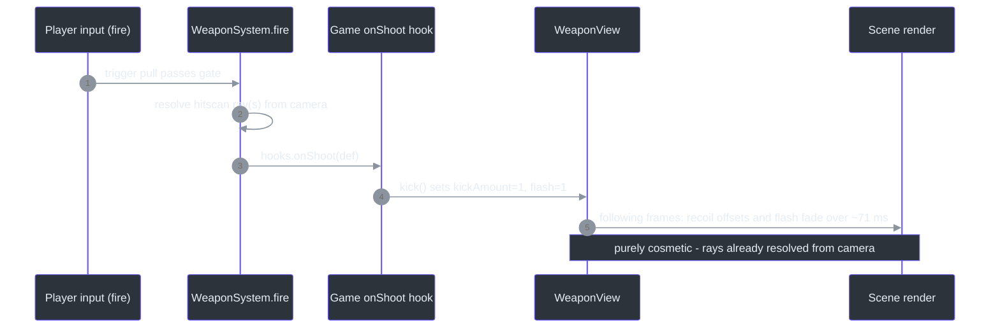

# WeaponView — First-Person Hold Pose, Recoil & Muzzle Flash

## Overview

`WeaponView` is the *purely cosmetic* weapon layer: a procedural box/cylinder gun model per weapon, parented to the player character's hand, with recoil kick on fire, movement bob while walking, and an additive muzzle flash ([src/systems/WeaponView.ts:22](https://github.com/noiz354/arena-city-try/blob/main/src/systems/WeaponView.ts#L22)). It never affects hit detection — [WeaponSystem](./weapon-system.md) rays from the camera regardless of what the model shows ([src/systems/WeaponSystem.ts:208-209](https://github.com/noiz354/arena-city-try/blob/main/src/systems/WeaponSystem.ts#L208-L209)).

Framing note (title vs code): despite the catalogue page title, this is a **third-person** viewmodel adapted to the third-person camera ("bloodwave viewmodel pattern", [header comment](https://github.com/noiz354/arena-city-try/blob/main/src/systems/WeaponView.ts#L16-L21)) — attached to the visible player character, not rendered in a separate camera pass.

### At a glance

| Aspect | Value | Source |
|---|---|---|
| Hold pose | `HOLD_POS = (0.42, 1.02, 0.18)`, pitch −0.12 rad | [`src/systems/WeaponView.ts:13-14`](https://github.com/noiz354/arena-city-try/blob/main/src/systems/WeaponView.ts#L13-L14), applied [`:32-33`](https://github.com/noiz354/arena-city-try/blob/main/src/systems/WeaponView.ts#L32-L33) |
| Models | one hidden gun per `WEAPONS` entry at construction; toggled by visibility | [`src/systems/WeaponView.ts:35-40`](https://github.com/noiz354/arena-city-try/blob/main/src/systems/WeaponView.ts#L35-L40) |
| Recoil | decay 7/s (~143 ms); offsets z +0.12, x +0.015, pitch +0.14 rad | [`src/systems/WeaponView.ts:70-74`](https://github.com/noiz354/arena-city-try/blob/main/src/systems/WeaponView.ts#L70-L74) |
| Bob | rate 6 Hz + up to 10 Hz at sprint; y amplitude 0.02 m, roll 0.012 rad | [`src/systems/WeaponView.ts:77-82`](https://github.com/noiz354/arena-city-try/blob/main/src/systems/WeaponView.ts#L77-L82) |
| Muzzle flash | decay 14/s (~71 ms), opacity ×0.9, scale 0.7→1.3 | [`src/systems/WeaponView.ts:89-91`](https://github.com/noiz354/arena-city-try/blob/main/src/systems/WeaponView.ts#L89-L91) |
| Hide while driving | free via `player.group.visible = false` hiding the childed holder | [`src/systems/ModeController.ts:181`](https://github.com/noiz354/arena-city-try/blob/main/src/systems/ModeController.ts#L181) |

## Architecture

### Scene-graph attachment

<!-- Sources: src/systems/WeaponView.ts:31-55; src/game/Game.ts:186-187 -->

Game adds `holder` to `player.group` during construction ([src/game/Game.ts:186-187](https://github.com/noiz354/arena-city-try/blob/main/src/game/Game.ts#L186-L187)), so the gun inherits player position/yaw automatically — no per-frame parenting code exists. The constructor iterates all of `WEAPONS`, builds each model hidden, then defaults to `'pistol'` via `setWeapon` ([src/systems/WeaponView.ts:35-55](https://github.com/noiz354/arena-city-try/blob/main/src/systems/WeaponView.ts#L35-L55)).

### Per-frame animation pipeline

Called as `update(dt, moving, speedRatio)` every frame after mode resolution ([src/game/Game.ts:441-443](https://github.com/noiz354/arena-city-try/blob/main/src/game/Game.ts#L441-L443)). Caller arguments are precise: `moving` is true only in foot mode with horizontal speed > 0.5 m/s; `speedRatio = min(1, speed / 9.5)` where 9.5 matches `SPRINT_SPEED` ([src/entities/Player.ts:17](https://github.com/noiz354/arena-city-try/blob/main/src/entities/Player.ts#L17)), so bob frequency scales walk → sprint.

<!-- Sources: src/systems/WeaponView.ts:68-92 -->

### Shot feedback chain

<!-- Sources: src/systems/WeaponSystem.ts:204-206; src/game/Game.ts:249-251; src/systems/WeaponView.ts:62-66 -->

`kick()` is called on every shot regardless of weapon type ([src/game/Game.ts:251](https://github.com/noiz354/arena-city-try/blob/main/src/game/Game.ts#L251)) — see [Known quirks](#known-quirks) for the missing per-weapon scaling.

## Model building & materials

`buildModel(def)` ([src/systems/WeaponView.ts:95-143](https://github.com/noiz354/arena-city-try/blob/main/src/systems/WeaponView.ts#L95-L143)) assembles each gun from two local helpers: `box(w,h,d,...)` (BoxGeometry meshes) and `cyl(...)` (10-segment CylinderGeometry pitched π/2 to lie along z). Three shared materials:

| Material | Params | Used for |
|---|---|---|
| metal | tinted with `def.color`, roughness 0.45, metalness 0.7 | bodies, stocks |
| dark | `0x1a1a1f`, roughness 0.7 | slides, grips, mags, barrels |
| accent brass | `0xc9a227`, metalness 0.6 | shotgun pump, rifle scope |

Per-model parts differ: pistol 4 boxes/cylinders, SMG 5 (suppressor barrel), shotgun 4 (brass pump), rifle 6 (scope cylinder) ([src/systems/WeaponView.ts:113-141](https://github.com/noiz354/arena-city-try/blob/main/src/systems/WeaponView.ts#L113-L141)). Geometry mirrors only `WEAPONS[id].color`; shapes are hard-coded per id.

## Public API

| Member | Signature | Behavior | Source |
|---|---|---|---|
| `holder` | readonly `` `Group` `` | Attach point; Game parents it to the player group | [`src/systems/WeaponView.ts:23`](https://github.com/noiz354/arena-city-try/blob/main/src/systems/WeaponView.ts#L23), [`src/game/Game.ts:187`](https://github.com/noiz354/arena-city-try/blob/main/src/game/Game.ts#L187) |
| `setWeapon` | `(id: string) => void` | Shows exactly the named model, hides all others | [`src/systems/WeaponView.ts:58-60`](https://github.com/noiz354/arena-city-try/blob/main/src/systems/WeaponView.ts#L58-L60) |
| `kick` | `() => void` | One recoil + flash cycle; called from `onShoot` every shot | [`src/systems/WeaponView.ts:62-66`](https://github.com/noiz354/arena-city-try/blob/main/src/systems/WeaponView.ts#L62-L66) |
| `update` | `(dt, moving, speedRatio) => void` | Advances recoil decay, bob, flash fade | [`src/systems/WeaponView.ts:68`](https://github.com/noiz354/arena-city-try/blob/main/src/systems/WeaponView.ts#L68) |

Call sites for `setWeapon`: pickup collection's `onWeapon` hook ([src/game/Game.ts:284](https://github.com/noiz354/arena-city-try/blob/main/src/game/Game.ts#L284)), digit-key switching in [ModeController](../gameplay-core/mode-controller.md) ([src/systems/ModeController.ts:96](https://github.com/noiz354/arena-city-try/blob/main/src/systems/ModeController.ts#L96)), post-load restore to `weapons.currentWeaponId` ([src/game/Game.ts:303](https://github.com/noiz354/arena-city-try/blob/main/src/game/Game.ts#L303)).

## Tuning constants

| Constant | Value | Effect | Source |
|---|---|---|---|
| `HOLD_POS` | `(0.42, 1.02, 0.18)` | Right-hand anchor on the player | [`src/systems/WeaponView.ts:13`](https://github.com/noiz354/arena-city-try/blob/main/src/systems/WeaponView.ts#L13) |
| `HOLD_ROT_X` | −0.12 rad | Slight downward aim | [`src/systems/WeaponView.ts:14`](https://github.com/noiz354/arena-city-try/blob/main/src/systems/WeaponView.ts#L14) |
| Recoil decay | 7/s; z 0.12, x 0.015, pitch 0.14 rad | Kick feel (~143 ms) | [`src/systems/WeaponView.ts:70-74`](https://github.com/noiz354/arena-city-try/blob/main/src/systems/WeaponView.ts#L70-L74) |
| Bob | base 6 Hz + up to 10 Hz at sprint; y 0.02 m, roll 0.012 rad; idle damp λ 8 | Walk-to-sprint motion scaling | [`src/systems/WeaponView.ts:78-85`](https://github.com/noiz354/arena-city-try/blob/main/src/systems/WeaponView.ts#L78-L85) |
| Flash | decay 14/s (~71 ms); peak opacity 0.9; scale 0.7–1.3 | Muzzle pop | [`src/systems/WeaponView.ts:89-91`](https://github.com/noiz354/arena-city-try/blob/main/src/systems/WeaponView.ts#L89-L91) |

Extension: add a `case` in `buildModel`'s switch keyed by the new `WEAPONS` id — the model auto-registers because the constructor iterates all of `WEAPONS` ([src/systems/WeaponView.ts:113-141](https://github.com/noiz354/arena-city-try/blob/main/src/systems/WeaponView.ts#L113-L141), [`:35-40`](https://github.com/noiz354/arena-city-try/blob/main/src/systems/WeaponView.ts#L35-L40)).

## Known quirks

- **`WeaponDef.recoil` unused here too**: per-weapon recoil values exist in data (shotgun 0.05 vs SMG 0.008) but `kick()` uses fixed magnitudes for every weapon — no per-weapon kick scaling anywhere in `src/`.
- **Docstring vs code**: comment says "additive billboard", but the muzzle flash is a static world-aligned **box**, never rotated toward the camera ([src/systems/WeaponView.ts:42-53](https://github.com/noiz354/arena-city-try/blob/main/src/systems/WeaponView.ts#L42-L53)).
- **One pose fits all**: no per-weapon hold pose or two-handed grip; every weapon shares `HOLD_POS`.
- **Night lighting dependency**: models use `MeshStandardMaterial` with no emissive component, so at night the viewmodel relies entirely on ambient/moon lighting ([src/systems/WeaponView.ts:97-99](https://github.com/noiz354/arena-city-try/blob/main/src/systems/WeaponView.ts#L97-L99)).

## Related Pages

| Page | Relationship |
|------|-------------|
| [WeaponSystem](./weapon-system.md) | Fires this view's `kick()` via its `onShoot` hook; owns real hit detection |
| [PickupSystem](./pickup-system.md) | Weapon pickups call `weaponView.setWeapon(id)` through the `onWeapon` hook |
| [ModeController](../gameplay-core/mode-controller.md) | Digit-key switching calls `setWeapon`; driving hides the holder via player visibility |

