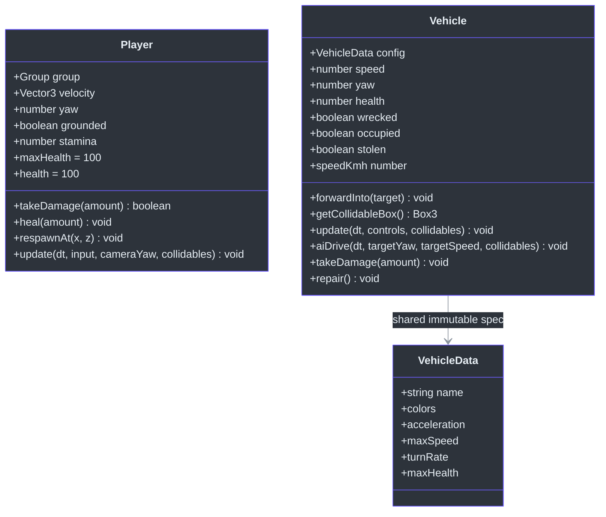
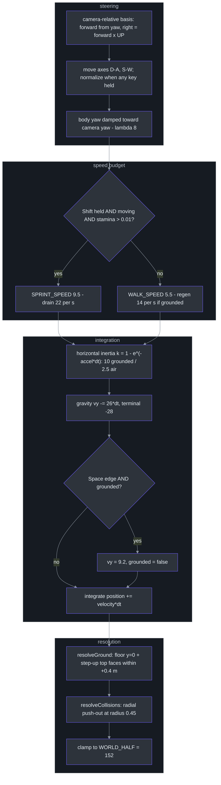
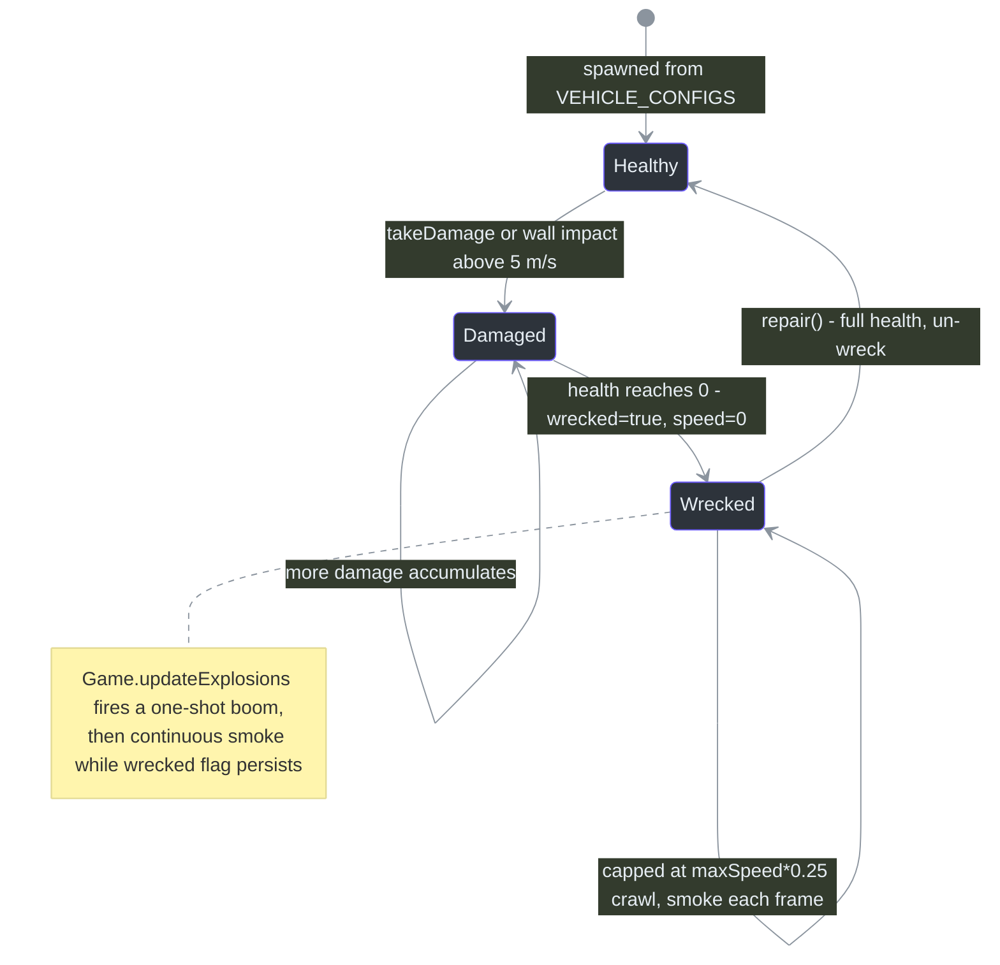
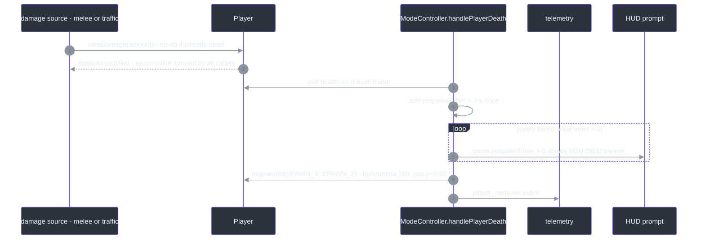
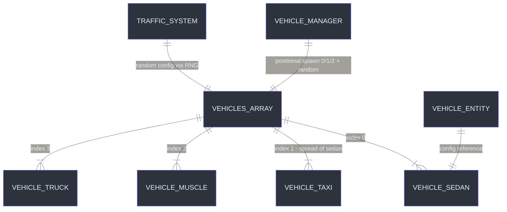

# Entities — Player & Vehicle Physics, Damage, Enter/Exit State Machines

## Overview

CITY RUSH has exactly two gameplay entity classes — everything else is a system managing plain data. `Player` ([src/entities/Player.ts:34](https://github.com/noiz354/arena-city-try/blob/main/src/entities/Player.ts#L34)) is a third-person on-foot controller: camera-relative WASD with exponential inertia, gravity/jump, sprint stamina, capsule-vs-AABB collision. `Vehicle` ([src/entities/Vehicle.ts:29](https://github.com/noiz354/arena-city-try/blob/main/src/entities/Vehicle.ts#L29)) is an enterable car using a scalar-speed model (throttle/brake/reverse/friction on one signed number) plus yaw steering with visual roll.

Two design rules define both classes:

1. **Neither owns input or mode transitions.** [ModeController](../../gameplay-core/mode-controller.md) reads `InputManager` and calls into them — entities stay pure simulation.
2. **No physics engine, no GLTF assets.** Both are hand-rolled three.js primitives with documented constants; collision is AABB push-out against the shared `{ box: Box3 }` collidable currency.

### At a glance

| Aspect | Player | Vehicle | Source |
|---|---|---|---|
| Movement model | velocity `Vector3`, camera-relative | signed scalar `speed` along forward `(sin yaw, 0, cos yaw)` | [`src/entities/Player.ts:35-47`](https://github.com/noiz354/arena-city-try/blob/main/src/entities/Player.ts#L35-L47), [`src/entities/Vehicle.ts:30-48`](https://github.com/noiz354/arena-city-try/blob/main/src/entities/Vehicle.ts#L30-L48) |
| Collision | capsule radius 0.45 vs AABB footprint | rotated-extent AABB approximation | [`src/entities/Player.ts:214-242`](https://github.com/noiz354/arena-city-try/blob/main/src/entities/Player.ts#L214-L242), [`src/entities/Vehicle.ts:250-283`](https://github.com/noiz354/arena-city-try/blob/main/src/entities/Vehicle.ts#L250-L283) |
| Rest height | group origin = capsule center, rest y = **0.95** | rides ground plane y = 0 (no suspension) | [`src/entities/Player.ts:49-58`](https://github.com/noiz354/arena-city-try/blob/main/src/entities/Player.ts#L49-L58), [`src/entities/Vehicle.ts:50-59`](https://github.com/noiz354/arena-city-try/blob/main/src/entities/Vehicle.ts#L50-L59) |
| Damage entry points | enemy melee, traffic impacts | wall impacts > 5 m/s, bullets | [`src/systems/ModeController.ts:101-112`](https://github.com/noiz354/arena-city-try/blob/main/src/systems/ModeController.ts#L101-L112), [`src/entities/Vehicle.ts:179-185`](https://github.com/noiz354/arena-city-try/blob/main/src/entities/Vehicle.ts#L179-L185) |
| Death state | health ≤ 0 → 3 s respawn timer at spawn point | `wrecked=true, speed=0` at 0 HP | [`src/systems/ModeController.ts:204-217`](https://github.com/noiz354/arena-city-try/blob/main/src/systems/ModeController.ts#L204-L217), [`src/entities/Vehicle.ts:168-176`](https://github.com/noiz354/arena-city-try/blob/main/src/entities/Vehicle.ts#L168-L176) |

## Architecture

### Class structure

<!-- Sources: src/entities/Player.ts:34-128; src/entities/Vehicle.ts:29-96; src/data/vehicles.ts:5-24 -->

Note the asymmetry in the diagram: `velocity` is a persistent `Vector3` that other systems write into directly (traffic knockback sets it, [src/game/Game.ts:565](https://github.com/noiz354/arena-city-try/blob/main/src/game/Game.ts#L565)), while vehicle `speed` is a single signed scalar — reversing is just negative speed, which is why the whole driving model needs no vector math.

## Player

### Construction & the y=0.95 contract

The humanoid (~1.9 m of box/sphere primitives, all casting/receiving shadows) is built by `buildHumanoid` ([src/entities/Player.ts:61-106](https://github.com/noiz354/arena-city-try/blob/main/src/entities/Player.ts#L61-L106)); a nose sphere at z=−0.19 marks facing so yaw is visible ([src/entities/Player.ts:103](https://github.com/noiz354/arena-city-try/blob/main/src/entities/Player.ts#L103)). Feet sit at local y=0, so the **group origin is the center of a virtual capsule of half-height 0.95** — hence the magic spawn/rest/save-load value `y = 0.95` everywhere ([src/game/Game.ts:182](https://github.com/noiz354/arena-city-try/blob/main/src/game/Game.ts#L182), [src/game/Game.ts:586](https://github.com/noiz354/arena-city-try/blob/main/src/game/Game.ts#L586)).

### Per-frame update order

Called once per frame from `ModeController.updateOnFoot` as `player.update(delta, input, cameraRig.yaw, withTraffic)` where `withTraffic` = buildings ∪ parked vehicles ∪ traffic cars ([src/systems/ModeController.ts:85-87](https://github.com/noiz354/arena-city-try/blob/main/src/systems/ModeController.ts#L85-L87)). Exact steps ([src/entities/Player.ts:130-188](https://github.com/noiz354/arena-city-try/blob/main/src/entities/Player.ts#L130-L188)):

<!-- Sources: src/entities/Player.ts:130-188,150-158,161-166,169-175,191-211,214-242 -->

Key mechanics behind two of those boxes:

- **Exponential inertia**: `k = 1 − e^(−accel·dt)` lerps `velocity.xz` toward `dir·speed`. Because `k < 1` always, steady-state speed converges *asymptotically below* the cap — relevant to the walk-speed finding below.
- **Ground resolution** ([src/entities/Player.ts:191-211](https://github.com/noiz354/arena-city-try/blob/main/src/entities/Player.ts#L191-L211)): every collidable whose XZ footprint contains the player center contributes its top face if `box.max.y ≤ position.y + 0.4` (step-up reach); grounded when `position.y ≤ groundY + 0.95 + 0.01`; falling snaps `y = groundY + 0.95` and zeroes vy. This is why roof-walking works for free.
- **Wall resolution** ([src/entities/Player.ts:214-242](https://github.com/noiz354/arena-city-try/blob/main/src/entities/Player.ts#L214-L242)): closest-point-on-footprint test at `RADIUS = 0.45`; outside-center pushes radially out by `RADIUS − d`; dead-center (d² ≤ 1e-9) pushes along least-penetration axis.

### Physics constants

All in one block ([src/entities/Player.ts:14-27](https://github.com/noiz354/arena-city-try/blob/main/src/entities/Player.ts#L14-L27)):

| Constant | Value | Meaning |
|---|---|---|
| GRAVITY | 26 m/s² | snappier than real g |
| JUMP_SPEED | 9.2 m/s | apex ≈ v²/2g ≈ 1.63 m above feet → ~2.58 absolute |
| WALK_SPEED | 5.5 m/s | steady-state walk cap |
| SPRINT_SPEED | 9.5 m/s | sprint cap (also weapon-view bob reference /9.5) |
| ACCEL_GROUND / ACCEL_AIR | 10 / 2.5 /s | exponential inertia rates |
| HALF_HEIGHT | 0.95 | capsule half-height; rest y = 0.95 |
| RADIUS | 0.45 | wall push-out radius |
| MAX_FALL | −28 m/s | terminal velocity |
| WORLD_HALF | 152 | CITY_HALF(155) − 3 bound clamp |
| SPRINT_DRAIN | 22 /s | full→empty in ~4.5 s |
| STAMINA_REGEN | 14 /s | grounded non-sprint only |
| STAMINA_MAX | 100 | |

Runtime sanity checks from observed sessions: sprint drain 100 → 100 − 22·0.8 = **82.4 predicted** vs **81.94 observed** over 0.8 s ✓ (frame quantization accounts for the difference); jump apex continuous **2.58 predicted** (= 0.95 + 1.63) vs **≈2.53 observed** ✓ (discrete integration shaves a few centimetres). The model checks out against measurement — except where flagged under [Known anomalies](#known-anomalies).

## Vehicle

### Scalar-speed model

`new Vehicle(config: VehicleData, x, z, yaw)` copies `health = config.maxHealth` and builds a procedural body from primitives (body box, cabin, bumpers, 4 spinning cylinder wheels, emissive headlights) ([src/entities/Vehicle.ts:50-59](https://github.com/noiz354/arena-city-try/blob/main/src/entities/Vehicle.ts#L50-L59), [src/entities/Vehicle.ts:194-247](https://github.com/noiz354/arena-city-try/blob/main/src/entities/Vehicle.ts#L194-L247)). It is driven two ways:

| Driver | Call | Notes |
|---|---|---|
| Human | `v.update(dt, { throttle: W−S, steer: D−A }, withTraffic)` from `updateDriving` | weapons disabled while driving | 
| AI | `aiDrive(dt, targetYaw, targetSpeed, collidables)` from [TrafficSystem](../../vehicles-traffic/traffic-system.md) | angle-wrapped steering clamped to `turnRate·0.7·dt`, accel/brake at 0.8× rates; wrecked AI targets speed 0 |

Sources: [`src/systems/ModeController.ts:149-153`](https://github.com/noiz354/arena-city-try/blob/main/src/systems/ModeController.ts#L149-L153); [`src/entities/Vehicle.ts:133-153`](https://github.com/noiz354/arena-city-try/blob/main/src/entities/Vehicle.ts#L133-L153)

<!-- Sources: src/entities/Vehicle.ts:97,168-185; src/game/Game.ts:470-481 -->

### Update sequence & collision math

Order inside `update` ([src/entities/Vehicle.ts:94-127](https://github.com/noiz354/arena-city-try/blob/main/src/entities/Vehicle.ts#L94-L127)): effective max speed (wrecked ×0.25) → throttle accelerate/clamp → brake-or-reverse branch (reverse at 0.6× power) → coast friction `speed *= friction^(dt·60)` (frame-rate compensated, snap <0.05 → 0) → steering authority `clamp(|speed|/6, 0, 1)` with sign(speed) inversion when reversing → integrate with body roll damped λ=10 and wheel spin `Δrot = (speed/wheelRadius)·dt` → collisions → world bounds → impact damage.

Building collision approximates the *rotated* footprint conservatively as an AABB with `rx = hx·|cos| + hz·|sin|`, `rz = hx·|sin| + hz·|cos|` over vertical span `[0, height]`; overlap resolves along the smaller penetration axis; impacts above 2 m/s cut `speed ×= 0.62` and latch `lastCollided` for the damage pass ([src/entities/Vehicle.ts:250-283](https://github.com/noiz354/arena-city-try/blob/main/src/entities/Vehicle.ts#L250-L283)). Impact damage applies `(|speed| − 5) · 4.5 · dt · 60` when the latched collision exceeded `IMPACT_DAMAGE_THRESHOLD = 5` m/s ([src/entities/Vehicle.ts:16-17](https://github.com/noiz354/arena-city-try/blob/main/src/entities/Vehicle.ts#L16-L17), [src/entities/Vehicle.ts:179-185](https://github.com/noiz354/arena-city-try/blob/main/src/entities/Vehicle.ts#L179-L185)). The same rotated-extent math backs the cached public `getCollidableBox()` used for vehicle-vs-vehicle, camera avoidance, and player-hit tests ([src/entities/Vehicle.ts:78-92](https://github.com/noiz354/arena-city-try/blob/main/src/entities/Vehicle.ts#L78-L92)).

## Death / respawn flow

`takeDamage(amount)` returns early once dead and otherwise subtracts, returning the "just died" boolean — which **no caller consumes**; death detection is done by polling `health <= 0` ([src/entities/Player.ts:112-116](https://github.com/noiz354/arena-city-try/blob/main/src/entities/Player.ts#L112-L116)). `ModeController.handlePlayerDeath` runs every frame regardless of mode: arms `respawnTimer = 3` s when health ≤ 0, counts down, then calls `player.respawnAt(SPAWN_X, SPAWN_Z)` (+telemetry) ([src/systems/ModeController.ts:204-217](https://github.com/noiz354/arena-city-try/blob/main/src/systems/ModeController.ts#L204-L217)). `respawnAt` restores health 100, stamina 100, zeroes velocity, places `(x, 0.95, z)`, re-shows the group ([src/entities/Player.ts:122-128](https://github.com/noiz354/arena-city-try/blob/main/src/entities/Player.ts#L122-L128)). Because all damage paths are foot-mode-gated (traffic check requires `mode === 'foot'`, melee ticks only inside `updateOnFoot`), death always happens on foot and respawn lands at the origin in foot mode.

<!-- Sources: src/entities/Player.ts:112-128; src/systems/ModeController.ts:204-217; src/ui/hud.ts:138-139 -->

## Enter / exit vehicle transitions

Full choreography lives on [ModeController](../../gameplay-core/mode-controller.md#enter-exit-transitions); the entity-relevant facts:

| Transition | Entity mutations | Source |
|---|---|---|
| Enter (**E**, no active mission, car within 3.6 m) | `v.occupied=true`, `v.stolen=true` (AI never resumes it), `v.speed=0`; player group hidden (which also hides the childed weapon holder) | [`src/systems/ModeController.ts:121-127,175-184`](https://github.com/noiz354/arena-city-try/blob/main/src/systems/ModeController.ts#L121-L127), [`src/systems/CameraRig.ts:38-43`](https://github.com/noiz354/arena-city-try/blob/main/src/systems/CameraRig.ts#L38-L43) |
| While driving | weapons disabled; wanted frozen; engine audio keyed off `\|speed\|/maxSpeed`; HUD swaps player bar for vehicle-health bar | [`src/game/Game.ts:416`](https://github.com/noiz354/arena-city-try/blob/main/src/game/Game.ts#L416), [`src/game/Game.ts:483-491`](https://github.com/noiz354/arena-city-try/blob/main/src/game/Game.ts#L483-L491), [`src/ui/hud.ts:123-131`](https://github.com/noiz354/arena-city-try/blob/main/src/ui/hud.ts#L123-L131) |
| Exit (**E**) | player placed at `vehicle.position + (cos yaw, 0, −sin yaw)·2.8`, y forced to 0.95, velocity zeroed, `occupied=false` (`stolen` stays true forever), mode `'foot'`, visible again | [`src/systems/ModeController.ts:186-200`](https://github.com/noiz354/arena-city-try/blob/main/src/systems/ModeController.ts#L186-L200) |
| Safety net | mode `'driving'` with null vehicle snaps straight back to `'foot'` | [`src/systems/ModeController.ts:140-144`](https://github.com/noiz354/arena-city-try/blob/main/src/systems/ModeController.ts#L140-L144) |

A mission zone under the car consumes E first so exit doesn't double-fire ([src/systems/ModeController.ts:159-168](https://github.com/noiz354/arena-city-try/blob/main/src/systems/ModeController.ts#L159-L168)).

## Data-driven specs

Vehicle archetypes are pure rows in `VEHICLE_CONFIGS`; consumers index **positionally** (VehicleManager spawns sedan/taxi/muscle from indices 0/1/2; parked/traffic pick randomly via RNG), so array order is API ([src/data/vehicles.ts:88-93](https://github.com/noiz354/arena-city-try/blob/main/src/data/vehicles.ts#L88-L93), [src/systems/VehicleManager.ts:31-37](https://github.com/noiz354/arena-city-try/blob/main/src/systems/VehicleManager.ts#L31-L37)).

<!-- Sources: src/data/vehicles.ts:26-93; src/systems/VehicleManager.ts:31-37,89; src/systems/TrafficSystem.ts:65 -->

| Spec | Sedan | Taxi | Muscle | Truck |
|---|---|---|---|---|
| acceleration (m/s²) | 11 | 11* | 16 | 7 |
| maxSpeed (m/s) | 24 | **22** | 30 | 17 |
| reverseMax (m/s) | 8 | 8* | 9 | 6 |
| brakeForce (m/s²) | 18 | 18* | 22 | 14 |
| friction (/s mult) | 0.985 | 0.985* | 0.982 | 0.99 |
| turnRate (rad/s) | 1.7 | 1.7* | 1.5 | 1.0 |
| rollFactor | 0.06 | 0.06* | 0.08 | 0.04 |
| W×H×L (m) | 2.1×1.5×4.6 | same* | 2.2×1.4×4.8 | 2.6×2.2×6.4 |
| wheelRadius | 0.38 | 0.38* | 0.42 | 0.5 |
| maxHealth | 100 | 100* | 100 | **150** |

(\*Taxi is `{ ...VEHICLE_SEDAN, name: 'Taxi', colors, maxSpeed: 22 }` — spread overriding only name/colors/maxSpeed, [src/data/vehicles.ts:44-51](https://github.com/noiz354/arena-city-try/blob/main/src/data/vehicles.ts#L44-L51).)

## Known anomalies

Preserved from source analysis — do not "fix" these silently; they are measurement-vs-code flags:

| Finding | Analysis | Source |
|---|---|---|
| `heal()` has zero callers | HP auto-regen does **not** exist in current source. Only definition found (grep-verified); no code path raises `health` besides `respawnAt`/save-load. Observed idle recovery 28 → 68 cannot be reproduced from this code — likely an older build or a misread of the stamina bar. If regen is wanted: add time-since-damage-gated regen in `Player.update` | [`src/entities/Player.ts:118`](https://github.com/noiz354/arena-city-try/blob/main/src/entities/Player.ts#L118) |
| Observed walk speed "~6.5 m/s" exceeds `WALK_SPEED = 5.5` | Steady-state horizontal velocity converges exactly to 5.5: the exponential approach `k = 1 − e^(−10·dt)` can only undershoot the target, and no code path adds forward displacement beyond velocity integration except AABB push-out. Treat 6.5 as stale/measurement error unless a replay proves otherwise | [`src/entities/Player.ts:16`](https://github.com/noiz354/arena-city-try/blob/main/src/entities/Player.ts#L16), [`src/entities/Player.ts:161-166`](https://github.com/noiz354/arena-city-try/blob/main/src/entities/Player.ts#L161-L166) |
| Observed respawn "~3.2 s" vs coded 3.0 s | Consistent with the delta clamp at 0.05 s making the countdown lag wall-clock below 20 fps — not a separate constant | [`src/systems/ModeController.ts:214`](https://github.com/noiz354/arena-city-try/blob/main/src/systems/ModeController.ts#L214), [`src/game/Game.ts:376`](https://github.com/noiz354/arena-city-try/blob/main/src/game/Game.ts#L376) |
| `takeDamage` boolean return is dead API | No caller consumes the kill-return (checked both call sites) | [`src/game/Game.ts:559`](https://github.com/noiz354/arena-city-try/blob/main/src/game/Game.ts#L559), [`src/systems/ModeController.ts:107`](https://github.com/noiz354/arena-city-try/blob/main/src/systems/ModeController.ts#L107) |

## Tuning & extension points

- **New vehicle archetype** = pure data row in `VEHICLE_CONFIGS`; picked up automatically by parked spawning — but remember positional indexing ([src/data/vehicles.ts:88-93](https://github.com/noiz354/arena-city-try/blob/main/src/data/vehicles.ts#L88-L93)).
- **New player verb** belongs in `ModeController.updateOnFoot`; the E-key handler shows the arbitration pattern: mission zones consume input before vehicle entry ([src/systems/ModeController.ts:115-133](https://github.com/noiz354/arena-city-try/blob/main/src/systems/ModeController.ts#L115-L133)).
- Vehicle knobs: wrecked crawl ×0.25, reverse power fraction 0.6, AI turn/accel scale 0.7/0.8, world-bound clamp with ×0.5 speed penalty ([src/entities/Vehicle.ts:97,109,139-147,285-295](https://github.com/noiz354/arena-city-try/blob/main/src/entities/Vehicle.ts#L97)).
- Save/load persists player x/z + health + kills; restored y forced back to 0.95 ([src/game/Game.ts:571-590](https://github.com/noiz354/arena-city-try/blob/main/src/game/Game.ts#L571-L590)).

## Related Pages

| Page | Relationship |
|------|-------------|
| [Game Bootstrap & Per-Frame Update Loop](game-loop.md) | Steps these entities at slots 8–15; delta clamp explains the respawn-timer drift |
| [ModeController](../../gameplay-core/mode-controller.md) | Owns input, enter/exit choreography and the death timer calling into both entities |
| [VehicleManager](../../vehicles-traffic/vehicle-manager.md) | Spawns/parks vehicles; `getNearest` 3.6 m enter threshold |
| [TrafficSystem](../../vehicles-traffic/traffic-system.md) | Drives vehicles via `aiDrive` |
| [WeaponSystem](../../combat-missions/weapon-system.md) | Bullets vs vehicle hitboxes via cached `getCollidableBox()` |
| [WeaponView](../../combat-missions/weapon-view.md) | Viewmodel parented to `player.group` — hidden together while driving |
| [MissionSystem](../../combat-missions/mission-system.md) | Active mission consumes E before enter/exit |
