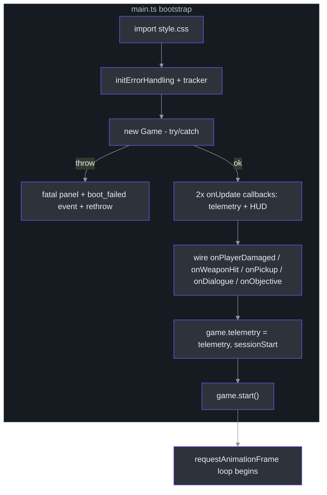
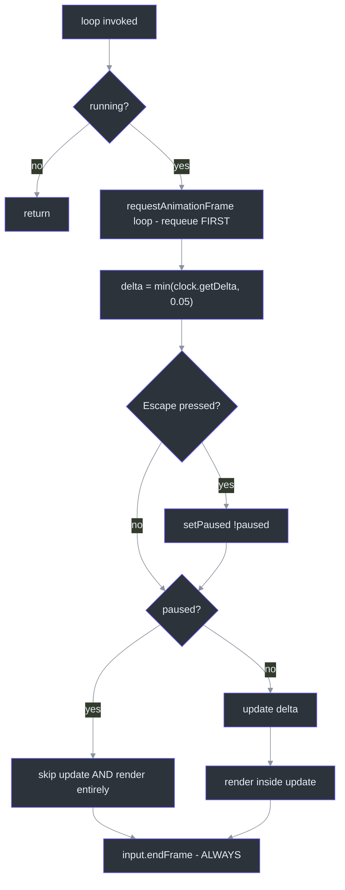
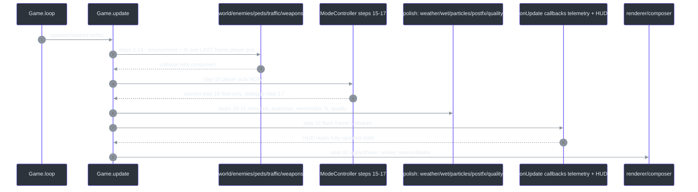

# Game Bootstrap & the Per-Frame Update Loop

## Overview

Every game needs exactly one owner for the things that exist exactly once: the `WebGLRenderer`, the `Scene`, the camera, the render loop, and — most importantly — **the order in which systems update each frame**. In CITY RUSH that owner is the `Game` class ([src/game/Game.ts:51](https://github.com/noiz354/arena-city-try/blob/main/src/game/Game.ts#L51)), booted by `src/main.ts` ([src/main.ts:30](https://github.com/noiz354/arena-city-try/blob/main/src/main.ts#L30)) with static world construction delegated to `World` ([src/game/World.ts:37](https://github.com/noiz354/arena-city-try/blob/main/src/game/World.ts#L37)). The design bet: a *fixed, readable update sequence* beats an event bus or scheduler. You can open `Game.update` ([src/game/Game.ts:385-467](https://github.com/noiz354/arena-city-try/blob/main/src/game/Game.ts#L385-L467)) and read the entire frame top to bottom — no registration order surprises, no priority numbers.

Two deliberate exclusions shape the class: player foot/driving behavior is *not* here (extracted into [ModeController](../../gameplay-core/mode-controller.md) in the "A-1 refactor", [src/game/Game.ts:45-50](https://github.com/noiz354/arena-city-try/blob/main/src/game/Game.ts#L45-L50)), and static geometry is not here (`World` owns ground/terrain/lights/sky). What remains is orchestration: construction order, frame scheduling, cross-system glue (collision lists, explosion watching, engine audio), pause, autosave, resize, and debug exposure.

### At a glance

| Aspect | Value | Source |
|---|---|---|
| Loop mechanism | Plain `requestAnimationFrame`, re-queued **first** each frame | [`src/game/Game.ts:372-374`](https://github.com/noiz354/arena-city-try/blob/main/src/game/Game.ts#L372-L374) |
| Delta clamp | `min(clock.getDelta(), 0.05)` — max 20 Hz sim under lag | [`src/game/Game.ts:376`](https://github.com/noiz354/arena-city-try/blob/main/src/game/Game.ts#L376) |
| Pause | `Escape` edge toggles; skips `update()` entirely (no rendering either) | [`src/game/Game.ts:378-380`](https://github.com/noiz354/arena-city-try/blob/main/src/game/Game.ts#L378-L380) |
| Subsystems wired | ~27 readonly fields + World | [`src/game/Game.ts:52-82`](https://github.com/noiz354/arena-city-try/blob/main/src/game/Game.ts#L52-L82) |
| Autosave | Every 30 s of accumulated sim time | [`src/game/Game.ts:429-433`](https://github.com/noiz354/arena-city-try/blob/main/src/game/Game.ts#L429-L433) |
| HUD timing | Runs at step 32 via `updateCallbacks`, after all simulation | [`src/game/Game.ts:458`](https://github.com/noiz354/arena-city-try/blob/main/src/game/Game.ts#L458), [`src/ui/hud.ts`](ui-layer.md) |

## Architecture

### Phase 1 — Bootstrap in main.ts

The entry file has one job: get error handling up first, construct `Game` safely, wire callbacks, start the loop.

| # | Step | Detail | Source |
|---|---|---|---|
| 1 | CSS first | `import './ui/style.css'` so styles exist before any DOM is built | [`src/main.ts:1`](https://github.com/noiz354/arena-city-try/blob/main/src/main.ts#L1) |
| 2 | Error handling before Game | tracker + `initErrorHandling` run *before* construction; overlay only in DEV builds (`import.meta.env.DEV`) | [`src/main.ts:10-14`](https://github.com/noiz354/arena-city-try/blob/main/src/main.ts#L10-L14), [`src/utils/errors.ts:22-32`](https://github.com/noiz354/arena-city-try/blob/main/src/utils/errors.ts#L22-L32) |
| 3 | Loading overlay helpers | `hideLoading()` fades opacity then removes after 700 ms, guarded by a one-shot `loaded` flag | [`src/main.ts:16-26`](https://github.com/noiz354/arena-city-try/blob/main/src/main.ts#L16-L26) |
| 4 | `new Game({ container })` in try/catch | thrown constructor error renders a full-screen "game failed to start" panel with Reload, tracks `boot_failed`, rethrows | [`src/main.ts:29-45`](https://github.com/noiz354/arena-city-try/blob/main/src/main.ts#L29-L45) |
| 5 | Two `onUpdate` frame callbacks | (a) hide loading + telemetry `frame()`/`update(dt)`, (b) `hud.update(delta, game)` | [`src/main.ts:47-55`](https://github.com/noiz354/arena-city-try/blob/main/src/main.ts#L47-L55) |
| 6 | HUD event hooks | `onPlayerDamaged`, `onWeaponHit`, `onPickup`, `onDialogue`, `onObjective` | [`src/main.ts:58-65`](https://github.com/noiz354/arena-city-try/blob/main/src/main.ts#L58-L65) |
| 7 | Telemetry attach | `game.telemetry = telemetry`, then `telemetry.sessionStart()` | [`src/main.ts:68-69`](https://github.com/noiz354/arena-city-try/blob/main/src/main.ts#L68-L69) |
| 8 | Flush on `pagehide` | analytics batched queue drained via sendBeacon path | [`src/main.ts:72`](https://github.com/noiz354/arena-city-try/blob/main/src/main.ts#L72) |
| 9 | **`game.start()`** | without this the loop never runs and the page sticks on the loading screen — the comment records this line was previously missing | [`src/main.ts:74-75`](https://github.com/noiz354/arena-city-try/blob/main/src/main.ts#L74-L75) |
| 10 | Debug globals | `window.game`, `window.tracker` for console QA | [`src/main.ts:78-79`](https://github.com/noiz354/arena-city-try/blob/main/src/main.ts#L78-L79) |

<!-- Sources: src/main.ts:1-79 -->

### Phase 2 — Game constructor creation order

Creation order matters because later systems take earlier ones as arguments ([src/game/Game.ts:120-338](https://github.com/noiz354/arena-city-try/blob/main/src/game/Game.ts#L120-L338)):

| # | Created | Key detail | Source |
|---|---|---|---|
| 1 | Renderer | `WebGLRenderer({ antialias: true })`, DPR capped at `min(devicePixelRatio, 2)`, shadow map `PCFSoftShadowMap`, ACES tone mapping exposure 1.1 | [`src/game/Game.ts:122-129`](https://github.com/noiz354/arena-city-try/blob/main/src/game/Game.ts#L122-L129) |
| 2 | Camera | `PerspectiveCamera(60, aspect, 0.1, 2000)` at `(28, 22, 38)` looking at `(0, 2, 0)`; aspect guard `max(clientHeight, 1)` | [`src/game/Game.ts:132-135`](https://github.com/noiz354/arena-city-try/blob/main/src/game/Game.ts#L132-L135) |
| 3 | Input | `InputManager.attach(container)` | [`src/game/Game.ts:138-139`](https://github.com/noiz354/arena-city-try/blob/main/src/game/Game.ts#L138-L139) |
| 4 | World | its `fog`, `skyColor`, `root` group grafted onto the scene | [`src/game/Game.ts:142-145`](https://github.com/noiz354/arena-city-try/blob/main/src/game/Game.ts#L142-L145), [`src/game/World.ts:38-48`](https://github.com/noiz354/arena-city-try/blob/main/src/game/World.ts#L38-L48) |
| 5 | Audio, PostFX, AutoQuality | PostFX builds the composer chain immediately (RenderPass → GTAO → Bloom → LUT → OutputPass), sized right away | [`src/game/Game.ts:148-150`](https://github.com/noiz354/arena-city-try/blob/main/src/game/Game.ts#L148-L150), [`src/systems/PostFX.ts:40-63`](https://github.com/noiz354/arena-city-try/blob/main/src/systems/PostFX.ts#L40-L63) |
| 6 | Lights + DayNightSystem | moon `DirectionalLight(0x8fa8ff, 0.3)` at `(-80, 60, -40)`; ambient looked back up out of `world.root.children` by identity | [`src/game/Game.ts:153-165`](https://github.com/noiz354/arena-city-try/blob/main/src/game/Game.ts#L153-L165) |
| 7 | Weather, Vegetation, WetSurface, ColliderDebug, Particles, MobileControls | wet system shares `world.groundMaterial`; collider debug off until F3 | [`src/game/Game.ts:166-178`](https://github.com/noiz354/arena-city-try/blob/main/src/game/Game.ts#L166-L178) |
| 8 | Player | positioned `(SPAWN_X=0, 0.95, SPAWN_Z=0)`; immediate `world.update(x,z)` primes chunk streaming; `WeaponView.holder` parented into `player.group` | [`src/game/Game.ts:181-187`](https://github.com/noiz354/arena-city-try/blob/main/src/game/Game.ts#L181-L187), [`src/systems/ModeController.ts:20-21`](https://github.com/noiz354/arena-city-try/blob/main/src/systems/ModeController.ts#L20-L21) |
| 9-11 | VehicleManager, Enemy/Pedestrian/Traffic groups, WantedSystem | scene-graph groups added as each manager is constructed | [`src/game/Game.ts:190-204`](https://github.com/noiz354/arena-city-try/blob/main/src/game/Game.ts#L190-L204) |
| 12 | MissionSystem + MinimapSystem + SaveManager + PauseMenu | mission hooks: start → toast+telemetry, complete → jingle/toast/save, objective → HUD text | [`src/game/Game.ts:207-235`](https://github.com/noiz354/arena-city-try/blob/main/src/game/Game.ts#L207-L235) |
| 13 | WeaponSystem | collidable provider closure evaluated fresh per raycast: buildings ∪ vehicles; `onShoot` panics peds within 40 m, raises wanted if cop within 55 m | [`src/game/Game.ts:238-275`](https://github.com/noiz354/arena-city-try/blob/main/src/game/Game.ts#L238-L275) |
| 14 | PickupSystem + initial pickups | SMG (-14,14), shotgun (14,-14), rifle (45,-30), two ammo boxes | [`src/game/Game.ts:278-303`](https://github.com/noiz354/arena-city-try/blob/main/src/game/Game.ts#L278-L303), [`src/game/Game.ts:611-617`](https://github.com/noiz354/arena-city-try/blob/main/src/game/Game.ts#L611-L617) |
| 15 | `loadSave()` | restores profile/player pos/health/kills/weapons from localStorage; restored y forced back to 0.95 | [`src/game/Game.ts:582-590`](https://github.com/noiz354/arena-city-try/blob/main/src/game/Game.ts#L582-L590) |
| 16 | CameraRig, ModeController last | ModeController receives all deps last since it touches nearly every subsystem | [`src/game/Game.ts:305-323`](https://github.com/noiz354/arena-city-try/blob/main/src/game/Game.ts#L305-L323) |
| 17 | Listeners + clock | window `resize`; one-shot WebAudio unlock on first `pointerdown`/`keydown`; `clock.start()` | [`src/game/Game.ts:326-337`](https://github.com/noiz354/arena-city-try/blob/main/src/game/Game.ts#L326-L337) |

```mermaid
%%{init: {"theme": "base", "themeVariables": {"background": "#0d1117", "primaryColor": "#2d333b", "primaryBorderColor": "#6d5dfc", "primaryTextColor": "#e6edf3", "lineColor": "#8b949e", "clusterBkg": "#161b22", "clusterBorder": "#30363d"}}}%%
flowchart LR
    subgraph BASE ["foundation - order matters"]
      R["Renderer"] --> C["Camera"] --> IN["InputManager"] --> W["World"]
    end
    subgraph ENV ["environment layer"]
      W --> DN["DayNightSystem"] --> WE["Weather"] --> VEG["Vegetation"] --> WET["WetSurface"]
    end
    subgraph ACTORS ["actor layer"]
      WET --> P["Player at spawn y=0.95"] --> VM["VehicleManager"] --> EN["Enemies / Peds / Traffic"] --> WA["WantedSystem"]
    end
    subgraph META ["content + meta layer"]
      WA --> MS["MissionSystem"] --> MM["Minimap"] --> SM["SaveManager + PauseMenu"]
    end
    subgraph LAST ["consumers of everything"]
      SM --> WS["WeaponSystem"] --> PS["PickupSystem"] --> CR["CameraRig"] --> MC["ModeController - deps last"]
    end
    MC --> LS["resize listener, audio unlock, clock.start()"]
    classDef n fill:#2d333b,stroke:#6d5dfc,color:#e6edf3
    class R,C,IN,W,DN,WE,VEG,WET,P,VM,EN,WA,MS,MM,SM,WS,PS,CR,MC,LS n
    linkStyle default stroke:#8b949e
```

<!-- Sources: src/game/Game.ts:120-338; src/game/World.ts:37-52 -->

## The Loop

Plain `requestAnimationFrame` — not `setAnimationLoop` — with three deliberate choices visible in eight lines ([src/game/Game.ts:372-383](https://github.com/noiz354/arena-city-try/blob/main/src/game/Game.ts#L372-L383)):

1. **Re-queue first** (`this.animationId = requestAnimationFrame(this.loop)` before any work): a throwing system can never kill the loop.
2. **Delta clamp** `Math.min(clock.getDelta(), 0.05)`: returning from a background tab produces a huge wall-clock delta; without the clamp every entity would teleport.
3. **`input.endFrame()` runs even when paused**: edge-triggered key presses and mouse deltas must be cleared regardless, or a stale click fires on resume.

`start()`/`stop()` guard re-entry via the `running` flag and cancel any pending frame ([src/game/Game.ts:344-353](https://github.com/noiz354/arena-city-try/blob/main/src/game/Game.ts#L344-L353)).

<!-- Sources: src/game/Game.ts:372-383; src/utils/InputManager.ts:169-174 -->

### Pause state machine

Pausing lives in three places that agree through one boolean: the loop skip above, `setPaused` which shows/hides the [pause menu](#related-pages) and calls `input.clearTransient()` so no queued click survives the pause boundary ([src/game/Game.ts:593-598](https://github.com/noiz354/arena-city-try/blob/main/src/game/Game.ts#L593-L598)), and `PauseMenu.setVisible` which renders stats + mute state on show ([src/ui/pauseMenu.ts:61-68](https://github.com/noiz354/arena-city-try/blob/main/src/ui/pauseMenu.ts#L61-L68)).

```mermaid
%%{init: {"theme": "base", "themeVariables": {"background": "#0d1117", "primaryColor": "#2d333b", "primaryBorderColor": "#6d5dfc", "primaryTextColor": "#e6edf3", "lineColor": "#8b949e"}}}%%
stateDiagram-v2
    [*] --> Running: game.start()
    Running --> Running: normal frame: update + render
    Running --> Paused: Escape or RESUME button toggles setPaused(true)
    Paused --> Paused: rAF continues but update() and render are skipped; input.endFrame still runs
    Paused --> Running: Escape again or menu RESUME; input.clearTransient dropped stale edges
    Running --> Stopped: destroy(): save, stop, detach, dispose
    Stopped --> [*]
```

<!-- Sources: src/game/Game.ts:372-383,593-604,355-370; src/ui/pauseMenu.ts:61-68 -->

## Per-frame update order

The heart of the page: the exact sequence inside `Game.update(delta)` ([src/game/Game.ts:385-467](https://github.com/noiz354/arena-city-try/blob/main/src/game/Game.ts#L385-L467)). This table is normative — new systems slot into it, they do not reorder it.

| # | Step | Why here / detail | Source |
|---|---|---|---|
| 1 | Spatial audio listener follows camera | audio positions are relative to what you see | [`src/game/Game.ts:387`](https://github.com/noiz354/arena-city-try/blob/main/src/game/Game.ts#L387) |
| 2 | Chunk streaming around `modeCtrl.activePosition` | car while driving, else player | [`src/game/Game.ts:389-390`](https://github.com/noiz354/arena-city-try/blob/main/src/game/Game.ts#L389-L390), [`src/systems/ModeController.ts:62-70`](https://github.com/noiz354/arena-city-try/blob/main/src/systems/ModeController.ts#L62-L70) |
| 3 | `dayNight.update(delta)` | must precede updateSun — computes shared sun direction/colors | [`src/game/Game.ts:393`](https://github.com/noiz354/arena-city-try/blob/main/src/game/Game.ts#L393) |
| 4 | `world.updateSun(x, z, sunDir)` | texel-snapped shadow frustum follows active position | [`src/game/Game.ts:394`](https://github.com/noiz354/arena-city-try/blob/main/src/game/Game.ts#L394), [`src/game/World.ts:101-118`](https://github.com/noiz354/arena-city-try/blob/main/src/game/World.ts#L101-L118) |
| 5 | `vehicles.update` | parked-car distance culling around active position | [`src/game/Game.ts:395`](https://github.com/noiz354/arena-city-try/blob/main/src/game/Game.ts#L395) |
| 6 | Build collidable lists | buildings ∪ parked vehicles, fresh each frame | [`src/game/Game.ts:397-398`](https://github.com/noiz354/arena-city-try/blob/main/src/game/Game.ts#L397-L398) |
| 7 | F3 collider debug toggle + update | off unless requested | [`src/game/Game.ts:401-402`](https://github.com/noiz354/arena-city-try/blob/main/src/game/Game.ts#L401-L402) |
| 8 | Enemy AI | LOS uses spatial `chunks.queryCircle(player, 70)`, not the full building list | [`src/game/Game.ts:405-406`](https://github.com/noiz354/arena-city-try/blob/main/src/game/Game.ts#L405-L406) |
| 9 | Pedestrians | walk/flee vs building collidables | [`src/game/Game.ts:407`](https://github.com/noiz354/arena-city-try/blob/main/src/game/Game.ts#L407) |
| 10 | Traffic AI | drives with combined collidable set | [`src/game/Game.ts:408`](https://github.com/noiz354/arena-city-try/blob/main/src/game/Game.ts#L408) |
| 11 | Car-vs-pedestrian run-over check | ≥2.5 m/s kills or knocks down, car slows ×0.72, 400 ms cooldown per ped | [`src/game/Game.ts:409`](https://github.com/noiz354/arena-city-try/blob/main/src/game/Game.ts#L409), [`src/game/Game.ts:497-525`](https://github.com/noiz354/arena-city-try/blob/main/src/game/Game.ts#L497-L525) |
| 12 | Traffic-vs-on-foot-player hit check | damage `min(40, round((speed−2.5)·6))`, knockback vy=3.5 | [`src/game/Game.ts:410`](https://github.com/noiz354/arena-city-try/blob/main/src/game/Game.ts#L410), [`src/game/Game.ts:543-569`](https://github.com/noiz354/arena-city-try/blob/main/src/game/Game.ts#L543-L569) |
| 13 | Pickups | 1.9 m radius collection | [`src/game/Game.ts:411`](https://github.com/noiz354/arena-city-try/blob/main/src/game/Game.ts#L411) |
| 14 | Weapons | hitscan ticks/reload progress | [`src/game/Game.ts:412`](https://github.com/noiz354/arena-city-try/blob/main/src/game/Game.ts#L412) |
| 15 | **`modeCtrl.update`** | player movement, camera rig, enter/exit, driving physics, death timer | [`src/game/Game.ts:415`](https://github.com/noiz354/arena-city-try/blob/main/src/game/Game.ts#L415) |
| 16 | Wanted level — **foot mode only** | frozen while driving | [`src/game/Game.ts:416`](https://github.com/noiz354/arena-city-try/blob/main/src/game/Game.ts#L416) |
| 17 | Civilian dialogue `maybeSpeak` | foot mode and health > 0 only | [`src/game/Game.ts:419-422`](https://github.com/noiz354/arena-city-try/blob/main/src/game/Game.ts#L419-L422) |
| 18 | Missions | zone/checkpoint evaluation | [`src/game/Game.ts:425`](https://github.com/noiz354/arena-city-try/blob/main/src/game/Game.ts#L425) |
| 19 | Minimap redraw | throttled internal cadence | [`src/game/Game.ts:426`](https://github.com/noiz354/arena-city-try/blob/main/src/game/Game.ts#L426), [`src/game/Game.ts:527-534`](https://github.com/noiz354/arena-city-try/blob/main/src/game/Game.ts#L527-L534) |
| 20 | Autosave every 30 s | `saveTimer` accumulates sim time only (paused time excluded naturally) | [`src/game/Game.ts:429-433`](https://github.com/noiz354/arena-city-try/blob/main/src/game/Game.ts#L429-L433) |
| 21 | Wanted-star telemetry | edge-triggered via `lastWantedStars` | [`src/game/Game.ts:436-439`](https://github.com/noiz354/arena-city-try/blob/main/src/game/Game.ts#L436-L439) |
| 22 | Weapon viewmodel bob/kick | moving when speed > 0.5 m/s; intensity `min(1, hypot(vx,vz)/9.5)` | [`src/game/Game.ts:442-443`](https://github.com/noiz354/arena-city-try/blob/main/src/game/Game.ts#L442-L443) |
| 23 | Weather | rain follows camera position | [`src/game/Game.ts:446`](https://github.com/noiz354/arena-city-try/blob/main/src/game/Game.ts#L446) |
| 24 | Vegetation sway | driven by `clock.elapsedTime`, not delta — pure function of time | [`src/game/Game.ts:447`](https://github.com/noiz354/arena-city-try/blob/main/src/game/Game.ts#L447) |
| 25 | Wet-surface rain response | consumes weather rain amount | [`src/game/Game.ts:448`](https://github.com/noiz354/arena-city-try/blob/main/src/game/Game.ts#L448) |
| 26 | Particles | pool update | [`src/game/Game.ts:449`](https://github.com/noiz354/arena-city-try/blob/main/src/game/Game.ts#L449) |
| 27 | Explosion/smoke pass over wrecks | one-shot boom per vehicle via `exploded: Set<Vehicle>` dedupe | [`src/game/Game.ts:450`](https://github.com/noiz354/arena-city-try/blob/main/src/game/Game.ts#L450), [`src/game/Game.ts:470-481`](https://github.com/noiz354/arena-city-try/blob/main/src/game/Game.ts#L470-L481) |
| 28 | Engine audio + KeyM mute | keyed off `\|speed\|/maxSpeed` | [`src/game/Game.ts:451`](https://github.com/noiz354/arena-city-try/blob/main/src/game/Game.ts#L451), [`src/game/Game.ts:483-491`](https://github.com/noiz354/arena-city-try/blob/main/src/game/Game.ts#L483-L491) |
| 29 | Exposure knob | `postfx.setExposure(0.55 + dayNight.day * 0.6)` — 0.55 night → 1.15 noon | [`src/game/Game.ts:453`](https://github.com/noiz354/arena-city-try/blob/main/src/game/Game.ts#L453) |
| 30 | postfx.update | screen shake decay λ=2.2/s | [`src/game/Game.ts:454`](https://github.com/noiz354/arena-city-try/blob/main/src/game/Game.ts#L454), [`src/systems/PostFX.ts:75-86`](https://github.com/noiz354/arena-city-try/blob/main/src/systems/PostFX.ts#L75-L86) |
| 31 | AutoQuality sample + tier adjust | FPS sampled over 2 s windows; down <28 fps, up >50 fps | [`src/game/Game.ts:455-456`](https://github.com/noiz354/arena-city-try/blob/main/src/game/Game.ts#L455-L456), [`src/systems/AutoQuality.ts:32-54`](https://github.com/noiz354/arena-city-try/blob/main/src/systems/AutoQuality.ts#L32-L54) |
| 32 | `updateCallbacks.forEach` | main.ts telemetry + **HUD** run here, after all simulation | [`src/game/Game.ts:458`](https://github.com/noiz354/arena-city-try/blob/main/src/game/Game.ts#L458), [`src/main.ts:47-55`](https://github.com/noiz354/arena-city-try/blob/main/src/main.ts#L47-L55) |
| 33 | applyShake → render → restoreShake | shake never accumulates into camera state | [`src/game/Game.ts:460-466`](https://github.com/noiz354/arena-city-try/blob/main/src/game/Game.ts#L460-L466) |

Rendering picks `composer.render()` when post-processing is enabled, else raw `renderer.render` ([src/game/Game.ts:461-465](https://github.com/noiz354/arena-city-try/blob/main/src/game/Game.ts#L461-L465); pass chain in [PostFX](../../rendering-postfx/postfx.md)).

<!-- Sources: src/game/Game.ts:385-467; src/main.ts:47-55 -->

### Ordering consequences worth knowing

- **Stale-player reads:** enemies/pedestrians/traffic/weapons (steps 8–14) all see the *previous* frame's player position, because the player moves at step 15. One frame at 60 fps ≈ 16 ms of lag — imperceptible, but it is why melee range checks use generous radii.
- **HUD always current:** the HUD runs at step 32, so health bars, ammo and prompts never lag simulation by even one step ([read path details](ui-layer.md)).
- **Vegetation ignores delta** deliberately: sway is `f(elapsedTime)`, so pausing freezes it for free and slow frames don't wind up the grass.

## Resize handling

`resize` reads dimensions from `renderer.domElement.parentElement` (not `window.innerWidth`), guards height ≥ 1, updates `camera.aspect` + `updateProjectionMatrix`, `renderer.setSize`, and `postfx.setSize` (which resizes the composer plus bloom/GTAO passes) ([src/game/Game.ts:619-628](https://github.com/noiz354/arena-city-try/blob/main/src/game/Game.ts#L619-L628), [src/systems/PostFX.ts:65-69](https://github.com/noiz354/arena-city-try/blob/main/src/systems/PostFX.ts#L65-L69)). Separately, AutoQuality tier changes force a `renderer.setSize(window.innerWidth, window.innerHeight, false)` so a new pixel ratio applies on the next frame ([src/systems/AutoQuality.ts:56-63](https://github.com/noiz354/arena-city-try/blob/main/src/systems/AutoQuality.ts#L56-L63)).

## Data structures & public API

| Artifact | Shape | Source |
|---|---|---|
| Readonly subsystem fields | ~25 declared once on `Game` | [`src/game/Game.ts:52-82`](https://github.com/noiz354/arena-city-try/blob/main/src/game/Game.ts#L52-L82) |
| Mutable state | `kills`, `paused`, private `saveTimer=30`, `exploded: Set<Vehicle>`, `lastWantedStars`, `lastTrafficHit` timestamp | [`src/game/Game.ts:84-88`](https://github.com/noiz354/arena-city-try/blob/main/src/game/Game.ts#L84-L88), [`src/game/Game.ts:542`](https://github.com/noiz354/arena-city-try/blob/main/src/game/Game.ts#L542) |
| Delegating getters | `mode ('foot' \| 'driving')`, `vehicle`, `nearestVehicle`, `respawnTimer` keep the pre-refactor public surface alive | [`src/game/Game.ts:104-118`](https://github.com/noiz354/arena-city-try/blob/main/src/game/Game.ts#L104-L118) |
| `updateCallbacks` | `Set<(delta: number) => void>` fed by `onUpdate(cb)` | [`src/game/Game.ts:98`](https://github.com/noiz354/arena-city-try/blob/main/src/game/Game.ts#L98), [`src/game/Game.ts:340-342`](https://github.com/noiz354/arena-city-try/blob/main/src/game/Game.ts#L340-L342) |
| `Collidable` | just `{ box: Box3 }` — single collision currency shared by player, vehicles, weapons, camera, pedestrians | [`src/game/World.ts:22-24`](https://github.com/noiz354/arena-city-try/blob/main/src/game/World.ts#L22-L24) |
| World exposes | `root`, `skyColor(0x87ceeb)`, `fog(0xbfd4e4, 90, 420)`, `chunks`, lights, `sky`, shared `groundMaterial`; tuning `shadowHalf=55`, `shadowDistance=140` | [`src/game/World.ts:38-52`](https://github.com/noiz354/arena-city-try/blob/main/src/game/World.ts#L38-L52) |
| `destroy()` | saves, stops loop, detaches input + resize listener, disposes world/vegetation/wet/colliderDebug/vehicles/traffic/wanted/particles/mobile/renderer | [`src/game/Game.ts:355-370`](https://github.com/noiz354/arena-city-try/blob/main/src/game/Game.ts#L355-L370) |

## Tuning & extension points

| Knob | Value | Source |
|---|---|---|
| Delta clamp | 0.05 s (max 20 Hz sim under lag) | [`src/game/Game.ts:376`](https://github.com/noiz354/arena-city-try/blob/main/src/game/Game.ts#L376) |
| DPR cap | 2 | [`src/game/Game.ts:122-128`](https://github.com/noiz354/arena-city-try/blob/main/src/game/Game.ts#L122-L128) |
| Autosave interval | 30 s | [`src/game/Game.ts:430-433`](https://github.com/noiz354/arena-city-try/blob/main/src/game/Game.ts#L430-L433) |
| Exposure curve | `0.55 + day*0.6` | [`src/game/Game.ts:453`](https://github.com/noiz354/arena-city-try/blob/main/src/game/Game.ts#L453) |
| Enemy LOS query radius | 70 m | [`src/game/Game.ts:405`](https://github.com/noiz354/arena-city-try/blob/main/src/game/Game.ts#L405) |
| Traffic-hit tuning | min impact 2.5 m/s, dmg scale 6/m/s, cap 40, vy 3.5, cooldown 400 ms | [`src/game/Game.ts:553-566`](https://github.com/noiz354/arena-city-try/blob/main/src/game/Game.ts#L553-L566) |

**Adding a system** (the sanctioned pattern): construct it in the constructor in dependency order, add one `this.sys.update(delta, …)` line in `Game.update` at the correct slot — before step 15 ([src/game/Game.ts:415](https://github.com/noiz354/arena-city-try/blob/main/src/game/Game.ts#L415)) if it should see last-frame player state, after if it needs current-frame — and dispose it in `destroy()`.

## Known gaps

| Finding | Detail | Source |
|---|---|---|
| PostFX composer never disposed | `PostFX.dispose()` exists but `Game.destroy()` never calls it; harmless on page teardown but leaks GPU targets if `Game` were recreated in-page | [`src/game/Game.ts:355-370`](https://github.com/noiz354/arena-city-try/blob/main/src/game/Game.ts#L355-L370) vs [`src/systems/PostFX.ts:119-122`](https://github.com/noiz354/arena-city-try/blob/main/src/systems/PostFX.ts#L119-L122) |
| Landmark tower offset | sits at (20, 20), not origin, specifically to keep spawn roads clear (BUG-001/002 history) — any "props at spawn" assumptions must respect this | [`src/systems/CityGenerator.ts:19-27`](https://github.com/noiz354/arena-city-try/blob/main/src/systems/CityGenerator.ts#L19-L27) |

## Related Pages

| Page | Relationship |
|------|-------------|
| [Entities — Player & Vehicle](entities.md) | The actors this loop steps at slots 8–15 |
| [UI Layer — HUD Read Path & Pause Menu](ui-layer.md) | Consumes step 32's callback slot; owns the other half of pause |
| [ModeController](../../gameplay-core/mode-controller.md) | Owns everything extracted out of `Game` in the A-1 refactor |
| [ChunkManager](../../world-generation/chunk-manager.md) | The chunk cache stepped at slot 2 |
| [PostFX](../../rendering-postfx/postfx.md) | Composer chain rendered at slot 33; exposure knob target |
| [AutoQuality](../../rendering-postfx/auto-quality.md) | Frame-timing consumer at slot 31 |
| [SaveManager](../ui-audio-support/save-manager.md) | Storage backend for autosave (slot 20) and `loadSave()` |
| [Quick Reference](../../getting-started/quick-reference.md) | `window.game` console hooks exposed at bootstrap |
