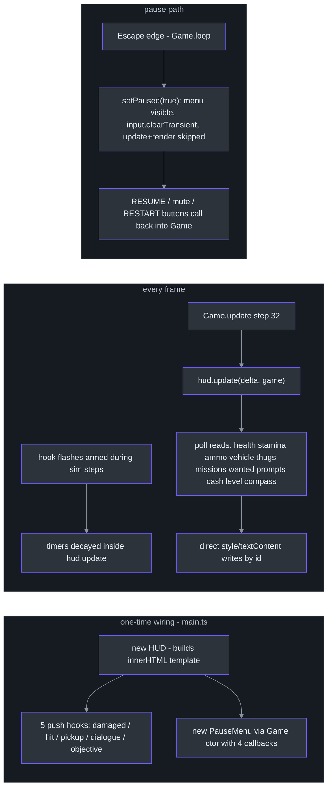
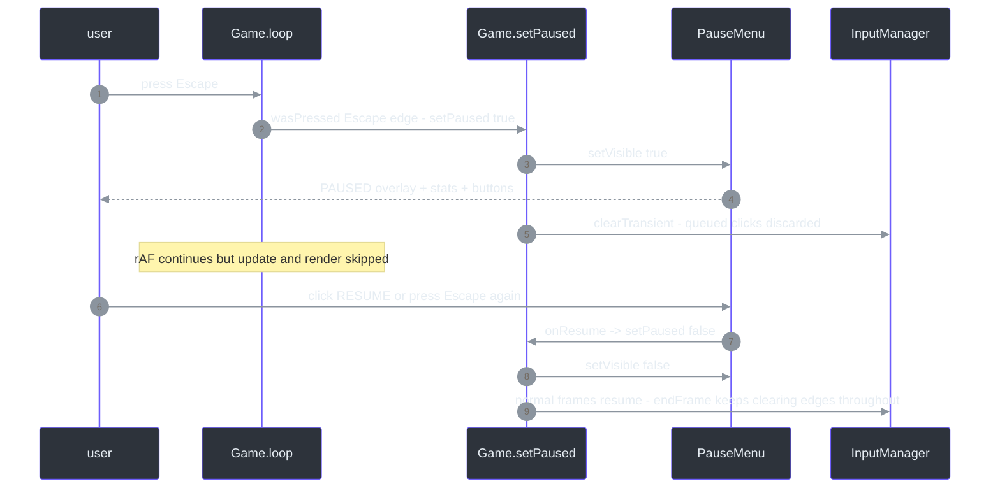

# UI Layer — HUD Read Path & Pause Menu

## Overview

CITY RUSH's UI has exactly two classes and zero frameworks: `HUD` ([src/ui/hud.ts:8](https://github.com/noiz354/arena-city-try/blob/main/src/ui/hud.ts#L8)) and `PauseMenu` ([src/ui/pauseMenu.ts:13](https://github.com/noiz354/arena-city-try/blob/main/src/ui/pauseMenu.ts#L13)). Both build their DOM imperatively into the `#ui-root` container, styled by the CSS bundle imported first thing in [main.ts:1](https://github.com/noiz354/arena-city-try/blob/main/src/main.ts#L1) ("CSS bundled inline by Vite — sandbox-safe, no CDN").

The architectural choice worth naming: the HUD is **read-only polling, not reactive**. Every frame it re-reads ~20 fields off the `Game` instance and writes them straight into DOM elements by id. There is no store, no subscription, no diffing. The one-way cost is a full re-write per frame (trivial for this element count); the benefit is that the HUD *cannot* desync — whatever simulation produced this frame is what the screen shows, guaranteed by callback ordering in the loop ([src/game/Game.ts:458](https://github.com/noiz354/arena-city-try/blob/main/src/game/Game.ts#L458)).

The inverse holds for transient feedback (damage vignette, hit marker, pickup toast): those are push-based, driven by five hooks assigned once at boot ([src/main.ts:58-65](https://github.com/noiz354/arena-city-try/blob/main/src/main.ts#L58-L65)) that just arm short timers which the poll path then decays.

### At a glance

| Aspect | Value | Source |
|---|---|---|
| Mount point | `#ui-root` div created in index.html, appended by both classes | [`src/ui/hud.ts:59`](https://github.com/noiz354/arena-city-try/blob/main/src/ui/hud.ts#L59), [`src/ui/pauseMenu.ts:58`](https://github.com/noiz354/arena-city-try/blob/main/src/ui/pauseMenu.ts#L58) |
| Update cadence | Once per rendered frame via `game.onUpdate` callback slot (step 32 of the frame) | [`src/main.ts:54-55`](https://github.com/noiz354/arena-city-try/blob/main/src/main.ts#L54-L55), [`src/game/Game.ts:458`](https://github.com/noiz354/arena-city-try/blob/main/src/game/Game.ts#L458) |
| State access | Direct field reads off `Game` public surface (`player`, `vehicle`, `mode`, `missions`, `wanted`, `enemies`, …) | [`src/ui/hud.ts:88-216`](https://github.com/noiz354/arena-city-try/blob/main/src/ui/hud.ts#L88-L216) |
| Push hooks | `showDamage`, `showHit`, `showPickup`, `showDialogue`, `setObjective` armed from boot wiring | [`src/ui/hud.ts:62-86`](https://github.com/noiz354/arena-city-try/blob/main/src/ui/hud.ts#L62-L86), [`src/main.ts:58-65`](https://github.com/noiz354/arena-city-try/blob/main/src/main.ts#L58-L65) |
| Pause entry | `Escape` edge in the loop → `Game.setPaused` → `PauseMenu.setVisible`; while paused neither `update()` nor render runs | [`src/game/Game.ts:378-380,593-598`](https://github.com/noiz354/arena-city-try/blob/main/src/game/Game.ts#L378-L380) |

## Architecture



<!-- Sources: src/main.ts:47-65; src/ui/hud.ts:19-86; src/ui/pauseMenu.ts:19-68; src/game/Game.ts:378-382,593-598 -->

### HUD element inventory

Built once as an innerHTML template in the constructor ([src/ui/hud.ts:22-58](https://github.com/noiz354/arena-city-try/blob/main/src/ui/hud.ts#L22-L58)); everything is addressed by id afterwards:

| Group | Elements | Visibility rule |
|---|---|---|
| Status strip | title, health bar (`hud-health-fill`), cash, level, FPS, POS, stamina bar, thug counter | always visible; stamina hidden while driving ([src/ui/hud.ts:99-101](https://github.com/noiz354/arena-city-try/blob/main/src/ui/hud.ts#L99-L101)) |
| Driving cluster | speed readout, vehicle-health bar | `display:inline-block` only while `mode === 'driving' && game.vehicle` ([src/ui/hud.ts:122-131](https://github.com/noiz354/arena-city-try/blob/main/src/ui/hud.ts#L122-L131)) |
| Combat cluster | weapon name, mag/reserve, reload progress bar, crosshair | foot mode AND alive only ([src/ui/hud.ts:103-119](https://github.com/noiz354/arena-city-try/blob/main/src/ui/hud.ts#L103-L119)) |
| Mission panel + compass | name, objective ticker, distance, rotating arrow | active mission; compass additionally requires a waypoint ([src/ui/hud.ts:153-175](https://github.com/noiz354/arena-city-try/blob/main/src/ui/hud.ts#L153-L157)) |
| Feedback layers | wanted stars, damage vignette, hit marker, pickup toast, dialogue bubble, contextual prompt, control hint | opacity-driven by timers/state |

## The per-frame read path

`update(delta, game)` ([src/ui/hud.ts:88](https://github.com/noiz354/arena-city-try/blob/main/src/ui/hud.ts#L88)) executes this read list in order — the same order as the source lines:

| Reads | Writes / behavior | Source |
|---|---|---|
| `game.mode === 'driving'` cached as `driving` | drives all visibility branches below | [`src/ui/hud.ts:89`](https://github.com/noiz354/arena-city-try/blob/main/src/ui/hud.ts#L89) |
| `player.health / maxHealth` | bar width %; gradient green >50%, amber >25%, red below | [`src/ui/hud.ts:91-96`](https://github.com/noiz354/arena-city-try/blob/main/src/ui/hud.ts#L91-L96) |
| `player.stamina` | width %; strip hidden while driving | [`src/ui/hud.ts:98-101`](https://github.com/noiz354/arena-city-try/blob/main/src/ui/hud.ts#L98-L101) |
| `weapons.currentDef.name`, `weapons.mag`, `weapons.reserve`, `reloading`, `reloadProgress` | combat cluster text + reload bar opacity/fill | [`src/ui/hud.ts:110-119`](https://github.com/noiz354/arena-city-try/blob/main/src/ui/hud.ts#L110-L119) |
| `vehicle.speedKmh`, `vehicle.health`, `vehicle.wrecked` | km/h text; vehicle bar green/red when wrecked | [`src/ui/hud.ts:126-131`](https://github.com/noiz354/arena-city-try/blob/main/src/ui/hud.ts#L126-L131) |
| `enemies.aliveCount` | THUGS counter | [`src/ui/hud.ts:134`](https://github.com/noiz354/arena-city-try/blob/main/src/ui/hud.ts#L134) |
| `respawnTimer`, `nearestVehicle` (+ `.wrecked`, `.config.name`) | contextual prompt: death banner, `[E] Enter <name>`, or WRECKED warning | [`src/ui/hud.ts:137-146`](https://github.com/noiz354/arena-city-try/blob/main/src/ui/hud.ts#L137-L146) |
| `missions.profile.money`, `.level` | cash + LVL labels | [`src/ui/hud.ts:149-150`](https://github.com/noiz354/arena-city-try/blob/main/src/ui/hud.ts#L149-L150) |
| `missions.active`, `missions.waypoint()`, `missions.objectiveText()` | mission panel + objective text (page-set text wins over generated) | [`src/ui/hud.ts:155-161`](https://github.com/noiz354/arena-city-try/blob/main/src/ui/hud.ts#L155-L161) |
| `cameraRig.yaw` + waypoint delta | compass arrow rotation (math below) | [`src/ui/hud.ts:162-174`](https://github.com/noiz354/arena-city-try/blob/main/src/ui/hud.ts#L162-L174) |
| `wanted.stars` | WANTED ★ string, opacity toggle | [`src/ui/hud.ts:178-181`](https://github.com/noiz354/arena-city-try/blob/main/src/ui/hud.ts#L178-L181) |
| internal timers ×3 | dialogue/vignette/hit/toast decay + low-health pulse | [`src/ui/hud.ts:183-203`](https://github.com/noiz354/arena-city-try/blob/main/src/ui/hud.ts#L183-L203) |
| `performance.now()` window | FPS counter + position readout refreshed at most 1×/s | [`src/ui/hud.ts:205-215`](https://github.com/noiz354/arena-city-try/blob/main/src/ui/hud.ts#L205-L215) |

```mermaid
%%{init: {"theme": "base", "themeVariables": {"background": "#0d1117", "primaryColor": "#2d333b", "primaryBorderColor": "#6d5dfc", "primaryTextColor": "#e6edf3", "lineColor": "#8b949e", "actorBkg": "#2d333b", "actorBorder": "#6d5dfc", "actorTextColor": "#e6edf3", "signalColor": "#8b949e", "signalTextColor": "#e6edf3"}}}%%
sequenceDiagram
    autonumber
    participant SIM as simulation systems - steps 1-31
    participant LOOP as Game.update
    participant H as HUD
    participant D as DOM #ui-root
    SIM->>LOOP: state mutations settle - player moved at step 15
    LOOP->>H: updateCallbacks flush - hud.update(delta, game)
    H->>H: cache driving flag, decay flash timers
    H->>D: write health/stamina/ammo bars
    alt mode === driving and game.vehicle
        H->>D: show speed kmh + vehicle-health bar, hide stamina/combat
    else foot and alive
        H->>D: show ammo + crosshair + nearest-car prompt
    end
    H->>D: mission panel, compass rotation, wanted stars
    H->>D: vignette/hit/toast opacities from decaying timers
    Note over H,D: HUD never mutates game state - strictly read-only against Game
```

<!-- Sources: src/ui/hud.ts:88-216; src/game/Game.ts:458 -->

### Details worth knowing

- **Compass math** ([src/ui/hud.ts:167-173](https://github.com/noiz354/arena-city-try/blob/main/src/ui/hud.ts#L167-L173)): angle to waypoint `atan2(wp.x − p.x, wp.z − p.z)` minus `cameraRig.yaw`, wrapped into `(−π, π]` with two while-loops; the arrow rotates by `−rel` rad so it points relative to where the camera looks. Distance uses the *active* entity's position — vehicle position while driving, else player ([src/ui/hud.ts:164](https://github.com/noiz354/arena-city-try/blob/main/src/ui/hud.ts#L164)).
- **Low-health pulse** ([src/ui/hud.ts:198-203](https://github.com/noiz354/arena-city-try/blob/main/src/ui/hud.ts#L198-L203)): below 30% HP (and alive), a sine wave over `performance.now()·0.004` oscillates the vignette up to 0.35 opacity — layered on top of any damage flash via `Math.max`.
- **Objective override**: `setObjective(text)` stores persistent text that beats `missions.objectiveText()` until replaced ([src/ui/hud.ts:81-86](https://github.com/noiz354/arena-city-try/blob/main/src/ui/hud.ts#L81-L86), [src/ui/hud.ts:160-161](https://github.com/noiz354/arena-city-try/blob/main/src/ui/hud.ts#L160-L161)) — set through the `onObjective` hook fired by MissionSystem completion/objective changes ([src/game/Game.ts:207-223](https://github.com/noiz354/arena-city-try/blob/main/src/game/Game.ts#L207-L223)).
- **FPS/POS throttle**: the expensive-ish text updates run only when a 1000 ms window elapses; frames counted in between ([src/ui/hud.ts:205-215](https://github.com/noiz354/arena-city-try/blob/main/src/ui/hud.ts#L205-L215)).
- **Push-hook timers**: `showDamage` arms 0.5 s, `showHit` 0.12 s, `showPickup` 1.2 s (and sets toast text immediately), `showDialogue` 3.2 s ([src/ui/hud.ts:62-79](https://github.com/noiz354/arena-city-try/blob/main/src/ui/hud.ts#L62-L79)). The hook wiring itself lives in main.ts ([src/main.ts:58-65](https://github.com/noiz354/arena-city-try/blob/main/src/main.ts#L58-L65)).

## Pause menu

`PauseMenu` is constructed by `Game` with a four-callback interface and renders nothing until shown ([src/game/Game.ts:228-235](https://github.com/noiz354/arena-city-try/blob/main/src/game/Game.ts#L228-L235), [src/ui/pauseMenu.ts:19-59](https://github.com/noiz354/arena-city-try/blob/main/src/ui/pauseMenu.ts#L19-L59)). Entry points: the `Escape` edge polled in the loop *before* the paused check ([src/game/Game.ts:378](https://github.com/noiz354/arena-city-try/blob/main/src/game/Game.ts#L378)), or the RESUME button. On `setVisible(true)` it refreshes the stats line and the mute label ([src/ui/pauseMenu.ts:61-68](https://github.com/noiz354/arena-city-try/blob/main/src/ui/pauseMenu.ts#L61-L68)).

While paused, the loop still fires `requestAnimationFrame` but skips both `update()` and rendering — the last frame stays on screen behind the overlay — and `input.endFrame()` keeps clearing edges ([src/game/Game.ts:372-383](https://github.com/noiz354/arena-city-try/blob/main/src/game/Game.ts#L372-L383)). `setPaused` also calls `input.clearTransient()` so a click that happened mid-pause can't fire on resume ([src/game/Game.ts:597](https://github.com/noiz354/arena-city-try/blob/main/src/game/Game.ts#L597), [src/utils/InputManager.ts:177-182](https://github.com/noiz354/arena-city-try/blob/main/src/utils/InputManager.ts#L177-L182)).

| Button | Callback chain | Effect | Source |
|---|---|---|---|
| ▶ RESUME | `cb.onResume` → `Game.setPaused(false)` | hides menu, sim resumes next frame | [`src/ui/pauseMenu.ts:35`](https://github.com/noiz354/arena-city-try/blob/main/src/ui/pauseMenu.ts#L35), [`src/game/Game.ts:593-598`](https://github.com/noiz354/arena-city-try/blob/main/src/game/Game.ts#L593-L598) |
| SOUND ON/OFF | `cb.onToggleMute` → `audio.setMuted` + local `refreshMute()` label swap | persists for session | [`src/ui/pauseMenu.ts:36-39,74-76`](https://github.com/noiz354/arena-city-try/blob/main/src/ui/pauseMenu.ts#L36-L39) |
| ↺ RESTART | `cb.onRestart` → `Game.restart()`: `saveManager.clear()` then `window.location.reload()` | **wipes the save** — destructive by design, hence the danger styling class `pause__danger` | [`src/ui/pauseMenu.ts:40`](https://github.com/noiz354/arena-city-try/blob/main/src/ui/pauseMenu.ts#L40), [`src/game/Game.ts:600-604`](https://github.com/noiz354/arena-city-try/blob/main/src/game/Game.ts#L600-L604) |
| Stats block | `cb.stats()` string built on open: `MONEY $x · LEVEL n · KILLS n · WANTED ★★` | snapshot, not live-updated while open | [`src/game/Game.ts:606-609`](https://github.com/noiz354/arena-city-try/blob/main/src/game/Game.ts#L606-L609), [`src/ui/pauseMenu.ts:64-67`](https://github.com/noiz354/arena-city-try/blob/main/src/ui/pauseMenu.ts#L64-L67) |

The controls reference card is static HTML in the constructor listing WASD/LMB/1–4/R/E/SHIFT/SPACE/M/ESC ([src/ui/pauseMenu.ts:42-50](https://github.com/noiz354/arena-city-try/blob/main/src/ui/pauseMenu.ts#L42-L50)); it mirrors the binding map maintained on [Input, Utilities & Data Tables](utils-and-data.md#key-binding-map).



<!-- Sources: src/game/Game.ts:372-383,593-604; src/ui/pauseMenu.ts:61-76; src/utils/InputManager.ts:169-182 -->

## Implementation notes & extension points

| Topic | Detail | Source |
|---|---|---|
| No virtualization needed | fixed element count (~25 ids), direct id lookups per frame are cheap; if the HUD grows, batch reads before writes to avoid layout thrash | [`src/ui/hud.ts:88-216`](https://github.com/noiz354/arena-city-try/blob/main/src/ui/hud.ts#L88-L216) |
| Adding a widget | add markup to the constructor template, then one read/write pair in `update` — keep it after the `driving` branch if mode-conditional | [`src/ui/hud.ts:22-58`](https://github.com/noiz354/arena-city-try/blob/main/src/ui/hud.ts#L22-L58) |
| Minimap is NOT here | the canvas minimap is a separate system stepped at slot 19 of the frame — see [MinimapSystem](../ui-audio-support/minimap-system.md) | [`src/game/Game.ts:426,527-534`](https://github.com/noiz354/arena-city-try/blob/main/src/game/Game.ts#L426) |
| Debug surface | the HUD is also QA-visible state: console access via `window.game` lets you verify what the HUD should be showing | [`src/main.ts:78-79`](https://github.com/noiz354/arena-city-try/blob/main/src/main.ts#L78-L79) |

No doc-vs-code anomalies were found in `hud.ts` or `pauseMenu.ts`: every visibility branch and timer matches its comment/docstring, and both classes confine themselves to DOM mutation without touching game state.

## Related Pages

| Page | Relationship |
|------|-------------|
| [Game Bootstrap & Per-Frame Update Loop](game-loop.md) | Owns the callback slot (step 32) the HUD runs in and the pause skip logic |
| [Input, Utilities & Data Tables](utils-and-data.md) | Binding map mirrored by the pause-menu controls card |
| [ModeController](../../gameplay-core/mode-controller.md) | The `mode`/`nearestVehicle`/`respawnTimer` values the HUD polls come from its getters |
| [MissionSystem](../../combat-missions/mission-system.md) | Feeds mission panel, objective text and compass waypoints |
| [MinimapSystem](../ui-audio-support/minimap-system.md) | The other half of the visual layer — canvas map, separate from DOM HUD |
| [SaveManager](../ui-audio-support/save-manager.md) | RESTART wipes storage through it |
