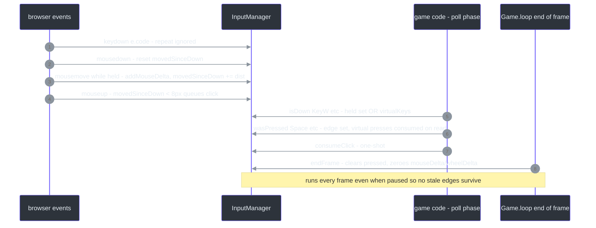
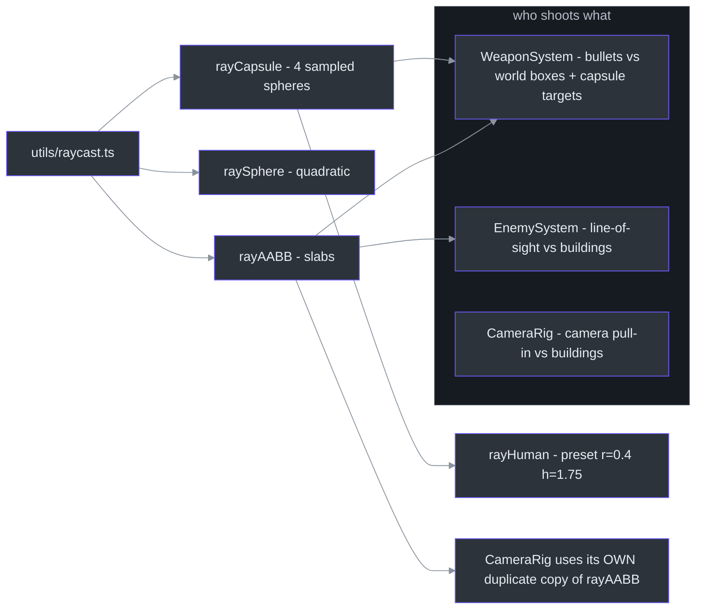
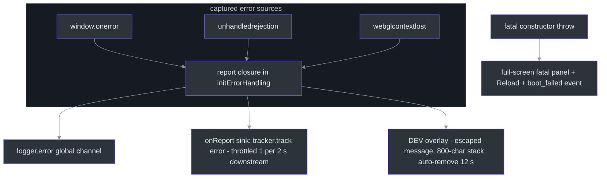
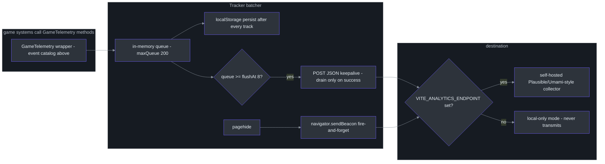

# Input, Utilities & Data Tables

## Overview

Everything on this page is plumbing — the code that has no gameplay opinion of its own but which every gameplay system stands on. Three groups:

1. **`src/utils/`** — `InputManager` (keyboard + mouse-drag state with per-frame edge tracking), analytic ray helpers (`rayAABB`/`raySphere`/`rayCapsule`), shadow-texel snapping pure functions, a structured singleton logger, and global error handling.
2. **`src/data/`** — static tables (`MISSIONS`, `VEHICLE_CONFIGS`, `WEAPONS`) that let content grow without touching systems.
3. **`src/analytics/`** — a privacy-friendly batching `Tracker` transport plus a `GameTelemetry` wrapper mapping game events onto it.

The unifying philosophy is *no abstraction layers*: InputManager exposes raw `KeyboardEvent.code` strings (no action-name indirection), data tables are plain objects consumed by id/index, telemetry is one wrapper class over one batcher.

### At a glance

| Group | Files | Consumed by | Source |
|---|---|---|---|
| Input | `InputManager.ts` | Player, ModeController, Game, MobileControls | [`src/utils/InputManager.ts:5`](https://github.com/noiz354/arena-city-try/blob/main/src/utils/InputManager.ts#L5) |
| Ray math | `raycast.ts` | WeaponSystem, EnemySystem, CameraRig | [`src/utils/raycast.ts:3-6`](https://github.com/noiz354/arena-city-try/blob/main/src/utils/raycast.ts#L3-L6) |
| Shadow texels | `texel.ts` | World.updateSun | [`src/utils/texel.ts:1-9`](https://github.com/noiz354/arena-city-try/blob/main/src/utils/texel.ts#L1-L9) |
| Logging / errors | `logger.ts`, `errors.ts` | main.ts boot path | [`src/utils/logger.ts:1-4`](https://github.com/noiz354/arena-city-try/blob/main/src/utils/logger.ts#L1-L4), [`src/utils/errors.ts:22-32`](https://github.com/noiz354/arena-city-try/blob/main/src/utils/errors.ts#L22-L32) |
| Data tables | `missions.ts`, `vehicles.ts`, `weapons.ts` | MissionSystem, VehicleManager/Traffic, WeaponSystem | [`src/data/missions.ts:27-81`](https://github.com/noiz354/arena-city-try/blob/main/src/data/missions.ts#L27-L81), [`src/data/weapons.ts:23-92`](https://github.com/noiz354/arena-city-try/blob/main/src/data/weapons.ts#L23-L92) |
| Telemetry | `tracker.ts`, `gameTelemetry.ts` | main.ts wiring, Game hooks | [`src/analytics/tracker.ts:11-16`](https://github.com/noiz354/arena-city-try/blob/main/src/analytics/tracker.ts#L11-L16), [`src/analytics/gameTelemetry.ts:8`](https://github.com/noiz354/arena-city-try/blob/main/src/analytics/gameTelemetry.ts#L8) |

## InputManager

Adapted from the mavonengine pattern: a held-key `Set` plus a per-frame "pressed this frame" `Set`, extended with mouse-drag discrimination and mobile virtual keys ([src/utils/InputManager.ts:1-4](https://github.com/noiz354/arena-city-try/blob/main/src/utils/InputManager.ts#L1-L4)). State ([src/utils/InputManager.ts:6-19](https://github.com/noiz354/arena-city-try/blob/main/src/utils/InputManager.ts#L6-L19)): `keys` (held codes), `pressed` (edges), mouse fields incl. `movedSinceDown`, `clickQueued`, and two accumulators reset per frame — public `mouseDelta {x,y}` and `wheelDelta`.

### Key binding map

Actual codes queried by game code — there is no binding table; rebinding means editing these call sites:

| Code(s) | Action | Queried at |
|---|---|---|
| `KeyW` / `KeyS` | foot moveZ / vehicle throttle fwd-back | [`src/entities/Player.ts:136`](https://github.com/noiz354/arena-city-try/blob/main/src/entities/Player.ts#L136); [`src/systems/ModeController.ts:151`](https://github.com/noiz354/arena-city-try/blob/main/src/systems/ModeController.ts#L151) |
| `KeyA` / `KeyD` | foot moveX strafe / vehicle steer left-right | [`src/entities/Player.ts:135`](https://github.com/noiz354/arena-city-try/blob/main/src/entities/Player.ts#L135); [`src/systems/ModeController.ts:152`](https://github.com/noiz354/arena-city-try/blob/main/src/systems/ModeController.ts#L152) |
| `ShiftLeft`, `ShiftRight` | sprint | [`src/entities/Player.ts:150`](https://github.com/noiz354/arena-city-try/blob/main/src/entities/Player.ts#L150) |
| `Space` | jump when grounded; also virtual jump button | [`src/entities/Player.ts:172`](https://github.com/noiz354/arena-city-try/blob/main/src/entities/Player.ts#L172); [`src/systems/MobileControls.ts:76`](https://github.com/noiz354/arena-city-try/blob/main/src/systems/MobileControls.ts#L76) |
| `KeyE` | enter/exit vehicle, start mission / interact | [`src/systems/ModeController.ts:115,159,166`](https://github.com/noiz354/arena-city-try/blob/main/src/systems/ModeController.ts#L115) |
| `Digit1`..`Digit4` | switch weapon (loop over `WEAPON_LIST`, matches `WeaponDef.key`) | [`src/systems/ModeController.ts:93-94`](https://github.com/noiz354/arena-city-try/blob/main/src/systems/ModeController.ts#L93-L94) |
| `KeyR` | start reload | [`src/systems/ModeController.ts:99`](https://github.com/noiz354/arena-city-try/blob/main/src/systems/ModeController.ts#L99) |
| `Escape` | toggle pause | [`src/game/Game.ts:378`](https://github.com/noiz354/arena-city-try/blob/main/src/game/Game.ts#L378) |
| `F3` | toggle collider debug view | [`src/game/Game.ts:401`](https://github.com/noiz354/arena-city-try/blob/main/src/game/Game.ts#L401) |
| `KeyM` | mute/unmute audio | [`src/game/Game.ts:490`](https://github.com/noiz354/arena-city-try/blob/main/src/game/Game.ts#L490) |

Virtual keys from [MobileControls](../ui-audio-support/mobile-controls.md) map 1:1 onto physical codes: joystick thresholds (±0.25 normalized) drive `KeyW/S/A/D` via `setVirtualKey`; buttons fire `pressVirtualKey('KeyE')` / `pressVirtualKey('Space')`; hold-to-sprint uses `setVirtualKey('ShiftLeft', …)`; the fire button uses `setMouseHeld(true)` and tap = `injectClick()`; touch drag feeds `addMouseDelta` for camera orbiting ([src/utils/InputManager.ts:143-166](https://github.com/noiz354/arena-city-try/blob/main/src/utils/InputManager.ts#L143-L166), [src/systems/MobileControls.ts:69-77](https://github.com/noiz354/arena-city-try/blob/main/src/systems/MobileControls.ts#L69-L77)).

### Event handling & query API

| Behavior | Detail | Source |
|---|---|---|
| Listener attachment | keydown/keyup/mousemove/mouseup/wheel on `window`; mousedown on the passed element only | [`src/utils/InputManager.ts:70-78`](https://github.com/noiz354/arena-city-try/blob/main/src/utils/InputManager.ts#L70-L78) |
| Auto-repeat ignored | keydown returns early when `e.repeat` | [`src/utils/InputManager.ts:22`](https://github.com/noiz354/arena-city-try/blob/main/src/utils/InputManager.ts#L22) |
| Scroll guard | `preventDefault()` for `Space` + arrow keys | [`src/utils/InputManager.ts:26-28`](https://github.com/noiz354/arena-city-try/blob/main/src/utils/InputManager.ts#L26-L28) |
| Click vs drag | press+release with cumulative movement < 8 px queues a click; `isDragging()` true while held > 8 px — used to avoid shooting while orbiting | [`src/utils/InputManager.ts:61`](https://github.com/noiz354/arena-city-try/blob/main/src/utils/InputManager.ts#L61), [`src/utils/InputManager.ts:132-134`](https://github.com/noiz354/arena-city-try/blob/main/src/utils/InputManager.ts#L132-L134) |
| Passive wheel | listener registered `{ passive: true }` | [`src/utils/InputManager.ts:77`](https://github.com/noiz354/arena-city-try/blob/main/src/utils/InputManager.ts#L77) |
| `isDown(...codes)` | any code held in `keys` OR `virtualKeys` | [`src/utils/InputManager.ts:93-95`](https://github.com/noiz354/arena-city-try/blob/main/src/utils/InputManager.ts#L93-L95) |
| `wasPressed(...codes)` | frame-edge check against `pressed` OR `virtualPressed`; matched virtual presses consumed on read | [`src/utils/InputManager.ts:98-108`](https://github.com/noiz354/arena-city-try/blob/main/src/utils/InputManager.ts#L98-L108) |
| `consumeClick()` / `consumeVirtualPress()` | one-shot consumption helpers | [`src/utils/InputManager.ts:137-141`](https://github.com/noiz354/arena-city-try/blob/main/src/utils/InputManager.ts#L137-L141), [`src/utils/InputManager.ts:113-115`](https://github.com/noiz354/arena-city-try/blob/main/src/utils/InputManager.ts#L113-L115) |

<!-- Sources: src/utils/InputManager.ts:21-33,35-64,93-141,168-182; src/game/Game.ts:382 -->

Two lifecycle methods matter beyond the happy path: `endFrame()` must be called once per frame at end of update ([src/utils/InputManager.ts:169-174](https://github.com/noiz354/arena-city-try/blob/main/src/utils/InputManager.ts#L169-L174)); `clearTransient()` drops all queued edges including `mouseHeld`, used by `Game.setPaused` so no stale click fires after resume ([src/utils/InputManager.ts:177-182](https://github.com/noiz354/arena-city-try/blob/main/src/utils/InputManager.ts#L177-L182), [src/game/Game.ts:597](https://github.com/noiz354/arena-city-try/blob/main/src/game/Game.ts#L597)).

## Raycast utilities

Analytic ray helpers returning entry distance `t` or `null` — used by shooting, enemy vision, and camera collision ([src/utils/raycast.ts:3-6](https://github.com/noiz354/arena-city-try/blob/main/src/utils/raycast.ts#L3-L6)):

| Helper | Method | Consumers | Source |
|---|---|---|---|
| `rayAABB(origin, dir, boxMin, boxMax, maxDist)` | slab method over 3 axes; per-axis early-out when `\|d\| < 1e-9` and origin outside slab; null when `tmin > tmax` | WeaponSystem bullet-vs-world ([src/systems/WeaponSystem.ts:224](https://github.com/noiz354/arena-city-try/blob/main/src/systems/WeaponSystem.ts#L224)), EnemySystem LOS (:108), CameraRig pull-in (:76) | [`src/utils/raycast.ts:9-35`](https://github.com/noiz354/arena-city-try/blob/main/src/utils/raycast.ts#L9-L35) |
| `raySphere(origin, dir, center, radius, maxDist)` | quadratic; cheap reject if center behind origin or beyond maxDist; entry root only | hit-sphere tests | [`src/utils/raycast.ts:38-53`](https://github.com/noiz354/arena-city-try/blob/main/src/utils/raycast.ts#L38-L53) |
| `rayCapsule(origin, dir, feet, radius, height, maxDist)` | vertical capsule approximated by 4 spheres at axis fractions `[0.08, 0.38, 0.68, 0.95]` covering feet/hips/chest/head, sample radius inflated ×1.15 to close gaps; nearest hit kept — chosen for determinism so chest-aimed shots connect | enemy/player hit detection | [`src/utils/raycast.ts:55-81`](https://github.com/noiz354/arena-city-try/blob/main/src/utils/raycast.ts#L55-L81) |
| `rayHuman(...)` | humanoid preset: radius 0.4, height 1.75, feet-based | default target preset | [`src/utils/raycast.ts:84-91`](https://github.com/noiz354/arena-city-try/blob/main/src/utils/raycast.ts#L84-L91) |

<!-- Sources: src/utils/raycast.ts:3-91; src/systems/WeaponSystem.ts:224,232,242; src/systems/EnemySystem.ts:11,108; src/systems/CameraRig.ts:76,92 -->

Note the flagged drift risk: CameraRig keeps a *duplicate local copy* of `rayAABB` instead of importing from utils ([src/systems/CameraRig.ts:92](https://github.com/noiz354/arena-city-try/blob/main/src/systems/CameraRig.ts#L92)) — see [Unresolved](#unresolved).

## Texel utilities

Two pure functions extracted so shadow-stabilization math stays headlessly testable ([src/utils/texel.ts:1-4](https://github.com/noiz354/arena-city-try/blob/main/src/utils/texel.ts#L1-L4)):

| Function | Formula | Purpose |
|---|---|---|
| `worldTexelSize(halfExtent, mapSize)` | `(halfExtent * 2) / mapSize` | world meters per shadow-map texel |
| `snapToGrid(value, size)` | round to nearest cell; passthrough when `size <= 0` | stop shadows swimming as frustum moves |

Sole consumer is `World.updateSun(playerX, playerZ, sunDir)` (imported at [src/game/World.ts:20](https://github.com/noiz354/arena-city-try/blob/main/src/game/World.ts#L20)): computes the texel from shadow-frustum half-extent + map size, snaps the frustum center XZ to that grid, and scales `shadow.normalBias = worldTexel * 1.25` ([src/game/World.ts:102-117](https://github.com/noiz354/arena-city-try/blob/main/src/game/World.ts#L102-L117)).

## Logger & error handling

**Logger** ([src/utils/logger.ts](https://github.com/noiz354/arena-city-try/blob/main/src/utils/logger.ts)): singleton structured logger, zero deps. Levels `debug|info|warn|error` ordered 10/20/30/40; global minimum `'info'` via `setLevel()`. Each entry becomes `LogEntry {level, system, message, at: performance.now(), data?}` printed as `[LEVEL] [system] message [data]`, with `debug` routed to `console.log` ([src/utils/logger.ts:5-41](https://github.com/noiz354/arena-city-try/blob/main/src/utils/logger.ts#L5-L41)). Extra sinks subscribe via `addSink(sink)` ([src/utils/logger.ts:27-29](https://github.com/noiz354/arena-city-try/blob/main/src/utils/logger.ts#L27-L29)).

**Error handling** ([src/utils/errors.ts](https://github.com/noiz354/arena-city-try/blob/main/src/utils/errors.ts)): `initErrorHandling(options)` installs global handlers, called first thing from main.ts so even constructor/boot errors are caught; safe no-op outside a browser for headless tests.

| Captured source | Report shape | Extra behavior | Source |
|---|---|---|---|
| `window.onerror` | `{type:'error', message, source/lineno/colno, stack}` | — | [`src/utils/errors.ts:41-51`](https://github.com/noiz354/arena-city-try/blob/main/src/utils/errors.ts#L41-L51) |
| `unhandledrejection` | `{type:'rejection', message, stack}` | — | [`src/utils/errors.ts:53-61`](https://github.com/noiz354/arena-city-try/blob/main/src/utils/errors.ts#L53-L61) |
| WebGL context loss | `{type:'webgl', …}` after `preventDefault()` | swaps in full-screen "Graphics context lost" overlay with Reload button | [`src/utils/errors.ts:64-74`](https://github.com/noiz354/arena-city-try/blob/main/src/utils/errors.ts#L64-L74) |

Every report flows through one `report()` closure: logs via `logger.error('global', …)`, forwards to the optional `onReport` sink (main.ts passes `r => tracker.track('error', {…})`), and shows a DEV overlay (`options.overlay ?? import.meta.env.DEV`) — bottom-right red card with type + HTML-escaped message + collapsible stack truncated to 800 chars, auto-removed after 12 s ([src/utils/errors.ts:35-39,83-101](https://github.com/noiz354/arena-city-try/blob/main/src/utils/errors.ts#L35-L39)). Fatal boot failure gets its own full-screen panel + `boot_failed` analytics event ([src/main.ts:31-45](https://github.com/noiz354/arena-city-try/blob/main/src/main.ts#L31-L45)).

<!-- Sources: src/utils/errors.ts:22-101; src/main.ts:9-45; src/analytics/gameTelemetry.ts:75-80 -->

## Data table: missions

Data-driven descriptors in `src/data/missions.ts`; types `'delivery' | 'assassination' | 'race' | 'chase'` with optional per-type payloads (`pickup/dropoff`, `targetId`, `checkpoints[]`, `followRange/followTime`) ([src/data/missions.ts:1-25](https://github.com/noiz354/arena-city-try/blob/main/src/data/missions.ts#L1-L25)). All 4 missions ([src/data/missions.ts:27-81](https://github.com/noiz354/arena-city-try/blob/main/src/data/missions.ts#L27-L81)):

| id | name | type | start (x,z) | reward | xp | requiresLevel | payload |
|---|---|---|---|---|---|---|---|
| `delivery_1` | PIZZA DELIVERY | delivery | (-60, 60) | 150 | 60 | 1 | pickup (-62,58) → dropoff (92,-64) |
| `race_1` | MIDTOWN SPRINT | race | (82, -52) | 250 | 90 | 1 | 6 checkpoints: (40,-80), (-40,-80), (-80,-40), (-40,40), (40,80), (80,40) |
| `assassination_1` | THUG CLEANUP | assassination | (-92, -84) | 400 | 150 | 2 | targetId 3 |
| `chase_1` | TAIL THE TARGET | chase | (104, 64) | 350 | 120 | 2 | followRange 35 m, followTime 12 s |

Shared tuning: `MISSION_START_DIST = 4.5` m and `WAYPOINT_DIST = 6` m ([src/data/missions.ts:83-84](https://github.com/noiz354/arena-city-try/blob/main/src/data/missions.ts#L83-L84)), consumed by [MissionSystem](../../combat-missions/mission-system.md).

## Data table: vehicles

Full spec comparison — physics fields feed `Vehicle.update` directly (see [Entities](entities.md#data-driven-specs)); taxi is a sedan spread override ([src/data/vehicles.ts:44-50](https://github.com/noiz354/arena-city-try/blob/main/src/data/vehicles.ts#L44-L50)):

| Spec | Sedan | Taxi | Muscle | Truck |
|---|---|---|---|---|
| color / cabinColor | 0x2e86de / 0x1b4f72 | 0xf5c542 / 0x6d5a1a | 0xc0392b / 0x641e16 | 0x8fa3b8 / 0x46586e |
| acceleration | 11 | 11* | 16 | 7 |
| maxSpeed | 24 | **22** | 30 | 17 |
| reverseMax | 8 | 8* | 9 | 6 |
| brakeForce | 18 | 18* | 22 | 14 |
| friction | 0.985 | 0.985* | 0.982 | 0.99 |
| turnRate | 1.7 | 1.7* | 1.5 | 1.0 |
| w × h × l | 2.1×1.5×4.6 | same* | 2.2×1.4×4.8 | 2.6×2.2×6.4 |
| wheelRadius | 0.38 | 0.38* | 0.42 | 0.5 |
| maxHealth | 100 | 100* | 100 | **150** |

Exports are four individual configs plus the `VEHICLE_CONFIGS` array in that order ([src/data/vehicles.ts:26-93](https://github.com/noiz354/arena-city-try/blob/main/src/data/vehicles.ts#L26-L93)). **Consumers index positionally** — VehicleManager spawns the player's starter sedan/taxi/muscle from indices 0/1/2, parked/traffic pick randomly via RNG ([src/systems/VehicleManager.ts:31-37,89](https://github.com/noiz354/arena-city-try/blob/main/src/systems/VehicleManager.ts#L31-L37); [src/systems/TrafficSystem.ts:65](https://github.com/noiz354/arena-city-try/blob/main/src/systems/TrafficSystem.ts#L65)) — so array order is API.

## Data table: weapons

`WeaponDef`: id/name/switch key, damage, magSize, reserveMax, reloadTime (s), fireRate (s between shots), `auto`, spread (rad), pellets, recoil (camera-pitch kick rad), range (m), gun + tracer colors ([src/data/weapons.ts:4-21](https://github.com/noiz354/arena-city-try/blob/main/src/data/weapons.ts#L4-L21)). All 4 weapons in the `WEAPONS` record ([src/data/weapons.ts:23-92](https://github.com/noiz354/arena-city-try/blob/main/src/data/weapons.ts#L23-L92)):

| Field | pistol | smg | shotgun | rifle |
|---|---|---|---|---|
| key | 1 | 2 | 3 | 4 |
| damage | 34 | 18 | **16 ×6 pellets** | 30 |
| magSize / reserveMax | 12 / 60 | 30 / 120 | 8 / 40 | 24 / 96 |
| reloadTime (s) | 1.1 | 1.6 | 2.6 | 2.0 |
| fireRate (s) | 0.28 | 0.085 | 0.9 | 0.11 |
| auto | false | true | false | true |
| spread (rad) | 0.012 | 0.028 | 0.09 | 0.018 |
| recoil (rad) | 0.012 | 0.008 | 0.05 | 0.012 |
| range (m) | 120 | 100 | 45 | 160 |
| color / tracer | 0x2c2c30 / 0xffe9a0 | 0x33333a / 0xffe9a0 | 0x4a3a2a / 0xffd27a | 0x1f1f24 / 0xfff2b0 |

`WEAPON_LIST = Object.values(WEAPONS)` drives Digit-key switching ([src/systems/ModeController.ts:93](https://github.com/noiz354/arena-city-try/blob/main/src/systems/ModeController.ts#L93)) and pickup naming; direct lookups by id happen in PickupSystem and WeaponSystem for ammo grants (`magSize * 0.8`, `reserveMax * 0.5`) and save-state clamping ([src/systems/PickupSystem.ts:38](https://github.com/noiz354/arena-city-try/blob/main/src/systems/PickupSystem.ts#L38), [src/systems/WeaponSystem.ts:115-149](https://github.com/noiz354/arena-city-try/blob/main/src/systems/WeaponSystem.ts#L115-L149)).

## Telemetry

Two layers under `src/analytics/`.

### Transport — Tracker

Privacy-friendly batcher, no external scripts/cookies ([src/analytics/tracker.ts:1-10](https://github.com/noiz354/arena-city-try/blob/main/src/analytics/tracker.ts#L1-L10)). Events `{name, props?, ts, session}` queue in memory, persisted to localStorage keys `cityrush_analytics_queue` / `cityrush_analytics_session` after every track ([src/analytics/tracker.ts:27-28,83-91](https://github.com/noiz354/arena-city-try/blob/main/src/analytics/tracker.ts#L83-L91)). Session id generated once and reused across visits ([src/analytics/tracker.ts:51-65](https://github.com/noiz354/arena-city-try/blob/main/src/analytics/tracker.ts#L51-L65)).

| Policy | Value | Source |
|---|---|---|
| Flush threshold | `flushAt` default 8 events, `maxQueue` 200 | [`src/analytics/tracker.ts:47-48`](https://github.com/noiz354/arena-city-try/blob/main/src/analytics/tracker.ts#L47-L48) |
| Batch shape | up to `flushAt * 4` events POST as JSON `{site, events:[…]}` with `keepalive: true`; drains only after success; failures re-trim and retry later | [`src/analytics/tracker.ts:107-148`](https://github.com/noiz354/arena-city-try/blob/main/src/analytics/tracker.ts#L107-L148) |
| Page exit | switches to `navigator.sendBeacon` fire-and-forget on `pagehide` (also registered in main.ts:72) | [`src/analytics/tracker.ts:119-127`](https://github.com/noiz354/arena-city-try/blob/main/src/analytics/tracker.ts#L119-L127) |
| Destination | build-time env vars only: `VITE_ANALYTICS_ENDPOINT` (+ optional `VITE_ANALYTICS_SITE`) via `createTracker()` | [`src/analytics/tracker.ts:172-181`](https://github.com/noiz354/arena-city-try/blob/main/src/analytics/tracker.ts#L172-L181) |
| Local-only mode | **with no endpoint configured it never sends anything**, though events still accumulate locally | [`src/analytics/tracker.ts:110`](https://github.com/noiz354/arena-city-try/blob/main/src/analytics/tracker.ts#L110) |
| Opt-out | none at runtime — opting out means building without the endpoint env var | [`src/analytics/tracker.ts:44-46`](https://github.com/noiz354/arena-city-try/blob/main/src/analytics/tracker.ts#L44-L46) |
| Debug access | exposed on `window.tracker` from main.ts:79; `clearLocal()` wipes queue + session | [`src/analytics/tracker.ts:159-169`](https://github.com/noiz354/arena-city-try/blob/main/src/analytics/tracker.ts#L159-L169) |

### Gameplay mapping — GameTelemetry

Wraps the tracker; wired from main.ts by assigning `game.telemetry` and calling `frame()/update(dt)` every tick for FPS sampling ([src/main.ts:47-52,68-69](https://github.com/noiz354/arena-city-try/blob/main/src/main.ts#L47-L52)). Event catalog ([src/analytics/gameTelemetry.ts](https://github.com/noiz354/arena-city-try/blob/main/src/analytics/gameTelemetry.ts)):

| Event | Props | Trigger / emitter |
|---|---|---|
| `session_start` | ua (first 80 chars), lang, dpr, viewport w/h | boot ([src/analytics/gameTelemetry.ts:18-26](https://github.com/noiz354/arena-city-try/blob/main/src/analytics/gameTelemetry.ts#L18-L26)) |
| `player_damaged` | – | Game.onPlayerDamaged hook ([src/main.ts:58-61](https://github.com/noiz354/arena-city-try/blob/main/src/main.ts#L58-L61)) |
| `kill` | kind 'enemy'\|'civilian', weapon id | Game kill path ([src/game/Game.ts:268](https://github.com/noiz354/arena-city-try/blob/main/src/game/Game.ts#L268)) |
| `weapon_acquired` / `ammo_pickup` | weapon id / – | pickup hooks ([src/game/Game.ts:286,292](https://github.com/noiz354/arena-city-try/blob/main/src/game/Game.ts#L286)) |
| `mission_start` / `mission_complete` | mission id, name, reward | MissionSystem accept/done ([src/game/Game.ts:215,220](https://github.com/noiz354/arena-city-try/blob/main/src/game/Game.ts#L215)) |
| `vehicle_enter` / `vehicle_exit` | – | ModeController transitions |
| `wanted_changed` | stars | wanted level delta, edge-triggered in Game ([src/game/Game.ts:436-439](https://github.com/noiz354/arena-city-try/blob/main/src/game/Game.ts#L436-L439)) |
| `player_died` / `player_respawn` | – | ModeController death timer |
| `error` | type, message (160 chars) | global handler sink; throttled to 1 per 2 s ([src/analytics/gameTelemetry.ts:75-80](https://github.com/noiz354/arena-city-try/blob/main/src/analytics/gameTelemetry.ts#L75-L80)) |
| `fps_report` | fps, interval | sampled every **10 s**: frames ÷ window seconds, then reset ([src/analytics/gameTelemetry.ts:84-95](https://github.com/noiz354/arena-city-try/blob/main/src/analytics/gameTelemetry.ts#L84-L95)) |
| `snapshot` | arbitrary stats record | declared but no caller found — see [Unresolved](#unresolved) |
| `boot_failed` | message | main.ts fatal catch ([src/main.ts:34](https://github.com/noiz354/arena-city-try/blob/main/src/main.ts#L34)) |

<!-- Sources: src/analytics/tracker.ts:11-148,159-181; src/analytics/gameTelemetry.ts:8-100; src/main.ts:47-79 -->

## Tuning & extension points

- **Add content without touching systems:** append missions to `MISSIONS`; push vehicles into `VEHICLE_CONFIGS` (positional indexing caveat); add weapons as new keys in `WEAPONS` — Digit-switching, pickups and saves pick them up automatically via `WEAPON_LIST`/id lookups ([src/data/weapons.ts:94](https://github.com/noiz354/arena-city-try/blob/main/src/data/weapons.ts#L94)).
- **Rebind controls:** edits go directly to the `isDown/wasPressed('KeyX')` call sites listed in the binding table; mobile controls already route through the virtual-key API mirroring physical codes 1:1.
- **Analytics routing:** swap endpoint/site via env vars only; any JSON-array collector works. New game events = one method on GameTelemetry following the existing wrapper pattern.
- **Hitbox fidelity:** capsule sampling fractions/radius live in `rayCapsule` (SAMPLES array, 1.15 inflation); humanoid defaults in `rayHuman`.
- **Shadow stability knobs:** texel grid + bias factor in `World.updateSun`; pure helpers testable headlessly.
- **Logging verbosity:** `logger.setLevel()` / `addSink()` — currently unused seams ([src/utils/logger.ts:23-29](https://github.com/noiz354/arena-city-try/blob/main/src/utils/logger.ts#L23-L29)).

## Unresolved

| Finding | Detail | Source |
|---|---|---|
| Duplicate rayAABB | CameraRig carries a local copy instead of importing `utils/raycast.rayAABB` — drift risk if slab logic changes | [`src/systems/CameraRig.ts:92`](https://github.com/noiz354/arena-city-try/blob/main/src/systems/CameraRig.ts#L92) |
| No runtime telemetry opt-out | only build-time env gating exists; no UI toggle or consent hook | [`src/analytics/tracker.ts:44-49`](https://github.com/noiz354/arena-city-try/blob/main/src/analytics/tracker.ts#L44-L49) |
| Logger sinks unused | `addSink` has zero callers; nothing sets level below `info`, so `debug()` output is always suppressed (grep across src) | [`src/utils/logger.ts:27-29`](https://github.com/noiz354/arena-city-try/blob/main/src/utils/logger.ts#L27-L29) |
| `telemetry.snapshot()` uncalled | declared but no caller found in src — presumably reserved for pause/end screens not yet wired | [`src/analytics/gameTelemetry.ts:98-100`](https://github.com/noiz354/arena-city-try/blob/main/src/analytics/gameTelemetry.ts#L98-L100) |

## Related Pages

| Page | Relationship |
|------|-------------|
| [Entities](entities.md) | Reads input through this page's bindings; vehicle specs live here |
| [Game Bootstrap & Per-Frame Update Loop](game-loop.md) | Calls `input.endFrame()` each frame; consumes error handling at boot |
| [MobileControls](../ui-audio-support/mobile-controls.md) | Injects virtual keys into InputManager |
| [WeaponSystem](../../combat-missions/weapon-system.md) | Primary raycast consumer; ammo economy cross-checks |
| [MissionSystem](../../combat-missions/mission-system.md) | Consumes the missions table |
| [VehicleManager](../../vehicles-traffic/vehicle-manager.md) / [TrafficSystem](../../vehicles-traffic/traffic-system.md) | Positional consumers of `VEHICLE_CONFIGS` |
| [Quick Reference](../../getting-started/quick-reference.md) | Console QA hooks incl. `window.tracker` |
