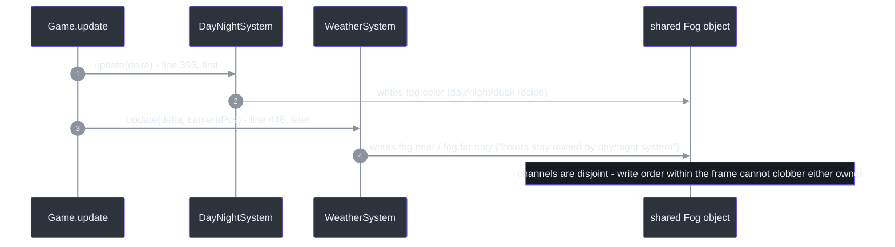

# DayNightSystem — Time-of-Day Cycle & Sun Direction Contract

## Overview

DayNightSystem drives the full day/night cycle: it advances a normalized `timeOfDay` clock, computes the sun's direction (azimuth orbit + elevation), and derives **all** sun/sky/fog/light colors and intensities from that one direction ([src/systems/DayNightSystem.ts:20-28](https://github.com/noiz354/arena-city-try/blob/main/src/systems/DayNightSystem.ts#L20-L28)).

Its key architectural decision: it does **not** position the `DirectionalLight`. [World's](../core-loop/game-loop.md) `updateSun` places the light + shadow frustum around the player using the exported `sunDirection`, so shadows follow the player instead of orbiting the origin ([src/systems/DayNightSystem.ts:24-27](https://github.com/noiz354/arena-city-try/blob/main/src/systems/DayNightSystem.ts#L24-L27)). It feeds the same direction into [SkySystem's](./sky-system.md) single-scatter shader, so sky, fog, and the directional light always agree.

### At a glance

| Aspect | Value | Source |
|--------|-------|--------|
| Day length | `DAY_LENGTH = 180` s — full day in 3 real minutes | [src/systems/DayNightSystem.ts:12](https://github.com/noiz354/arena-city-try/blob/main/src/systems/DayNightSystem.ts#L12) |
| Anchors | t 0 / 0.25 / 0.5 / 0.75 = midnight / dawn / noon / dusk | [src/systems/DayNightSystem.ts:30-31](https://github.com/noiz354/arena-city-try/blob/main/src/systems/DayNightSystem.ts#L30-L31) |
| Default start time | `timeOfDay = 0.55` | field initializer table below |
| Fog ownership split | color here; near/far belong to [WeatherSystem](./weather-system.md) | [src/systems/WeatherSystem.ts:80-82](https://github.com/noiz354/arena-city-try/blob/main/src/systems/WeatherSystem.ts#L80-L82) |
| Update order contract | runs *before* `World.updateSun` each frame | [src/game/Game.ts:391-394](https://github.com/noiz354/arena-city-try/blob/main/src/game/Game.ts#L391-L394) |

## Construction & Injected Dependencies

Created once in Game's constructor with **7 injected dependencies**: the world's key sun `DirectionalLight`, the scene `AmbientLight` (found by scanning `world.root.children`), the `HemisphereLight`, a dedicated moon `DirectionalLight` (created in Game at color `0x8fa8ff`, intensity 0.3, position `(-80,60,-40)`), the scene background `Color`, the `Fog`, and the `SkySystem` ([src/game/Game.ts:153-165](https://github.com/noiz354/arena-city-try/blob/main/src/game/Game.ts#L153-L165)). The constructor body is empty — all state comes from field initializers ([src/systems/DayNightSystem.ts:44-52](https://github.com/noiz354/arena-city-try/blob/main/src/systems/DayNightSystem.ts#L44-L52)).

| Field | Type | Meaning | Source |
|-------|------|---------|--------|
| `timeOfDay` | public mutable number | 0 midnight, 0.25 dawn, 0.5 noon, 0.75 dusk; default 0.55. Writable to scrub time (Visual QA drives 0.0 / 0.5 / 0.75 for deterministic screenshots) | [src/systems/DayNightSystem.ts:30-31](https://github.com/noiz354/arena-city-try/blob/main/src/systems/DayNightSystem.ts#L30-L31) |
| `sunDirection` | readonly Vector3 | Unit vector toward the sun, recomputed each frame; shared with World shadow placement + SkySystem uniforms. Initial `(0.3,0.8,0.4).normalize()` | [src/systems/DayNightSystem.ts:33-34](https://github.com/noiz354/arena-city-try/blob/main/src/systems/DayNightSystem.ts#L33-L34) |
| `day` | number 0..1 | Smoothed daylight amount; PostFX exposure consumes it via `postfx.setExposure(0.55 + day*0.6)` | [src/systems/DayNightSystem.ts:36-37](https://github.com/noiz354/arena-city-try/blob/main/src/systems/DayNightSystem.ts#L36-L37), [src/game/Game.ts:453](https://github.com/noiz354/arena-city-try/blob/main/src/game/Game.ts#L453) |
| `tmpSky`, `tmpFog`, `duskTint`, `sunDay` | private Colors | Scratch/reusable colors; no per-frame allocation | [src/systems/DayNightSystem.ts:39-42](https://github.com/noiz354/arena-city-try/blob/main/src/systems/DayNightSystem.ts#L39-L42) |

Palette constants: `SKY_DAY 0x87ceeb`, `SKY_DUSK 0xff9a5a`, `SKY_NIGHT 0x0b1026`, `FOG_DAY 0xbfd4e4`, `FOG_NIGHT 0x0d1330` ([src/systems/DayNightSystem.ts:12-18](https://github.com/noiz354/arena-city-try/blob/main/src/systems/DayNightSystem.ts#L12-L18)); plus `duskTint 0xff9a5a` and `sunDay 0xfff4e0` ([src/systems/DayNightSystem.ts:41-42](https://github.com/noiz354/arena-city-try/blob/main/src/systems/DayNightSystem.ts#L41-L42)).

## The Cycle Timeline

```mermaid
%%{init: {"theme":"base","themeVariables":{"background":"transparent","primaryColor":"#2d333b","primaryBorderColor":"#6d5dfc","primaryTextColor":"#e6edf3","secondaryColor":"#161b22","secondaryBorderColor":"#30363d","tertiaryColor":"#161b22","lineColor":"#8b949e","textColor":"#e6edf3","mainBkg":"#2d333b","nodeBorder":"#6d5dfc","clusterBkg":"#161b22","clusterBorder":"#30363d","titleColor":"#e6edf3","edgeLabelBackground":"#161b22","actorBkg":"#2d333b","actorBorder":"#6d5dfc","actorTextColor":"#e6edf3","actorLineColor":"#8b949e","signalColor":"#8b949e","signalTextColor":"#e6edf3","labelBoxBkgColor":"#2d333b","labelBoxBorderColor":"#6d5dfc","labelTextColor":"#e6edf3","loopTextColor":"#e6edf3","noteBkgColor":"#161b22","noteBorderColor":"#6d5dfc","noteTextColor":"#e6edf3","activationBkgColor":"#161b22","activationBorderColor":"#6d5dfc","sequenceNumberColor":"#e6edf3","stateBkg":"#2d333b","stateBorder":"#6d5dfc","compositeBackground":"#161b22","compositeBorder":"#30363d","compositeTitleBackground":"#161b22","altBackground":"#161b22","attributeBackgroundColorOdd":"#161b22","attributeBackgroundColorEven":"#2d333b","classText":"#e6edf3","arrowheadColor":"#8b949e"}}}%%
flowchart LR
    MID["t = 0<br>midnight<br>elevation = -1"] -->|"dt / DAY_LENGTH"| DAWN["t = 0.25<br>dawn<br>elevation crosses 0"]
    DAWN --> NOON["t = 0.5<br>noon<br>elevation peaks"]
    NOON --> DUSK["t = 0.75<br>dusk glow window<br>elevation crosses 0"]
    DUSK -->|"wraps mod 1"| MID
    linkStyle default stroke:#8b949e
```



<!-- Sources: src/systems/DayNightSystem.ts:12, src/systems/DayNightSystem.ts:64, src/systems/DayNightSystem.ts:68-83 -->

Cycle math per update ([src/systems/DayNightSystem.ts:64-83](https://github.com/noiz354/arena-city-try/blob/main/src/systems/DayNightSystem.ts#L64-L83)):

```text
timeOfDay  = (timeOfDay + dt / DAY_LENGTH) % 1
elevation  = sin((t - 0.25) * PI * 2)          // peaks at noon, zero at dawn/dusk
sunY       = clamp(elevation, -0.35, 1)        // sun never sinks far below horizon
direction  = normalize(cos((t-0.5)*2PI), sunY, sin((t-0.5)*2PI))
day        = smoothstep(clamp(elevation, -0.15, 0.4), -0.15, 0.4)
dusk       = max(0, 1 - abs(elevation) * 5)    // nonzero only near horizon crossings
```

## Per-Frame Update Sequence

Updated exactly once per tick from `Game.update`, deliberately **before** `World.updateSun`, because light placement consumes the freshly computed `sunDirection` ([src/game/Game.ts:391-394](https://github.com/noiz354/arena-city-try/blob/main/src/game/Game.ts#L391-L394)).

```mermaid
%%{init: {"theme":"base","themeVariables":{"background":"transparent","primaryColor":"#2d333b","primaryBorderColor":"#6d5dfc","primaryTextColor":"#e6edf3","secondaryColor":"#161b22","secondaryBorderColor":"#30363d","tertiaryColor":"#161b22","lineColor":"#8b949e","textColor":"#e6edf3","mainBkg":"#2d333b","nodeBorder":"#6d5dfc","clusterBkg":"#161b22","clusterBorder":"#30363d","titleColor":"#e6edf3","edgeLabelBackground":"#161b22","actorBkg":"#2d333b","actorBorder":"#6d5dfc","actorTextColor":"#e6edf3","actorLineColor":"#8b949e","signalColor":"#8b949e","signalTextColor":"#e6edf3","labelBoxBkgColor":"#2d333b","labelBoxBorderColor":"#6d5dfc","labelTextColor":"#e6edf3","loopTextColor":"#e6edf3","noteBkgColor":"#161b22","noteBorderColor":"#6d5dfc","noteTextColor":"#e6edf3","activationBkgColor":"#161b22","activationBorderColor":"#6d5dfc","sequenceNumberColor":"#e6edf3","stateBkg":"#2d333b","stateBorder":"#6d5dfc","compositeBackground":"#161b22","compositeBorder":"#30363d","compositeTitleBackground":"#161b22","altBackground":"#161b22","attributeBackgroundColorOdd":"#161b22","attributeBackgroundColorEven":"#2d333b","classText":"#e6edf3","arrowheadColor":"#8b949e"}}}%%
flowchart TD
    T["1. Advance time: timeOfDay += dt / 180 mod 1<br>DayNightSystem.ts:64"] --> E
    E["2. Elevation sin((t-0.25) x 2pi); sunY clamp -0.35..1<br>DayNightSystem.ts:68-69"] --> D
    D["3. Azimuth orbit direction vector, normalized<br>DayNightSystem.ts:72-78"] --> F
    F["4. day smoothstep band -0.15..0.4; dusk glow factor<br>DayNightSystem.ts:81-83"] --> BG
    BG["5. Background fallback: SKY_DAY -> lerp SKY_NIGHT -> lerp SKY_DUSK x (dusk x (1-day) x 0.7)<br>DayNightSystem.ts:86-88"] --> FG
    FG["6. Fog COLOR channel: same recipe on FOG_DAY / FOG_NIGHT,<br>dusk lerp factor x 0.5 - distances untouched<br>DayNightSystem.ts:91-93"] --> LI
    LI["7. Lights: sun / hemi / ambient / moon intensities + dusk tint<br>DayNightSystem.ts:96-103"] --> SK
    SK["8. Sky handoff: setSunDirection + sunColor copy +<br>intensity lerp(1.2,26,day) + exposure pinned 1.0<br>DayNightSystem.ts:106-110"]
    linkStyle default stroke:#8b949e
```



<!-- Sources: src/systems/DayNightSystem.ts:64-110 -->

### Light intensity ranges

| Light | Intensity curve | Extra detail | Source |
|-------|-----------------|--------------|--------|
| Sun | `lerp(0.15, 2.6, day)` | color lerped from `0xfff4e0` toward dusk tint `0xff9a5a` by `dusk·0.6` | [src/systems/DayNightSystem.ts:96-97](https://github.com/noiz354/arena-city-try/blob/main/src/systems/DayNightSystem.ts#L96-L97) |
| Hemisphere | `lerp(0.12, 0.5, day)` | — | [src/systems/DayNightSystem.ts:99](https://github.com/noiz354/arena-city-try/blob/main/src/systems/DayNightSystem.ts#L99) |
| Ambient | `lerp(0.12, 0.45, day)` | — | [src/systems/DayNightSystem.ts:100](https://github.com/noiz354/arena-city-try/blob/main/src/systems/DayNightSystem.ts#L100) |
| Moon | `lerp(0.35, 0.02, day)` | bright at night, nearly off at noon | [src/systems/DayNightSystem.ts:103](https://github.com/noiz354/arena-city-try/blob/main/src/systems/DayNightSystem.ts#L103) |
| Sky radiance | `lerp(1.2, 26, day)` | written into SkySystem uniform | [src/systems/DayNightSystem.ts:109](https://github.com/noiz354/arena-city-try/blob/main/src/systems/DayNightSystem.ts#L109) |

## Frame Ordering & the Shared Fog Contract

Both this system and [WeatherSystem](./weather-system.md) write into the **same `Fog` object**, but on disjoint channels — that is what makes the sibling relationship safe without coordination:



<!-- Sources: src/game/Game.ts:391-394, src/game/Game.ts:446, src/systems/DayNightSystem.ts:93, src/systems/WeatherSystem.ts:80-82 -->

| Channel | Owner | Evidence |
|---------|-------|----------|
| `fog.color` | DayNightSystem | [src/systems/DayNightSystem.ts:91-93](https://github.com/noiz354/arena-city-try/blob/main/src/systems/DayNightSystem.ts#L91-L93) |
| `fog.near` / `fog.far` | WeatherSystem (`90→45` / `420→170` at full rain) | [src/systems/WeatherSystem.ts:81-82](https://github.com/noiz354/arena-city-try/blob/main/src/systems/WeatherSystem.ts#L81-L82) |

### Sun-direction consumers

| Consumer | What it does with `sunDirection` | Source |
|----------|----------------------------------|--------|
| World shadow placement | positions the shadow-casting sun light + texel-snapped frustum around the player | [src/game/World.ts:101-118](https://github.com/noiz354/arena-city-try/blob/main/src/game/World.ts#L101-L118) |
| [SkySystem](./sky-system.md) | dome scattering direction + radiance alignment; consumed via its allocation-free `setSunDirection` | [src/systems/DayNightSystem.ts:106-107](https://github.com/noiz354/arena-city-try/blob/main/src/systems/DayNightSystem.ts#L106-L107), [src/systems/SkySystem.ts:139-142](https://github.com/noiz354/arena-city-try/blob/main/src/systems/SkySystem.ts#L139-L142) |

## Public API

| Member | Signature | Behavior | Source |
|--------|-----------|----------|--------|
| `isNight` | getter `boolean` | True when `hour() < 6 || hour() > 19` — night spans 19:00–06:00 game-time | [src/systems/DayNightSystem.ts:54-57](https://github.com/noiz354/arena-city-try/blob/main/src/systems/DayNightSystem.ts#L54-L57) |
| `hour()` | `(): number` | `timeOfDay * 24` as fractional hours | [src/systems/DayNightSystem.ts:59-61](https://github.com/noiz354/arena-city-try/blob/main/src/systems/DayNightSystem.ts#L59-L61) |
| `update(dt)` | `(dt: number): void` | Full sequence above; `dt` in seconds | [src/systems/DayNightSystem.ts:64](https://github.com/noiz354/arena-city-try/blob/main/src/systems/DayNightSystem.ts#L64) |
| `timeOfDay` | field | Writable at runtime to scrub time — used for deterministic QA screenshots | [src/systems/DayNightSystem.ts:30-31](https://github.com/noiz354/arena-city-try/blob/main/src/systems/DayNightSystem.ts#L30-L31) |
| `sunDirection`, `day` | readonly fields | Read by Game/World/PostFX each frame | [src/systems/DayNightSystem.ts:33-37](https://github.com/noiz354/arena-city-try/blob/main/src/systems/DayNightSystem.ts#L33-L37) |

## Tuning Knobs

All values live in [src/systems/DayNightSystem.ts](https://github.com/noiz354/arena-city-try/blob/main/src/systems/DayNightSystem.ts):

| Knob | Value / guidance | Source |
|------|------------------|--------|
| `DAY_LENGTH` | 180 s — raise for realism | [src/systems/DayNightSystem.ts:12](https://github.com/noiz354/arena-city-try/blob/main/src/systems/DayNightSystem.ts#L12) |
| `sunY` clamp | `[-0.35, 1]` | [src/systems/DayNightSystem.ts:68-69](https://github.com/noiz354/arena-city-try/blob/main/src/systems/DayNightSystem.ts#L68-L69) |
| Transition windows | daylight smoothstep band elevation `[-0.15, 0.4]`; dusk glow dies by `|elevation| ≥ 0.2` | [src/systems/DayNightSystem.ts:81-82](https://github.com/noiz354/arena-city-try/blob/main/src/systems/DayNightSystem.ts#L81-L82) |
| Intensity ranges | see table above (lines 96-103, 109) | [src/systems/DayNightSystem.ts:96-109](https://github.com/noiz354/arena-city-try/blob/main/src/systems/DayNightSystem.ts#L96-L109) |
| Palette hexes | lines 14-18 plus `duskTint` / `sunDay` | [src/systems/DayNightSystem.ts:14-18](https://github.com/noiz354/arena-city-try/blob/main/src/systems/DayNightSystem.ts#L14-L18), [41-42](https://github.com/noiz354/arena-city-try/blob/main/src/systems/DayNightSystem.ts#L41-L42) |
| Safe extensions | add derived channels inside `update()` after line 81 where `day`/`dusk` exist; pass new consumers next to lines 106-110. Do NOT add light-positioning here — that contract belongs to `World.updateSun` | [docs/wiki/systems/DayNightSystem.md](https://github.com/noiz354/arena-city-try/blob/main/docs/wiki/systems/DayNightSystem.md) |

## Known Findings & Gaps

The implementation wiki lists **no unresolved findings** for this system — it is one of the cleanest contracts in the codebase.

## References

- Hand-verified implementation doc: [docs/wiki/systems/DayNightSystem.md](https://github.com/noiz354/arena-city-try/blob/main/docs/wiki/systems/DayNightSystem.md)
- Primary sources: [src/systems/DayNightSystem.ts](https://github.com/noiz354/arena-city-try/blob/main/src/systems/DayNightSystem.ts), [src/game/Game.ts](https://github.com/noiz354/arena-city-try/blob/main/src/game/Game.ts), [src/game/World.ts](https://github.com/noiz354/arena-city-try/blob/main/src/game/World.ts)

## Related Pages

| Page | Relationship |
|------|-------------|
| [SkySystem](./sky-system.md) | Passive consumer of the sun-direction contract pushed every frame |
| [WeatherSystem](./weather-system.md) | Sibling fog writer — disjoint channels (color vs near/far) into the same Fog object |
| [WetSurfaceSystem](./wet-surface-system.md) | Downstream of weather's rain envelope, which this system coexists with via the fog split |
| [PostFX](../rendering-postfx/postfx.md) | Reads the public `day` factor for tone-map exposure each frame |
| [Game Bootstrap & Update Loop](../core-loop/game-loop.md) | Owns the strict ordering: dayNight before world.updateSun before weather |
