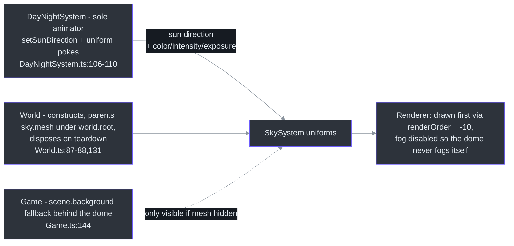
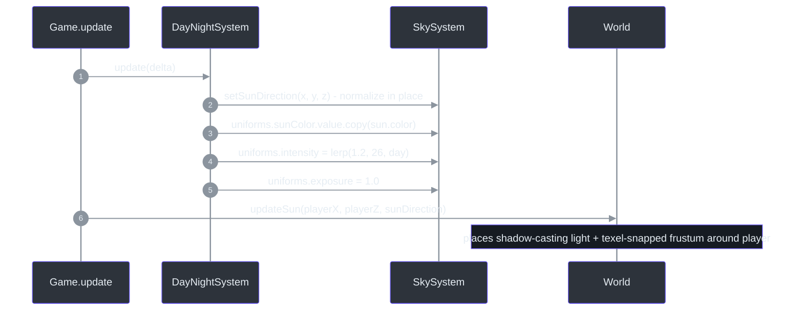

# SkySystem — Sky Dome Consuming Shared Sun Direction

## Overview

SkySystem renders the sky as a **single-scatter atmospheric dome**: a `BackSide` sphere whose fragment shader ray-marches a flat exponential atmosphere (Rayleigh + Mie scattering) from a ground-level camera, producing physically-grounded radiance, a sun disc + halo, and horizon haze ([src/systems/SkySystem.ts:3-9](https://github.com/noiz354/arena-city-try/blob/main/src/systems/SkySystem.ts#L3-L9)). It replaces a flat `scene.background` color and shares ONE sun direction with the directional light and fog — the direction is pushed in by [DayNightSystem](./day-night-system.md) every frame.

**Why this design:** per its own header comment it deliberately uses canonical sea-level coefficients instead of a LUT-based tier (which would need `.exr`/`.bin` assets), keeping the system **asset-free / sandbox-safe** ([src/systems/SkySystem.ts:10-14](https://github.com/noiz354/arena-city-try/blob/main/src/systems/SkySystem.ts#L10-L14)). It is also fully passive — there is no `update()`; all animation is external uniform-poking.

### At a glance

| Aspect | Value | Source |
|--------|-------|--------|
| Geometry | `SphereGeometry(900, 40, 20)` — fits inside the 2000 m camera far plane | [src/systems/SkySystem.ts:37](https://github.com/noiz354/arena-city-try/blob/main/src/systems/SkySystem.ts#L37), [src/game/Game.ts:133](https://github.com/noiz354/arena-city-try/blob/main/src/game/Game.ts#L133) |
| Material | `ShaderMaterial`, `side: BackSide`, `depthWrite: false`, `fog: false` | [src/systems/SkySystem.ts:38-50](https://github.com/noiz354/arena-city-try/blob/main/src/systems/SkySystem.ts#L38-L50) |
| Draw order | `renderOrder = -10` (first), `frustumCulled = false` (dome always surrounds camera), name `'sky'` | [src/systems/SkySystem.ts:133-136](https://github.com/noiz354/arena-city-try/blob/main/src/systems/SkySystem.ts#L133-L136) |
| Initial uniforms | sunDirection `(0.3,0.8,0.4).normalize()`, sunColor `0xfff4e0`, intensity 26, exposure 1.0 | [src/systems/SkySystem.ts:30-35](https://github.com/noiz354/arena-city-try/blob/main/src/systems/SkySystem.ts#L30-L35) |
| Sole animator | DayNightSystem, once per frame | [src/systems/DayNightSystem.ts:106-110](https://github.com/noiz354/arena-city-try/blob/main/src/systems/DayNightSystem.ts#L106-L110) |

## Architecture Position

<!-- Sources: src/systems/SkySystem.ts:133-136, src/systems/DayNightSystem.ts:106-110, src/game/World.ts:87-88, src/game/World.ts:131, src/game/Game.ts:144 -->

No other system reads or writes it; `scene.background` remains set to `world.skyColor` as a *fallback behind* the dome ([src/game/Game.ts:144](https://github.com/noiz354/arena-city-try/blob/main/src/game/Game.ts#L144)). The dome is also deliberately isolated from weather haze: its material sets `fog: false`, so [WeatherSystem](./weather-system.md)'s fog-distance squeeze (`near 90→45`, `far 420→170` at full rain, [src/systems/WeatherSystem.ts:80-82](https://github.com/noiz354/arena-city-try/blob/main/src/systems/WeatherSystem.ts#L80-L82)) tightens the world without washing out the sky.

### Uniforms

| Uniform | Type | Meaning / driver | Source |
|---------|------|------------------|--------|
| `sunDirection` | `{ value: Vector3 }` | Unit vector toward the sun ("light travel direction" comment); set+normalized by `setSunDirection`, no allocation | [src/systems/SkySystem.ts:19-20](https://github.com/noiz354/arena-city-try/blob/main/src/systems/SkySystem.ts#L19-L20), [139-142](https://github.com/noiz354/arena-city-try/blob/main/src/systems/SkySystem.ts#L139-L142) |
| `sunColor` | `{ value: Color }` | Sun radiance color, driven by day/night | [src/systems/SkySystem.ts:21-22](https://github.com/noiz354/arena-city-try/blob/main/src/systems/SkySystem.ts#L21-L22) |
| `intensity` | `{ value: number }` | Overall radiance scale — overwritten each frame as `lerp(1.2, 26, day)` | [src/systems/SkySystem.ts:23-24](https://github.com/noiz354/arena-city-try/blob/main/src/systems/SkySystem.ts#L23-L24) |
| `exposure` | `{ value: number }` | Extra exposure trim for tuning; pinned to 1.0 by DayNightSystem | [src/systems/SkySystem.ts:25-26](https://github.com/noiz354/arena-city-try/blob/main/src/systems/SkySystem.ts#L25-L26) |

## The Per-Frame Handoff

<!-- Sources: src/systems/DayNightSystem.ts:106-110, src/game/Game.ts:391-394, src/game/World.ts:101-118 -->

The import is type-only (`import type { SkySystem }`) to avoid a runtime cycle ([src/systems/DayNightSystem.ts:10](https://github.com/noiz354/arena-city-try/blob/main/src/systems/DayNightSystem.ts#L10)).

## Fragment Shader Pipeline

```mermaid
%%{init: {"theme":"base","themeVariables":{"background":"transparent","primaryColor":"#2d333b","primaryBorderColor":"#6d5dfc","primaryTextColor":"#e6edf3","secondaryColor":"#161b22","secondaryBorderColor":"#30363d","tertiaryColor":"#161b22","lineColor":"#8b949e","textColor":"#e6edf3","mainBkg":"#2d333b","nodeBorder":"#6d5dfc","clusterBkg":"#161b22","clusterBorder":"#30363d","titleColor":"#e6edf3","edgeLabelBackground":"#161b22","actorBkg":"#2d333b","actorBorder":"#6d5dfc","actorTextColor":"#e6edf3","actorLineColor":"#8b949e","signalColor":"#8b949e","signalTextColor":"#e6edf3","labelBoxBkgColor":"#2d333b","labelBoxBorderColor":"#6d5dfc","labelTextColor":"#e6edf3","loopTextColor":"#e6edf3","noteBkgColor":"#161b22","noteBorderColor":"#6d5dfc","noteTextColor":"#e6edf3","activationBkgColor":"#161b22","activationBorderColor":"#6d5dfc","sequenceNumberColor":"#e6edf3","stateBkg":"#2d333b","stateBorder":"#6d5dfc","compositeBackground":"#161b22","compositeBorder":"#30363d","compositeTitleBackground":"#161b22","altBackground":"#161b22","attributeBackgroundColorOdd":"#161b22","attributeBackgroundColorEven":"#2d333b","classText":"#e6edf3","arrowheadColor":"#8b949e"}}}%%
flowchart TD
    A["View ray rd = normalize(vWorldPos - cameraPosition)<br>muSun = dot(rd, sunDirection)<br>SkySystem.ts:86-87"] --> B["View march: 16 samples over T_MAX = 60000 m<br>Rayleigh/Mie optical depth, exp(-h/H) falloff clamped h >= 0<br>SkySystem.ts:90-113"]
    B --> C["Nested light march: 8 samples toward the sun<br>computes transmittance tr"]
    C --> D["Inscatter accumulate:<br>tr x (betaR.dR.rayleighPhase + betaM.dM.henyeyGreenstein)"]
    D --> E["color = inscatter x sunColor x intensity<br>SkySystem.ts:115"]
    E --> F["Sun disc + halo:<br>airmass 1/max(muSun, 0.04); transmittance exp(-(betaR.H_R + betaM.H_M) x 0.35 x airmass)<br>disc smoothstep between 1-8r and 1-0.5r<br>halo pow(cosAng,120) x 0.06 + pow(cosAng,16) x 0.12<br>SkySystem.ts:118-123"]
    F --> G["Night floor: add (0.006, 0.008, 0.02)<br>scaled by (1 - clamp(muSun + 0.5))<br>dome never reads fully black<br>SkySystem.ts:126"]
    G --> H["gl_FragColor = vec4(col x exposure, 1.0)<br>SkySystem.ts:128"]
    linkStyle default stroke:#8b949e
```

<!-- Sources: src/systems/SkySystem.ts:85-129 -->

### Shader constants

| Constant | Value | Meaning | Source |
|----------|-------|---------|--------|
| `betaR` | `(3.8e-6, 13.5e-6, 33.1e-6)` m⁻¹ | Rayleigh scattering coefficients | [src/systems/SkySystem.ts:64-73](https://github.com/noiz354/arena-city-try/blob/main/src/systems/SkySystem.ts#L64-L73) |
| `betaM` | `21.0e-6` m⁻¹ | Mie scattering coefficient | same block |
| `H_R` / `H_M` | 8000 / 1200 m | Exponential scale heights | same block |
| `g` | 0.8 | Mie anisotropy (Henyey–Greenstein) | same block |
| `sunAngularRadius` | 0.004675 (~0.268°) | Sun disc size | same block |
| `VIEW_SAMPLES` / `LIGHT_SAMPLES` | 16 / 8 | March sample counts — halving VIEW_SAMPLES is the first mobile perf lever | same block |
| `T_MAX` | 60000 m | View march extent | same block |

Phase functions: `rayleighPhase(c) = 3/(16π)(1+c²)` ([src/systems/SkySystem.ts:75-77](https://github.com/noiz354/arena-city-try/blob/main/src/systems/SkySystem.ts#L75-L77)); standard Henyey–Greenstein ([src/systems/SkySystem.ts:79-83](https://github.com/noiz354/arena-city-try/blob/main/src/systems/SkySystem.ts#L79-L83)). The red-at-horizon effect comes from transmittance through more air mass at grazing angles ([src/systems/SkySystem.ts:118-123](https://github.com/noiz354/arena-city-try/blob/main/src/systems/SkySystem.ts#L118-L123)).

## Public API

| Member | Signature | Behavior | Source |
|--------|-----------|----------|--------|
| constructor | none | Builds geometry/material/mesh; all tuning happens via uniforms after creation | [src/systems/SkySystem.ts:17](https://github.com/noiz354/arena-city-try/blob/main/src/systems/SkySystem.ts#L17) |
| `setSunDirection` | `(x, y, z): void` | Sets + normalizes the shared direction reusing the existing Vector3 — zero allocation; called once per frame by DayNightSystem | [src/systems/SkySystem.ts:139-142](https://github.com/noiz354/arena-city-try/blob/main/src/systems/SkySystem.ts#L139-L142) |
| `dispose` | `(): void` | Disposes sphere geometry and ShaderMaterial; called from `World.dispose` | [src/systems/SkySystem.ts:144-147](https://github.com/noiz354/arena-city-try/blob/main/src/systems/SkySystem.ts#L144-L147), [src/game/World.ts:131](https://github.com/noiz354/arena-city-try/blob/main/src/game/World.ts#L131) |
| `mesh` / `uniforms` | readonly fields | `uniforms` intentionally exposed so DayNightSystem can write radiance/color/exposure directly | [src/systems/DayNightSystem.ts:107-110](https://github.com/noiz354/arena-city-try/blob/main/src/systems/DayNightSystem.ts#L107-L110) |

## Tuning Knobs

| Knob | Guidance | Source |
|------|----------|--------|
| Dome size/detail | radius 900, segments 40×20 — raise only if camera far plane grows beyond ~1800 | [src/systems/SkySystem.ts:37](https://github.com/noiz354/arena-city-try/blob/main/src/systems/SkySystem.ts#L37) |
| Brightness | tune `intensity` in DayNightSystem's `lerp(1.2, 26, day)` — not here; it is overwritten every frame. Repurpose `exposure` for QA brightness overrides | [src/systems/DayNightSystem.ts:109-110](https://github.com/noiz354/arena-city-try/blob/main/src/systems/DayNightSystem.ts#L109-L110) |
| Atmosphere physics | coefficients/scale-heights/g/sun-radius block; halve `VIEW_SAMPLES` first on mobile | [src/systems/SkySystem.ts:64-72](https://github.com/noiz354/arena-city-try/blob/main/src/systems/SkySystem.ts#L64-L72) |
| Sun look | disc size `sunAngularRadius`; halo exponents 120/16 with gains 0.06/0.12; night floor color | [src/systems/SkySystem.ts:69](https://github.com/noiz354/arena-city-try/blob/main/src/systems/SkySystem.ts#L69), [122](https://github.com/noiz354/arena-city-try/blob/main/src/systems/SkySystem.ts#L122), [126](https://github.com/noiz354/arena-city-try/blob/main/src/systems/SkySystem.ts#L126) |
| Safe extensions | add uniforms at lines 30-35 + matching GLSL; keep `fog: false` and `renderOrder = -10`; add stars/clouds inside this shader keyed off an extra uniform rather than a second mesh | [src/systems/SkySystem.ts:30-35](https://github.com/noiz354/arena-city-try/blob/main/src/systems/SkySystem.ts#L30-L35) |

## Known Findings & Gaps

Preserved from the implementation wiki:

1. **Provenance reference is external only** — the header cites a "threejs-atmosphere-aerial-perspective skill" as design origin ([src/systems/SkySystem.ts:4](https://github.com/noiz354/arena-city-try/blob/main/src/systems/SkySystem.ts#L4)); no such file exists in-repo.

## References

- Hand-verified implementation doc: [docs/wiki/systems/SkySystem.md](https://github.com/noiz354/arena-city-try/blob/main/docs/wiki/systems/SkySystem.md)
- Primary sources: [src/systems/SkySystem.ts](https://github.com/noiz354/arena-city-try/blob/main/src/systems/SkySystem.ts), [src/systems/DayNightSystem.ts](https://github.com/noiz354/arena-city-try/blob/main/src/systems/DayNightSystem.ts), [src/game/World.ts](https://github.com/noiz354/arena-city-try/blob/main/src/game/World.ts)

## Related Pages

| Page | Relationship |
|------|-------------|
| [DayNightSystem](./day-night-system.md) | Sole animator — pushes sun direction + radiance uniforms into this dome every frame |
| [WeatherSystem](./weather-system.md) | Sibling fog writer; weather owns near/far while this dome stays unfogged by design |
| [PostFX](../rendering-postfx/postfx.md) | Downstream tone mapping consumes the day factor that also drives sky intensity |
