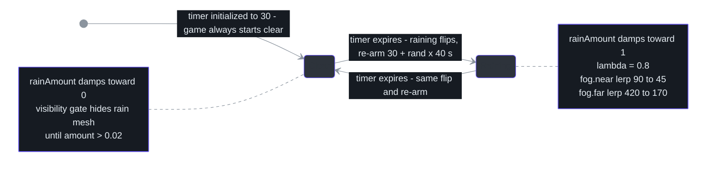
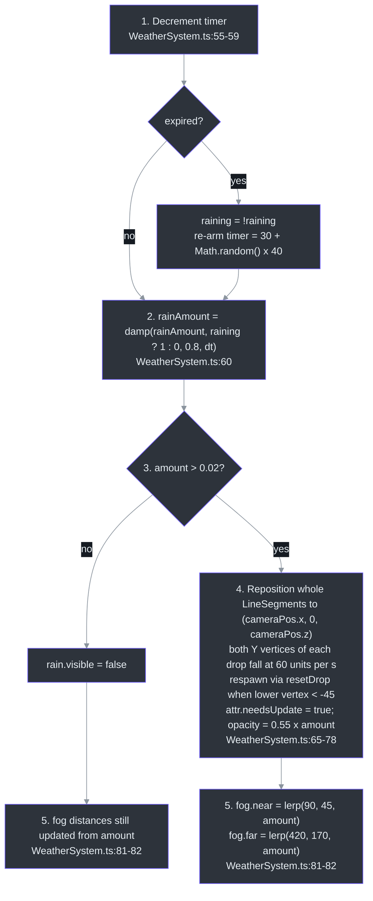
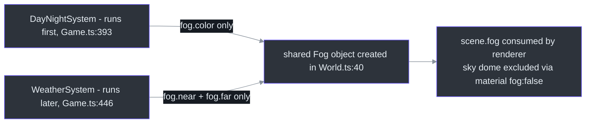

# WeatherSystem — Weather State Machine & Fog Ownership

## Overview

WeatherSystem implements the clear ↔ rain cycle: a timed state machine flips `raining` every **30–70 s**, and a pooled `LineSegments` rain field (500 drops) renders falling streaks that follow the camera ([src/systems/WeatherSystem.ts:7-9](https://github.com/noiz354/arena-city-try/blob/main/src/systems/WeatherSystem.ts#L7-L9)). It owns fog **distances** — rain tightens `near`/`far` while leaving fog *color* to [DayNightSystem](./day-night-system.md) ([src/systems/WeatherSystem.ts:80-82](https://github.com/noiz354/arena-city-try/blob/main/src/systems/WeatherSystem.ts#L80-L82)). Its smoothed `rainAmount` envelope is the single shared signal consumed by [WetSurfaceSystem](./wet-surface-system.md) ([src/systems/WeatherSystem.ts:13](https://github.com/noiz354/arena-city-try/blob/main/src/systems/WeatherSystem.ts#L13)).

**Why this design:** one boolean state + one smoothed envelope gives every consumer (fog, wetness, visuals) the same weather signal without coupling; the fog channel split avoids write conflicts on the shared `Fog` object.

### At a glance

| Aspect | Value | Source |
|--------|-------|--------|
| States | binary clear / raining — no thunder, lightning or snow | [src/systems/WeatherSystem.ts:55-59](https://github.com/noiz354/arena-city-try/blob/main/src/systems/WeatherSystem.ts#L55-L59) |
| Phase length | initial delay 30 s; then uniform `30 + rand·40` s | [src/systems/WeatherSystem.ts:15](https://github.com/noiz354/arena-city-try/blob/main/src/systems/WeatherSystem.ts#L15), [58](https://github.com/noiz354/arena-city-try/blob/main/src/systems/WeatherSystem.ts#L58) |
| Envelope | `rainAmount = damp(rainAmount, target, 0.8, dt)` | [src/systems/WeatherSystem.ts:60](https://github.com/noiz354/arena-city-try/blob/main/src/systems/WeatherSystem.ts#L60) |
| Rain field | 500 line segments (3000 floats), ±45 m spread, streaks 0.35 | [src/systems/WeatherSystem.ts:3-5](https://github.com/noiz354/arena-city-try/blob/main/src/systems/WeatherSystem.ts#L3-L5), [17](https://github.com/noiz354/arena-city-try/blob/main/src/systems/WeatherSystem.ts#L17) |
| Fog squeeze | near `90 → 45`, far `420 → 170` at full rain | [src/systems/WeatherSystem.ts:81-82](https://github.com/noiz354/arena-city-try/blob/main/src/systems/WeatherSystem.ts#L81-L82) |
| Teardown | no `dispose()` — geometry/material freed by scene teardown | API notes below |

## Weather State Machine

<!-- Sources: src/systems/WeatherSystem.ts:15, src/systems/WeatherSystem.ts:55-63, src/systems/WeatherSystem.ts:60, src/systems/WeatherSystem.ts:81-82 -->

There are exactly two states; nothing outside flips `raining` at runtime.

## Construction & Data Structures

`new WeatherSystem(scene, fog)` in Game's constructor with the scene (rain self-added) and the world `Fog` object ([src/game/Game.ts:166](https://github.com/noiz354/arena-city-try/blob/main/src/game/Game.ts#L166)). The constructor builds a `BufferGeometry` with `RAIN_COUNT·6` floats (2 vertices per drop), initializes all 500 drops via `resetDrop(i, 0)`, attaches a position attribute, wraps it in a transparent `LineBasicMaterial` (color `0x9fb4c8`, opacity 0.55, `depthWrite: false`), sets `frustumCulled = false`, starts `visible = false`, adds itself to the scene ([src/systems/WeatherSystem.ts:24-37](https://github.com/noiz354/arena-city-try/blob/main/src/systems/WeatherSystem.ts#L24-L37)).

| Field | Type | Meaning | Source |
|-------|------|---------|--------|
| `raining` | boolean | Current discrete state; flips on timer expiry | [src/systems/WeatherSystem.ts:12](https://github.com/noiz354/arena-city-try/blob/main/src/systems/WeatherSystem.ts#L12) |
| `rainAmount` | public number | Smoothed 0..1 envelope; THE coupling signal for WetSurfaceSystem (via closure) | [src/systems/WeatherSystem.ts:13-14](https://github.com/noiz354/arena-city-try/blob/main/src/systems/WeatherSystem.ts#L13-L14) |
| `timer` | private number | Seconds to next flip; init 30, re-armed `30 + rand·40` | [src/systems/WeatherSystem.ts:15](https://github.com/noiz354/arena-city-try/blob/main/src/systems/WeatherSystem.ts#L15), [58](https://github.com/noiz354/arena-city-try/blob/main/src/systems/WeatherSystem.ts#L58) |
| `rain` | readonly LineSegments | The pooled rain field mesh | [src/systems/WeatherSystem.ts:16](https://github.com/noiz354/arena-city-try/blob/main/src/systems/WeatherSystem.ts#L16) |
| `positions` | readonly Float32Array | Backing array of 3000 floats (500 segments × 6 coords) | [src/systems/WeatherSystem.ts:17](https://github.com/noiz354/arena-city-try/blob/main/src/systems/WeatherSystem.ts#L17), [25](https://github.com/noiz354/arena-city-try/blob/main/src/systems/WeatherSystem.ts#L25) |
| `baseColors` | readonly Color | Drop color `0x9fb4c8` | [src/systems/WeatherSystem.ts:18](https://github.com/noiz354/arena-city-try/blob/main/src/systems/WeatherSystem.ts#L18) |

Drop geometry from `resetDrop`: head at random `(±45, baseY + rand·90 − 45, ±45)`; tail offset `(rand−0.5)·0.08, +RAIN_LENGTH(0.35), (rand−0.5)·0.08` giving slight streak jitter ([src/systems/WeatherSystem.ts:40-51](https://github.com/noiz354/arena-city-try/blob/main/src/systems/WeatherSystem.ts#L40-L51)).

## Per-Frame Update Pipeline

`update(dt, cameraPos)` runs from `Game.update` after day/night ([src/game/Game.ts:446](https://github.com/noiz354/arena-city-try/blob/main/src/game/Game.ts#L446)):

<!-- Sources: src/systems/WeatherSystem.ts:55-82 -->

The whole field follows the player horizontally but stays pinned to y=0 (`cameraPos.y` ignored).

## The Shared-Fog Contract

Both environment systems write into the same `Fog` instance created in World ([src/game/World.ts:40](https://github.com/noiz354/arena-city-try/blob/main/src/game/World.ts#L40)); frame order makes it safe because channels are disjoint:

<!-- Sources: src/game/Game.ts:393, src/game/Game.ts:446, src/systems/DayNightSystem.ts:93, src/systems/WeatherSystem.ts:80-82, src/game/World.ts:40, src/systems/SkySystem.ts:38-50 -->

DayNight runs first (Game.ts:393), weather later (Game.ts:446): weather's distance writes land last, but neither owner overwrites the other's channel. DayNightSystem writes only the color recipe from `FOG_DAY`/`FOG_NIGHT` plus dusk lerp ([src/systems/DayNightSystem.ts:91-93](https://github.com/noiz354/arena-city-try/blob/main/src/systems/DayNightSystem.ts#L91-L93)).

### rainAmount consumers

| Consumer | Coupling mechanism | Source |
|----------|--------------------|--------|
| WetSurfaceSystem | constructor closure `() => this.weather.rainAmount` passed by Game — THE coupling point between weather state and ground response; the closure value is consumed as the wetness target every update | [src/game/Game.ts:171](https://github.com/noiz354/arena-city-try/blob/main/src/game/Game.ts#L171), [src/systems/WetSurfaceSystem.ts:74-77](https://github.com/noiz354/arena-city-try/blob/main/src/systems/WetSurfaceSystem.ts#L74-L77) |

## Public API

| Member | Signature | Behavior | Source |
|--------|-----------|----------|--------|
| constructor | `(scene: Scene, fog: { near: number; far: number })` | Fog param is structurally typed `{near,far}` rather than three's Fog — any object with those numeric fields works | [src/systems/WeatherSystem.ts:20-23](https://github.com/noiz354/arena-city-try/blob/main/src/systems/WeatherSystem.ts#L20-L23) |
| `update` | `(dt: number, cameraPos: Vector3): void` | State tick + rain sim + fog distances; field centers on camera x/z (y ignored, pinned to 0) | [src/systems/WeatherSystem.ts:65-78](https://github.com/noiz354/arena-city-try/blob/main/src/systems/WeatherSystem.ts#L65-L78) |
| `raining` / `rainAmount` | public fields | Read-only in practice; nothing external flips `raining` | [src/systems/WeatherSystem.ts:12-14](https://github.com/noiz354/arena-city-try/blob/main/src/systems/WeatherSystem.ts#L12-L14) |
| dispose | none | No `dispose()` exists — geometry/material leak owned by scene teardown (Game never calls one) | documented gap |

## Tuning Knobs

All constants in [src/systems/WeatherSystem.ts](https://github.com/noiz354/arena-city-try/blob/main/src/systems/WeatherSystem.ts):

| Knob | Value | Effect | Source |
|------|-------|--------|--------|
| Initial delay / phase length | timer 30 s; `30 + rand·40` | Uniform 30–70 s cycles; always starts clear | [src/systems/WeatherSystem.ts:15](https://github.com/noiz354/arena-city-try/blob/main/src/systems/WeatherSystem.ts#L15), [58](https://github.com/noiz354/arena-city-try/blob/main/src/systems/WeatherSystem.ts#L58) |
| Damping λ | 0.8 in damp call | Raise for snappier storm onset | [src/systems/WeatherSystem.ts:60](https://github.com/noiz354/arena-city-try/blob/main/src/systems/WeatherSystem.ts#L60) |
| Rain look/density | `RAIN_COUNT=500`, `RAIN_SPREAD=45`, `RAIN_LENGTH=0.35` | Field size + streak length | [src/systems/WeatherSystem.ts:3-5](https://github.com/noiz354/arena-city-try/blob/main/src/systems/WeatherSystem.ts#L3-L5) |
| Fall speed / respawn floor | hardcoded 60 u/s; floor −45 | Streak motion | [src/systems/WeatherSystem.ts:72-74](https://github.com/noiz354/arena-city-try/blob/main/src/systems/WeatherSystem.ts#L72-L74) |
| Opacity / gate | base 0.55 × amount; visible only > 0.02 | Fade-in/out | [src/systems/WeatherSystem.ts:31](https://github.com/noiz354/arena-city-try/blob/main/src/systems/WeatherSystem.ts#L31), [77](https://github.com/noiz354/arena-city-try/blob/main/src/systems/WeatherSystem.ts#L77), [63](https://github.com/noiz354/arena-city-try/blob/main/src/systems/WeatherSystem.ts#L63) |
| Fog squeeze | near `90→45`, far `420→170` | Visibility range at full rain | [src/systems/WeatherSystem.ts:81-82](https://github.com/noiz354/arena-city-try/blob/main/src/systems/WeatherSystem.ts#L81-L82) |
| Safe extension | replace the boolean flip with an enum index into a phase table — keep writing `rainAmount` so the wet-surface coupling survives; add snow as a sibling LineSegments gated on temperature; do NOT touch the fog-color channel | design guidance from source doc | [docs/wiki/systems/WeatherSystem.md](https://github.com/noiz354/arena-city-try/blob/main/docs/wiki/systems/WeatherSystem.md) |

## Known Findings & Gaps

Preserved from the implementation wiki:

1. **Stale doc comment** — claims `rainAmount` is "read by Game to tint sky slightly" ([src/systems/WeatherSystem.ts:13](https://github.com/noiz354/arena-city-try/blob/main/src/systems/WeatherSystem.ts#L13)), but no such tint exists in current `Game.update`; the only consumer found is WetSurfaceSystem ([src/game/Game.ts:171](https://github.com/noiz354/arena-city-try/blob/main/src/game/Game.ts#L171)). Likely stale.
2. **No `dispose()`** — geometry/material rely entirely on scene teardown.

## References

- Hand-verified implementation doc: [docs/wiki/systems/WeatherSystem.md](https://github.com/noiz354/arena-city-try/blob/main/docs/wiki/systems/WeatherSystem.md)
- Primary sources: [src/systems/WeatherSystem.ts](https://github.com/noiz354/arena-city-try/blob/main/src/systems/WeatherSystem.ts), [src/game/Game.ts](https://github.com/noiz354/arena-city-try/blob/main/src/game/Game.ts), [src/game/World.ts](https://github.com/noiz354/arena-city-try/blob/main/src/game/World.ts)

## Related Pages

| Page | Relationship |
|------|-------------|
| [DayNightSystem](./day-night-system.md) | Sibling writer on the shared Fog — disjoint color vs distance channels |
| [WetSurfaceSystem](./wet-surface-system.md) | Reads `rainAmount` through Game's constructor closure to drive ground wetness + ripples |
| [SkySystem](./sky-system.md) | Sky dome deliberately excludes fog (`material fog:false`) so weather haze doesn't wash the sky |
