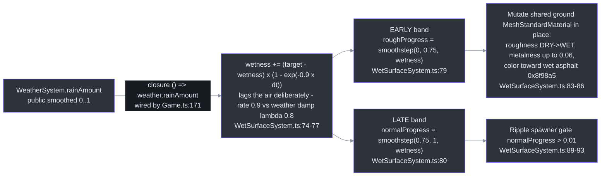
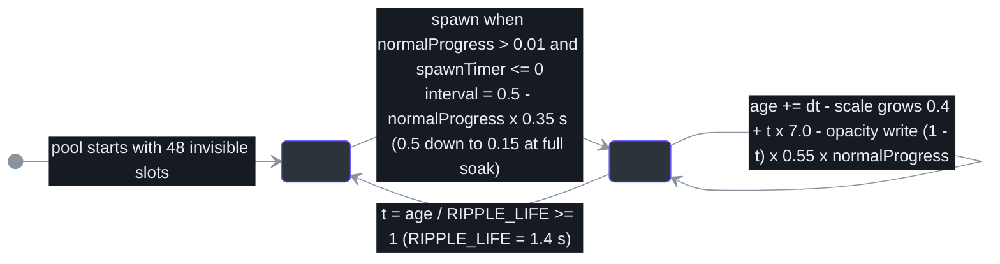
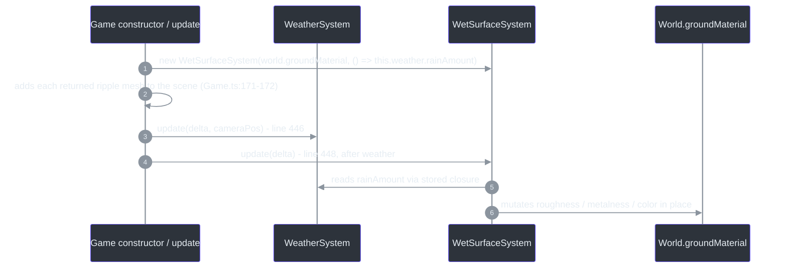

# WetSurfaceSystem — Rain Wetness & Ripple Surfaces

## Overview

WetSurfaceSystem couples rain to a ground response through the single shared envelope `WeatherSystem.rainAmount` ([src/systems/WetSurfaceSystem.ts:19-22](https://github.com/noiz354/arena-city-try/blob/main/src/systems/WetSurfaceSystem.ts#L19-L22)). Following its source skill's "wet-puddle contract", ground roughness/gloss responds on an **EARLY wetness band** (`smoothstep(0.0, 0.75, ...)`) while ripple rings only appear on a **LATE heavy-rain band** (`smoothstep(0.75, 1.0, ...)`) ([src/systems/WetSurfaceSystem.ts:23-27](https://github.com/noiz354/arena-city-try/blob/main/src/systems/WetSurfaceSystem.ts#L23-L27)).

The roughness response is pure material-property mutation (no shader string injection → runtime-safe); ripples are pooled expanding/fading ring meshes as a stylized proxy for analytic ripple normals (explicitly deferred). A procedural canvas puddle mask assigned as `roughnessMap` makes puddle blotches glossier than surrounding asphalt ([src/systems/WetSurfaceSystem.ts:28-33](https://github.com/noiz354/arena-city-try/blob/main/src/systems/WetSurfaceSystem.ts#L28-L33)).

### At a glance

| Aspect | Value | Source |
|--------|-------|--------|
| Input signal | closure into `weather.rainAmount`, wired by Game | [src/game/Game.ts:171](https://github.com/noiz354/arena-city-try/blob/main/src/game/Game.ts#L171) |
| Wetness lag | frame-rate-independent approach at rate 0.9/s — slower than weather's damp(0.8), so ground lags the air | [src/systems/WetSurfaceSystem.ts:74-77](https://github.com/noiz354/arena-city-try/blob/main/src/systems/WetSurfaceSystem.ts#L74-L77) |
| Early band | roughness/metalness/color response on the shared ground material | [src/systems/WetSurfaceSystem.ts:79-86](https://github.com/noiz354/arena-city-try/blob/main/src/systems/WetSurfaceSystem.ts#L79-L86) |
| Late band | pooled 48 ripple meshes spawning on heavy-rain gate | [src/systems/WetSurfaceSystem.ts:60-66](https://github.com/noiz354/arena-city-try/blob/main/src/systems/WetSurfaceSystem.ts#L60-L66), [89-93](https://github.com/noiz354/arena-city-try/blob/main/src/systems/WetSurfaceSystem.ts#L89-L93) |
| Known quirk | all ripples share ONE material → per-mesh opacity writes are ineffective (last visible wins) | [Unresolved](#the-shared-ripple-material-quirk) |

## Signal Path



<!-- Sources: src/game/Game.ts:171-172, src/systems/WetSurfaceSystem.ts:74-93 -->

Band math:

```text
wetness        += (rainAmount() - wetness) * (1 - exp(-0.9 * dt))
roughProgress   = smoothstep(0.00, 0.75, wetness)
normalProgress  = smoothstep(0.75, 1.00, wetness)
```

### Early-band material response

Because `roughnessMap` is set, three.js multiplies the map with the scalar `roughness`, so puddles go glossier than plain asphalt automatically ([src/systems/WetSurfaceSystem.ts:83-86](https://github.com/noiz354/arena-city-try/blob/main/src/systems/WetSurfaceSystem.ts#L83-L86)).

| Property | Dry → Wet | Source |
|----------|-----------|--------|
| `roughness` | `DRY_ROUGHNESS 0.92 → WET_ROUGHNESS 0.4` via `roughProgress` | [src/systems/WetSurfaceSystem.ts:16-17](https://github.com/noiz354/arena-city-try/blob/main/src/systems/WetSurfaceSystem.ts#L16-L17), [83](https://github.com/noiz354/arena-city-try/blob/main/src/systems/WetSurfaceSystem.ts#L83) |
| `metalness` | `0 → 0.06 · roughProgress` | [src/systems/WetSurfaceSystem.ts:84](https://github.com/noiz354/arena-city-try/blob/main/src/systems/WetSurfaceSystem.ts#L84) |
| `color` | white lerped toward wet-asphalt `0x8f98a5` by `roughProgress · 0.55` | [src/systems/WetSurfaceSystem.ts:40](https://github.com/noiz354/arena-city-try/blob/main/src/systems/WetSurfaceSystem.ts#L40), [85-86](https://github.com/noiz354/arena-city-try/blob/main/src/systems/WetSurfaceSystem.ts#L85-L86) |

The target material is the same `MeshStandardMaterial` built in `World.buildGround` (initial `roughness: 0.92, metalness: 0` — matching `DRY_ROUGHNESS`), exposed specifically for this coupling ([src/game/World.ts:47-48](https://github.com/noiz354/arena-city-try/blob/main/src/game/World.ts#L47-L48), [194-195](https://github.com/noiz354/arena-city-try/blob/main/src/game/World.ts#L194-L195)). Only the city ground plane gets wet; the outer terrain material ([src/game/World.ts:233](https://github.com/noiz354/arena-city-try/blob/main/src/game/World.ts#L233)) is untouched — see also [Vegetation's](../world-generation/vegetation.md) matching gap.

## Ripple Lifecycle (Late Band)

Pool of 48 meshes sharing one `RingGeometry(0.28, 0.42, 24)` and one additive material, rotated flat (`rotation.x = -π/2`) ([src/systems/WetSurfaceSystem.ts:53-66](https://github.com/noiz354/arena-city-try/blob/main/src/systems/WetSurfaceSystem.ts#L53-L66)).



<!-- Sources: src/systems/WetSurfaceSystem.ts:13-14, src/systems/WetSurfaceSystem.ts:89-106 -->

Spawning picks the first invisible pool slot and places it at random `(x, z)` within `±(CITY_HALF − 8)` — i.e. ±147 m of the 310 m city, keeping an 8 m margin from the edge (importing `CITY_HALF = 155` from CityGenerator, [src/systems/CityGenerator.ts:9](https://github.com/noiz354/arena-city-try/blob/main/src/systems/CityGenerator.ts#L9)) — at fixed height y=0.03 ([src/systems/WetSurfaceSystem.ts:109-117](https://github.com/noiz354/arena-city-try/blob/main/src/systems/WetSurfaceSystem.ts#L109-L117), [112-113](https://github.com/noiz354/arena-city-try/blob/main/src/systems/WetSurfaceSystem.ts#L112-L113)).

## Game Wiring & Frame Order



<!-- Sources: src/game/Game.ts:166, src/game/Game.ts:171-172, src/game/Game.ts:446, src/game/Game.ts:448, src/systems/WetSurfaceSystem.ts:19-22 -->

This one-directional pull keeps WeatherSystem unaware of ground response — the system never imports WeatherSystem directly ([docs/wiki/systems/WetSurfaceSystem.md](https://github.com/noiz354/arena-city-try/blob/main/docs/wiki/systems/WetSurfaceSystem.md)).

## The Shared-Ripple-Material Quirk

**Flagged doc-vs-code finding — do not treat per-ripple fading as working.**

The update loop writes `(r.mesh.material as MeshBasicMaterial).opacity` per mesh ([src/systems/WetSurfaceSystem.ts:105](https://github.com/noiz354/arena-city-try/blob/main/src/systems/WetSurfaceSystem.ts#L105)), but every pool mesh shares ONE material instance created once in the constructor ([src/systems/WetSurfaceSystem.ts:53](https://github.com/noiz354/arena-city-try/blob/main/src/systems/WetSurfaceSystem.ts#L53), [62](https://github.com/noiz354/arena-city-try/blob/main/src/systems/WetSurfaceSystem.ts#L62)). Consequence:

| Intended | Actual behavior |
|----------|-----------------|
| Each ring fades out individually over its 1.4 s life | The **last iterated visible ripple's value wins** each frame; all visible ripples flash identically rather than fading individually |

Rings still grow and hide on schedule, so the effect functions — but individual fade curves do not exist. Fixing requires per-mesh materials or vertex-color alpha ([docs/wiki/systems/WetSurfaceSystem.md](https://github.com/noiz354/arena-city-try/blob/main/docs/wiki/systems/WetSurfaceSystem.md), Unresolved section).

## Puddle Mask Construction

`buildPuddleMask()` (module-level): a 1024² canvas filled white, then **90 radial-gradient blotches** at random positions, radii 18–78 px, shade factor `0.35 + rand·0.4`; falls back to solid translucent squares when `createRadialGradient` is unavailable (headless/DOM-stub environments); returns an sRGB `CanvasTexture` assigned to `ground.roughnessMap` with `needsUpdate` flagged ([src/systems/WetSurfaceSystem.ts:50-51](https://github.com/noiz354/arena-city-try/blob/main/src/systems/WetSurfaceSystem.ts#L50-L51), [127-157](https://github.com/noiz354/arena-city-try/blob/main/src/systems/WetSurfaceSystem.ts#L127-L157)).

## Public API & Data Structures

| Member | Signature | Behavior | Source |
|--------|-----------|----------|--------|
| constructor | `(ground: MeshStandardMaterial, rainAmount: () => number)` | Mutates ground in place (roughnessMap/metalness/roughness/color); closure supplies the target envelope each update | [src/systems/WetSurfaceSystem.ts:36-72](https://github.com/noiz354/arena-city-try/blob/main/src/systems/WetSurfaceSystem.ts#L36-L72) |
| `meshes` | getter `Mesh[]` | All 48 ripple meshes; the OWNER must add them to the scene (Game does) | [src/systems/WetSurfaceSystem.ts:69-72](https://github.com/noiz354/arena-city-try/blob/main/src/systems/WetSurfaceSystem.ts#L69-L72), [src/game/Game.ts:172](https://github.com/noiz354/arena-city-try/blob/main/src/game/Game.ts#L172) |
| `update(dt)` | `(dt: number): void` | Envelope integration + material response + ripple lifecycle; ticked after weather each frame | [src/systems/WetSurfaceSystem.ts:74](https://github.com/noiz354/arena-city-try/blob/main/src/systems/WetSurfaceSystem.ts#L74), [src/game/Game.ts:448](https://github.com/noiz354/arena-city-try/blob/main/src/game/Game.ts#L448) |
| `dispose()` | `(): void` | Frees ripple material/geometry and the puddle mask texture. Does NOT restore original ground material state | [src/systems/WetSurfaceSystem.ts:119-123](https://github.com/noiz354/arena-city-try/blob/main/src/systems/WetSurfaceSystem.ts#L119-L123) |
| `wetness` | public field | Smoothed 0..1 envelope, documented "testable"; starts 0 (dry) | [src/systems/WetSurfaceSystem.ts:36-37](https://github.com/noiz354/arena-city-try/blob/main/src/systems/WetSurfaceSystem.ts#L36-L37) |
| `ripples` | private array of `{ mesh, age }` | Fixed 48-entry pool; `age` in seconds since spawn | [src/systems/WetSurfaceSystem.ts:41](https://github.com/noiz354/arena-city-try/blob/main/src/systems/WetSurfaceSystem.ts#L41) |
| `rippleMat` | private MeshBasicMaterial | Shared additive material (color `0xbfd6e8`, transparent, opacity 0, AdditiveBlending, `depthWrite:false`) — the quirk locus | [src/systems/WetSurfaceSystem.ts:42](https://github.com/noiz354/arena-city-try/blob/main/src/systems/WetSurfaceSystem.ts#L42), [53-59](https://github.com/noiz354/arena-city-try/blob/main/src/systems/WetSurfaceSystem.ts#L53-L59) |

Constants: `RIPPLE_POOL = 48`, `RIPPLE_LIFE = 1.4` s, `DRY_ROUGHNESS = 0.92`, `WET_ROUGHNESS = 0.4`; wetness damping rate `0.9` inline ([src/systems/WetSurfaceSystem.ts:13-17](https://github.com/noiz354/arena-city-try/blob/main/src/systems/WetSurfaceSystem.ts#L13-L17), [77](https://github.com/noiz354/arena-city-try/blob/main/src/systems/WetSurfaceSystem.ts#L77)).

## Tuning Knobs

All in [src/systems/WetSurfaceSystem.ts](https://github.com/noiz354/arena-city-try/blob/main/src/systems/WetSurfaceSystem.ts):

| Knob | Value | Effect | Source |
|------|-------|--------|--------|
| Band edges | rough `[0, 0.75]`, ripple `[0.75, 1]` | Re-times the whole wet-vs-soaked feel | [src/systems/WetSurfaceSystem.ts:79-80](https://github.com/noiz354/arena-city-try/blob/main/src/systems/WetSurfaceSystem.ts#L79-L80) |
| Roughness endpoints | 0.92 → 0.4; metalness peak 0.06; darken ×0.55 toward `0x8f98a5` | Gloss/darkening strength | [src/systems/WetSurfaceSystem.ts:16-17](https://github.com/noiz354/arena-city-try/blob/main/src/systems/WetSurfaceSystem.ts#L16-L17), [84](https://github.com/noiz354/arena-city-try/blob/main/src/systems/WetSurfaceSystem.ts#L84), [40](https://github.com/noiz354/arena-city-try/blob/main/src/systems/WetSurfaceSystem.ts#L40), [86](https://github.com/noiz354/arena-city-try/blob/main/src/systems/WetSurfaceSystem.ts#L86) |
| Envelope lag | rate `0.9` s⁻¹ (vs weather damp λ 0.8) | Raise both together for snappier storms | [src/systems/WetSurfaceSystem.ts:77](https://github.com/noiz354/arena-city-try/blob/main/src/systems/WetSurfaceSystem.ts#L77), [src/systems/WeatherSystem.ts:60](https://github.com/noiz354/arena-city-try/blob/main/src/systems/WeatherSystem.ts#L60) |
| Ripples | pool 48, life 1.4 s, ring geo 0.28–0.42 / 24 seg, growth `0.4+t·7`, fade `(1−t)·0.55`, cadence `0.5−p·0.35`, margin 8 m inside `CITY_HALF`, y=0.03, tint `0xbfd6e8` | Rain-ring look | [src/systems/WetSurfaceSystem.ts:13-14](https://github.com/noiz354/arena-city-try/blob/main/src/systems/WetSurfaceSystem.ts#L13-L14), [60](https://github.com/noiz354/arena-city-try/blob/main/src/systems/WetSurfaceSystem.ts#L60), [103](https://github.com/noiz354/arena-city-try/blob/main/src/systems/WetSurfaceSystem.ts#L103), [105](https://github.com/noiz354/arena-city-try/blob/main/src/systems/WetSurfaceSystem.ts#L105), [92](https://github.com/noiz354/arena-city-try/blob/main/src/systems/WetSurfaceSystem.ts#L92), [112-114](https://github.com/noiz354/arena-city-try/blob/main/src/systems/WetSurfaceSystem.ts#L112-L114), [54](https://github.com/noiz354/arena-city-try/blob/main/src/systems/WetSurfaceSystem.ts#L54) |
| Puddle mask | 90 blotches, radii 18–78 px, shade 0.35–0.75, canvas 1024² | Glossy-blotch pattern | [src/systems/WetSurfaceSystem.ts:128-139](https://github.com/noiz354/arena-city-try/blob/main/src/systems/WetSurfaceSystem.ts#L128-L139) |
| Safe extension | swap pooled rings for shader-based normal perturbation (header notes analytic normals deferred pending browser verification); wet additional surfaces by applying early-band math inside step 3 rather than parallel systems | design guidance from source doc | [docs/wiki/systems/WetSurfaceSystem.md](https://github.com/noiz354/arena-city-try/blob/main/docs/wiki/systems/WetSurfaceSystem.md) |

## References

- Hand-verified implementation doc: [docs/wiki/systems/WetSurfaceSystem.md](https://github.com/noiz354/arena-city-try/blob/main/docs/wiki/systems/WetSurfaceSystem.md)
- Primary sources: [src/systems/WetSurfaceSystem.ts](https://github.com/noiz354/arena-city-try/blob/main/src/systems/WetSurfaceSystem.ts), [src/game/Game.ts](https://github.com/noiz354/arena-city-try/blob/main/src/game/Game.ts), [src/systems/WeatherSystem.ts](https://github.com/noiz354/arena-city-try/blob/main/src/systems/WeatherSystem.ts)

## Related Pages

| Page | Relationship |
|------|-------------|
| [WeatherSystem](./weather-system.md) | Sole data source — supplies the smoothed `rainAmount` through Game's closure |
| [DayNightSystem](./day-night-system.md) | Co-writes environment state alongside this system without overlap (fog color vs ground material) |
| [CityGenerator](../world-generation/city-generator.md) | Exports `CITY_HALF` used for the 8 m ripple-spawn margin |
| [Vegetation](../world-generation/vegetation.md) | Documents the complementary gap: outer terrain/grass never get wet |
