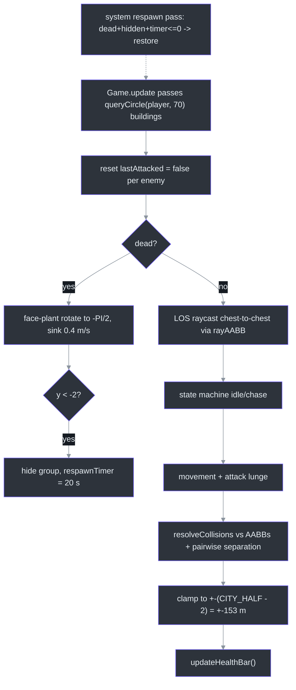
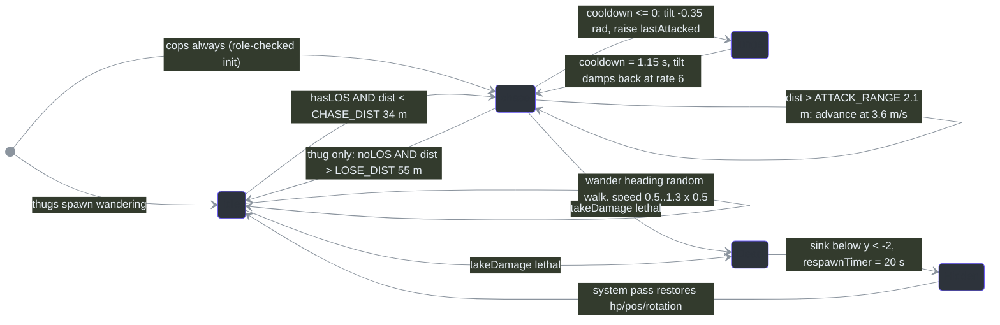
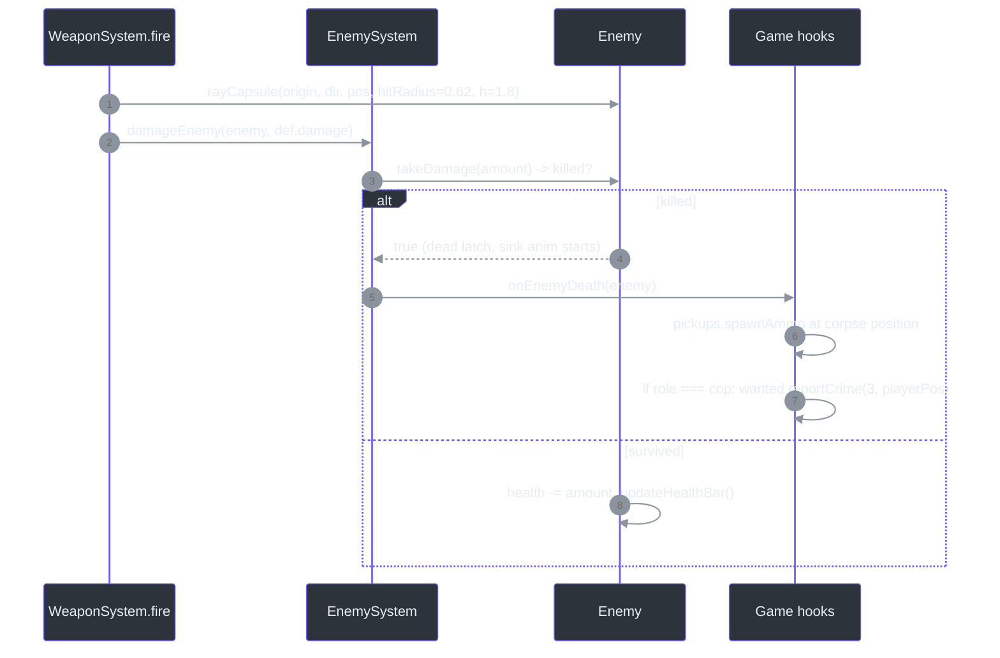
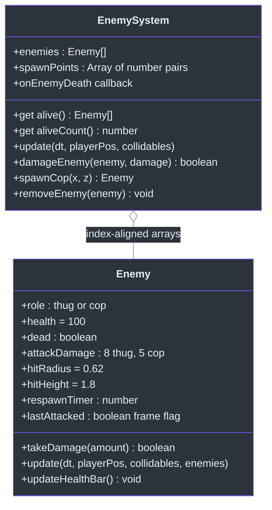

# EnemySystem — Thugs & Cops: LOS, Chase & Melee Combat

## Overview

`EnemySystem` spawns and simulates the city's humanoid NPCs with hostile behavior: 14 wandering street thugs that chase and melee the player on line-of-sight, plus police officers spawned on demand by [WantedSystem](./wanted-system.md). It handles hit detection, death/respawn cycling, billboard health bars, and collision separation ([class doc](https://github.com/noiz354/arena-city-try/blob/main/src/systems/EnemySystem.ts#L251-L254)). Like [PedestrianSystem](./pedestrian-system.md), it pairs an `Enemy` agent class with a pool manager in one file ([src/systems/EnemySystem.ts:25](https://github.com/noiz354/arena-city-try/blob/main/src/systems/EnemySystem.ts#L25)).

Why this design: enemies are the *only* threat vector, so their perception is deliberately simple — a single LOS raycast gated by two radii (34 m aggro, 55 m give-up) instead of a navmesh or hearing model. Combat is pure melee for NPCs; guns belong to the player via [WeaponSystem](../combat-missions/weapon-system.md), which ray-casts against enemy hit capsules.

### At a glance

| Aspect | Value | Source |
|---|---|---|
| Initial thugs | `ENEMY_COUNT = 14` from seeded spawn points (`0xbeefcafe`) | [`src/systems/EnemySystem.ts:14`](https://github.com/noiz354/arena-city-try/blob/main/src/systems/EnemySystem.ts#L14), [`:258`](https://github.com/noiz354/arena-city-try/blob/main/src/systems/EnemySystem.ts#L258) |
| Aggro / give-up radii | `CHASE_DIST = 34` m, `LOSE_DIST = 55` m | [`src/systems/EnemySystem.ts:15-16`](https://github.com/noiz354/arena-city-try/blob/main/src/systems/EnemySystem.ts#L15-L16) |
| Melee trigger / cooldown | `ATTACK_RANGE = 2.1` m, `ATTACK_COOLDOWN = 1.15` s | [`src/systems/EnemySystem.ts:17-18`](https://github.com/noiz354/arena-city-try/blob/main/src/systems/EnemySystem.ts#L17-L18) |
| Chase speed | `MOVE_SPEED = 3.6` m/s (player walk is 5.5 — outrunnable) | [`src/systems/EnemySystem.ts:19`](https://github.com/noiz354/arena-city-try/blob/main/src/systems/EnemySystem.ts#L19) |
| Melee damage | thug **8**, cop **5** per hit | [`src/systems/EnemySystem.ts:49`](https://github.com/noiz354/arena-city-try/blob/main/src/systems/EnemySystem.ts#L49) |
| Hit capsule | `HIT_RADIUS = 0.62`, height 1.8 (hitscan target) | [`src/systems/EnemySystem.ts:20`](https://github.com/noiz354/arena-city-try/blob/main/src/systems/EnemySystem.ts#L20) |
| Body radius | `RADIUS = 0.45` m collision circle | [`src/systems/EnemySystem.ts:21`](https://github.com/noiz354/arena-city-try/blob/main/src/systems/EnemySystem.ts#L21) |
| Respawn delay | 20 s after corpse finishes sinking | [`src/systems/EnemySystem.ts:80`](https://github.com/noiz354/arena-city-try/blob/main/src/systems/EnemySystem.ts#L80) |
| Health | 100, health bar at y = 2.0 | [`src/systems/EnemySystem.ts:243-248`](https://github.com/noiz354/arena-city-try/blob/main/src/systems/EnemySystem.ts#L243-L248) |

## Architecture

### Spawn generation

Deterministic via `seededRng(0xbeefcafe)` ([src/systems/EnemySystem.ts:258](https://github.com/noiz354/arena-city-try/blob/main/src/systems/EnemySystem.ts#L258)): random block (`gi/gj` ∈ [0, `BLOCK_COUNT = 8`)), random orientation (vertical road 50%), offset across road of `BLOCK_SIZE + 2.5 + rng·(CELL − BLOCK_SIZE − 5)` = 32.5–37.5 m, along-road position `4 + rng·(BLOCK_SIZE − 8)` = 4–26 m; guard caps attempts at 500 ([src/systems/EnemySystem.ts:330-351](https://github.com/noiz354/arena-city-try/blob/main/src/systems/EnemySystem.ts#L330-L351)). Points inside the 36×36 m center square (`|x| < 18 && |z| < 18`) are rejected so the player spawn area stays calm ([`:347`](https://github.com/noiz354/arena-city-try/blob/main/src/systems/EnemySystem.ts#L347)). The constructor then instantiates one thug per point ([`:263-270`](https://github.com/noiz354/arena-city-try/blob/main/src/systems/EnemySystem.ts#L263-L270)); Game adds the group to the scene ([src/game/Game.ts:194-195](https://github.com/noiz354/arena-city-try/blob/main/src/game/Game.ts#L194-L195)).

### Per-frame pipeline

`update(dt, playerPos, collidables)` receives *only nearby* building collidables via spatial query `world.chunks.queryCircle(px, pz, 70)` ([src/game/Game.ts:405-406](https://github.com/noiz354/arena-city-try/blob/main/src/game/Game.ts#L405-L406)):

<!-- Sources: src/systems/EnemySystem.ts:280-300,73-86,97-114,157-184; src/game/Game.ts:405-406 -->

Line of sight is zero-allocation: one ray from enemy chest (y + 0.9) to player head (y + 0.9), max distance `dist + 0.5`; any intersected building box blocks vision via `rayAABB`, the slab method returning entry-t ([src/systems/EnemySystem.ts:97-114](https://github.com/noiz354/arena-city-try/blob/main/src/systems/EnemySystem.ts#L97-L114), [src/utils/raycast.ts:9-35](https://github.com/noiz354/arena-city-try/blob/main/src/utils/raycast.ts#L9-L35)).

### Behavior state machine

<!-- Sources: src/systems/EnemySystem.ts:37,53,116-146,73-86,289-300 -->

State rules in detail ([src/systems/EnemySystem.ts:116-146](https://github.com/noiz354/arena-city-try/blob/main/src/systems/EnemySystem.ts#L116-L146)):

| Transition | Condition | Source |
|---|---|---|
| `idle → chase` | LOS **and** distance < 34 m | [`:116-117`](https://github.com/noiz354/arena-city-try/blob/main/src/systems/EnemySystem.ts#L116-L117) |
| `chase → idle` | thugs only: no LOS **and** distance > 55 m; cops never leave chase | [`:118-120`](https://github.com/noiz354/arena-city-try/blob/main/src/systems/EnemySystem.ts#L118-L120), role check [`:53`](https://github.com/noiz354/arena-city-try/blob/main/src/systems/EnemySystem.ts#L53) |
| chase movement | face player (`atan2(toPlayer.x, toPlayer.z)`); advance while `dist > 2.1 m` | [`:124-130`](https://github.com/noiz354/arena-city-try/blob/main/src/systems/EnemySystem.ts#L124-L130) |
| attack | inside range with `attackCooldown <= 0`: set cooldown 1.15 s, lunge tilt −0.35, raise public `lastAttacked` | [`:131-135`](https://github.com/noiz354/arena-city-try/blob/main/src/systems/EnemySystem.ts#L131-L135) |
| idle wander | heading random walk `(rng−0.5)·0.4·dt`; move at `wanderSpeed · dt · 0.5`, `wanderSpeed ∈ [0.5, 1.3]` rolled per-enemy | [`:141-146`](https://github.com/noiz354/arena-city-try/blob/main/src/systems/EnemySystem.ts#L141-L146), speed roll [`:52`](https://github.com/noiz354/arena-city-try/blob/main/src/systems/EnemySystem.ts#L52) |

### Collisions

`resolveCollisions` pushes out against building AABBs whose vertical span overlaps ground level (`box.max.y >= 0 && box.min.y <= 2.2`) with body radius 0.45, then pairwise-separates live enemies within `RADIUS·2.2 ≈ 0.99 m`, each pushed half the overlap ([src/systems/EnemySystem.ts:157-184](https://github.com/noiz354/arena-city-try/blob/main/src/systems/EnemySystem.ts#L157-L184)); position clamps to ±(`CITY_HALF − 2`) = ±153 m ([`:150-151`](https://github.com/noiz354/arena-city-try/blob/main/src/systems/EnemySystem.ts#L150-L151)).

## Damage flow: from hitscan to corpse

<!-- Sources: src/systems/WeaponSystem.ts:229-255; src/systems/EnemySystem.ts:303-307,61-70; src/game/Game.ts:297-300 -->

Weapon damage values come from the data table — pistol 34, SMG 18, shotgun 16×6 pellets, rifle 30 ([src/data/weapons.ts:24-91](https://github.com/noiz354/arena-city-try/blob/main/src/data/weapons.ts#L24-L91)). `takeDamage` returns `true` exactly when this hit kills ([src/systems/EnemySystem.ts:61-70](https://github.com/noiz354/arena-city-try/blob/main/src/systems/EnemySystem.ts#L61-L70)).

## Melee handoff to the player

The two-step flag handoff with [ModeController](./mode-controller.md): `lastAttacked` is reset before each enemy updates so one swing = one hit ([src/systems/EnemySystem.ts:283](https://github.com/noiz354/arena-city-try/blob/main/src/systems/EnemySystem.ts#L283)), raised inside attack range ([`:131-135`](https://github.com/noiz354/arena-city-try/blob/main/src/systems/EnemySystem.ts#L131-L135)), then consumed by ModeController's reception loop within its own `ATTACK_RANGE² = 2.4²` ([src/systems/ModeController.ts:101-112](https://github.com/noiz354/arena-city-try/blob/main/src/systems/ModeController.ts#L101-L112)). This is why an idle player can be worn down: 100 HP ÷ 8 thug damage = 9 hits at ≥1.15 s apart.

## Data structures

<!-- Sources: src/systems/EnemySystem.ts:25-33,272-277,303-327 -->

Key invariant: `enemies` and `spawnPoints` stay index-aligned because both are only ever mutated in tandem by `spawnCop`/`removeEnemy` ([src/systems/EnemySystem.ts:310-327](https://github.com/noiz354/arena-city-try/blob/main/src/systems/EnemySystem.ts#L310-L327)). Visuals are procedural box assemblies — cops blue cloth `0x1f3a5f` + gold badge, thugs purple-brown `0x3a2f45` + red band ([`buildBody`, src/systems/EnemySystem.ts:186-238](https://github.com/noiz354/arena-city-try/blob/main/src/systems/EnemySystem.ts#L186-L238)); the billboard health bar re-centers by shifting x by `−(1−pct)·0.33`.

## Public API

| Member | Signature | Behavior | Source |
|---|---|---|---|
| `alive` getter | `` () => Enemy[] `` | Filter `!dead`; allocates per call | [`src/systems/EnemySystem.ts:272`](https://github.com/noiz354/arena-city-try/blob/main/src/systems/EnemySystem.ts#L272) |
| `aliveCount` getter | `() => number` | Count of living enemies | [`src/systems/EnemySystem.ts:276`](https://github.com/noiz354/arena-city-try/blob/main/src/systems/EnemySystem.ts#L276) |
| `update` | `(dt, playerPos, collidables) => void` | Pipeline above incl. respawn pass | [`src/systems/EnemySystem.ts:280`](https://github.com/noiz354/arena-city-try/blob/main/src/systems/EnemySystem.ts#L280) |
| `damageEnemy` | `(enemy, damage) => boolean` | Applies damage, fires `onEnemyDeath` on kill | [`src/systems/EnemySystem.ts:303`](https://github.com/noiz354/arena-city-try/blob/main/src/systems/EnemySystem.ts#L303) |
| `spawnCop` | `(x, z) => Enemy` | New role-`'cop'` enemy appended to enemies+spawnPoints+group | [`src/systems/EnemySystem.ts:310`](https://github.com/noiz354/arena-city-try/blob/main/src/systems/EnemySystem.ts#L310) |
| `removeEnemy` | `(enemy) => void` | Splices both arrays at same index, detaches group | [`src/systems/EnemySystem.ts:319`](https://github.com/noiz354/arena-city-try/blob/main/src/systems/EnemySystem.ts#L319) |

Consumers: Game owns/ticks it and wires `onEnemyDeath` ([src/game/Game.ts:297-300](https://github.com/noiz354/arena-city-try/blob/main/src/game/Game.ts#L297-L300)); WeaponSystem shoots capsules via `enemies.alive` ([src/systems/WeaponSystem.ts:231-237](https://github.com/noiz354/arena-city-try/blob/main/src/systems/WeaponSystem.ts#L231-L237)); MissionSystem reads `enemies[targetId]` for assassination targets ([src/systems/MissionSystem.ts:147](https://github.com/noiz354/arena-city-try/blob/main/src/systems/MissionSystem.ts#L147), [`:185`](https://github.com/noiz354/arena-city-try/blob/main/src/systems/MissionSystem.ts#L185)).

## Tuning constants

| Constant | Value | Effect | Source |
|---|---|---|---|
| `ENEMY_COUNT` | 14 | Initial thugs (cop spawns are extra) | [`src/systems/EnemySystem.ts:14`](https://github.com/noiz354/arena-city-try/blob/main/src/systems/EnemySystem.ts#L14) |
| `CHASE_DIST` | 34 m | Aggro radius (requires LOS) | [`src/systems/EnemySystem.ts:15`](https://github.com/noiz354/arena-city-try/blob/main/src/systems/EnemySystem.ts#L15) |
| `LOSE_DIST` | 55 m | Thug give-up radius (also needs no LOS) | [`src/systems/EnemySystem.ts:16`](https://github.com/noiz354/arena-city-try/blob/main/src/systems/EnemySystem.ts#L16) |
| `ATTACK_RANGE` | 2.1 m | Enemy-side melee trigger distance | [`src/systems/EnemySystem.ts:17`](https://github.com/noiz354/arena-city-try/blob/main/src/systems/EnemySystem.ts#L17) |
| `ATTACK_COOLDOWN` | 1.15 s | Time between melee swings | [`src/systems/EnemySystem.ts:18`](https://github.com/noiz354/arena-city-try/blob/main/src/systems/EnemySystem.ts#L18) |
| `MOVE_SPEED` | 3.6 m/s | Chase speed (outrunnable on foot) | [`src/systems/EnemySystem.ts:19`](https://github.com/noiz354/arena-city-try/blob/main/src/systems/EnemySystem.ts#L19) |
| `HIT_RADIUS` / `RADIUS` | 0.62 / 0.45 m | Hitscan capsule vs body collision | [`src/systems/EnemySystem.ts:20-21`](https://github.com/noiz354/arena-city-try/blob/main/src/systems/EnemySystem.ts#L20-L21) |
| Respawn delay | 20 s | Set when corpse finishes sinking | [`src/systems/EnemySystem.ts:80`](https://github.com/noiz354/arena-city-try/blob/main/src/systems/EnemySystem.ts#L80) |
| LOS eye height | 0.9 m | Chest-height vision ray endpoints | [`src/systems/EnemySystem.ts:101,104`](https://github.com/noiz354/arena-city-try/blob/main/src/systems/EnemySystem.ts#L101) |
| Calm zone | `\|x\|, \|z\| < 18 m` | No spawn points downtown | [`src/systems/EnemySystem.ts:347`](https://github.com/noiz354/arena-city-try/blob/main/src/systems/EnemySystem.ts#L347) |

Extension: roles are data-driven enough for new variants — add a constructor branch for `attackDamage`/start state and colors in `buildBody` ([src/systems/EnemySystem.ts:49-53](https://github.com/noiz354/arena-city-try/blob/main/src/systems/EnemySystem.ts#L49-L53), [`:186-196`](https://github.com/noiz354/arena-city-try/blob/main/src/systems/EnemySystem.ts#L186-L196)).

## Known quirks

- **Per-frame allocations**: `alive` filters into a fresh array and is called multiple times per frame (weapon loop, melee loop) — fine at n≈17, worth caching above ~50 entities.
- **Index alignment is convention**: `removeEnemy` assumes `enemies`/`spawnPoints` alignment ([src/systems/EnemySystem.ts:323-324](https://github.com/noiz354/arena-city-try/blob/main/src/systems/EnemySystem.ts#L323-L324)); nothing enforces it.
- **Assassination target drift**: mission `targetId` indexes the shared array; a cop insertion/removal before index 3 silently shifts which enemy the mission points at (see [MissionSystem](../combat-missions/mission-system.md)).
- **Vision ignores height nuance**: the LOS ray is blocked by *any* box, including low props, though collision filtering only considers y-ranges near ground.

## Related Pages

| Page | Relationship |
|------|-------------|
| [WantedSystem](./wanted-system.md) | Spawns/removes cops through this pool; cop kills feed severity-3 crimes |
| [ModeController](./mode-controller.md) | Consumes `lastAttacked` flags to apply melee damage to the player |
| [WeaponSystem](../combat-missions/weapon-system.md) | Hitscan ray-casts these hit capsules; kills route through `damageEnemy` |
| [MissionSystem](../combat-missions/mission-system.md) | Assassination objective watches `enemies[targetId]` |

