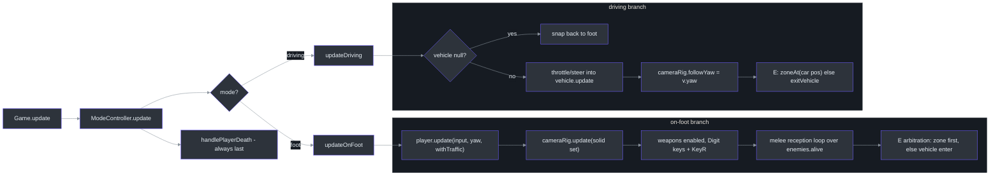
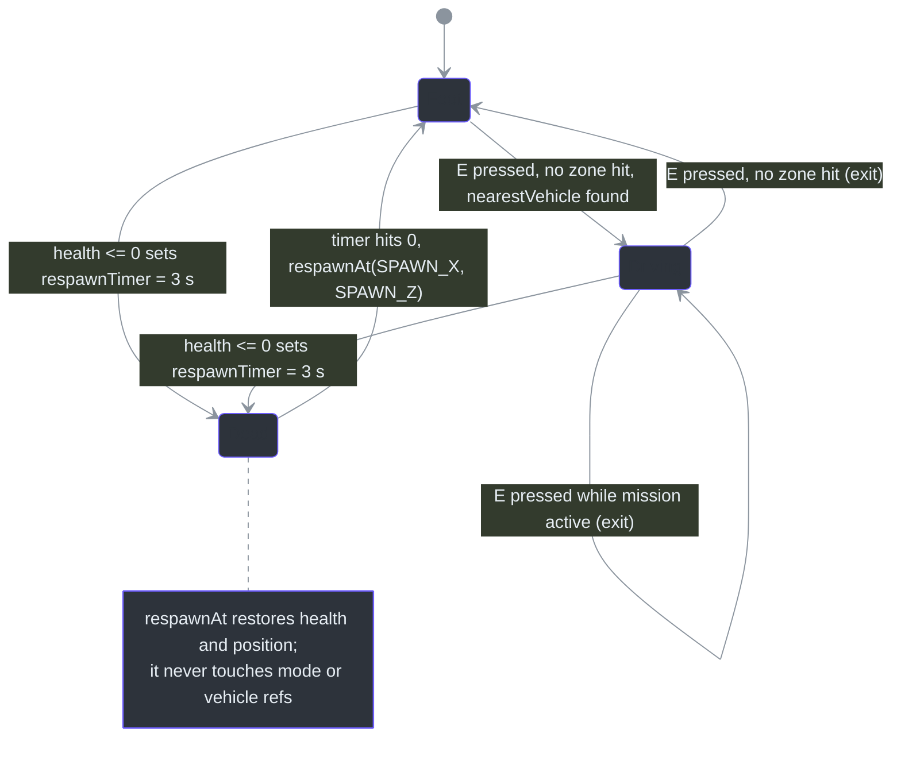
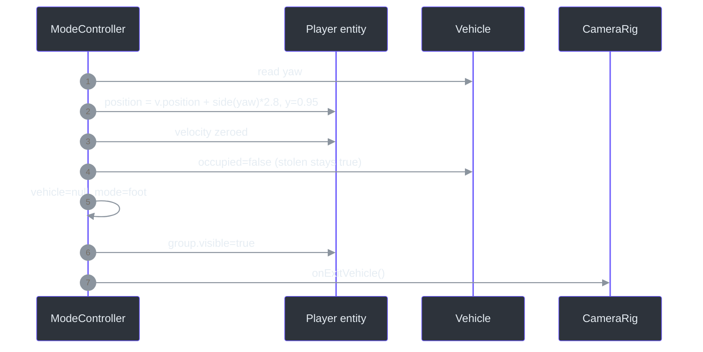
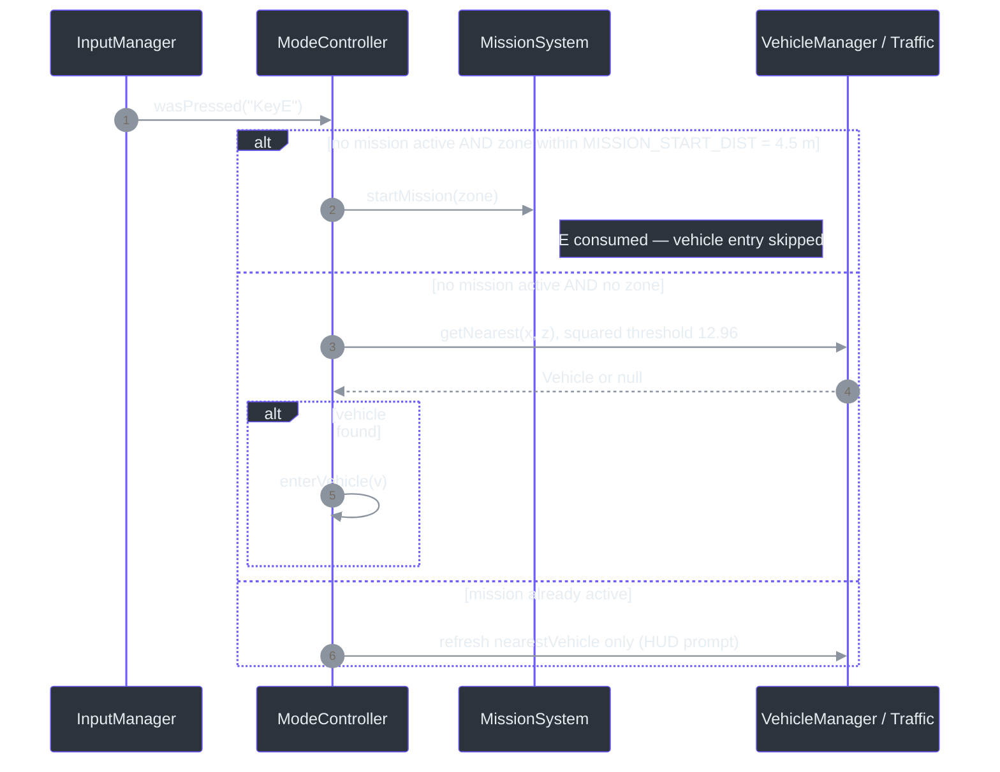
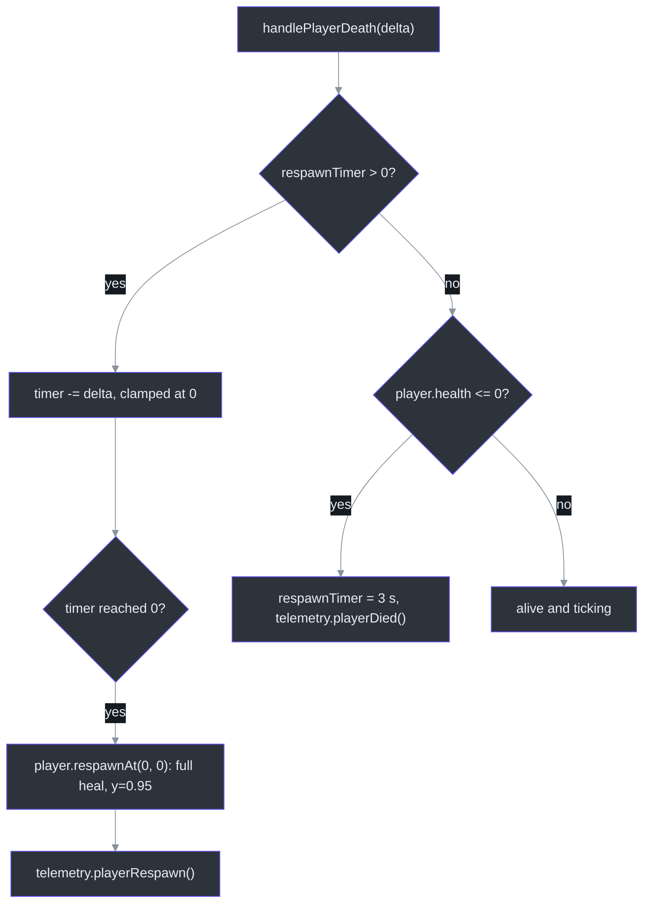

# ModeController — Foot↔Vehicle Mode State Machine

## Overview

`ModeController` exists because the monolithic `Game.ts` mixed two concerns: *wiring systems* (orchestration) and *deciding how the player acts this frame* (gameplay). The "A-1 refactor" extracted the latter into one class owning the `'foot' | 'driving'` switch ([src/systems/ModeController.ts:18](https://github.com/noiz354/arena-city-try/blob/main/src/systems/ModeController.ts#L18)), vehicle enter/exit placement, on-foot input (weapons, melee reception, mission zones, vehicle entry via **E**), driving input, and death → respawn ([class doc](https://github.com/noiz354/arena-city-try/blob/main/src/systems/ModeController.ts#L43-L48)). Everything else reads mode through Game's delegating getters (`game.mode`, `game.vehicle`, `game.nearestVehicle`, `game.respawnTimer`) ([src/game/Game.ts:104-118](https://github.com/noiz354/arena-city-try/blob/main/src/game/Game.ts#L104-L118)).

It is a *state machine with side effects*: each tick reaches into other systems through an injected dependency bag of 13 references plus callbacks ([src/systems/ModeController.ts:25-41](https://github.com/noiz354/arena-city-try/blob/main/src/systems/ModeController.ts#L25-L41)), wired once at [src/game/Game.ts:308-323](https://github.com/noiz354/arena-city-try/blob/main/src/game/Game.ts#L308-L323). No event bus — the trade is tight coupling for total readability of who-acts-when.

### At a glance

| Aspect | Value | Source |
|---|---|---|
| Modes | `'foot' \| 'driving'` | [`src/systems/ModeController.ts:18`](https://github.com/noiz354/arena-city-try/blob/main/src/systems/ModeController.ts#L18) |
| Tick order | After vehicles/pedestrians/traffic; wanted updates gated on foot mode | [`src/game/Game.ts:415-416`](https://github.com/noiz354/arena-city-try/blob/main/src/game/Game.ts#L415-L416) |
| Spawn / respawn point | `SPAWN_X = 0`, `SPAWN_Z = 0` (center intersection) | [`src/systems/ModeController.ts:20-21`](https://github.com/noiz354/arena-city-try/blob/main/src/systems/ModeController.ts#L20-L21) |
| Melee reception range | `ATTACK_RANGE = 2.4` m (squared compare) | [`src/systems/ModeController.ts:22`](https://github.com/noiz354/arena-city-try/blob/main/src/systems/ModeController.ts#L22), [`:106`](https://github.com/noiz354/arena-city-try/blob/main/src/systems/ModeController.ts#L106) |
| Exit placement | 2.8 m along car's side vector, `y = 0.95` | [`src/systems/ModeController.ts:189-191`](https://github.com/noiz354/arena-city-try/blob/main/src/systems/ModeController.ts#L189-L191) |
| Respawn delay | 3 s | [`src/systems/ModeController.ts:214`](https://github.com/noiz354/arena-city-try/blob/main/src/systems/ModeController.ts#L214) |
| E-key priority | Mission zone consumes E before vehicle enter/exit in both modes | [`src/systems/ModeController.ts:115-127`](https://github.com/noiz354/arena-city-try/blob/main/src/systems/ModeController.ts#L115-L127), [`:159-168`](https://github.com/noiz354/arena-city-try/blob/main/src/systems/ModeController.ts#L159-L168) |

## Architecture

### Per-frame dispatch

`Game.update` calls `modeCtrl.update(delta, buildings)` after vehicles/pedestrians/traffic ([src/game/Game.ts:415](https://github.com/noiz354/arena-city-try/blob/main/src/game/Game.ts#L415)); dispatch runs the mode branch then always finishes with the death pass ([src/systems/ModeController.ts:73-77](https://github.com/noiz354/arena-city-try/blob/main/src/systems/ModeController.ts#L73-L77)):

<!-- Sources: src/systems/ModeController.ts:73-77,81-171; src/game/Game.ts:415 -->

Order matters downstream: `vehicles.update()` runs earlier in the frame ([src/game/Game.ts:395](https://github.com/noiz354/arena-city-try/blob/main/src/game/Game.ts#L395)), so visibility flags filtered inside `getNearest`/`getCollidables` are fresh for this frame's player position.

### Mode state machine

<!-- Sources: src/systems/ModeController.ts:138-143,175-200,204-217; src/entities/Player.ts:122-128 -->

Note the driving self-loop: while a mission is active, *any* E press exits the car ([src/systems/ModeController.ts:166-168](https://github.com/noiz354/arena-city-try/blob/main/src/systems/ModeController.ts#L166-L168)). Deterministic from source, intent undocumented — see [Known quirks](#known-quirks).

## Enter & exit transitions

`enterVehicle(v)` ([src/systems/ModeController.ts:175-184](https://github.com/noiz354/arena-city-try/blob/main/src/systems/ModeController.ts#L175-L184)): stores `vehicle`; sets `v.occupied = v.stolen = true` (even parked cars become permanently stolen); zeroes `v.speed`; switches to `'driving'`; hides `player.group` (which also hides the childed weapon holder — see [WeaponView](../combat-missions/weapon-view.md)); snaps the camera behind the car via `cameraRig.onEnterVehicle(v.yaw)` (resets mouse offset, clamps distance ≥ `MIN_DISTANCE+2`, [src/systems/CameraRig.ts:38-43](https://github.com/noiz354/arena-city-try/blob/main/src/systems/CameraRig.ts#L38-L43)); fires telemetry `vehicleEnter`. The candidate comes from parked-first `getNearest` with traffic fallback, using squared threshold `ENTER_DIST² = 12.96` (3.6 m) ([src/systems/VehicleManager.ts:9](https://github.com/noiz354/arena-city-try/blob/main/src/systems/VehicleManager.ts#L9)).

`exitVehicle()` ([src/systems/ModeController.ts:186-200](https://github.com/noiz354/arena-city-try/blob/main/src/systems/ModeController.ts#L186-L200)) computes a side vector `(cos yaw, 0, −sin yaw)` perpendicular to forward `(sin yaw, 0, cos yaw)`, places the player 2.8 m along it at `y = 0.95` (matching capsule half-height, [src/entities/Player.ts:20](https://github.com/noiz354/arena-city-try/blob/main/src/entities/Player.ts#L20)), zeroes velocity, clears `occupied` but leaves `stolen = true` forever (TrafficSystem never resumes stolen cars, [src/systems/TrafficSystem.ts:125](https://github.com/noiz354/arena-city-try/blob/main/src/systems/TrafficSystem.ts#L125)), restores mode/camera/visibility, emits `vehicleExit`. No-op when `vehicle` is null.

<!-- Sources: src/systems/ModeController.ts:186-200; src/systems/CameraRig.ts:44-48 -->

## On-foot duties

In execution order ([src/systems/ModeController.ts:81-134](https://github.com/noiz354/arena-city-try/blob/main/src/systems/ModeController.ts#L81-L134)):

| Duty | Detail | Source |
|---|---|---|
| Collision sets | `solid = buildings + parked collidables` feeds both player body and camera wall ray (traffic excluded there to avoid snap-jitter); `withTraffic = solid + traffic` is player solidity only | [`src/systems/ModeController.ts:83-87`](https://github.com/noiz354/arena-city-try/blob/main/src/systems/ModeController.ts#L83-L87) |
| Camera contract | `cameraRig.followYaw = null` means free mouse orbit | [`src/systems/ModeController.ts:88-89`](https://github.com/noiz354/arena-city-try/blob/main/src/systems/ModeController.ts#L88-L89), [`src/systems/CameraRig.ts:25`](https://github.com/noiz354/arena-city-try/blob/main/src/systems/CameraRig.ts#L25) |
| Weapons | Digit keys from `WEAPON_LIST` call `switchWeapon` + `weaponView.setWeapon`; `KeyR` reloads | [`src/systems/ModeController.ts:90-99`](https://github.com/noiz354/arena-city-try/blob/main/src/systems/ModeController.ts#L90-L99) |
| Melee reception | Enemy with `lastAttacked === true` within `ATTACK_RANGE² = 2.4²` deals its `attackDamage` (thug 8, cop 5) plus audio, 0.3 shake, `onPlayerDamaged` | [`src/systems/ModeController.ts:101-112`](https://github.com/noiz354/arena-city-try/blob/main/src/systems/ModeController.ts#L101-L112), damage values [`src/systems/EnemySystem.ts:49`](https://github.com/noiz354/arena-city-try/blob/main/src/systems/EnemySystem.ts#L49) |
| E arbitration | `missions.zoneAt(x,z)` checked first; a hit starts the mission and *consumes* E so entry can't double-fire; otherwise enter nearest. Other frames refresh `nearestVehicle` for the HUD prompt | [`src/systems/ModeController.ts:114-133`](https://github.com/noiz354/arena-city-try/blob/main/src/systems/ModeController.ts#L114-L133) |

Melee is the receiving half of a flag handoff: `EnemySystem` raises public `lastAttacked` during its update earlier in the frame ([src/game/Game.ts:406](https://github.com/noiz354/arena-city-try/blob/main/src/game/Game.ts#L406)) and resets it before each enemy ticks ([src/systems/EnemySystem.ts:283](https://github.com/noiz354/arena-city-try/blob/main/src/systems/EnemySystem.ts#L283)); ModeController converts committed swings into damage. Chase/melee AI details live in [EnemySystem](./enemy-system.md).

### E-key arbitration (foot)

<!-- Sources: src/systems/ModeController.ts:114-133; src/systems/MissionSystem.ts:81-88; src/systems/VehicleManager.ts:54 -->

## Driving duties

| Duty | Detail | Source |
|---|---|---|
| Safety net | If `vehicle` is null while mode is driving, snap back to `'foot'` | [`src/systems/ModeController.ts:140-143`](https://github.com/noiz354/arena-city-try/blob/main/src/systems/ModeController.ts#L140-L143) |
| Collision sets | Exclude the driven car itself: `vehicles.getCollidables(v)` / `traffic.getCollidables(v)` | [`src/systems/ModeController.ts:147-148`](https://github.com/noiz354/arena-city-try/blob/main/src/systems/ModeController.ts#L147-L148) |
| Weapons off | `weapons.enabled = false` — firing impossible while driving | [`src/systems/ModeController.ts:149`](https://github.com/noiz354/arena-city-try/blob/main/src/systems/ModeController.ts#L149) |
| Input mapping | `throttle = W(1)/S(−1)`, `steer = D(1)/A(−1)` passed straight into `Vehicle.update` physics | [`src/systems/ModeController.ts:151-153`](https://github.com/noiz354/arena-city-try/blob/main/src/systems/ModeController.ts#L151-L153) |
| Camera lock | `cameraRig.followYaw = v.yaw` (heading-follow instead of orbit) | [`src/systems/ModeController.ts:155-156`](https://github.com/noiz354/arena-city-try/blob/main/src/systems/ModeController.ts#L155-L156) |
| E arbitration | No mission active: zone check at the *car's* position first, else exit. Mission active: any E press exits | [`src/systems/ModeController.ts:158-168`](https://github.com/noiz354/arena-city-try/blob/main/src/systems/ModeController.ts#L158-L168) |
| Prompt reset | `nearestVehicle = null` while driving | [`src/systems/ModeController.ts:170`](https://github.com/noiz354/arena-city-try/blob/main/src/systems/ModeController.ts#L170) |

Because `WantedSystem.update` runs only when `modeCtrl.mode === 'foot'` ([src/game/Game.ts:416](https://github.com/noiz354/arena-city-try/blob/main/src/game/Game.ts#L416)), stars freeze and cops stop spawning mid-chase if you get in a car — see [WantedSystem](./wanted-system.md).

## Death & respawn

<!-- Sources: src/systems/ModeController.ts:204-217; src/entities/Player.ts:122-128 -->

`respawnAt` heals and repositions but does not reset `mode` or `vehicle`, and ModeController never touches those fields during death either — verified by reading both methods ([src/entities/Player.ts:122-128](https://github.com/noiz354/arena-city-try/blob/main/src/entities/Player.ts#L122-L128), [src/systems/ModeController.ts:204-217](https://github.com/noiz354/arena-city-try/blob/main/src/systems/ModeController.ts#L204-L217)).

## Data structures

| Member | Type | Meaning | Source |
|---|---|---|---|
| `mode` | `PlayerMode` (`'foot' \| 'driving'`) | Current state | [`src/systems/ModeController.ts:50`](https://github.com/noiz354/arena-city-try/blob/main/src/systems/ModeController.ts#L50) |
| `vehicle` | `` `Vehicle \| null` `` | Car being driven; null on foot | [`src/systems/ModeController.ts:51`](https://github.com/noiz354/arena-city-try/blob/main/src/systems/ModeController.ts#L51) |
| `nearestVehicle` | `` `Vehicle \| null` `` | Enter-prompt candidate, refreshed per frame on foot | [`src/systems/ModeController.ts:52`](https://github.com/noiz354/arena-city-try/blob/main/src/systems/ModeController.ts#L52) |
| `respawnTimer` | `number` | Seconds until respawn; > 0 means dead | [`src/systems/ModeController.ts:53`](https://github.com/noiz354/arena-city-try/blob/main/src/systems/ModeController.ts#L53) |
| `exitOffset` | private `Vector3` | Reused temp for exit placement (zero allocation) | [`src/systems/ModeController.ts:54`](https://github.com/noiz354/arena-city-try/blob/main/src/systems/ModeController.ts#L54) |
| `deps` | private readonly `ModeControllerDeps` | All external references, injected once | [`src/systems/ModeController.ts:56`](https://github.com/noiz354/arena-city-try/blob/main/src/systems/ModeController.ts#L56) |

## Public API & consumers

| Member | Behavior | Source |
|---|---|---|
| `activePosition` getter | Vehicle position while driving else player position — the single point world streaming, culling and minimap track; read by Game before any system updates | [`src/systems/ModeController.ts:63-65`](https://github.com/noiz354/arena-city-try/blob/main/src/systems/ModeController.ts#L63-L65), read at [`src/game/Game.ts:389`](https://github.com/noiz354/arena-city-try/blob/main/src/game/Game.ts#L389) |
| `activeYaw` getter | Car yaw while driving else player yaw; feeds minimap rotation | [`src/systems/ModeController.ts:68-70`](https://github.com/noiz354/arena-city-try/blob/main/src/systems/ModeController.ts#L68-L70) |
| `enterVehicle(v)` / `exitVehicle()` | Transitions above; only called internally after `getNearest` | [`src/systems/ModeController.ts:175-200`](https://github.com/noiz354/arena-city-try/blob/main/src/systems/ModeController.ts#L175-L200) |
| HUD consumers | Shows `[E] Enter <name>` or `WRECKED — cannot enter` from `nearestVehicle`; reads mode for prompts | [`src/ui/hud.ts:137-146`](https://github.com/noiz354/arena-city-try/blob/main/src/ui/hud.ts#L137-L146) |
| Engine audio | Reads `modeCtrl.vehicle` + mode each frame | [`src/game/Game.ts:484-486`](https://github.com/noiz354/arena-city-try/blob/main/src/game/Game.ts#L484-L486) |

## Tuning constants

| Constant | Value | Effect | Source |
|---|---|---|---|
| `SPAWN_X / SPAWN_Z` | `0 / 0` | Respawn point (center intersection) | [`src/systems/ModeController.ts:20-21`](https://github.com/noiz354/arena-city-try/blob/main/src/systems/ModeController.ts#L20-L21) |
| `ATTACK_RANGE` | 2.4 m (squared compare) | Max range at which a committed enemy swing connects | [`src/systems/ModeController.ts:22`](https://github.com/noiz354/arena-city-try/blob/main/src/systems/ModeController.ts#L22) |
| Exit offset | 2.8 m sideways, `y = 0.95` | Where the player pops out; raise if long trucks clip | [`src/systems/ModeController.ts:190-191`](https://github.com/noiz354/arena-city-try/blob/main/src/systems/ModeController.ts#L190-L191) |
| Respawn delay | 3 s | Death screen duration | [`src/systems/ModeController.ts:214`](https://github.com/noiz354/arena-city-try/blob/main/src/systems/ModeController.ts#L214) |
| Melee shake | 0.3 | PostFX intensity per hit taken | [`src/systems/ModeController.ts:109`](https://github.com/noiz354/arena-city-try/blob/main/src/systems/ModeController.ts#L109) |

## Known quirks

- **Driving-E branch redundancy**: when a mission is active, `else if (input.wasPressed('KeyE')) this.exitVehicle()` makes any E press exit the car ([src/systems/ModeController.ts:166-168](https://github.com/noiz354/arena-city-try/blob/main/src/systems/ModeController.ts#L166-L168)). Deterministic but undocumented intent.
- **Respawn does not reset mode**: dying while driving leaves `mode = 'driving'` with `vehicle` still set after respawn; nothing in `handlePlayerDeath` or `respawnAt` clears it.
- **Stolen is one-way**: `stolen = true` is set on every enter and never cleared ([src/systems/ModeController.ts:178](https://github.com/noiz354/arena-city-try/blob/main/src/systems/ModeController.ts#L178)); TrafficSystem permanently abandons such cars.

## Related Pages

| Page | Relationship |
|------|-------------|
| [PedestrianSystem](./pedestrian-system.md) | Run-over checks are gated to foot mode via this controller |
| [WantedSystem](./wanted-system.md) | Wanted updates/cop spawns gated on `mode === 'foot'` here |
| [EnemySystem](./enemy-system.md) | Melee reception consumes the `lastAttacked` flag its update raised |
| [WeaponSystem](../combat-missions/weapon-system.md) | `weapons.enabled` toggled per mode; digit/R input owned here |
| [MissionSystem](../combat-missions/mission-system.md) | `zoneAt` wins the E-key arbitration in both modes |

