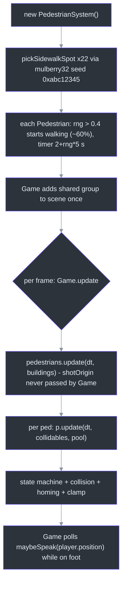
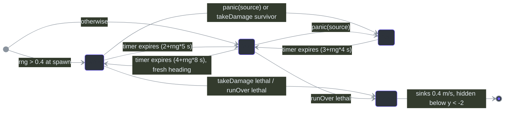
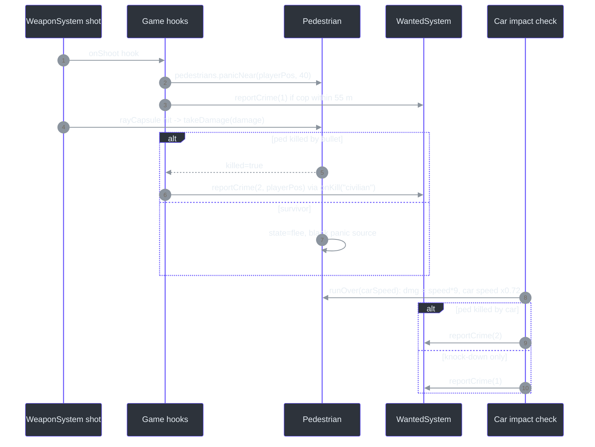
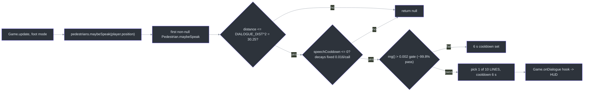

# PedestrianSystem — Spawn, Walk, Flee

## Overview

`PedestrianSystem` populates the city with `PEDESTRIAN_COUNT = 22` low-poly civilians that walk sidewalks, idle, flee from gunfire and vehicle impacts, can be shot or run over (feeding the [WantedSystem](./wanted-system.md)), and occasionally speak ambient lines when the player is close. One file owns both halves: the `Pedestrian` agent class (state machine + procedural body + movement/collision) and the `PedestrianSystem` pool manager (spawning, panic broadcast, dialogue aggregation) ([src/systems/PedestrianSystem.ts:42](https://github.com/noiz354/arena-city-try/blob/main/src/systems/PedestrianSystem.ts#L42), [src/systems/PedestrianSystem.ts:233](https://github.com/noiz354/arena-city-try/blob/main/src/systems/PedestrianSystem.ts#L233)).

The design goal is *ambient life at near-zero cost*: no navigation mesh, no pathfinding — pedestrians pick random headings on sidewalks, get pushed out of building AABBs, and drift home if they stray past 40 m. Death is permanent for the session; dead peds stay in the pool as face-down corpses that sink out of view.

### At a glance

| Aspect | Value | Source |
|---|---|---|
| Pool size | 22, fixed at construction | [`src/systems/PedestrianSystem.ts:13`](https://github.com/noiz354/arena-city-try/blob/main/src/systems/PedestrianSystem.ts#L13) |
| Walk / flee speed | 1.4 / 4.2 m/s (flee is 3× walk) | [`src/systems/PedestrianSystem.ts:14-15`](https://github.com/noiz354/arena-city-try/blob/main/src/systems/PedestrianSystem.ts#L14-L15) |
| Health | 100 per ped; run-over damage `speed * 9` (one-hit kill above ~11.1 m/s) | [`src/systems/PedestrianSystem.ts:44`](https://github.com/noiz354/arena-city-try/blob/main/src/systems/PedestrianSystem.ts#L44), [`:84`](https://github.com/noiz354/arena-city-try/blob/main/src/systems/PedestrianSystem.ts#L84) |
| Spawn RNG | mulberry32 seeded `0xabc12345`, sidewalk-edge placement | [`src/systems/PedestrianSystem.ts:236`](https://github.com/noiz354/arena-city-try/blob/main/src/systems/PedestrianSystem.ts#L236), [`:278-290`](https://github.com/noiz354/arena-city-try/blob/main/src/systems/PedestrianSystem.ts#L278-L290) |
| Hit capsule | radius 0.38, height 1.8 (hitscan soft target) | [`src/systems/PedestrianSystem.ts:46-47`](https://github.com/noiz354/arena-city-try/blob/main/src/systems/PedestrianSystem.ts#L46-L47) |
| Dialogue range / chance | ≤ 5.5 m, ≈0.2% per frame at ~60 fps, 6 s cooldown | [`src/systems/PedestrianSystem.ts:18`](https://github.com/noiz354/arena-city-try/blob/main/src/systems/PedestrianSystem.ts#L18), [`:102-108`](https://github.com/noiz354/arena-city-try/blob/main/src/systems/PedestrianSystem.ts#L102-L108) |
| World clamp | ±(`CITY_HALF − 1`) = ±154 m | [`src/systems/PedestrianSystem.ts:166-168`](https://github.com/noiz354/arena-city-try/blob/main/src/systems/PedestrianSystem.ts#L166-L168) |

## Architecture

### Construction & lifecycle

<!-- Sources: src/systems/PedestrianSystem.ts:234-245,56-63; src/game/Game.ts:198-199,407,419-421 -->

Bodies are pure primitives assembled in `buildBody`: torso box 0.5×0.7×0.3, head cube 0.3³, hair slab, two legs; shirt color from a 6-hex palette with lightness jitter ([src/systems/PedestrianSystem.ts:198-226](https://github.com/noiz354/arena-city-try/blob/main/src/systems/PedestrianSystem.ts#L198-L226)). Sidewalk spots come from a random block (`gi`,`gj` ∈ [0,8)), one of 4 edges, inset 2 m from the block edge ([src/systems/PedestrianSystem.ts:278-290](https://github.com/noiz354/arena-city-try/blob/main/src/systems/PedestrianSystem.ts#L278-L290)); block constants live in [src/systems/CityGenerator.ts:4-9](https://github.com/noiz354/arena-city-try/blob/main/src/systems/CityGenerator.ts#L4-L9).

### Behavior state machine

<!-- Sources: src/systems/PedestrianSystem.ts:112-169 -->

Per-state details ([src/systems/PedestrianSystem.ts:112-169](https://github.com/noiz354/arena-city-try/blob/main/src/systems/PedestrianSystem.ts#L112-L169)):

| State | Speed | Heading | Notes | Source |
|---|---|---|---|---|
| walk | `WALK_SPEED = 1.4` | random-walk jitter `(rng()-0.5)*0.3*dt` rad/frame | timer expiry → idle | [`:128-133`](https://github.com/noiz354/arena-city-try/blob/main/src/systems/PedestrianSystem.ts#L128-L133) |
| idle | 0 | unchanged | expiry → walk with new angle | [`:134-137`](https://github.com/noiz354/arena-city-try/blob/main/src/systems/PedestrianSystem.ts#L134-L137) |
| flee | `FLEE_SPEED = 4.2` | `atan2(away.x, away.z)` directly away from `panicSource` | expiry → idle | [`:139-148`](https://github.com/noiz354/arena-city-try/blob/main/src/systems/PedestrianSystem.ts#L139-L148) |
| dead | sink 0.4 m/s | rotation damps to face-down `-π/2` at rate 4 | hidden below y < −2; no further logic | [`:113-117`](https://github.com/noiz354/arena-city-try/blob/main/src/systems/PedestrianSystem.ts#L113-L117) |

### Collision, homing & clamping

| Mechanism | Behavior | Source |
|---|---|---|
| Building push-out | circle-vs-AABB with `RADIUS = 0.4` against boxes whose y-range intersects [0, 2] | [`src/systems/PedestrianSystem.ts:173-183`](https://github.com/noiz354/arena-city-try/blob/main/src/systems/PedestrianSystem.ts#L173-L183) |
| Ped-vs-ped separation | soft push (0.4 × overlap) when closer than `2R`; dead peds skipped | [`src/systems/PedestrianSystem.ts:184-195`](https://github.com/noiz354/arena-city-try/blob/main/src/systems/PedestrianSystem.ts#L184-L195) |
| Homing | beyond 40 m from spawn point, drift back at `WALK_SPEED` so peds never wander off permanently | [`src/systems/PedestrianSystem.ts:159-165`](https://github.com/noiz354/arena-city-try/blob/main/src/systems/PedestrianSystem.ts#L159-L165) |
| World clamp | ±154 m (`CITY_HALF − 1`), y forced to 0 | [`src/systems/PedestrianSystem.ts:166-168`](https://github.com/noiz354/arena-city-try/blob/main/src/systems/PedestrianSystem.ts#L166-L168) |

Collidables come from `world.getCollidables()` over active chunks ([src/game/World.ts:125-126](https://github.com/noiz354/arena-city-try/blob/main/src/game/World.ts#L125-L126)).

## Damage & panic flow

Two damage entry points feed the wanted pipeline; one broadcast path panics without damage:

<!-- Sources: src/game/Game.ts:249-270,499-520; src/systems/PedestrianSystem.ts:69-98 -->

Key facts behind the diagram:

- `takeDamage(amount)` returns `true` iff this hit killed; survivors flee ([src/systems/PedestrianSystem.ts:69-79](https://github.com/noiz354/arena-city-try/blob/main/src/systems/PedestrianSystem.ts#L69-L79)).
- `runOver(carSpeed)` deals `carSpeed * 9` damage — a 100 HP ped dies above ~11.1 m/s; survivors get `FLEE_DURATION + 1.5` s of fleeing and a dazed `rotation.x = -0.5` tilt ([src/systems/PedestrianSystem.ts:82-92](https://github.com/noiz354/arena-city-try/blob/main/src/systems/PedestrianSystem.ts#L82-L92)).
- Car impacts pair every living ped against every visible vehicle moving ≥ 2.5 m/s within radius `max(width,length)*0.6 + 0.35`, with a 400 ms `carHitAt` cooldown per ped ([src/game/Game.ts:499-520](https://github.com/noiz354/arena-city-try/blob/main/src/game/Game.ts#L499-L520)).
- `panic(from)` is a no-op if dead or already fleeing ([src/systems/PedestrianSystem.ts:95-98](https://github.com/noiz354/arena-city-try/blob/main/src/systems/PedestrianSystem.ts#L95-L98)); every player weapon shot triggers `panicNear(p, 40)` before crime checks ([src/game/Game.ts:253](https://github.com/noiz354/arena-city-try/blob/main/src/game/Game.ts#L253)).
- Peds are registered as hitscan soft targets through the `alive` getter supplier ([src/game/Game.ts:274](https://github.com/noiz354/arena-city-try/blob/main/src/game/Game.ts#L274)); in the shot resolver a nearest-ped hit beats enemies and calls `takeDamage(damage)`, with kills classified as kind `'civilian'` ([src/systems/WeaponSystem.ts:240-263](https://github.com/noiz354/arena-city-try/blob/main/src/systems/WeaponSystem.ts#L240-L263)) — see [WeaponSystem](../combat-missions/weapon-system.md).
- Severity semantics on the receiving end are convention-only, documented at the `reportCrime` signature ([src/systems/WantedSystem.ts:29](https://github.com/noiz354/arena-city-try/blob/main/src/systems/WantedSystem.ts#L29)).

## Dialogue pipeline

<!-- Sources: src/systems/PedestrianSystem.ts:20-31,101-110,269-275; src/game/Game.ts:419-421,95 -->

The line table holds 10 strings at [src/systems/PedestrianSystem.ts:20-31](https://github.com/noiz354/arena-city-try/blob/main/src/systems/PedestrianSystem.ts#L20-L31); polling happens only while on foot and alive ([src/game/Game.ts:419-421](https://github.com/noiz354/arena-city-try/blob/main/src/game/Game.ts#L419-L421)).

## Data structures

| Member | Type | Meaning | Source |
|---|---|---|---|
| `State.kind` | `'walk' \| 'idle' \| 'flee'` | Current behavior | [`src/systems/PedestrianSystem.ts:35-40`](https://github.com/noiz354/arena-city-try/blob/main/src/systems/PedestrianSystem.ts#L35-L40) |
| `State.timer` | `number` | Seconds until this state may expire | [`src/systems/PedestrianSystem.ts:36`](https://github.com/noiz354/arena-city-try/blob/main/src/systems/PedestrianSystem.ts#L36) |
| `State.panicSource` | `` `Vector3 \| undefined` `` | Flee-away point (gunshot origin / damage location) | [`src/systems/PedestrianSystem.ts:38`](https://github.com/noiz354/arena-city-try/blob/main/src/systems/PedestrianSystem.ts#L38) |
| `health` / `dead` | `number` / `boolean` | Starts 100; death latch gates all updates | [`src/systems/PedestrianSystem.ts:44-45`](https://github.com/noiz354/arena-city-try/blob/main/src/systems/PedestrianSystem.ts#L44-L45) |
| `hitRadius` / `hitHeight` | `0.38` / `1.8` | Ray-capsule target shape for bullets | [`src/systems/PedestrianSystem.ts:46-47`](https://github.com/noiz354/arena-city-try/blob/main/src/systems/PedestrianSystem.ts#L46-L47) |
| `carHitAt` | `number` | `performance.now()` of last car hit; anti-multi-frame cooldown read by Game | [`src/systems/PedestrianSystem.ts:49`](https://github.com/noiz354/arena-city-try/blob/main/src/systems/PedestrianSystem.ts#L49), used [`src/game/Game.ts:500`](https://github.com/noiz354/arena-city-try/blob/main/src/game/Game.ts#L500) |
| `pedestrians` | readonly `` `Pedestrian[]` `` | Fixed pool of 22; dead ones stay in it | [`src/systems/PedestrianSystem.ts:234`](https://github.com/noiz354/arena-city-try/blob/main/src/systems/PedestrianSystem.ts#L234) |

## Public API

| Method | Signature | Behavior | Source |
|---|---|---|---|
| `alive` getter | `` (): Pedestrian[] `` | Filters `!dead` — allocates a fresh array per access; supplied to WeaponSystem as shootable targets | [`src/systems/PedestrianSystem.ts:247-249`](https://github.com/noiz354/arena-city-try/blob/main/src/systems/PedestrianSystem.ts#L247-L249) |
| `update` | `(dt, collidables, shotOrigin?) => void` | Optional global panic broadcast + per-ped update | [`src/systems/PedestrianSystem.ts:251-256`](https://github.com/noiz354/arena-city-try/blob/main/src/systems/PedestrianSystem.ts#L251-L256) |
| `panicNear` | `(from, radius) => void` | Panics every living ped within `radius²`; called with radius 40 on every shot | [`src/systems/PedestrianSystem.ts:259-266`](https://github.com/noiz354/arena-city-try/blob/main/src/systems/PedestrianSystem.ts#L259-L266) |
| `maybeSpeak` | `(playerPos) => string \| null` | First dialogue line from any ped this frame | [`src/systems/PedestrianSystem.ts:269-275`](https://github.com/noiz354/arena-city-try/blob/main/src/systems/PedestrianSystem.ts#L269-L275) |
| `takeDamage` (per ped) | `(amount) => boolean` | True iff killed; survivors flee | [`src/systems/PedestrianSystem.ts:69-79`](https://github.com/noiz354/arena-city-try/blob/main/src/systems/PedestrianSystem.ts#L69-L79) |
| `runOver` (per ped) | `(carSpeed) => boolean` | Damage `speed*9`; dazed longer flee for survivors | [`src/systems/PedestrianSystem.ts:82-92`](https://github.com/noiz354/arena-city-try/blob/main/src/systems/PedestrianSystem.ts#L82-L92) |

## Tuning constants

| Constant | Value | Effect | Source |
|---|---|---|---|
| `PEDESTRIAN_COUNT` | 22 | Pool size, fixed at construction | [`src/systems/PedestrianSystem.ts:13`](https://github.com/noiz354/arena-city-try/blob/main/src/systems/PedestrianSystem.ts#L13) |
| `WALK_SPEED` | 1.4 m/s | Walk + homing speed | [`src/systems/PedestrianSystem.ts:14`](https://github.com/noiz354/arena-city-try/blob/main/src/systems/PedestrianSystem.ts#L14) |
| `FLEE_SPEED` | 4.2 m/s | Panic sprint (3× walk) | [`src/systems/PedestrianSystem.ts:15`](https://github.com/noiz354/arena-city-try/blob/main/src/systems/PedestrianSystem.ts#L15) |
| `FLEE_DURATION` | 3.5 s (+1.5 run-over daze) | Panic length | [`src/systems/PedestrianSystem.ts:16`](https://github.com/noiz354/arena-city-try/blob/main/src/systems/PedestrianSystem.ts#L16), [`:88`](https://github.com/noiz354/arena-city-try/blob/main/src/systems/PedestrianSystem.ts#L88) |
| `RADIUS` | 0.4 m | Collision circle; separation uses `2R` | [`src/systems/PedestrianSystem.ts:17`](https://github.com/noiz354/arena-city-try/blob/main/src/systems/PedestrianSystem.ts#L17) |
| `DIALOGUE_DIST` | 5.5 m | Max player distance for speech rolls | [`src/systems/PedestrianSystem.ts:18`](https://github.com/noiz354/arena-city-try/blob/main/src/systems/PedestrianSystem.ts#L18) |
| Homing threshold | 40 m | Beyond this, peds beeline home | [`src/systems/PedestrianSystem.ts:162`](https://github.com/noiz354/arena-city-try/blob/main/src/systems/PedestrianSystem.ts#L162) |
| Run-over lethality | `dmg = speed * 9` vs 100 HP | One-hit kill above ~11.1 m/s | [`src/systems/PedestrianSystem.ts:84`](https://github.com/noiz354/arena-city-try/blob/main/src/systems/PedestrianSystem.ts#L84) |
| Spawn seed | `0xabc12345` | Deterministic placement | [`src/systems/PedestrianSystem.ts:236`](https://github.com/noiz354/arena-city-try/blob/main/src/systems/PedestrianSystem.ts#L236) |

## Known quirks

- **Frame-rate-dependent dialogue cadence**: `speechCooldown` decays by hardcoded `0.016` per call instead of real dt ([src/systems/PedestrianSystem.ts:102](https://github.com/noiz354/arena-city-try/blob/main/src/systems/PedestrianSystem.ts#L102)), so higher fps ⇒ faster cooldown recovery.
- **Dead peds are never recycled**: no respawn pass exists; restoring would need to reset `health/dead/state/rotation/visibility` and reposition.
- The optional `shotOrigin` parameter of `update` is never passed by Game ([src/game/Game.ts:407](https://github.com/noiz354/arena-city-try/blob/main/src/game/Game.ts#L407)); the broadcast form is unused.

## Related Pages

| Page | Relationship |
|------|-------------|
| [WantedSystem](./wanted-system.md) | Consumes severity-1/2 crimes from bullet kills and car run-overs |
| [EnemySystem](./enemy-system.md) | Same agent+manager split; both expose `hitRadius/hitHeight` capsules |
| [WeaponSystem](../combat-missions/weapon-system.md) | Peds registered as soft ray targets via the `alive` supplier |
| [ModeController](./mode-controller.md) | Dialogue polling gated to foot mode |

