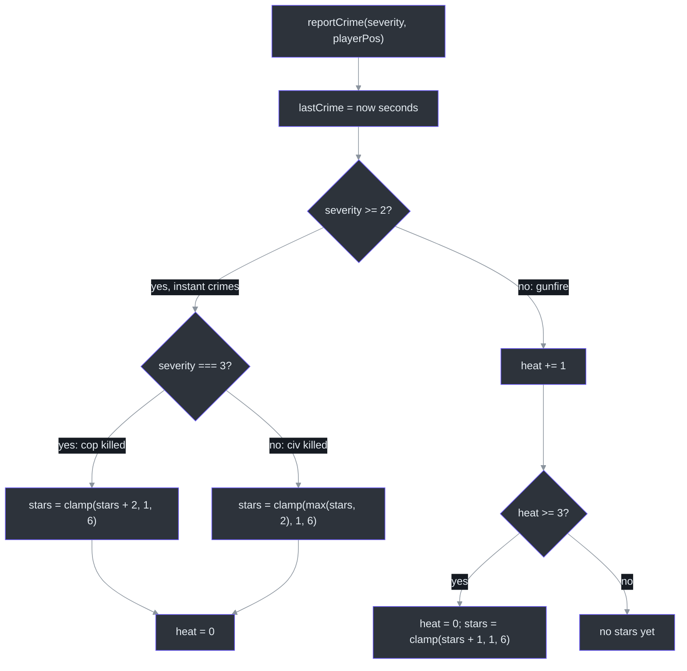
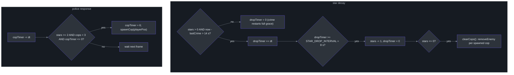
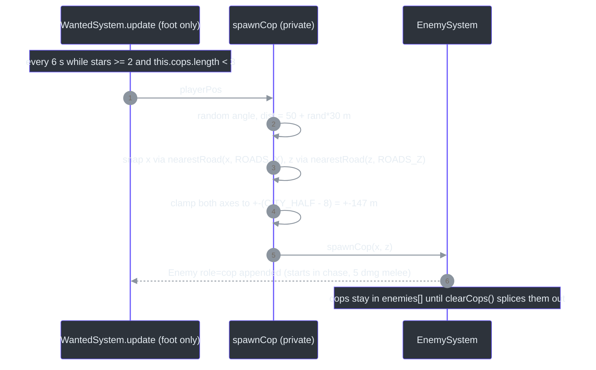
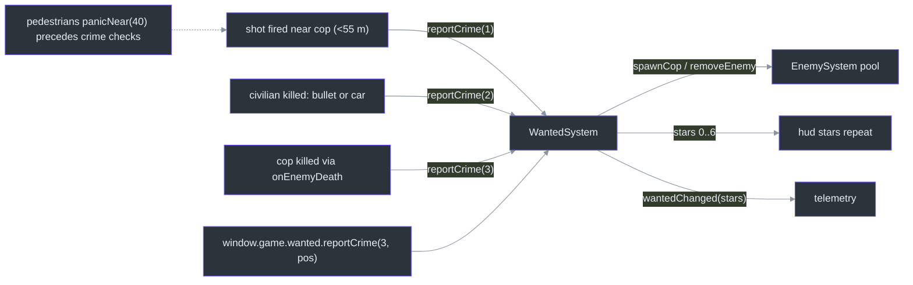

# WantedSystem — Star Math, Decay & Cop Cadence

## Overview

`WantedSystem` implements a GTA-style 6-star meter: crimes raise stars 1..6, stars decay when the player behaves, and from 2 stars police officers spawn near the player, chase on foot, and are despawned when the meter clears ([class doc](https://github.com/noiz354/arena-city-try/blob/main/src/systems/WantedSystem.ts#L11-L18)). It is intentionally tiny — one class holding `stars` plus four timers, delegating all *police behavior* to [EnemySystem](./enemy-system.md) via `spawnCop`/`removeEnemy` ([src/systems/WantedSystem.ts:19-27](https://github.com/noiz354/arena-city-try/blob/main/src/systems/WantedSystem.ts#L19-L27)).

The system's two jobs per frame are star bookkeeping and police logistics. It is constructed once with the shared enemy pool (`new WantedSystem(this.enemies)`, [src/game/Game.ts:204](https://github.com/noiz354/arena-city-try/blob/main/src/game/Game.ts#L204)) and updated **only while the player is on foot** ([src/game/Game.ts:416](https://github.com/noiz354/arena-city-try/blob/main/src/game/Game.ts#L416)) — stars do not decay and cops do not spawn while driving.

### At a glance

| Aspect | Value | Source |
|---|---|---|
| Star ceiling | `MAX_STARS = 6`, clamped | [`src/systems/WantedSystem.ts:5`](https://github.com/noiz354/arena-city-try/blob/main/src/systems/WantedSystem.ts#L5) |
| Cop trigger | `POLICE_AT_STARS = 2` | [`src/systems/WantedSystem.ts:6`](https://github.com/noiz354/arena-city-try/blob/main/src/systems/WantedSystem.ts#L6) |
| Cop cap | `MAX_COPS = 3` spawned by this system | [`src/systems/WantedSystem.ts:7`](https://github.com/noiz354/arena-city-try/blob/main/src/systems/WantedSystem.ts#L7) |
| Decay grace / drop interval | 14 s crime-free, then 8 s per dropped star | [`src/systems/WantedSystem.ts:8-9`](https://github.com/noiz354/arena-city-try/blob/main/src/systems/WantedSystem.ts#L8-L9) |
| Spawn cadence | every 6 s while ≥ 2 stars | [`src/systems/WantedSystem.ts:63-67`](https://github.com/noiz354/arena-city-try/blob/main/src/systems/WantedSystem.ts#L63-L67) |
| Spawn ring | 50 + rand·30 m (50–80 m), X/Z independently snapped to nearest road centerline | [`src/systems/WantedSystem.ts:70-81`](https://github.com/noiz354/arena-city-try/blob/main/src/systems/WantedSystem.ts#L70-L81) |
| Severity scale | 1 = gunfire, 2 = civilian killed, 3 = cop killed (convention only) | [`src/systems/WantedSystem.ts:29`](https://github.com/noiz354/arena-city-try/blob/main/src/systems/WantedSystem.ts#L29) |

## Crime intake

`reportCrime(severity, playerPos)` always stamps `lastCrime`, then branches on severity ([src/systems/WantedSystem.ts:30-44](https://github.com/noiz354/arena-city-try/blob/main/src/systems/WantedSystem.ts#L30-L44)):

<!-- Sources: src/systems/WantedSystem.ts:30-44 -->

Semantics worth memorizing:

| Severity | Effect | Source |
|---|---|---|
| 1 (gunfire near a live cop within 55 m) | heat-based: third heat point converts to +1 star and resets heat — three shots needed for the first star | [`src/systems/WantedSystem.ts:36-41`](https://github.com/noiz354/arena-city-try/blob/main/src/systems/WantedSystem.ts#L36-L41), distance check [`src/game/Game.ts:259`](https://github.com/noiz354/arena-city-try/blob/main/src/game/Game.ts#L259) |
| 2 (civilian killed, bullet or car) | forces *at least* 2 stars via `max(stars, 2)`; resets heat | [`src/systems/WantedSystem.ts:32-34`](https://github.com/noiz354/arena-city-try/blob/main/src/systems/WantedSystem.ts#L32-L34), call sites [`src/game/Game.ts:269`](https://github.com/noiz354/arena-city-try/blob/main/src/game/Game.ts#L269), [`:516`](https://github.com/noiz354/arena-city-try/blob/main/src/game/Game.ts#L516) |
| 3 (cop killed) | adds +2 on top of current stars, clamped to 6 | [`src/systems/WantedSystem.ts:33`](https://github.com/noiz354/arena-city-try/blob/main/src/systems/WantedSystem.ts#L33), call site [`src/game/Game.ts:299`](https://github.com/noiz354/arena-city-try/blob/main/src/game/Game.ts#L299) |
| any | position-independent: `playerPos` accepted then explicitly discarded with `void playerPos` | [`src/systems/WantedSystem.ts:43`](https://github.com/noiz354/arena-city-try/blob/main/src/systems/WantedSystem.ts#L43) |

> **Flagged quirk**: `reportCrime(3, pos)` from 0 stars yields **2** stars, not 3+ — `max(0, 0 + 2)` clamps to 2 ([src/systems/WantedSystem.ts:33](https://github.com/noiz354/arena-city-try/blob/main/src/systems/WantedSystem.ts#L33)). It does immediately enable cop spawning (`POLICE_AT_STARS = 2`); "≥3 stars" only holds if the player already had ≥1 star. Repeating escalates: from 2 stars a second call gives 4.

## Per-frame update

`update(dt, playerPos)` runs every frame *only on foot* ([src/game/Game.ts:416](https://github.com/noiz354/arena-city-try/blob/main/src/game/Game.ts#L416)) and does two things ([src/systems/WantedSystem.ts:47-68](https://github.com/noiz354/arena-city-try/blob/main/src/systems/WantedSystem.ts#L47-L68)):

<!-- Sources: src/systems/WantedSystem.ts:51-67 -->

Two subtleties from the source:

1. **Each crime restarts the full grace period**, not just the drop countdown — any crime inside the 14 s window takes the `else` branch and zeroes `dropTimer` ([src/systems/WantedSystem.ts:58-59](https://github.com/noiz354/arena-city-try/blob/main/src/systems/WantedSystem.ts#L58-L59)). Worst-case decay of 6 stars is therefore 6 × 8 s = 48 s after a crime-free 14 s.
2. `lastCrime` initializes to `-999` so the first frame is already inside the decay window harmlessly ([src/systems/WantedSystem.ts:22](https://github.com/noiz354/arena-city-try/blob/main/src/systems/WantedSystem.ts#L22)).

### Cop spawn cadence & placement

<!-- Sources: src/systems/WantedSystem.ts:63-86; src/systems/EnemySystem.ts:310-327; src/systems/CityGenerator.ts:28-31 -->

Snapping X and Z **independently** against identical road grids ([src/systems/CityGenerator.ts:28-31](https://github.com/noiz354/arena-city-try/blob/main/src/systems/CityGenerator.ts#L28-L31)) means cops materialize at/near intersections, coming "from the streets" ([comment at src/systems/WantedSystem.ts:75](https://github.com/noiz354/arena-city-try/blob/main/src/systems/WantedSystem.ts#L75)). Spawned cops start permanently in `'chase'` state and never leave it ([src/systems/EnemySystem.ts:53](https://github.com/noiz354/arena-city-try/blob/main/src/systems/EnemySystem.ts#L53)); their melee deals 5 damage vs a thug's 8 ([src/systems/EnemySystem.ts:49](https://github.com/noiz354/arena-city-try/blob/main/src/systems/EnemySystem.ts#L49)) — full behavior in [EnemySystem](./enemy-system.md).

## Interaction map

<!-- Sources: src/game/Game.ts:249-300,515-520,436-438; src/ui/hud.ts:179-181; src/main.ts:78 -->

All four `reportCrime` call sites live in [src/game/Game.ts](https://github.com/noiz354/arena-city-try/blob/main/src/game/Game.ts#L255-L300): gunfire near cops (`:255-263`, squared distance check `< 55*55` at `:259`), civilian bullet kills (`:265-270`), car run-over kill/knock-down (`:515-520`), cop kills via `enemies.onEnemyDeath` ([`:297-300`](https://github.com/noiz354/arena-city-try/blob/main/src/game/Game.ts#L297-L300)). Telemetry fires `wantedChanged(stars)` on every change ([src/game/Game.ts:436-438](https://github.com/noiz354/arena-city-try/blob/main/src/game/Game.ts#L436-L438)); the HUD renders `'★'.repeat(stars)` ([src/ui/hud.ts:180](https://github.com/noiz354/arena-city-try/blob/main/src/ui/hud.ts#L180)). The whole Game is exposed as `window.game` ([src/main.ts:78](https://github.com/noiz354/arena-city-try/blob/main/src/main.ts#L78)), so `window.game.wanted.reportCrime(3, pos)` works from the console.

## Data structures

| Field | Type | Meaning | Source |
|---|---|---|---|
| `stars` | `number` (public, 0–6) | Wanted level; read by HUD, telemetry, pause stats | [`src/systems/WantedSystem.ts:20`](https://github.com/noiz354/arena-city-try/blob/main/src/systems/WantedSystem.ts#L20) |
| `heat` | private `number` | Gunfire accumulator; 3 points = 1 star | [`src/systems/WantedSystem.ts:21`](https://github.com/noiz354/arena-city-try/blob/main/src/systems/WantedSystem.ts#L21) |
| `lastCrime` | private `number` | Wall-clock seconds of last crime; gates decay | [`src/systems/WantedSystem.ts:22`](https://github.com/noiz354/arena-city-try/blob/main/src/systems/WantedSystem.ts#L22) |
| `dropTimer` | private `number` | Seconds accumulated toward next star drop | [`src/systems/WantedSystem.ts:23`](https://github.com/noiz354/arena-city-try/blob/main/src/systems/WantedSystem.ts#L23) |
| `copTimer` | private `number` | Countdown to next cop spawn attempt | [`src/systems/WantedSystem.ts:24`](https://github.com/noiz354/arena-city-try/blob/main/src/systems/WantedSystem.ts#L24) |
| `cops` | private `` `Enemy[]` `` | Only cops *this system* spawned; original thugs never enter it | [`src/systems/WantedSystem.ts:25`](https://github.com/noiz354/arena-city-try/blob/main/src/systems/WantedSystem.ts#L25) |

## Public API

| Member | Signature | Behavior | Source |
|---|---|---|---|
| constructor | `(enemies: EnemySystem)` | Needs the enemy pool to spawn/remove cops | [`src/systems/WantedSystem.ts:27`](https://github.com/noiz354/arena-city-try/blob/main/src/systems/WantedSystem.ts#L27) |
| `reportCrime` | `(severity, playerPos) => void` | Crime intake per table above | [`src/systems/WantedSystem.ts:30`](https://github.com/noiz354/arena-city-try/blob/main/src/systems/WantedSystem.ts#L30) |
| `update` | `(dt, playerPos) => void` | Decay + cop spawning; call only on foot | [`src/systems/WantedSystem.ts:47`](https://github.com/noiz354/arena-city-try/blob/main/src/systems/WantedSystem.ts#L47) |
| `dispose` | `() => void` | `clearCops()` | [`src/systems/WantedSystem.ts:88-90`](https://github.com/noiz354/arena-city-try/blob/main/src/systems/WantedSystem.ts#L88-L90) |
| `spawnCop` / `clearCops` | private | Placement/cleanup described above | [`src/systems/WantedSystem.ts:70-86`](https://github.com/noiz354/arena-city-try/blob/main/src/systems/WantedSystem.ts#L70-L86) |

## Tuning constants

| Constant | Value | Effect | Source |
|---|---|---|---|
| `MAX_STARS` | 6 | Hard ceiling for clamping | [`src/systems/WantedSystem.ts:5`](https://github.com/noiz354/arena-city-try/blob/main/src/systems/WantedSystem.ts#L5) |
| `POLICE_AT_STARS` | 2 | First star count that triggers cop spawns | [`src/systems/WantedSystem.ts:6`](https://github.com/noiz354/arena-city-try/blob/main/src/systems/WantedSystem.ts#L6) |
| `MAX_COPS` | 3 | Max simultaneous spawned cops | [`src/systems/WantedSystem.ts:7`](https://github.com/noiz354/arena-city-try/blob/main/src/systems/WantedSystem.ts#L7) |
| `HEAT_DECAY_TIME` | 14 s | Crime-free time before any star can drop | [`src/systems/WantedSystem.ts:8`](https://github.com/noiz354/arena-city-try/blob/main/src/systems/WantedSystem.ts#L8) |
| `STAR_DROP_INTERVAL` | 8 s | Time per dropped star once decaying | [`src/systems/WantedSystem.ts:9`](https://github.com/noiz354/arena-city-try/blob/main/src/systems/WantedSystem.ts#L9) |
| Cop cadence | 6 s literal in `update` | One new cop per interval while ≥ 2 stars | [`src/systems/WantedSystem.ts:65`](https://github.com/noiz354/arena-city-try/blob/main/src/systems/WantedSystem.ts#L65) |
| Spawn ring | `50 + rand*30` m | Literals in `spawnCop` | [`src/systems/WantedSystem.ts:72`](https://github.com/noiz354/arena-city-try/blob/main/src/systems/WantedSystem.ts#L72) |
| City clamp | ±(`CITY_HALF − 8`) = ±147 m | `CITY_HALF = 155` | [`src/systems/WantedSystem.ts:78-79`](https://github.com/noiz354/arena-city-try/blob/main/src/systems/WantedSystem.ts#L78-L79), [`src/systems/CityGenerator.ts:9`](https://github.com/noiz354/arena-city-try/blob/main/src/systems/CityGenerator.ts#L9) |

Extension points: severity semantics are convention-only (any integer works — a new crime type is just another `reportCrime(n, pos)` call site); road snapping depends on `ROADS_X`/`ROADS_Z` being identical grids ([src/systems/CityGenerator.ts:28-31](https://github.com/noiz354/arena-city-try/blob/main/src/systems/CityGenerator.ts#L28-L31)).

## Known quirks

- **`reportCrime(3, pos)` from 0 stars yields 2, not 3+**: `max(0, 0 + 2)` clamps to 2 ([src/systems/WantedSystem.ts:33](https://github.com/noiz354/arena-city-try/blob/main/src/systems/WantedSystem.ts#L33)). Cop spawning does activate immediately; repeating escalates (from 2 stars → 4).
- **Dead cops still occupy slots** in `this.cops` — only `clearCops()` removes them ([src/systems/WantedSystem.ts:56](https://github.com/noiz354/arena-city-try/blob/main/src/systems/WantedSystem.ts#L56), [`:83-86`](https://github.com/noiz354/arena-city-try/blob/main/src/systems/WantedSystem.ts#L83-L86)). At `MAX_COPS`, no reinforcements spawn while corpses persist; the cap is effectively "cops ever spawned this spree", not "alive".
- **Stars freeze while driving**: `update` is gated on foot mode ([src/game/Game.ts:416](https://github.com/noiz354/arena-city-try/blob/main/src/game/Game.ts#L416)), so cops also stop spawning mid-chase once you enter a car — see [ModeController](./mode-controller.md).

## Related Pages

| Page | Relationship |
|------|-------------|
| [EnemySystem](./enemy-system.md) | Provides `spawnCop`/`removeEnemy`; cops are role-flagged enemies |
| [PedestrianSystem](./pedestrian-system.md) | Civilian kills and gunfire near peds are the main crime feeders |
| [ModeController](./mode-controller.md) | Gates `update` to foot mode; car run-over crimes originate there |
| [WeaponSystem](../combat-missions/weapon-system.md) | `onShoot` hook triggers the severity-1 crime check |

