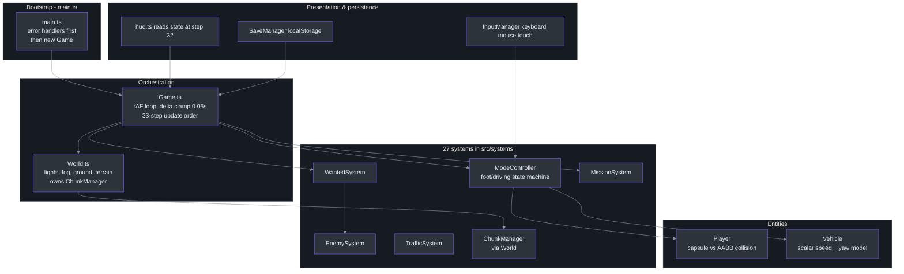
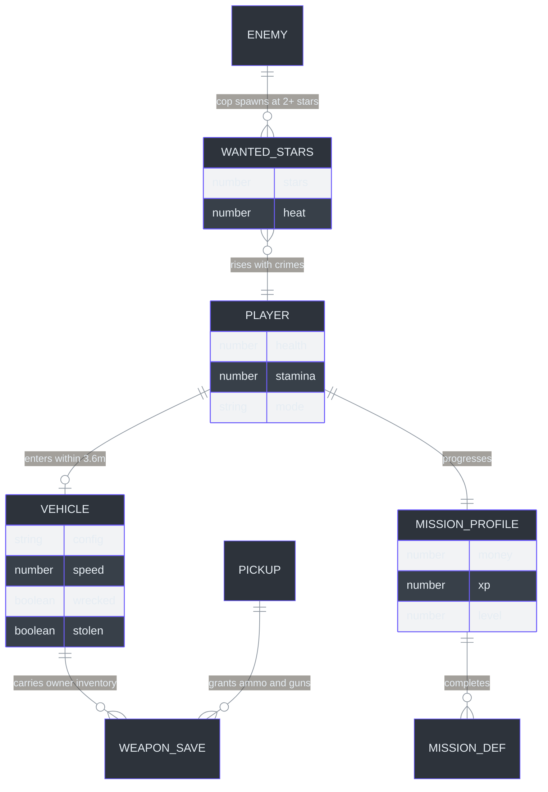
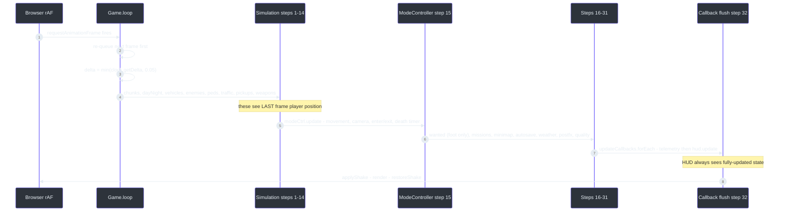
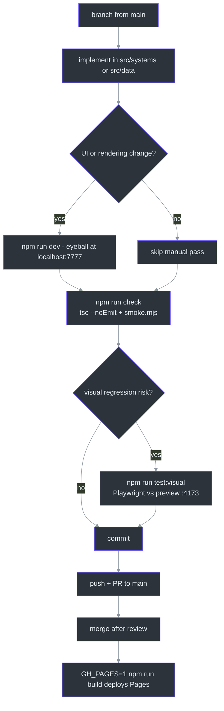

# Contributor Guide — Zero to First PR in a Three.js Codebase

This guide is progressive: Part I gives you the language/runtime foundation if you come from Python, Part II maps the codebase itself, Part III gets you to a merged PR. Everything is grounded in the file:line-verified implementation wiki under [`docs/wiki/index.md`](https://github.com/noiz354/arena-city-try/blob/main/docs/wiki/index.md).

**Repo:** [noiz354/arena-city-try](https://github.com/noiz354/arena-city-try) · **Stack:** TypeScript strict + Vite 8 + Three.js r185 · **Runtime deps:** `three` only ([`package.json:15-18`](https://github.com/noiz354/arena-city-try/blob/main/package.json#L15-L18))

---

## Part I — Foundations

### 1. TypeScript for Python Engineers

You need surprisingly little TS to contribute here. The codebase uses plain classes, no decorators, no generics beyond the occasional `Map<string, T>`.

| Concept | Python | This repo (TypeScript) |
|---|---|---|
| Class | `class Player:` | `export class Player { ... }` — [`src/entities/Player.ts:34`](https://github.com/noiz354/arena-city-try/blob/main/src/entities/Player.ts#L34) |
| Constructor | `def __init__(self, x):` | `constructor(private key = 'cityrush_save_v1') {}` — [`src/systems/SaveManager.ts:21`](https://github.com/noiz354/arena-city-try/blob/main/src/systems/SaveManager.ts#L21) |
| Fields | Declared in `__init__` | Declared at class level *with types*: `health = 100` — [`src/entities/Player.ts:35-47`](https://github.com/noiz354/arena-city-try/blob/main/src/entities/Player.ts#L35-L47) |
| Modules | `import player from './player.py'` (implicit) | Explicit ES modules; imports may carry `.ts` extensions (`allowImportingTsExtensions`) — [`tsconfig.json:9`](https://github.com/noiz354/arena-city-try/blob/main/tsconfig.json#L9) |
| Union type | Not idiomatic | `'foot' \| 'driving'` string-literal unions replace enums — [`src/systems/ModeController.ts:18`](https://github.com/noiz354/arena-city-try/blob/main/src/systems/ModeController.ts#L18) |
| Optional chaining / null | `if obj is not None:` | `window.matchMedia?.(...)` and `\| null` return types — [`src/systems/MobileControls.ts:28`](https://github.com/noiz354/arena-city-try/blob/main/src/systems/MobileControls.ts#L28) |
| Closures / lambdas | `lambda:` | Arrow functions as dependency injectors: `() => this.weather.rainAmount` — [`src/game/Game.ts:171`](https://github.com/noiz354/arena-city-try/blob/main/src/game/Game.ts#L171) |
| Package management | pip + requirements.txt / pyproject | npm + `package.json` scripts — [`package.json:6-13`](https://github.com/noiz354/arena-city-try/blob/main/package.json#L6-L13) |

**The async model difference matters most.** There are no coroutines or `await` in the game loop. A browser game is a *frame function*: the runtime calls your `loop` once per display refresh (~60×/s) via `requestAnimationFrame`, and everything must finish within that slice. Compare:

```python
# Python mindset: block until done
while running:
    dt = clock.tick(60)
    world.update(dt)
    render()
```

```ts
// Browser mindset: return immediately, get called again
private loop = (): void => {
  this.animationId = requestAnimationFrame(this.loop); // re-queue FIRST
  const delta = Math.min(this.clock.getDelta(), 0.05); // clamp hitches
  if (!this.paused) this.update(delta);
  this.input.endFrame();                                // runs even when paused
};
```
Sources: [`src/game/Game.ts:372-383`](https://github.com/noiz354/arena-city-try/blob/main/src/game/Game.ts#L372-L383)

Two consequences: (1) long-running work must be split across frames or it stalls rendering; (2) state persists across calls via class fields, not loop locals — e.g. the autosave countdown `saveTimer = 30` lives on `Game` ([`src/game/Game.ts:86`](https://github.com/noiz354/arena-city-try/blob/main/src/game/Game.ts#L86)).

**Collections & typing quick map:** Python `dict` → `Map` (`chunks: Map<string, Chunk>`, [`src/systems/ChunkManager.ts:100`](https://github.com/noiz354/arena-city-try/blob/main/src/systems/ChunkManager.ts#L100)); `set` → `Set` (`keys: Set<string>` of held codes, [`src/utils/InputManager.ts:6-19`](https://github.com/noiz354/arena-city-try/blob/main/src/utils/InputManager.ts#L6-L19)); dataclasses → `interface` (e.g. `Collidable { box: Box3 }`, [`src/game/World.ts:22-24`](https://github.com/noiz354/arena-city-try/blob/main/src/game/World.ts#L22-L24)); module-level constants → `export const`.

### 2. Three.js + Vite Essentials

Three.js is to WebGL what Pygame is to SDL — but declarative-scene-graph based instead of immediate draw calls:

| Three.js concept | Nearest Python analogy | Where used here |
|---|---|---|
| `Scene` | The screen/surface | Grafted together from `World.root` + system groups ([`src/game/Game.ts:142-145`](https://github.com/noiz354/arena-city-try/blob/main/src/game/Game.ts#L142-L145)) |
| `Mesh` = geometry + material | A sprite/image | Every building, car, human is composed of boxes/cylinders — no GLTF assets ([`docs/wiki/entities.md`](https://github.com/noiz354/arena-city-try/blob/main/docs/wiki/entities.md)) |
| `Group` | A container/pygame Group | One per chunk, per vehicle fleet, per pedestrian batch |
| `WebGLRenderer` | `pygame.display` | Created once with DPR cap 2, ACES tone mapping ([`src/game/Game.ts:122-129`](https://github.com/noiz354/arena-city-try/blob/main/src/game/Game.ts#L122-L129)) |
| EffectComposer passes | Post-processing shaders chained | RenderPass → GTAO → UnrealBloom → LUT → OutputPass ([`src/systems/PostFX.ts:40-63`](https://github.com/noiz354/arena-city-try/blob/main/src/systems/PostFX.ts#L40-L63)) |
| InstancedMesh | Blitting one sprite N times | Mid-ring chunks render as ONE draw call each ([`src/systems/ChunkManager.ts:287-304`](https://github.com/noiz354/arena-city-try/blob/main/src/systems/ChunkManager.ts#L287-L304)) |

Vite plays the role of Flask's dev server + a bundler: `npm run dev` serves TypeScript directly on port 7777 with hot reload ([`vite.config.ts:8-13`](https://github.com/noiz354/arena-city-try/blob/main/vite.config.ts#L8-L13)); production bundles go through `tsc && vite build` so a type error fails the build ([`package.json:8`](https://github.com/noiz354/arena-city-try/blob/main/package.json#L8)). Full toolchain details live in [Dev Setup & Build](../setup.md).

---

## Part II — This Codebase

### 3. What This Project Does

CITY RUSH is a third-person GTA-style sandbox that runs entirely in the browser: you walk or drive around an infinite-feeling procedurally generated city, commit crimes that raise a 6-star wanted meter, fight thugs and police, complete four mission archetypes, and persist progress locally — with day/night, rain, wet surfaces, particles, spatial audio, and mobile touch controls layered on top ([`docs/wiki/index.md`](https://github.com/noiz354/arena-city-try/blob/main/docs/wiki/index.md)).

### 4. Project Structure

```
gta-game/
├── index.html              # Shell page: #app canvas host + #ui-root overlay container
├── package.json            # All npm scripts; three ^0.185.1 is the only runtime dep
├── vite.config.ts          # Port 7777, es2022 target, GH_PAGES base-path switch
├── tsconfig.json           # strict + noUnusedLocals + noUnusedParameters (src/ only)
├── playwright.config.ts    # Visual tests auto-build + preview on :4173
├── AGENTS.md               # Contributor rules: check gate, boundaries, conventions
├── src/
│   ├── main.ts             # Boot: error handling → Game creation → HUD/telemetry wiring
│   ├── game/
│   │   ├── Game.ts         # ★ Orchestrator: owns rAF loop + exact 33-step update order
│   │   └── World.ts        # Static scene assembly: lights, fog, ground texture, terrain
│   ├── entities/           # Player.ts, Vehicle.ts — the only two entity classes
│   ├── systems/            # 27 files, one class per gameplay/render system
│   ├── ui/                 # hud.ts (per-frame read), pauseMenu.ts, style.css
│   ├── data/               # missions.ts, vehicles.ts, weapons.ts — pure data tables
│   ├── utils/              # InputManager, raycast helpers, texel snapping, logger, errors
│   └── analytics/          # tracker.ts (transport), gameTelemetry.ts (event mapping)
├── tests/                  # smoke.mjs, playtest.mjs bot, visual.spec.ts, E2E runbook
└── docs/wiki/              # ★ 31 file:line-verified implementation pages — READ FIRST
```

Architecture overview — who constructs whom and who feeds whom each frame:



<!-- Sources: docs/wiki/index.md, docs/wiki/game-loop.md (bootstrap order src/game/Game.ts:120-338), docs/wiki/utils-and-data.md -->

Key structural rules from [AGENTS.md](https://github.com/noiz354/arena-city-try/blob/main/AGENTS.md): new gameplay goes in `src/systems/<Name>System.ts`, one file per system, wired into `Game.ts`/`World.ts` following the existing update order. Changing that order is ask-first territory.

### 5. Core Concepts

**Chunk streaming & LOD.** The city is a fixed 22×22 grid of 16 m cells (484 total). Each frame converts the player position into chunk coordinates and assigns levels by Chebyshev ring distance: ≤1 → full detail, ≤2 → simple instanced shell, else hidden ([`src/systems/ChunkManager.ts:150-158`](https://github.com/noiz354/arena-city-try/blob/main/src/systems/ChunkManager.ts#L150-L158)). Chunks build **once, lazily, never tear down during play** — geometry accumulates (~1798 observed) while draw calls stay bounded because mid-ring chunks are single InstancedMeshes ([`src/systems/ChunkManager.md`](https://github.com/noiz354/arena-city-try/blob/main/docs/wiki/systems/ChunkManager.md)).

**Seeded determinism.** World layout and traffic spawn patterns use mulberry32, a tiny seeded PRNG — traffic cars roll their route from seed `0x7a11ca9` ([`src/systems/TrafficSystem.ts:57`](https://github.com/noiz354/arena-city-try/blob/main/src/systems/TrafficSystem.ts#L57)), city plots scatter deterministically per chunk ([`docs/wiki/systems/CityGenerator.md`](https://github.com/noiz354/arena-city-try/blob/main/docs/wiki/systems/CityGenerator.md)). Same seed ⇒ same city, every session.

**Hand-rolled physics.** No physics engine. Collision currency is `{ box: Box3 }` — buildings expose axis-aligned boxes from build time; the player is a virtual capsule (radius 0.45, half-height 0.95) resolved against them by closest-point push-out ([`src/entities/Player.ts:214-242`](https://github.com/noiz354/arena-city-try/blob/main/src/entities/Player.ts#L214-L242)); vehicles use conservative rotated-extent AABBs ([`src/entities/Vehicle.ts:250-283`](https://github.com/noiz354/arena-city-try/blob/main/src/entities/Vehicle.ts#L250-L283)). Bullets are hitscan rays ([`src/utils/raycast.ts:9-91`](https://github.com/noiz354/arena-city-try/blob/main/src/utils/raycast.ts#L9-L91)), enemy vision is a raycast LOS test.

**Mode state machine.** Exactly two modes, `'foot' | 'driving'`. E enters the nearest car within 3.6 m (parked wins ties over traffic), sets `occupied/stolen` flags, hides the player group; E exits placing the player left of the car ([`src/systems/ModeController.ts:175-200`](https://github.com/noiz354/arena-city-try/blob/main/src/systems/ModeController.ts#L175-L200)).

Core domain model:



<!-- Sources: docs/wiki/entities.md, docs/wiki/systems/MissionSystem.md (Profile src/systems/MissionSystem.ts:47), docs/wiki/systems/WantedSystem.md, docs/wiki/systems/WeaponSystem.md -->

**Data-driven content.** Missions, vehicles, and weapons are plain tables in `src/data/`. Adding a mission is appending a `MissionDef` ([`src/data/missions.ts:27`](https://github.com/noiz354/arena-city-try/blob/main/src/data/missions.ts#L27)); adding a weapon is adding a key to `WEAPONS` — switching, pickups, and saves pick it up automatically via `WEAPON_LIST` ([`src/data/weapons.ts:94`](https://github.com/noiz354/arena-city-try/blob/main/src/data/weapons.ts#L94)). Caveat: vehicle consumers index `VEHICLE_CONFIGS` **by position**, so order matters there ([`src/data/vehicles.ts:88-93`](https://github.com/noiz354/arena-city-try/blob/main/src/data/vehicles.ts#L88-L93)).

### 6. Frame Lifecycle (the "request")

There is no HTTP request pipeline; the equivalent end-to-end trace is one animation frame. Learn this order and you can predict any cross-system behavior:



<!-- Sources: docs/wiki/game-loop.md (per-frame order table, src/game/Game.ts:385-467) -->

Ordering facts worth memorizing: enemies/pedestrians/traffic/weapons all react to the *previous* frame's player position because the player updates at step 15 ([`src/game/Game.ts:397-412`](https://github.com/noiz354/arena-city-try/blob/main/src/game/Game.ts#L397-L412) vs [`src/game/Game.ts:415`](https://github.com/noiz354/arena-city-try/blob/main/src/game/Game.ts#L415)); Escape-pause skips both update *and* render, but `input.endFrame()` still runs so stale clicks don't fire after resume ([`src/game/Game.ts:380-382`](https://github.com/noiz354/arena-city-try/blob/main/src/game/Game.ts#L380-L382)).

### 7. Key Patterns — "If You Want to Add X"

**Add a system.** Follow the WetSurface recipe: construct it in `Game`'s constructor in dependency order, take what you need as constructor args or closures, add exactly one `this.<sys>.update(delta, …)` line at the correct slot in `Game.update`, dispose it in `destroy()` ([`docs/wiki/game-loop.md`](https://github.com/noiz354/arena-city-try/blob/main/docs/wiki/game-loop.md) § Tuning). Slot choice: before step 15 if you should see last-frame player state, after if you need current-frame.

**Add content without touching systems.** New mission → row in `MISSIONS`; new weapon → key in `WEAPONS`; new vehicle archetype → row in `VEHICLE_CONFIGS` ([`docs/wiki/utils-and-data.md`](https://github.com/noiz354/arena-city-try/blob/main/docs/wiki/utils-and-data.md) § Tuning).

**Wire optional behavior via hooks, not inheritance.** Mission start/completion side effects are injected callbacks: start → toast + telemetry; complete → jingle/toast/save ([`src/game/Game.ts:207-223`](https://github.com/noiz354/arena-city-try/blob/main/src/game/Game.ts#L207-L223)). Weapon kill effects likewise ride `onKill` ([`src/game/Game.ts:238-275`](https://github.com/noiz354/arena-city-try/blob/main/src/game/Game.ts#L238-L275)).

**Inject dependencies as closures for late binding.** `WetSurfaceSystem(world.groundMaterial, () => this.weather.rainAmount)` keeps weather unaware of ground response ([`docs/wiki/systems/WetSurfaceSystem.md`](https://github.com/noiz354/arena-city-try/blob/main/docs/wiki/systems/WetSurfaceSystem.md)).

**Zero-allocation hot loops.** Entities keep scratch vectors as fields and reuse them per frame ([`src/entities/Player.ts:69`](https://github.com/noiz354/arena-city-try/blob/main/src/entities/Player.ts#L69)); marker updates copy positions onto existing meshes instead of rebuilding ([`docs/wiki/systems/MissionSystem.md`](https://github.com/noiz354/arena-city-try/blob/main/docs/wiki/systems/MissionSystem.md) § marker diffing). Copy this habit for anything running 60×/s.

**Frame-rate independence.** Use exponential damping `k = 1 − e^(−rate·dt)` for smoothing (player inertia λ=10, body roll λ=10, shake decay λ=2.2) rather than raw multipliers ([`docs/wiki/entities.md`](https://github.com/noiz354/arena-city-try/blob/main/docs/wiki/entities.md)).

---

## Part III — Getting Productive

### 8. Prerequisites & Setup

| Tool | Version | Install | Notes |
|---|---|---|---|
| Node.js + npm | Recent enough for Vite 8 | [nodejs.org](https://nodejs.org) | Only real prerequisite |
| Playwright browsers | bundled by `@playwright/test ^1.62.1` | `npx playwright install --with-deps chromium` | Only for visual/E2E tests ([`playwright.config.ts:4-6`](https://github.com/noiz354/arena-city-try/blob/main/playwright.config.ts#L4-L6)) |

Step-by-step with expected results:

```sh
git clone https://github.com/noiz354/arena-city-try.git
cd arena-city-try
npm install          # creates node_modules; expect ~1 min, zero peer warnings
npm run dev          # → "Local: http://localhost:7777/"  (LAN-exposed via --host 0.0.0.0)
# open http://localhost:7777 — loading overlay fades, city renders, WASD moves
npm run typecheck    # tsc --noEmit → exits 0 silently when clean
npm test             # tsx tests/smoke.mjs → smoke assertions pass headlessly
```

Commands are verbatim from [`package.json:6-13`](https://github.com/noiz354/arena-city-try/blob/main/package.json#L6-L13). Troubleshooting the server: port 7777 is fixed and `allowedHosts: true` exists for sandbox previews ([`vite.config.ts:8-13`](https://github.com/noiz354/arena-city-try/blob/main/vite.config.ts#L8-L13)); GitHub Pages builds need `GH_PAGES=1` so the base path becomes `/arena-city-try/` ([`vite.config.ts:6`](https://github.com/noiz354/arena-city-try/blob/main/vite.config.ts#L6)).

### 9. Your First Task — Add a Fifth Weapon

A complete vertical slice touching only data + verification (the safest first PR):

1. Open [`src/data/weapons.ts`](https://github.com/noiz354/arena-city-try/blob/main/src/data/weapons.ts) and add a `dmr` key to `WEAPONS` modeled on `rifle` (damage 45, magSize 10, fireRate 0.55, range 200).
2. Nothing else *must* change: Digit-switching loops `WEAPON_LIST` ([`src/systems/ModeController.ts:93-94`](https://github.com/noiz354/arena-city-try/blob/main/src/systems/ModeController.ts#L93-L94)), save-state clamping validates ids against `WEAPONS` ([`src/systems/WeaponSystem.ts:115-149`](https://github.com/noiz354/arena-city-try/blob/main/src/systems/WeaponSystem.ts#L115-L149)), and pickup naming uses id lookups.
3. To make it obtainable in-session, add a pickup: extend the initial-spawn list pattern at [`src/game/Game.ts:611-617`](https://github.com/noiz354/arena-city-try/blob/main/src/game/Game.ts#L611-L617) with `spawnInitialPickups`-style coordinates.
4. Verify: `npm run check` (typecheck + smoke). Then playtest manually — press 1–4 to confirm the new slot appears in the switch loop, shoot once to hear the shot and see tracers.
5. Read [AGENTS.md](https://github.com/noiz354/arena-city-try/blob/main/AGENTS.md) before committing: `npm run check` must pass; don't touch tuning constants without asking (weapon stats are documented in `docs/wiki/`).

Stretch variant (touches a system): add a `heal(amount)` call site — `Player.heal()` currently has **zero callers**, which is a known finding ([`src/entities/Player.ts:118`](https://github.com/noiz354/arena-city-try/blob/main/src/entities/Player.ts#L118), [`docs/wiki/entities.md`](https://github.com/noiz354/arena-city-try/blob/main/docs/wiki/entities.md) § Unresolved). Wiring it to a health pickup is a genuinely useful second PR.

### 10. Development Workflow

Branching is trunk-based on `main` (33-commit history shows direct pushes plus one merge via PR #2 — see [changelog](../../changelog.md)). Conventions from AGENTS.md and the codebase:

- Commit gate: **`npm run check` must pass** (typecheck + smoke) before every commit.
- Naming: PascalCase classes/files for systems (`WantedSystem.ts`), camelCase utility modules (`logger.ts`).
- Comments are sparse section markers only (`// --- global error handling FIRST ---`).
- Never break the public `window.game` debug API; never modify `dist/`, `test-results/`, `node_modules/`.
- Ask-first list: new dependencies (only `three` runs at runtime), changing the per-frame update order, tuning documented constants, changing the GH_PAGES base path.



<!-- Sources: AGENTS.md, package.json:6-13, wiki/changelog.md, playwright.config.ts:19-24 -->

### 11. Running Tests

| Scope | Command | What happens |
|---|---|---|
| Typecheck only | `npm run typecheck` | `tsc --noEmit` across `src/` ([`tsconfig.json:19`](https://github.com/noiz354/arena-city-try/blob/main/tsconfig.json#L19) limits scope to src) |
| Smoke suite | `npm test` | Headless assertions via `tsx tests/smoke.mjs` |
| Pre-commit gate | `npm run check` | Both of the above in sequence ([`package.json:12`](https://github.com/noiz354/arena-city-try/blob/main/package.json#L12)) |
| Single visual spec | `npx playwright test tests/visual.spec.ts` | Auto-builds, serves preview on :4173, Chromium 1280×720, 90 s timeout ([`playwright.config.ts:7-24`](https://github.com/noiz354/arena-city-try/blob/main/playwright.config.ts#L7-L24)) |
| Automated playthrough | `node tests/playtest.mjs` | QA bot exercising gameplay entry points (see [changelog](../../changelog.md)) |
| Interactive QA | DevTools console on the running game | `window.game.*` hooks — see [Quick Reference](../quick-reference.md) |

There is no coverage tool configured — the philosophy is smoke + visual + bot playtests guarding a small surface, not percentage coverage. If you add nontrivial logic to utils (pure math like [`src/utils/texel.ts`](https://github.com/noiz354/arena-city-try/blob/main/src/utils/texel.ts)), prefer keeping it pure-function so it stays headlessly testable like its neighbors.

### 12. Debugging Guide

| Symptom | Likely cause | Fix / investigation |
|---|---|---|
| Stuck on loading overlay forever | `game.start()` never ran or constructor threw | Check console for `boot_failed` tracking; boot failure renders a full-screen error div with Reload ([`src/main.ts:29-45`](https://github.com/noiz354/arena-city-try/blob/main/src/main.ts#L29-L45)) |
| Red error card bottom-right | Global handler caught an error/rejection (DEV-only overlay) | Stack truncated to 800 chars in the card; full detail in console ([`src/utils/errors.ts:83-101`](https://github.com/noiz354/arena-city-try/blob/main/src/utils/errors.ts#L83-L101)) |
| "Graphics context lost" overlay | WebGL context loss | Intentional handled path — Reload button reloads the page ([`src/utils/errors.ts:64-74`](https://github.com/noiz354/arena-city-try/blob/main/src/utils/errors.ts#L64-L74)) |
| Game looks wrong after tab-back hitch | Delta clamp caps sim at 20 Hz under lag | Expected: `delta = min(getDelta(), 0.05)` ([`src/game/Game.ts:376`](https://github.com/noiz354/arena-city-try/blob/main/src/game/Game.ts#L376)) |
| Shadows "swim" while moving | Would happen without texel snapping — verify your change didn't bypass `World.updateSun` | Snap logic in [`src/game/World.ts:101-118`](https://github.com/noiz354/arena-city-try/blob/main/src/game/World.ts#L101-L118), helpers in [`src/utils/texel.ts`](https://github.com/noiz354/arena-city-try/blob/main/src/utils/texel.ts) |
| Cars clip through each other / through you | Traffic probe is a single point 7 m ahead — long trucks can overlap first | Known limitation, [`docs/wiki/systems/TrafficSystem.md`](https://github.com/noiz354/arena-city-try/blob/main/docs/wiki/systems/TrafficSystem.md) § Unresolved |
| Wanted stars frozen mid-chase | Wanted update is foot-mode-gated | By design ([`src/game/Game.ts:416`](https://github.com/noiz354/arena-city-try/blob/main/src/game/Game.ts#L416)) |
| Can't abandon a mission | `abort()` exists but has zero call sites | Soft-lock requires page reload — known finding ([`docs/wiki/systems/MissionSystem.md`](https://github.com/noiz354/arena-city-try/blob/main/docs/wiki/systems/MissionSystem.md) § Unresolved) |
| Ripples flash identically in rain | Shared ripple material makes per-mesh opacity writes ineffective | Known bug, [`docs/wiki/systems/WetSurfaceSystem.md`](https://github.com/noiz354/arena-city-try/blob/main/docs/wiki/systems/WetSurfaceSystem.md) § Unresolved |
| Save ignored / reset | Corrupt JSON or non-string `profile` → load returns null silently | Inspect `localStorage['cityrush_save_v1']` ([`src/systems/SaveManager.ts:32-42`](https://github.com/noiz354/arena-city-try/blob/main/src/systems/SaveManager.ts#L32-L42)) |

Live-inspection toolbox: `window.game` exposes the whole Game instance and `window.tracker` the analytics transport ([`src/main.ts:78-79`](https://github.com/noiz354/arena-city-try/blob/main/src/main.ts#L78-L79)); F3 toggles a collider wireframe overlay rebuilt every 0.25 s ([`docs/wiki/systems/ColliderDebug.md`](https://github.com/noiz354/arena-city-try/blob/main/docs/wiki/systems/ColliderDebug.md)).

### 13. Common Pitfalls

1. **Reading `renderer.render` output while paused** — nothing draws while paused, including your new UI, because update *and* render are skipped ([`src/game/Game.ts:380`](https://github.com/noiz354/arena-city-try/blob/main/src/game/Game.ts#L380)). Test visuals unpaused.
2. **Forgetting `input.endFrame()` semantics** — edge-triggered presses clear once per frame; poll them from systems inside `Game.update`, never from event handlers.
3. **Indexing `VEHICLE_CONFIGS` assuming stable positions** — consumers read configs positionally ([`src/data/vehicles.ts:88-93`](https://github.com/noiz354/arena-city-try/blob/main/src/data/vehicles.ts#L88-L93)); inserting a row reshuffles spawned fleets.
4. **Assuming stars decay while driving** — they freeze; cops also stop spawning ([`docs/wiki/systems/WantedSystem.md`](https://github.com/noiz354/arena-city-try/blob/main/docs/wiki/systems/WantedSystem.md)).
5. **Trusting docstrings over code** — several comments promise more than implemented (ColorGrade "S-curve" is linear contrast, [`docs/wiki/systems/ColorGrade.md`](https://github.com/noiz354/arena-city-try/blob/main/docs/wiki/systems/ColorGrade.md) § Unresolved). The implementation wiki's *Unresolved* sections are the source of truth for such gaps.
6. **Allocating in per-frame code** — GC spikes show up as frame drops; reuse scratch objects like the rest of the codebase.
7. **Adding a system but forgetting `destroy()` disposal** — GPU resources leak if `Game` is ever recreated in-page (PostFX already has this latent issue: [`docs/wiki/game-loop.md`](https://github.com/noiz354/arena-city-try/blob/main/docs/wiki/game-loop.md) § Unresolved).
8. **Editing generated-looking files in `docs/wiki/`** — they carry verified file:line citations; if you move/rename cited files, update the citations ([AGENTS.md](https://github.com/noiz354/arena-city-try/blob/main/AGENTS.md)).
9. **Committing with failing typecheck** — strict + `noUnusedLocals` means an unused variable fails CI. Delete it, don't underscore it.

---

## Appendices

### Appendix A — Glossary (40+ terms)

| Term | Meaning here |
|---|---|
| AABB | Axis-aligned bounding box; the universal collision volume (`Collidable { box: Box3 }`, [`src/game/World.ts:22-24`](https://github.com/noiz354/arena-city-try/blob/main/src/game/World.ts#L22-L24)) |
| Autosave | Timed save every 30 s of sim time ([`src/game/Game.ts:429-433`](https://github.com/noiz354/arena-city-try/blob/main/src/game/Game.ts#L429-L433)) |
| Bloom | UnrealBloomPass glow effect in the composer chain |
| Bob | Viewmodel sway driven by move speed ([`src/game/Game.ts:442-443`](https://github.com/noiz354/arena-city-try/blob/main/src/game/Game.ts#L442-L443)) |
| Capsule | Player's virtual collision shape: radius 0.45, half-height 0.95 |
| Chase radius | Enemy aggro distance 34 m; lose target beyond 55 m ([`docs/wiki/systems/EnemySystem.md`](https://github.com/noiz354/arena-city-try/blob/main/docs/wiki/systems/EnemySystem.md)) |
| Chebyshev distance | Ring metric `max(|Δcx|,|Δcz|)` used for LOD rings |
| Chunk | One 16 m cell of the streamed city grid (484 total) |
| Collidable | Anything exposing `.box` for collision/raycast queries |
| Composer | EffectComposer: chained post-processing passes |
| COP cadence | One cop spawns every 6 s while ≥2 stars ([`docs/wiki/systems/WantedSystem.md`](https://github.com/noiz354/arena-city-try/blob/main/docs/wiki/systems/WantedSystem.md)) |
| Culling | Hiding groups far from the player (traffic >100 m, parked >95 m) |
| Damage scale | Impact damage `(speed − 5) × 4.5` hp for vehicles |
| Dark-safe diagram | Mermaid styled for dark theme (convention in this wiki) |
| Delta time | Seconds since last frame, clamped to 0.05 s |
| Determinism | Same seed ⇒ same world (mulberry32) |
| DPR | Device pixel ratio, capped at 2 ([`src/game/Game.ts:122-129`](https://github.com/noiz354/arena-city-try/blob/main/src/game/Game.ts#L122-L129)) |
| Draw call | One GPU submission; minimized via InstancedMesh |
| Edge-triggered input | `wasPressed` true only on the frame a key went down |
| EffectComposer pass | One stage of screen-space post-processing |
| Entity | `Player` or `Vehicle` — the only two classes |
| Exponential damp | Frame-rate-independent smoothing `k = 1 − e^(−λ·dt)` |
| FPS report | Telemetry sample every 10 s ([`src/analytics/gameTelemetry.ts:84-95`](https://github.com/noiz354/arena-city-try/blob/main/src/analytics/gameTelemetry.ts#L84-L95)) |
| GTAO | Ground-truth ambient occlusion pass |
| Hitscan | Instant ray-based shooting (no projectile travel) |
| Heat | Gunfire accumulator; 3 points near cops = 1 star |
| InstancedMesh | One geometry drawn many times in a single call |
| LOD ring | Level-of-detail band: ≤1 full detail, ≤2 simple, else hidden |
| LOS | Line-of-sight raycast used by enemy vision |
| LUT | Color look-up texture (33³ grade applied via LUTPass) |
| Mode | `'foot' \| 'driving'` player state ([`src/systems/ModeController.ts:18`](https://github.com/noiz354/arena-city-try/blob/main/src/systems/ModeController.ts#L18)) |
| Muzzle flash | Brief viewmodel light/mesh on fire ([`docs/wiki/systems/WeaponView.md`](https://github.com/noiz354/arena-city-try/blob/main/docs/wiki/systems/WeaponView.md)) |
| Mulberry32 | Tiny seeded PRNG behind world/traffic generation |
| Pickup | Collectible gun/ammo within 1.9 m radius |
| Respawn | Death → 3 s timer → restore at origin with full HP ([`docs/wiki/entities.md`](https://github.com/noiz354/arena-city-try/blob/main/docs/wiki/entities.md)) |
| RoughnessMap | Texture modulating surface gloss (wet puddles) |
| Seed | Fixed RNG starting value (`0x7a11ca9` for traffic) |
| SendBeacon | Fire-and-forget analytics flush on page hide |
| Smoke test | Fast headless sanity suite (`tests/smoke.mjs`) |
| Smoothstep | S-curve remap used for wetness bands |
| Spatial hash | Per-chunk-cell bucketing of collidables for cheap proximity queries |
| Spawn ring | Cop placement annulus 50–80 m around player |
| Step-up reach | 0.4 m window letting players climb low ledges/roofs |
| Strict mode | Full TypeScript checking incl. unused-symbol rejection |
| Telemetry | Privacy-friendly local-first event batching ([`src/analytics/tracker.ts`](https://github.com/noiz354/arena-city-try/blob/main/src/analytics/tracker.ts)) |
| Texel snapping | Shadow frustum snapped to texel grid to stop swim |
| Tone mapping | ACES filmic HDR→SDR conversion, exposure 1.1 |
| Virtual key | Touch-injected key code mirroring physical keys 1:1 |
| Wanted stars | 0–6 crime meter ([`docs/wiki/systems/WantedSystem.md`](https://github.com/noiz354/arena-city-try/blob/main/docs/wiki/systems/WantedSystem.md)) |
| Waypoint | Active mission goal marker within 6 m completion radius |
| Wrecked | Vehicle state at 0 HP: crawl ×0.25, explosion, smoke |

### Appendix B — Key File Reference

| Path | Purpose | Why It Matters | Source |
|---|---|---|---|
| `src/main.ts` | Boot sequence, global error handling, HUD/telemetry wiring, `window.game` exposure | First thing that runs; boot failures tracked here | [`src/main.ts:29-79`](https://github.com/noiz354/arena-city-try/blob/main/src/main.ts#L29-L79) |
| `src/game/Game.ts` | Orchestrator: renderer, loop, 33-step update order, ~25 subsystem fields | The spine of the app — every wiring question ends here | [`src/game/Game.ts:51-100`](https://github.com/noiz354/arena-city-try/blob/main/src/game/Game.ts#L51-L100) |
| `src/game/World.ts` | Scene assembly: lights, fog, ground texture bake, outer terrain, ChunkManager ownership | Owns lighting tiers and shadow stability | [`src/game/World.ts:38-52`](https://github.com/noiz354/arena-city-try/blob/main/src/game/World.ts#L38-L52) |
| `src/entities/Player.ts` | On-foot controller: movement, jump, stamina, damage, respawn | All physics constants live at top of file | [`src/entities/Player.ts:14-27`](https://github.com/noiz354/arena-city-try/blob/main/src/entities/Player.ts#L14-L27) |
| `src/entities/Vehicle.ts` | Scalar-speed car model, enter/exit flags, impact damage | Shared by player driving AND AI traffic | [`src/entities/Vehicle.ts:29-96`](https://github.com/noiz354/arena-city-try/blob/main/src/entities/Vehicle.ts#L29-L96) |
| `src/systems/ModeController.ts` | Foot↔driving state machine, E-key interactions, death timer | Extracted from Game ("A-1 refactor") — where player verbs live | [`src/systems/ModeController.ts:49`](https://github.com/noiz354/arena-city-try/blob/main/src/systems/ModeController.ts#L49) |
| `src/systems/ChunkManager.ts` | Chunk streaming, LOD, collidables + spatial hash | Explains memory/draw-call budget of the whole city | [`src/systems/ChunkManager.ts:98-103`](https://github.com/noiz354/arena-city-try/blob/main/src/systems/ChunkManager.ts#L98-L103) |
| `src/systems/WantedSystem.ts` | Star math, decay timers, cop spawning | Crime escalation rules incl. quirks | [`src/systems/WantedSystem.ts:19`](https://github.com/noiz354/arena-city-try/blob/main/src/systems/WantedSystem.ts#L19) |
| `src/systems/MissionSystem.ts` | Mission graph, markers, XP profile | Content progression core; serialize/deserialize for saves | [`src/systems/MissionSystem.ts:44`](https://github.com/noiz354/arena-city-try/blob/main/src/systems/MissionSystem.ts#L44) |
| `src/systems/PostFX.ts` | Composer chain construction, exposure/shake APIs | Rendering cost center; toggle + resize paths | [`src/systems/PostFX.ts:26`](https://github.com/noiz354/arena-city-try/blob/main/src/systems/PostFX.ts#L26) |
| `src/ui/hud.ts` | Per-frame HUD read of player/vehicle/mode state | Runs last (step 32) so always consistent | [`src/ui/hud.ts:91-131`](https://github.com/noiz354/arena-city-try/blob/main/src/ui/hud.ts#L91-L131) |
| `src/utils/InputManager.ts` | Keyboard+mouse state, virtual-key API for touch | Every control rebinding touches this | [`src/utils/InputManager.ts:5`](https://github.com/noiz354/arena-city-try/blob/main/src/utils/InputManager.ts#L5) |
| `src/data/missions.ts` | All mission definitions + shared radii | Add content here without touching systems | [`src/data/missions.ts:27-84`](https://github.com/noiz354/arena-city-try/blob/main/src/data/missions.ts#L27-L84) |
| `src/analytics/tracker.ts` | Batched, local-first telemetry transport | Endpoint env-gated; local-only when unset | [`src/analytics/tracker.ts:34`](https://github.com/noiz354/arena-city-try/blob/main/src/analytics/tracker.ts#L34) |
| `tests/smoke.mjs` | Headless smoke suite | Half of the pre-commit gate | [`package.json:12`](https://github.com/noiz354/arena-city-try/blob/main/package.json#L12) |
| `AGENTS.md` | Contributor contract: gates, boundaries, conventions | Read before first commit | [AGENTS.md](https://github.com/noiz354/arena-city-try/blob/main/AGENTS.md) |

### Appendix C — Quick Reference Card

```text
SETUP      npm install && npm run dev     → http://localhost:7777
GATE       npm run check                  → typecheck + smoke (pre-commit)
BUILD      npm run build                  → dist/ (GH_PAGES=1 for Pages base)
VISUAL     npm run test:visual            → Playwright vs :4173
BOT        node tests/playtest.mjs        → automated playthrough

CONSOLE    window.game                    → whole Game instance
           window.tracker                 → analytics transport
           window.game.colliderDebug.toggle()
           window.game.wanted.reportCrime(3, {x:0, z:0})
KEYS       WASD move · Shift sprint · Space jump · E enter/exit/interact
           1-4 weapons · R reload · Esc pause · F3 colliders · M mute
```

Debug-hook details: [Quick Reference](../quick-reference.md). Binding sources: [`docs/wiki/utils-and-data.md`](https://github.com/noiz354/arena-city-try/blob/main/docs/wiki/utils-and-data.md).

---

## Related Pages

| Page | Relationship |
|------|-------------|
| [Onboarding Hub](./index.md) | Other role guides |
| [Staff Engineer Guide](./staff-engineer-guide.md) | The architectural "why" behind what you just saw |
| [Project Overview](../overview.md) | Layer-by-layer architecture tour |
| [Running & Playing](../usage.md) | Player-facing controls in depth |
