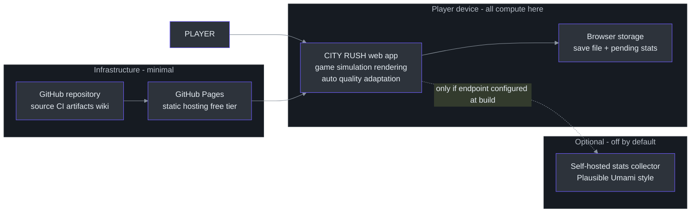
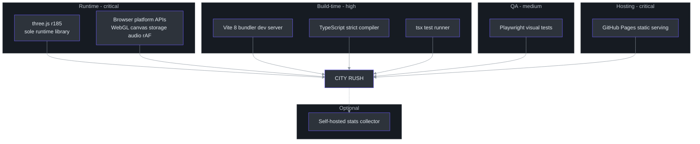

# Executive Guide — Capability, Risk & Investment View

Audience: VP/director-level engineering leadership. This page deliberately contains no code; every claim is backed by the file:line-verified implementation wiki ([`docs/wiki/index.md`](https://github.com/noiz354/arena-city-try/blob/main/docs/wiki/index.md)) or the [changelog](../../changelog.md).

## 1. System Overview

CITY RUSH is a browser-based, open-world action game in the GTA mold: players explore a procedurally generated city on foot or by car, commit crimes that escalate a police response, complete missions for money and levels, and keep their progress between sessions — all without any server. Business value today is threefold: it is a **working vertical slice** proving this team/toolchain can ship a complex interactive product end-to-end (world streaming, AI, combat, UI, persistence, mobile support) in an extremely short build-out; it is a **zero-infrastructure product** (static hosting only); and it is a **reusable engine baseline** for future browser-game projects.

## 2. Capability Map

| Capability | Status | Maturity | Dependencies |
|---|---|---|---|
| Open-world city exploration with streaming detail levels | Built | High — verified geometry/draw-call budgets ([`docs/wiki/systems/ChunkManager.md`](https://github.com/noiz354/arena-city-try/blob/main/docs/wiki/systems/ChunkManager.md)) | None beyond Three.js |
| Driving: enter/exit any car, 4 vehicle archetypes, damage/wreck states | Built | Medium-high — physics model documented and sanity-checked ([`docs/wiki/entities.md`](https://github.com/noiz354/arena-city-try/blob/main/docs/wiki/entities.md)) | Collision primitives (in-house) |
| AI traffic (10-car pool) + pedestrians with panic behavior | Built, quirky | Medium — documented turn-selection quirk means AI cars never turn right ([`docs/wiki/systems/TrafficSystem.md`](https://github.com/noiz354/arena-city-try/blob/main/docs/wiki/systems/TrafficSystem.md)) | Road-grid data (in-house) |
| Combat: 4 weapons, hitscan shooting, enemy melee AI | Built | Medium — tuned constants cross-checked against runtime observations ([`docs/wiki/utils-and-data.md`](https://github.com/noiz354/arena-city-try/blob/main/docs/wiki/utils-and-data.md)) | Raycast helpers (in-house) |
| Wanted/police system (6 stars, decay, cop spawning) | Built, quirky | Medium — star math has one counter-intuitive case ([`docs/wiki/systems/WantedSystem.md`](https://github.com/noiz354/arena-city-try/blob/main/docs/wiki/systems/WantedSystem.md)) | Enemy system |
| Missions: delivery / race / assassination / chase + XP/levels/money | Built, thin | Medium-low — only 1 mission per type; no way to fail or abandon one ([`docs/wiki/systems/MissionSystem.md`](https://github.com/noiz354/arena-city-try/blob/main/docs/wiki/systems/MissionSystem.md)) | Data tables |
| Save/load (auto-save every 30 s) | Built | Medium-high — defensive loading, corruption tolerated ([`docs/wiki/systems/SaveManager.md`](https://github.com/noiz354/arena-city-try/blob/main/docs/wiki/systems/SaveManager.md)) | Browser storage |
| Day/night cycle, weather, wet surfaces, particles, spatial audio | Built | Medium — one known visual bug in rain effects ([`docs/wiki/index.md`](https://github.com/noiz354/arena-city-try/blob/main/docs/wiki/index.md)) | PostFX chain |
| Mobile touch controls | Built | Medium — virtual inputs mirror keyboard 1:1 ([`docs/wiki/systems/MobileControls.md`](https://github.com/noiz354/arena-city-try/blob/main/docs/wiki/systems/MobileControls.md)) | Input layer |
| Automatic graphics quality scaling | Built | High — hysteresis-gated FPS-driven tiers ([`docs/wiki/systems/AutoQuality.md`](https://github.com/noiz354/arena-city-try/blob/main/docs/wiki/systems/AutoQuality.md)) | Renderer access |
| Anonymous play-statistics pipeline | Built, dormant | Medium — transport complete; disabled unless a destination is configured at packaging time ([`src/analytics/tracker.ts:110`](https://github.com/noiz354/arena-city-try/blob/main/src/analytics/tracker.ts#L110)) | Optional self-hosted collector |
| Multiplayer, accounts, cloud saves, content pipeline/tooling for artists | Not built | — | Out of current scope |

## 3. Architecture at a Glance

One deployment unit: a static web bundle served from GitHub Pages. All computation happens on the player's device; the only optional external integration is a self-hosted analytics collector.

<!-- Sources: docs/wiki/index.md overview, src/analytics/tracker.ts:110 local-only mode, AGENTS.md GH_PAGES notes -->

Team boundary note: there are no services to split across teams. The natural seam for parallel work is the 27 single-file systems behind one fixed per-frame order ([`docs/wiki/game-loop.md`](https://github.com/noiz354/arena-city-try/blob/main/docs/wiki/game-loop.md)) — content/data work (missions, vehicles, weapons tables) can proceed independently of engine work.

## 4. Team Topology

| Component | Owner | Criticality | Bus Factor |
|---|---|---|---|
| Entire codebase (engine + gameplay + tooling) | Single maintainer (repo history: 33 commits in one day, one PR merge) | Critical | **1** |
| Implementation wiki (`docs/wiki/`, 31 pages) | Same maintainer, generated via agent-assisted analysis | High — it is the authoritative map of the code | 1 |
| QA assets (playtest bot, visual spec, E2E runbook, scorecard) | Same maintainer | Medium | 1 |
| Analytics collector (if stood up) | Unowned — endpoint not yet configured | Low until enabled | n/a |

The single-day, 33-commit history recorded honestly in the [changelog](../../changelog.md) is itself a risk signal: velocity was exceptional, but knowledge is concentrated in one head (augmented by heavy agent-tooling use — 12 imported skill collections and audit reports are visible in history). Any staffing disruption currently equals project pause.

## 5. Technology Investment Thesis

| Technology | Purpose | Alternatives Considered (implicit/explicit in history) | Risk Level |
|---|---|---|---|
| Three.js r185 (only runtime dependency) | WebGL scene graph/rendering | Unity/Unreal web exports; Babylon.js; raw WebGL. Chosen stack gives instant-load browser distribution, no plugin/store gate, tiny bundle, full control | Low — mature library, pinned major, huge ecosystem |
| TypeScript strict mode | Correctness at zero runtime cost | Plain JS. Strict + unused-symbol rejection acts as the linter; type errors fail builds | Low |
| Vite 8 | Dev server + bundler | Webpack/rollup configs. Chosen for DX speed and one-line deploy switches | Low |
| Hand-rolled physics (no engine) | Capsule/AABB collision, hitscan | cannon-es/Rapier. City is boxes; determinism and bundle size favored in-house code | Medium — correct so far, but edge cases are ours alone (documented truck-probe gap) |
| localStorage persistence (no backend) | Progress saves | IndexedDB, server accounts/cloud saves. Deliberately dumb single-key store; corruption degrades gracefully | Low-Medium — quota/private-mode handled; schema migration strategy still just "bump key suffix" |
| Client-side anonymous telemetry batcher | Product analytics | Third-party SDKs, server events. Privacy-first posture: no cookies/scripts; sends nothing unless a destination exists ([`src/analytics/tracker.ts:110`](https://github.com/noiz354/arena-city-try/blob/main/src/analytics/tracker.ts#L110)) | Low technical / Medium product (no data flowing yet ⇒ decisions currently unmeasured) |

Thesis in one line: maximize iteration speed and portability while keeping marginal operating cost at zero; accept client-hardware variance as the main performance frontier (mitigated by automatic quality tiers).

## 6. Risk Assessment

| Risk | Likelihood | Impact | Mitigation (current/planned) | Owner |
|---|---|---|---|---|
| Bus factor 1 — single maintainer holds all context | Certain if disrupted | High (project stalls) | Exceptional documentation density (31 verified wiki pages + catalogue) lowers re-onboarding cost; no second contributor yet | Eng lead |
| Project youth — entire history is one day; unproven under maintenance | Certain | Medium-High | Audit culture already visible: external QA round found 5 bugs → 16-bug sweep landed same day; debt is tracked, not hidden ([changelog](../../changelog.md), [`docs/wiki/index.md`](https://github.com/noiz354/arena-city-try/blob/main/docs/wiki/index.md)) | Eng lead |
| Gameplay polish gaps shipped in prod (police star math surprise; traffic never turns right; no health regeneration path; rain-effect visual bug) — six verified findings catalogued in [`docs/wiki/index.md`](https://github.com/noiz354/arena-city-try/blob/main/docs/wiki/index.md) | High (they are live) | Medium (quality perception, retention) | Each is small, localized, and precisely cited — cheap fixes; none corrupt data | Eng lead |
| Mission soft-lock: players cannot abandon/fail a mission | Medium (edge triggers exist) | Medium-High (progression halts until reload → churn) | Known and cited; fix is wiring an existing-but-unconnected abort capability ([`docs/wiki/systems/MissionSystem.md`](https://github.com/noiz354/arena-city-try/blob/main/docs/wiki/systems/MissionSystem.md)) | Eng lead |
| Device-performance variance (browser clients) | Medium | Medium | Auto-quality tiers adapt resolution/effects/shadows automatically; no user settings needed ([`docs/wiki/systems/AutoQuality.md`](https://github.com/noiz354/arena-city-try/blob/main/docs/wiki/systems/AutoQuality.md)) | Eng lead |
| Data privacy/compliance (analytics) | Low now (nothing transmitted) | Medium if endpoint enabled without review | Local-only default; no cookies/third-party scripts; gap = no user-facing opt-out toggle before enabling collection ([`src/analytics/tracker.ts:44-49`](https://github.com/noiz354/arena-city-try/blob/main/src/analytics/tracker.ts#L44-L49)) | Eng lead + legal reviewer |
| Platform dependence: browser WebGL + free static hosting | Low | Medium | Standard APIs, no exotic features; hosting is commodity and swappable | Eng lead |
| Save corruption / tampered saves degrade experience | Low | Low-Medium | Defensive field-by-field loading; worst known case is an invalid position value slipping through ([`docs/wiki/systems/SaveManager.md`](https://github.com/noiz354/arena-city-try/blob/main/docs/wiki/systems/SaveManager.md)) | Eng lead |
| Test coverage thin relative to feature count | Medium | Medium | Pre-commit type+smoke gate mandatory; visual regression suite guards rendering; bot playtests cover gameplay smoke only | Eng lead |

## 7. Cost & Scaling Model

Cost structure is nearly ideal for a prototype: **hosting ≈ $0** (GitHub Pages static files), **compute ≈ $0 server-side** (everything runs on player devices), **storage ≈ $0** (player progress lives in their own browser). The only conceivable recurring cost is the optional self-hosted statistics collector, which scales with traffic volume but uses lightweight open-source collectors designed for exactly this payload shape.

Scaling bottlenecks are client-bound, not server-bound:

| Dimension | Behavior as usage grows | Next investment trigger |
|---|---|---|
| Concurrent users | No server to saturate; Pages CDN absorbs load | None foreseeable at prototype scale |
| Player-device quality | Auto-quality widens the playable range downward (three tiers: full/medium/minimal effects) ([`docs/wiki/systems/AutoQuality.md`](https://github.com/noiz354/arena-city-try/blob/main/docs/wiki/systems/AutoQuality.md)) | If minimum-tier devices still churn → consider asset/lighting budget cuts, not servers |
| Session length/exploration | World memory grows with exploration but is bounded by the finite map grid; draw calls stay flat ([`docs/wiki/systems/ChunkManager.md`](https://github.com/noiz354/arena-city-try/blob/main/docs/wiki/systems/ChunkManager.md)) | Long-session testing showing memory pressure → adopt documented texture-atlas upgrade |
| Telemetry volume | Queue caps locally at 200 events; batches flush at 8+ | Standing up the collector + dashboard becomes worth it once real users exist |

## 8. Dependency Map

<!-- Sources: package.json dependencies block, docs/wiki/index.md, vite.config.ts GH_PAGES switch -->

| Dependency | Type | Risk if Unavailable |
|---|---|---|
| three.js | Library (runtime, pinned ^0.185) | Fatal — no substitute without rewrite; risk low due to maturity/pinning |
| Browser WebGL/storage/audio standards | Platform | Fatal but stable; degradation paths exist (context-loss recovery screen built in) |
| Vite / TypeScript / tsx | Build tools | Build stops; runtime unaffected; replaceable with effort |
| Playwright | QA tooling | Visual safety net lost; development continues |
| GitHub Pages | Hosting | Site offline; redeploy anywhere static (commodity) |
| Stats collector | Service, currently unset | Nothing breaks — pipeline simply stays dormant |

## 9. Key Metrics & Observability

Instrumentation exists end-to-end but **no destination is configured**, so today nothing ships: session start (device class, viewport), damage/death/respawn counts, kills by weapon, weapon/ammo pickups, mission starts/completions by id, wanted-level changes, vehicle enter/exit, throttled error reports, and an FPS sample every 10 seconds ([`docs/wiki/utils-and-data.md`](https://github.com/noiz354/arena-city-try/blob/main/docs/wiki/utils-and-data.md) § Telemetry).

| Metric | Current Value | Target | Source |
|---|---|---|---|
| Transmission of collected events | Off (local queue only, cap 200) | On with endpoint + dashboard before next content push | [`src/analytics/tracker.ts:110`](https://github.com/noiz354/arena-city-try/blob/main/src/analytics/tracker.ts#L110) |
| FPS sampling | Every 10 s per session | Feed auto-quality tuning + device-mix decisions | [`src/analytics/gameTelemetry.ts:84-95`](https://github.com/noiz354/arena-city-try/blob/main/src/analytics/gameTelemetry.ts#L84-L95) |
| Error reporting | Throttled 1 per 2 s, includes boot failures | Alerting once a collector exists | [`src/analytics/gameTelemetry.ts:75-80`](https://github.com/noiz354/arena-city-try/blob/main/src/analytics/gameTelemetry.ts#L75-L80) |
| Mission funnel | Events defined (start/complete with ids/rewards) | Conversion per mission type | [`src/game/Game.ts:207-223`](https://github.com/noiz354/arena-city-try/blob/main/src/game/Game.ts#L207-L223) |
| Dashboards/alerting | None exist | Minimal funnel + error dashboard when collection enables | — |
| One-off QA score | 34/45 playtest scorecard, 16 screenshots, 5 bugs found → remediated | Repeat per milestone | [changelog](../../changelog.md) QA round |

## 10. Roadmap Alignment

History shows disciplined phase execution: scaffold → player controller → world streaming → vehicles → combat/weapons → NPCs/traffic/wanted → missions/progression → polish/performance (Phases 0–7), followed by two roadmap rounds (weapon viewmodel, pause menu, save/load, spatial audio; spatial LOS query, engine cleanup, CI) and five graphics milestones (sky, vegetation, wet surfaces, grading, post-processing, collider debug view). An explicit audit with prioritized roadmap was produced, remediated (all P0/P1/P2 items), then updated with post-roadmap metrics ([changelog](../../changelog.md)).

| Workstream | State | Business priority linkage |
|---|---|---|
| Core game build-out (Phases 0–7) | Done | Proves execution capability |
| Polish/QA rounds (bug sweep, audit remediation, playtest bot) | Done, repeatable pattern | Quality protection |
| Graphics upgrade M1–M5 | Done | Marketability/demo value |
| Six documented behavior fixes (star math, traffic turns, HP regen, rain visuals, walk-speed anomaly, grading gap) | Identified, not fixed | Cheapest quality win available |
| Mission fail/abandon capability | Identified (capability exists, unwired) | Retention protection |
| Analytics activation (endpoint + opt-out + minimal dashboard) | Not started | Prerequisite for data-driven content investment |
| Content expansion (more missions/vehicles/weapons — data-table driven) | Ready by design | Scales content cost sub-linearly ([`docs/wiki/utils-and-data.md`](https://github.com/noiz354/arena-city-try/blob/main/docs/wiki/utils-and-data.md) § Tuning) |

Workstream status at a glance:

```mermaid
%%{init: {"theme": "base", "themeVariables": {"primaryColor": "#2d333b", "primaryBorderColor": "#6d5dfc", "primaryTextColor": "#e6edf3", "lineColor": "#8b949e", "clusterBkg": "#161b22", "clusterBorder": "#30363d"}}}%%
graph LR
    subgraph DONE["Shipped - single day build-out"]
        CORE["Core game phases 0-7"]
        POLISH["Bug sweep audit remediation"]
        GFX["Graphics milestones M1-M5"]
    end
    subgraph NEXT["Identified - cheap high value"]
        FIXES["6 verified gameplay fixes"]
        ABORT["Mission fail abandon"]
        REGEN["Health regen decision"]
    end
    subgraph LATER["Prerequisite for growth"]
        ANALYTICS["Analytics activation + opt-out"]
        CONTENT["Content expansion via data tables"]
        BUS["Bus factor reduction"]
    end
    DONE --> NEXT --> LATER
```

<!-- Sources: wiki/changelog.md phase history, docs/wiki/index.md Known Doc-vs-Code Findings, docs/wiki/systems/MissionSystem.md abort gap -->

## 11. Technical Debt Summary

Top items ranked by business impact (full register with citations lives in the [Staff Engineer Guide](./staff-engineer-guide.md)):

| Issue | Business Impact | Effort to Fix | Priority |
|---|---|---|---|
| Missions cannot be failed or abandoned (soft-lock until reload) | Player churn at the core progression loop | Small — wire existing internal capability to input/menu | 1 |
| Police escalation surprise: killing a cop from a clean record yields 2 stars, contradicting player expectation | Trust/perception bug in a headline system | Small — one clamp expression | 2 |
| No health regeneration path (heal capability exists, never invoked) | Difficulty curve unknowingly brutal; design intent unclear | Small once product stance decided | 3 |
| Traffic AI never turns right due to a logic slip | World feels scripted on longer drives | Small — fix probability branch | 4 |
| Rain ripple effect flashes uniformly (shared material defect) | Visible polish defect in a showcase feature | Small-Medium — material refactor | 5 |

Context: every item above is already located, explained, and cited in the implementation wiki — unusual debt hygiene for a project this young, which materially reduces remediation cost.

## 12. Recommendations

Prioritized for the next quarter, highest impact first:

1. **Fix the six verified gameplay defects** (table above). They are small, precisely located, and protect quality perception of every demo. Estimated: days, not weeks.
2. **Wire mission fail/abandon** — the only identified churn-causing flow. Wire-up of an already-built internal capability plus a menu entry.
3. **Decide the health-regeneration product stance and implement it** — either restore intended regen or update design docs; ambiguity here distorts difficulty tuning everywhere else.
4. **Activate measurement before adding content**: choose/stand up the lightweight collector, add the missing user-facing opt-out toggle, ship a minimal funnel/error dashboard. The instrumentation is already built and proven dormant-safe.
5. **Reduce bus factor deliberately**: one pairing/review pass over the wiki-indexed hot spots (update order, wanted system, missions) would convert the exceptional single-person velocity into a transferable asset. The documentation density makes this unusually cheap.

## Related Pages

| Page | Relationship |
|------|-------------|
| [Onboarding Hub](./index.md) | Other role guides |
| [Staff Engineer Guide](./staff-engineer-guide.md) | Technical depth behind every claim here |
| [Product Manager Guide](./product-manager-guide.md) | Player-facing feature/journey view |
