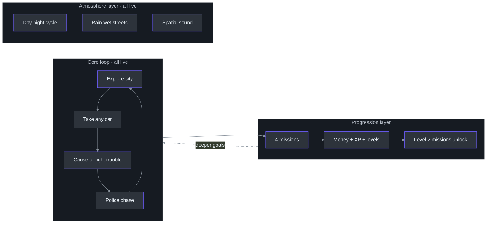
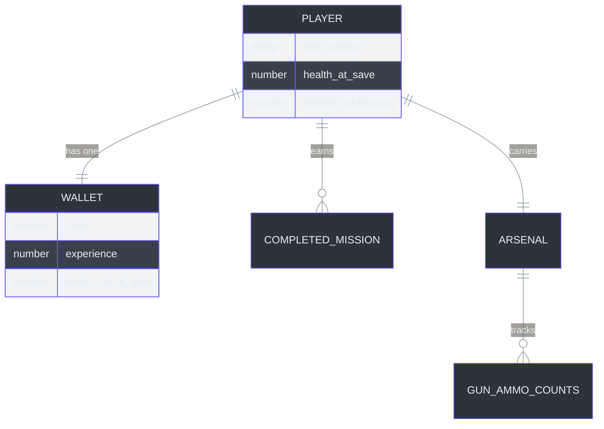

# Product Manager Guide — The Player Journey Without the Jargon

Audience: product managers and non-engineering stakeholders. Everything here describes what players *experience*, not how the game works inside. Claims are grounded in the implementation wiki ([`docs/wiki/index.md`](https://github.com/noiz354/arena-city-try/blob/main/docs/wiki/index.md)) and its per-feature pages.

## 1. What This System Does

CITY RUSH is a free-roaming action playground that runs in a web browser — nothing to install, no account needed. Players walk or drive around a procedurally built city, stir up police attention by causing trouble, complete small missions (deliver a pizza, win a street race, take out a thug, tail a car) to earn money and levels, and their progress saves automatically between visits. It plays with keyboard/mouse on desktop and touch controls on phones.

## 2. User Journey Map

```mermaid
%%{init: {"theme": "base", "themeVariables": {"primaryColor": "#2d333b", "primaryBorderColor": "#6d5dfc", "primaryTextColor": "#e6edf3", "lineColor": "#8b949e"}}}%%
journey
    title A typical first session
    Arrive: 5: Player opens the page, city loads in seconds, no sign-up
    Explore on foot: 4: Walk, sprint, jump across rooftops around spawn
    Find wheels: 4: Walk up to any parked or moving car, press E to take it
    Cause trouble: 4: Gunfire or bumping pedestrians raises wanted stars
    Police response: 3: Officers appear at 2+ stars and give chase
    Escape or survive: 3: Drive away - or die and reappear healthy at start
    Spot a mission: 5: Green light beams mark available missions
    Complete objective: 4: Yellow beam marks the current goal; reach it
    Get paid and level: 5: Money plus experience; level 2 unlocks harder missions
    Leave safely: 5: Progress saved automatically every 30 seconds
```

<!-- Sources: docs/wiki/systems/MissionSystem.md (green/yellow markers), docs/wiki/systems/WantedSystem.md (2-star threshold), docs/wiki/entities.md (respawn), docs/wiki/systems/SaveManager.md (30s autosave) -->

The core loop in one sentence: **explore → take a car → make (or fix) trouble → chase → mission → reward → repeat**, with the world unchanged underneath you between visits.

Mission roster currently shipped — exactly one of each type ([`docs/wiki/systems/MissionSystem.md`](https://github.com/noiz354/arena-city-try/blob/main/docs/wiki/systems/MissionSystem.md)):

| Mission | Type | Start marker | Reward | Unlocks at |
|---|---|---|---|---|
| PIZZA DELIVERY | Pickup-and-dropoff run | west of center | $150 + 60 XP | Level 1 |
| MIDTOWN SPRINT | 6-checkpoint race | east side | $250 + 90 XP | Level 1 |
| THUG CLEANUP | Defeat a marked enemy | southwest corner | $400 + 150 XP | Level 2 |
| TAIL THE TARGET | Follow a car within range for 12 s total | northeast corner | $350 + 120 XP | Level 2 |

## 3. Feature Capability Map

Status: **Live** = playable today; **Beta** = works but rough edges documented; **Planned** = intended but absent.

| Feature | Status | What the player experiences | Limitations today |
|---|---|---|---|
| Open city exploration | Live | Seamless streets, buildings, parks; distant detail fades gracefully | City size fixed (~310 m across); invisible walls at the edge |
| Walking, sprinting, jumping | Live | Sprint drains stamina, regenerates when resting; jump reaches rooftops via step-ups | No health regeneration while idle (see §8) |
| Cars: 4 types (sedan, taxi, muscle, truck) | Live | Distinct speed/handling/health per car; wrecks smoke and crawl | Damage numbers not shown; no car selection menu — you take what you find |
| Take any car (parked or traffic) | Live | Walk up, press E, drive away; press E to exit beside it | A taken AI car never returns to traffic; no garage/collection |
| AI traffic | Beta | 10 cars cruise the grid and brake for obstacles | They never turn right (a verified logic slip); opposing cars share lanes |
| Pedestrians | Live | People stroll, panic when shots fire, can be knocked down/run over | Small variety; purely ambient (no interactions) |
| Wanted stars + police | Beta | Crimes raise 0–6 stars; from 2★ officers chase; stars cool down if you lie low | Killing a cop from a clean record shows 2★ (surprising math); stars freeze while driving |
| Combat: pistol / SMG / shotgun / rifle | Live | Number keys switch; instant-hit bullets with tracers, reloads, ammo economy | Weapons only usable on foot; no aiming-down-sights |
| Weapon/ammo pickups | Live | Floating pickups near spawn and dropped by defeated enemies | Fixed placement at session start |
| Missions (4) + money + XP levels | Beta | Green beams invite; yellow beam guides; rewards and level-ups | One mission each; cannot cancel or fail a mission once started (soft-lock until reload) |
| Day/night cycle + weather | Live | Sky/sun cycle, fog, rain showers, wet reflective ground, thunder-adjacent audio | Rain ripple effect flashes uniformly (known visual bug) |
| Minimap + HUD | Live | North-up minimap with mission blips; health/stamina/vehicle bars, compass to goal | Minimap has no zoom or player-facing settings |
| Save/load | Live | Automatic every 30 s and after each mission; resumes position, health, kills, arsenal | Saves live only in that browser+device; "New Game" from pause wipes everything |
| Mobile touch controls | Live | On-screen joystick + buttons mirroring keyboard actions | Best on larger screens; no controller/gamepad support |
| Automatic quality adjustment | Live | Game quietly lowers/raises resolution and effects to hold smooth play | No manual graphics settings menu |
| Sound + spatial audio | Live | Engine pitch, gunfire distance, mission jingles, mute toggle (M) | No music soundtrack |

<!-- Sources: docs/wiki/index.md capability tables, docs/wiki/systems pages per feature, docs/wiki/utils-and-data.md weapons/vehicles tables -->



<!-- Sources: docs/wiki/index.md cluster structure -->

## 4. Data Model (Product View)

Think of the save file as **one player folder** kept in the browser:



<!-- Sources: docs/wiki/systems/SaveManager.md payload fields, docs/wiki/systems/MissionSystem.md profile shape -->

In business terms: **a Player has one Wallet** (cash, experience, level — level is always recalculated from experience so they can never disagree). **A Player completes many Missions** (the list of finished mission names gates replays). **A Player carries an Arsenal** — which guns are owned, which is equipped, and bullet counts per gun, each checked against the official gun catalog when loaded so impossible values self-correct. Notably *not* saved: police star level, active mission progress, or car damage — a returning player always starts clean of trouble.

## 5. Configuration & Feature Flags

There is no settings menu yet. What exists:

| Control | What it does | Default | Who can change it |
|---|---|---|---|
| M key | Mute/unmute all sound | Sound on | Any player |
| Esc key | Pause menu: resume, restart (wipes save + reloads), mute, stats line | Running | Any player |
| F3 key | Developer overlay showing collision outlines (QA tool, not gameplay) | Off | Developers/QA |
| Graphics effects master switch | Turns the fancy full-screen effects chain off entirely | On | Code/QA console only — players get automatic quality instead ([`docs/wiki/systems/PostFX.md`](https://github.com/noiz354/arena-city-try/blob/main/docs/wiki/systems/PostFX.md)) |
| Statistics destination address | Where anonymous play statistics get sent | Empty = statistics stay on the device, sent nowhere | Set once when the game is packaged — not changeable after ([`src/analytics/tracker.ts:172-181`](https://github.com/noiz354/arena-city-try/blob/main/src/analytics/tracker.ts#L172-L181)) |
| Website sub-folder path | Where the game lives on a website (for GitHub Pages hosting) | Site root | Packaging-time setting |

Product takeaway: player-facing configuration surface is intentionally minimal; the automatic quality system substitutes for a graphics menu.

## 6. Integration Capabilities

There is no public programming interface for partners, and no accounts — integration surface today is exactly two things:

| Capability | How it connects | Sign-in required? | Volume limits |
|---|---|---|---|
| Receive anonymous play statistics | Sends small batches of standard-format events to any lightweight self-hosted collector of the Plausible/Umami style | None — data is anonymous | Batches when 8+ events queue; holds at most 200 locally; flushes on tab close ([`docs/wiki/utils-and-data.md`](https://github.com/noiz354/arena-city-try/blob/main/docs/wiki/utils-and-data.md) § Telemetry) |
| QA/debug access for testers | Browser developer console exposes the running game object (`window.game`) — trigger test crimes, toggle overlays, inspect state | None | None; ships enabled everywhere, treated as a public contract ([`AGENTS.md`](https://github.com/noiz354/arena-city-try/blob/main/AGENTS.md)) |

If a partner integration matters later (leaderboards, accounts, cross-device saves), it would be new scope — nothing server-side exists today.

## 7. Performance & SLAs

No formal service-level commitments exist (single-player, static hosting), but observed/designed behavior:

| Operation | Expected experience | Built-in guardrail |
|---|---|---|
| Page load to playable | Seconds; loading screen fades out when ready | Boot failure shows a clear error screen instead of hanging ([`src/main.ts:29-45`](https://github.com/noiz354/arena-city-try/blob/main/src/main.ts#L29-L45)) |
| Smoothness target | 60 frames-per-second feel on typical laptops | Quality drops automatically below ~28 fps; recovers above ~50 fps sustained ([`docs/wiki/systems/AutoQuality.md`](https://github.com/noiz354/arena-city-try/blob/main/docs/wiki/systems/AutoQuality.md)) |
| Response to controls | Same-frame movement feel | Long freezes ("tab was in background") capped so time doesn't jump |
| Saving | Invisible; every 30 s and after missions; also when closing the tab | Storage problems are swallowed — game keeps playing unsaved rather than erroring ([`docs/wiki/systems/SaveManager.md`](https://github.com/noiz354/arena-city-try/blob/main/docs/wiki/systems/SaveManager.md)) |
| Respawn after death | About 3 seconds | Slightly longer on very weak devices under stress |
| Availability | Equals the hosting platform's uptime (GitHub Pages) | Static files — effectively as reliable as any webpage |

## 8. Known Limitations & Constraints

Honest list, each verified and located in the wiki:

| Limitation | Player impact | Workaround | Planned fix |
|---|---|---|---|
| Started missions cannot be canceled or failed | A stuck mission blocks starting others until page reload | Reload the page (progress since last autosave is lost) | Yes — the cancel capability exists internally, just unconnected ([`docs/wiki/systems/MissionSystem.md`](https://github.com/noiz354/arena-city-try/blob/main/docs/wiki/systems/MissionSystem.md)) |
| No health regeneration | Damage taken persists until death or reload; difficulty feels punishing on longer sessions | Die deliberately (fast respawn) or restart | Yes — pending a design decision ([`docs/wiki/entities.md`](https://github.com/noiz354/arena-city-try/blob/main/docs/wiki/entities.md)) |
| Traffic cars never turn right | World feels scripted on long drives | Barely noticeable in short sessions | Yes — one-line probability fix ([`docs/wiki/systems/TrafficSystem.md`](https://github.com/noiz354/arena-city-try/blob/main/docs/wiki/systems/TrafficSystem.md)) |
| Police star math surprise: cop kill from clean record = 2★ | Escalation feels arbitrary in a headline moment | None | Yes — small rules fix ([`docs/wiki/systems/WantedSystem.md`](https://github.com/noiz354/arena-city-try/blob/main/docs/wiki/systems/WantedSystem.md)) |
| Stars freeze while driving | Escaping police by car suspends the chase entirely — reads as exploit-friendly | Design decision to revisit | Under review ([`docs/wiki/systems/WantedSystem.md`](https://github.com/noiz354/arena-city-try/blob/main/docs/wiki/systems/WantedSystem.md)) |
| Rain ripples flash identically | Visual polish defect in a showcase weather feature | Play in clear weather | Yes ([`docs/wiki/systems/WetSurfaceSystem.md`](https://github.com/noiz354/arena-city-try/blob/main/docs/wiki/systems/WetSurfaceSystem.md)) |
| Only 1 mission per type; no music; no graphics settings | Content depth below genre expectations | — | Content is designed to be added cheaply (data lists) |
| Saves don't transfer between browsers/devices | Progress stranded on one device | None | Would require accounts/cloud — out of scope today |

## 9. Data & Privacy

The privacy posture is unusually strong for a game: no account, no cookies, no third-party scripts, no ads.

| Data type | Where it lives | Kept for | Notes |
|---|---|---|---|
| Save file (position, health, takedown count, wallet, arsenal) | Player's own browser storage | Until the player picks "New Game" or clears browser data | Never leaves the device ([`docs/wiki/systems/SaveManager.md`](https://github.com/noiz354/arena-city-try/blob/main/docs/wiki/systems/SaveManager.md)) |
| Anonymous play statistics (device class, screen size, gameplay events like mission completions) | Queued in browser storage first | Sent in batches **only if** a statistics destination was configured at packaging; otherwise sent nowhere, ever ([`src/analytics/tracker.ts:110`](https://github.com/noiz354/arena-city-try/blob/main/src/analytics/tracker.ts#L110)) | Contains no name, email, IP-based identity fields, or precise location |
| Session identifier | Browser storage, reused across visits | Until cleared | Enables "returning visitor" grouping only |
| Crash/error notes (short message snippets) | Same statistics channel, rate-limited to one per 2 s | As above | Message text is sanitized before display anywhere |

Compliance status: because nothing is collected or transmitted by default, exposure is minimal. Gap worth tracking: there is **no in-game opt-out switch** for statistics — turning them off means packaging a build without a destination ([`src/analytics/tracker.ts:44-49`](https://github.com/noiz354/arena-city-try/blob/main/src/analytics/tracker.ts#L44-L49)). If collection goes live publicly, add a visible toggle first.

## 10. Glossary (plain language)

| Term | What it means for this product |
|---|---|
| Wanted stars | The 0–6 "heat" meter that grows with crimes and drives police behavior |
| Hitscan shooting | Bullets hit instantly along the aim line (no travel time, no projectiles) |
| Pickups | Floating collectible items — guns or ammunition boxes |
| Marker / beam | The tall glowing light columns marking mission starts (green) and current goals (yellow) |
| Respawn | Dying → short countdown → reappear healthy at the city center |
| Wrecked | A car at zero health: crawls slowly, smokes, eventually explodes once |
| Auto-save | The game saving by itself every 30 seconds and after each mission |
| Chunk streaming | The city builds itself in small square pieces as you approach, keeping load instant |
| Quality tiers | Three automatic graphics levels (full / medium / minimal) chosen by the game to keep play smooth |
| Play statistics (telemetry) | Anonymous counts of what happens in sessions — used for product decisions, off by default |
| Debug console hooks | Test controls exposed to developers/QA in the browser's console |
| Soft-lock | A stuck state a player can't escape without reloading — currently possible with missions |

## 11. FAQ

**Q: Do players need to install anything or create an account?**
A: No. Open the page and play. Progress lives silently in their browser.

**Q: Is it multiplayer?**
A: No. Single-player only; nothing about the current architecture assumes other players.

**Q: How big is the world and can we make it bigger?**
A: One city (~310 m square) surrounded by open countryside hills. The generation rules are seeded and parameterized — resizing is an engineering task, not a redesign.

**Q: How much content is there?**
A: Four missions (one per type), four car types, four guns, one city. The content system was explicitly built so adding more is mostly writing data entries, not new code ([`docs/wiki/utils-and-data.md`](https://github.com/noiz354/arena-city-try/blob/main/docs/wiki/utils-and-data.md)).

**Q: Can players cheat? Does it matter?**
A: There's no server, so scores are honor-system anyway. Tampered save files degrade gracefully rather than crashing — worst case a corrupted value slips through.

**Q: What happens on a weak phone or old laptop?**
A: The game automatically lowers resolution and visual effects until motion stays smooth; at minimum tier shadows turn off. No user action needed.

**Q: What data do we collect, and could it identify someone?**
A: By default, nothing is even sent. If enabled, batches contain device class, screen size, and gameplay events — no names, emails, or precise locations, no cookies, no third-party trackers.

**Q: Can a player lose progress?**
A: Only by choosing "New Game," clearing browser data, or a corrupted save (which the game treats as "start fresh" rather than crashing). Autosave runs every 30 s.

**Q: Why can't I abandon a mission?**
A: Known gap — the internal capability exists but isn't connected to any button. It's the top-priority quality fix.

**Q: Is the police system fair right now?**
A: Mostly — with two documented quirks: killing an officer from a clean record yields two stars (not three), and stars freeze while driving. Both have identified fixes.

**Q: What would a "content expansion" cost relative to the original build?**
A: Far less — missions/vehicles/weapons are data-driven and validated automatically; new mission *types* (not instances) are where real engineering begins ([`docs/wiki/systems/MissionSystem.md`](https://github.com/noiz354/arena-city-try/blob/main/docs/wiki/systems/MissionSystem.md)).

**Q: Who owns this project operationally?**
A: Currently a single maintainer with exceptional documentation (31 verified wiki pages). Bus factor is the main organizational risk — see the [Executive Guide](./executive-guide.md).

## Related Pages

| Page | Relationship |
|------|-------------|
| [Onboarding Hub](./index.md) | Other role guides |
| [Running & Playing CITY RUSH](../usage.md) | Full controls and modes reference |
| [Executive Guide](./executive-guide.md) | Business risk/investment view of the same facts |
