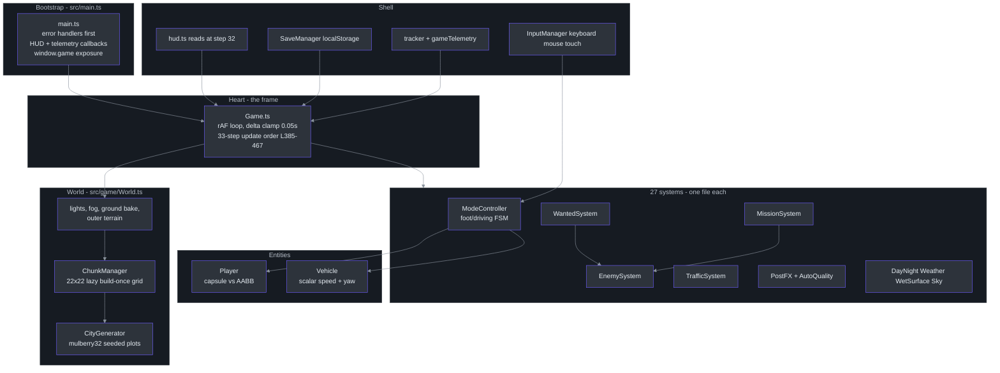
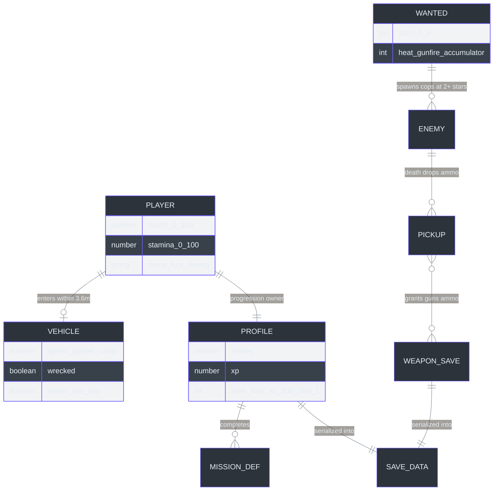
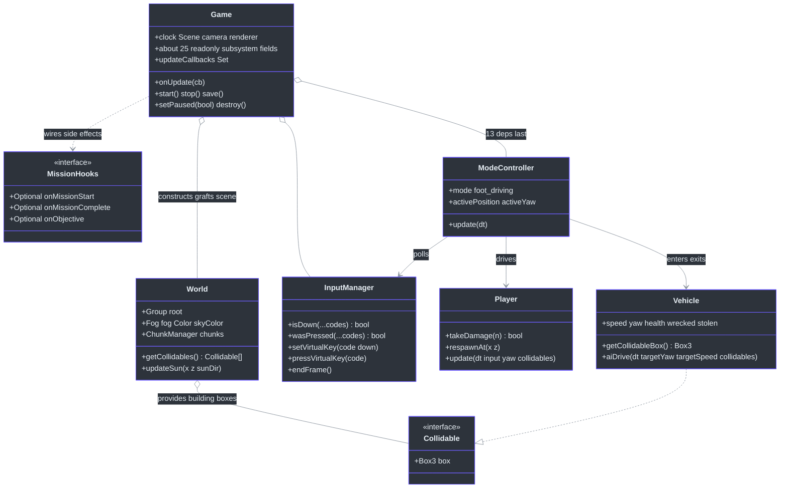
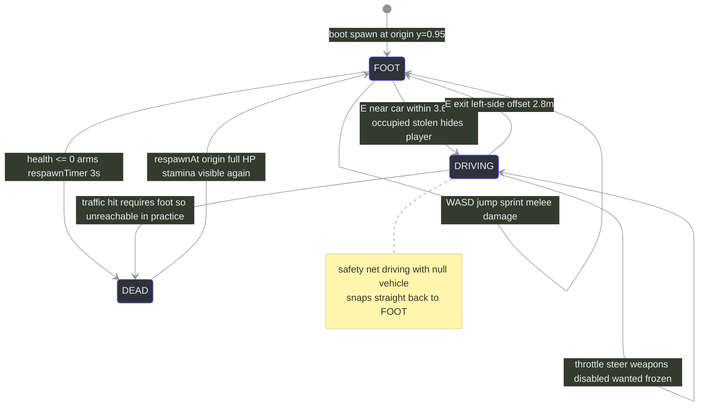
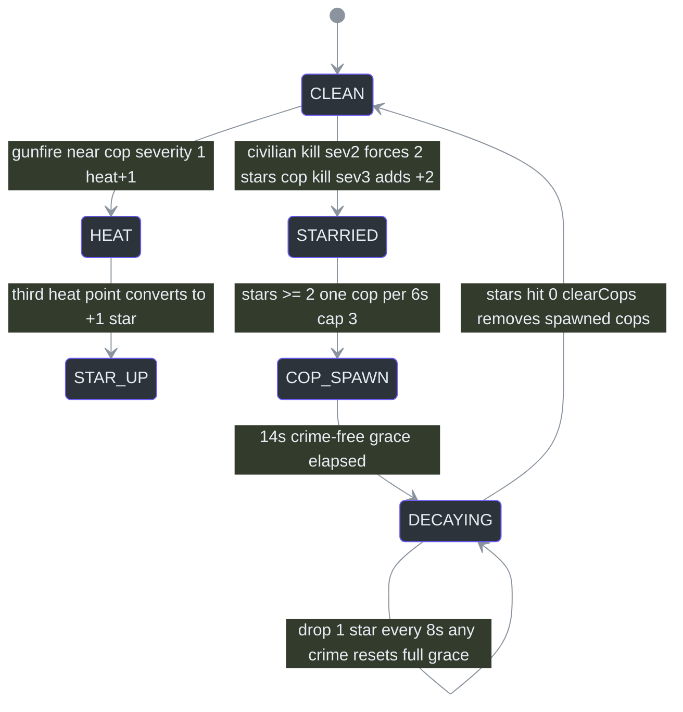
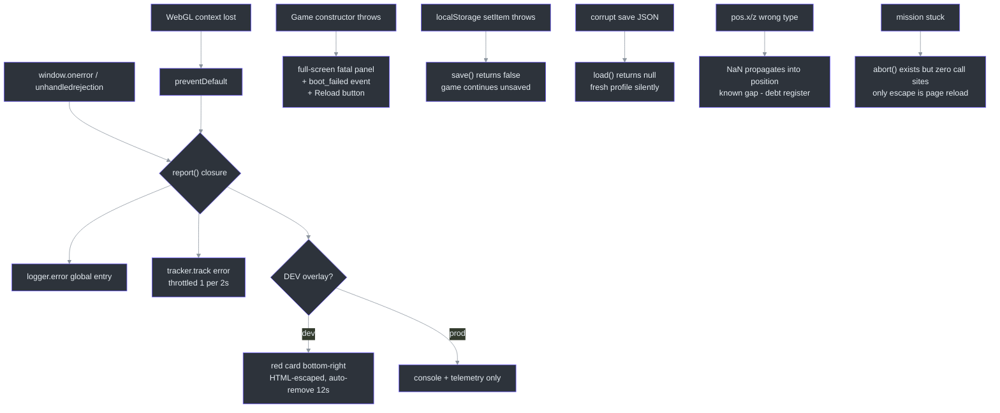

# Staff Engineer Guide

**Repo:** [noiz354/arena-city-try](https://github.com/noiz354/arena-city-try) · **Stack:** TypeScript strict + Vite 8 + Three.js r185 · **Runtime deps:** `three` only ([`package.json:15-18`](https://github.com/noiz354/arena-city-try/blob/main/package.json#L15-L18))

This is a dense, opinionated brief. It assumes deep systems experience and zero patience for hand-waving. All claims trace to the file:line-verified implementation wiki ([`docs/wiki/index.md`](https://github.com/noiz354/arena-city-try/blob/main/docs/wiki/index.md)) or to source directly.

## 1. Executive Summary

CITY RUSH is a single-page, client-only GTA-style sandbox (~4 kloc of TypeScript) that owns its entire simulation stack: procedural city generation (seeded, deterministic), chunk streaming with LOD rings, hand-rolled capsule-vs-AABB physics for two entity classes, scalar-speed vehicle dynamics shared between human driving and AI traffic, a six-star wanted/police loop, four data-driven mission archetypes, localStorage persistence with no schema versioning, a fixed 33-step per-frame update order over 27 single-file systems, an EffectComposer post chain with frame-timing-driven quality tiers, and a privacy-first batched telemetry transport that transmits nothing unless a build-time endpoint is configured. It delegates everything else to the platform: rAF scheduling, WebGL execution, audio decoding (WebAudio), storage durability (localStorage), and hosting (static GitHub Pages). There is no backend, no server state, no auth surface, and exactly one runtime dependency. The design bet is that a small deterministic client beats a distributed one for this product class — every consequence below flows from that bet.

| Owns | Delegates |
|---|---|
| World generation + streaming ([`src/systems/ChunkManager.ts:98`](https://github.com/noiz354/arena-city-try/blob/main/src/systems/ChunkManager.ts#L98)) | Frame scheduling → browser rAF ([`src/game/Game.ts:372-383`](https://github.com/noiz354/arena-city-try/blob/main/src/game/Game.ts#L372-L383)) |
| Physics/collision primitives ([`src/game/World.ts:22-24`](https://github.com/noiz354/arena-city-try/blob/main/src/game/World.ts#L22-L24)) | GPU execution → WebGL via three.js ([`src/game/Game.ts:122-129`](https://github.com/noiz354/arena-city-try/blob/main/src/game/Game.ts#L122-L129)) |
| Per-frame orchestration, 33-step order ([`src/game/Game.ts:385-467`](https://github.com/noiz354/arena-city-try/blob/main/src/game/Game.ts#L385-L467)) | Audio decode/playback → WebAudio ([`src/systems/AudioManager.ts:12`](https://github.com/noiz354/arena-city-try/blob/main/src/systems/AudioManager.ts#L12)) |
| Persistence payload + triggers ([`src/systems/SaveManager.ts:20`](https://github.com/noiz354/arena-city-try/blob/main/src/systems/SaveManager.ts#L20)) | Durability → localStorage (browser-managed quota/eviction) |
| Telemetry batching/transport ([`src/analytics/tracker.ts:34`](https://github.com/noiz354/arena-city-try/blob/main/src/analytics/tracker.ts#L34)) | Hosting → static Pages build (`GH_PAGES=1`, [`vite.config.ts:6`](https://github.com/noiz354/arena-city-try/blob/main/vite.config.ts#L6)) |

## 2. The Core Architectural Insight

The entire system is two ideas stacked: **a lazy build-once spatial cache for the world**, and **a fixed manual update sequence for behavior**. Everything else is detail.

The world is a preallocated 22×22 grid of 16 m chunk records that start empty. Each frame computes Chebyshev ring distance from the player: ≤1 → full detail, ≤2 → simple instanced shell, else hidden. A chunk's content is built **once, on first activation, and never torn down during play** — memory grows as you explore, but cost stays bounded because the grid is finite (484 cells) and mid-ring chunks render as one InstancedMesh each ([`src/systems/ChunkManager.md`](https://github.com/noiz354/arena-city-try/blob/main/docs/wiki/systems/ChunkManager.md)). In Python pseudocode:

```python
class City:                                   # ChunkManager, src/systems/ChunkManager.ts
    def __init__(self):
        self.cells = {f"{cx}_{cz}": Cell()    # 484 records, nothing generated yet
                      for cx in range(22) for cz in range(22)}

    def update(self, player_x, player_z):     # called every frame
        changed = False
        for cell in self.cells.values():
            ring = max(abs(cell.cx - px), abs(cell.cz - pz))   # Chebyshev
            level = 2 if ring <= FULL_RADIUS else \
                    1 if ring <= SIMPLE_RADIUS else 0
            if level != cell.level:
                if level > 0 and not cell.built:
                    cell.build()              # once ever; no teardown while playing
                cell.show(level)
                changed = True
        if changed:
            self.rebuild_collision_index()    # flat list + per-cell spatial buckets
        return changed
```

The second half: there is **no event bus, no ECS scheduler, no dependency graph**. One function calls 27 subsystems in a hand-maintained order, documented line-by-line ([`src/game/Game.ts:385-467`](https://github.com/noiz354/arena-city-try/blob/main/src/game/Game.ts#L385-L467)). The order *is* the concurrency contract: enemies/pedestrians/traffic/weapons at steps 8–14 deliberately see last frame's player position; the player moves at step 15; the HUD reads fully-updated state at step 32. Cross-system semantics are therefore readable by reading a table — not by tracing subscriptions. The cost of the trade: adding a system requires touching the orchestrator (by design; see decision log).

```python
def frame(game):                              # Game.loop, src/game/Game.ts:372-383
    delta = min(clock.get_delta(), 0.05)      # hitch clamp: max 20 Hz sim under lag
    input.end_frame()                          # edge-clear runs even when paused
    if game.paused: return
    for step in UPDATE_ORDER:                 # 33 slots, hand-ordered
        step(delta)
    render()                                  # composer.render() if postfx enabled
```

Concept mapping for engineers arriving from other ecosystems:

| Here | Nearest analogue elsewhere | Note |
|---|---|---|
| `Collidable { box }` | Unity `Collider` / PhysX shape | Deliberately minimal: just a Box3, no layers/masks ([`src/game/World.ts:22-24`](https://github.com/noiz354/arena-city-try/blob/main/src/game/World.ts#L22-L24)) |
| Chunk record | openworld-js "DPZ pattern" cell | Source comment says so verbatim ([`src/systems/ChunkManager.ts:90`](https://github.com/noiz354/arena-city-try/blob/main/src/systems/ChunkManager.ts#L90)) |
| Fixed update table | Engine main-loop tick order | The table lives in prose, not code ([`docs/wiki/game-loop.md`](https://github.com/noiz354/arena-city-try/blob/main/docs/wiki/game-loop.md)) |
| Closures-as-DI | Constructor injection w/o container | e.g. `() => weather.rainAmount` ([`src/game/Game.ts:171`](https://github.com/noiz354/arena-city-try/blob/main/src/game/Game.ts#L171)) |

## 3. System Architecture



<!-- Sources: docs/wiki/game-loop.md (bootstrap src/main.ts:1-79, constructor order src/game/Game.ts:120-338), docs/wiki/index.md -->

**The heart is `Game.update`'s 33-slot sequence** ([`src/game/Game.ts:385-467`](https://github.com/noiz354/arena-city-try/blob/main/src/game/Game.ts#L385-L467)). Every wiring question terminates there; every ordering bug manifests there. Construction order in the constructor matters equally — later systems take earlier ones as constructor arguments, ending with ModeController receiving ~13 deps precisely because it touches nearly everything ([`src/game/Game.ts:308-323`](https://github.com/noiz354/arena-city-try/blob/main/src/game/Game.ts#L308-L323)).

## 4. Domain Model



<!-- Sources: docs/wiki/entities.md, docs/wiki/systems/MissionSystem.md (Profile src/systems/MissionSystem.ts:47), docs/wiki/systems/WantedSystem.md, docs/wiki/systems/SaveManager.md -->

Data invariants:

| Entity | Invariant | Enforced By | Source |
|---|---|---|---|
| Player | `health ∈ [0, 100]`; only raised by respawn or save-load (`heal()` has zero callers) | `takeDamage` subtracts only; death polled at ≤0 | [`src/entities/Player.ts:112-118`](https://github.com/noiz354/arena-city-try/blob/main/src/entities/Player.ts#L112-L118), [`docs/wiki/entities.md`](https://github.com/noiz354/arena-city-try/blob/main/docs/wiki/entities.md) § Unresolved |
| Player mode | `mode ∈ {'foot','driving'}` (string-literal union, not enum) | TS type + snap-back net when driving with null vehicle | [`src/systems/ModeController.ts:18`](https://github.com/noiz354/arena-city-try/blob/main/src/systems/ModeController.ts#L18), [:140-144](https://github.com/noiz354/arena-city-try/blob/main/src/systems/ModeController.ts#L140-L144) |
| Vehicle | `wrecked ⇒ speed=0`, crawl cap ×0.25 | `takeDamage` sets wrecked at 0 HP; update clamps | [`src/entities/Vehicle.ts:168-176`](https://github.com/noiz354/arena-city-try/blob/main/src/entities/Vehicle.ts#L168-L176), [:97](https://github.com/noiz354/arena-city-try/blob/main/src/entities/Vehicle.ts#L97) |
| Vehicle flags | `stolen` is a one-way latch; AI never resumes a stolen car | Set in enterVehicle, cleared nowhere except restart | [`src/systems/TrafficSystem.md`](https://github.com/noiz354/arena-city-try/blob/main/docs/wiki/systems/TrafficSystem.md), [`src/systems/ModeController.ts:177-178`](https://github.com/noiz354/arena-city-try/blob/main/src/systems/ModeController.ts#L177-L178) |
| Wanted | `stars ∈ [0,6]`, clamped on every report | clamp in `reportCrime` | [`src/systems/WantedSystem.ts:32-34`](https://github.com/noiz354/arena-city-try/blob/main/src/systems/WantedSystem.ts#L32-L34) |
| Collision currency | Everything solid exposes `{ box: Box3 }` | Interface convention across buildings/vehicles/weapons/camera | [`src/game/World.ts:22-24`](https://github.com/noiz354/arena-city-try/blob/main/src/game/World.ts#L22-L24) |
| Save payload | Load returns null unless `profile` is a string | Minimal integrity check in `load()` | [`src/systems/SaveManager.ts:32-42`](https://github.com/noiz354/arena-city-try/blob/main/src/systems/SaveManager.ts#L32-L42) |
| Traffic pool | Exactly 10 cars forever, never recycled | Fixed-length readonly array | [`src/systems/TrafficSystem.md`](https://github.com/noiz354/arena-city-try/blob/main/docs/wiki/systems/TrafficSystem.md) § Data Structures |
| Level | `level = floor(xp/100)+1`, recomputed from xp on load | xp→level derivation, level never stored independently | [`src/systems/MissionSystem.ts:35-37`](https://github.com/noiz354/arena-city-try/blob/main/src/systems/MissionSystem.ts#L35-L37) |

## 5. Key Abstractions & Interfaces



<!-- Sources: docs/wiki/game-loop.md (Public API sections), docs/wiki/entities.md, docs/wiki/systems/MissionSystem.md (hooks :29-33), docs/wiki/utils-and-data.md (InputManager API) -->

Three load-bearing patterns worth naming:

1. **`Collidable` is the universal collision currency** — buildings, parked cars, traffic cars, and weapon raycasts all speak `{ box: Box3 }`. Adding a new solid thing means producing a Box3; nothing else is required ([`src/game/World.ts:22-24`](https://github.com/noiz354/arena-city-try/blob/main/src/game/World.ts#L22-L24)).
2. **Hooks, not inheritance.** Mission start/complete/objective side effects are optional injected callbacks; weapon kill effects ride `onKill`. Systems emit; Game decides policy ([`src/game/Game.ts:207-223`](https://github.com/noiz354/arena-city-try/blob/main/src/game/Game.ts#L207-L223), [:238-275](https://github.com/noiz354/arena-city-try/blob/main/src/game/Game.ts#L238-L275)).
3. **Delegating getters preserve a public API across refactors.** After the A-1 extraction of ModeController from the Game god-object, `game.mode`/`game.vehicle` still work via pass-through getters — the debug console contract stayed stable ([`src/game/Game.ts:104-118`](https://github.com/noiz354/arena-city-try/blob/main/src/game/Game.ts#L104-L118), [changelog](../../changelog.md) A-1).

## 6. Request Lifecycle

There are no HTTP requests; the unit of request is the frame. Full trace with `autonumber`:

```mermaid
%%{init: {"theme": "base", "themeVariables": {"primaryColor": "#2d333b", "primaryBorderColor": "#6d5dfc", "primaryTextColor": "#e6edf3", "lineColor": "#8b949e"}}}%%
sequenceDiagram
    autonumber
    participant RAF as Browser rAF
    participant LOOP as Game.loop
    participant EARLY as Steps 2-14 sim
    participant MC as ModeController step 15
    participant LATE as Steps 16-31 late sim
    participant CB as Step 32 callback flush
    RAF->>LOOP: frame fires
    LOOP->>LOOP: re-queue NEXT frame first
    LOOP->>LOOP: delta = min(getDelta(), 0.05)
    alt paused via Escape
        LOOP->>LOOP: skip update AND render
    end
    LOOP->>EARLY: chunks dayNight vehicles enemies peds traffic run-over pickups weapons
    Note over EARLY: all see LAST frame player position
    EARLY->>MC: modeCtrl.update - move camera enter exit death timer
    MC->>MC: player.update(delta, input, camYaw, collidables)
    MC->>LATE: wanted foot-only missions minimap autosave weather particles postfx quality
    LATE->>CB: telemetry.frame/update then hud.update
    Note over CB: HUD sees fully-updated state
    CB->>RAF: applyShake render restoreShake
```

<!-- Sources: docs/wiki/game-loop.md per-frame order table src/game/Game.ts:385-467, pause path src/game/Game.ts:378-382 -->

Two consequences worth internalizing: the one-frame perception lag in AI targeting is a *documented property*, not a defect ([`docs/wiki/game-loop.md`](https://github.com/noiz354/arena-city-try/blob/main/docs/wiki/game-loop.md)); and `input.endFrame()` running even while paused is what prevents stale clicks firing after resume ([`src/utils/InputManager.ts:169-174`](https://github.com/noiz354/arena-city-try/blob/main/src/utils/InputManager.ts#L169-L174)).

## 7. State Transitions

Player mode + death lifecycle (all transitions owned by ModeController):



<!-- Sources: docs/wiki/systems/ModeController.md states, enter/exit src/systems/ModeController.ts:115-200, death timer :204-217, docs/wiki/entities.md death section -->

Wanted meter lifecycle (foot-mode-gated; frozen entirely while driving):



<!-- Sources: docs/wiki/systems/WantedSystem.md execution flow src/systems/WantedSystem.ts:30-86 -->

Known wrinkle carried forward to the debt register: dead cops remain in the `cops` array until a full clear, so "cap 3" is really "3 ever spawned this spree" ([`docs/wiki/systems/WantedSystem.md`](https://github.com/noiz354/arena-city-try/blob/main/docs/wiki/systems/WantedSystem.md) § Unresolved).

## 8. Decision Log

| Decision | Alternatives Considered | Rationale | Source |
|---|---|---|---|
| No physics engine; hand-rolled capsule/AABB + hitscan | cannon-es, Rapier, ammo.js | Zero extra deps; the whole city is boxes so broad-phase is a spatial hash; determinism trivially preserved; bundle stays tiny | [`AGENTS.md`](https://github.com/noiz354/arena-city-try/blob/main/AGENTS.md), [`docs/wiki/entities.md`](https://github.com/noiz354/arena-city-try/blob/main/docs/wiki/entities.md) |
| Build-once chunks, never disposed during play | LRU eviction / dispose-at-level-0 | Grid bounded at 484 cells so worst-case memory is finite; draw calls bounded by instancing; disposal churn would trade CPU for memory nobody measured as a problem | [`src/systems/ChunkManager.md`](https://github.com/noiz354/arena-city-try/blob/main/docs/wiki/systems/ChunkManager.md) § Unresolved |
| InstancedMesh for simple LOD ring | Individual meshes | Collapsed ~100+ far-building draws to ~16 (one per mid-ring chunk); guarded by a Playwright visual smoke test | [changelog](../../changelog.md) A-3 (commit 178722c) |
| Scalar signed-speed vehicle model | Rigid-body wheels/suspension | Arcade feel directly tunable via data rows; same model serves human driving AND `aiDrive` traffic; no suspension artifacts | [`src/entities/Vehicle.ts:94-127`](https://github.com/noiz354/arena-city-try/blob/main/src/entities/Vehicle.ts#L94-L127), [`src/data/vehicles.ts:26-93`](https://github.com/noiz354/arena-city-try/blob/main/src/data/vehicles.ts#L26-L93) |
| Seeded mulberry32 determinism | `Math.random()` | Same seed ⇒ same city/traffic every session — reproducible bugs, testable spawns, free "authored feel" | [`src/systems/TrafficSystem.ts:57`](https://github.com/noiz354/arena-city-try/blob/main/src/systems/TrafficSystem.ts#L57), [`docs/wiki/systems/CityGenerator.md`](https://github.com/noiz354/arena-city-try/blob/main/docs/wiki/systems/CityGenerator.md) |
| Single-key localStorage save, no versioning/migration | IndexedDB, versioned schemas, cloud saves | "Deliberately dumb" per header comment; corruption swallowed to null ⇒ fresh start; upgrade path documented (bump `_v1` suffix, per-field typeof guards) | [`src/systems/SaveManager.md`](https://github.com/noiz354/arena-city-try/blob/main/docs/wiki/systems/SaveManager.md) § Purpose/Tuning |
| Fixed manual 33-step update order | ECS schedulers, event bus, priority queue | Ordering semantics must be legible to a small team and to AI agents editing the repo; cross-system timing facts are documented prose, reviewable in diff form | [`docs/wiki/game-loop.md`](https://github.com/noiz354/arena-city-try/blob/main/docs/wiki/game-loop.md), AGENTS ask-first rule |
| Extract ModeController, keep delegating getters (A-1) | Full god-object rewrite | First cut of decomposition without breaking `window.game.mode` console contract used by tests/QA | [changelog](../../changelog.md) A-1, [`src/game/Game.ts:104-118`](https://github.com/noiz354/arena-city-try/blob/main/src/game/Game.ts#L104-L118) |
| Client-only env-gated telemetry batcher | Third-party SDK, server-side events | Privacy posture (no cookies/scripts, local-only unless endpoint configured) plus zero backend ops; Plausible/Umami-style JSON target | [`src/analytics/tracker.ts:110`](https://github.com/noiz354/arena-city-try/blob/main/src/analytics/tracker.ts#L110), [:172-181](https://github.com/noiz354/arena-city-try/blob/main/src/analytics/tracker.ts#L172-L181) |
| Content as plain data tables in `src/data/` | Hardcoded in systems, JSON files, editor | New missions/weapons are data-only PRs picked up automatically via `WEAPON_LIST`/id lookups; caveat: vehicle consumers index configs positionally | [`docs/wiki/utils-and-data.md`](https://github.com/noiz354/arena-city-try/blob/main/docs/wiki/utils-and-data.md) § Tuning |
| Delta clamp 0.05 s | Fixed timestep accumulator, no clamp | Tab-back hitches can't teleport entities; sim degrades to ≥20 Hz rather than exploding; respawn-timer lag under 20 fps accepted as consistent artifact | [`src/game/Game.ts:376`](https://github.com/noiz354/arena-city-try/blob/main/src/game/Game.ts#L376), [`docs/wiki/entities.md`](https://github.com/noiz354/arena-city-try/blob/main/docs/wiki/entities.md) § Unresolved |
| Roads as baked ground texture only | Road meshes + curbs | One canvas texture replaces thousands of draw-call candidates; collision story unchanged since roads are open space | [`src/game/World.ts:139-203`](https://github.com/noiz354/arena-city-try/blob/main/src/game/World.ts#L139-L203), [`docs/wiki/game-loop.md`](https://github.com/noiz354/arena-city-try/blob/main/docs/wiki/game-loop.md) § Tuning |

## 9. Dependency Rationale

| Dependency | Purpose | What It Replaced / Why Chosen | Source |
|---|---|---|---|
| `three ^0.185.1` (runtime) | Scene graph, WebGL renderer, math, EffectComposer passes | Raw WebGL/WebGL2 boilerplate — unthinkably large to hand-roll | [`package.json:17`](https://github.com/noiz354/arena-city-try/blob/main/package.json#L17) |
| `@types/three ^0.185.4` | Type definitions for strict mode | Hand-written ambient declarations | [`package.json:16`](https://github.com/noiz354/arena-city-try/blob/main/package.json#L16) |
| `vite ^8.2.2` | Dev server (:7777) + bundler, GH_PAGES base switch | Manual bundling/webpack config; also supplies `import.meta.env.DEV` gating for error overlays | [`package.json:23`](https://github.com/noiz354/arena-city-try/blob/main/package.json#L23), [`vite.config.ts:6-13`](https://github.com/noiz354/arena-city-try/blob/main/vite.config.ts#L6-L13) |
| `typescript ^7.0.2` | Strict typecheck gate (`tsc && vite build`) | JSDoc-comment checking; `noUnusedLocals/noUnusedParameters` enforce zero dead symbols | [`package.json:22`](https://github.com/noiz354/arena-city-try/blob/main/package.json#L22), [`tsconfig.json`](https://github.com/noiz354/arena-city-try/blob/main/tsconfig.json) |
| `tsx ^4.23.12` | Runs headless smoke suite directly | ts-node/jest harness for what is deliberately a fast assertion script | [`package.json:10,12`](https://github.com/noiz354/arena-city-try/blob/main/package.json#L10) |
| `@playwright/test ^1.62.1` | Visual spec + auto-build/serve preview :4173 | Manual screenshot QA (the earlier QA round captured 16 screenshots by hand before the bot/spec landed) | [`package.json:20`](https://github.com/noiz354/arena-city-try/blob/main/package.json#L20), [changelog](../../changelog.md) |

Notable absence: no state library, no router, no CSS framework, no lint config committed beyond the compiler — the compiler *is* the linter here (strict + unused-symbol rejection). Ask-first rule for anything new ([`AGENTS.md`](https://github.com/noiz354/arena-city-try/blob/main/AGENTS.md)).

## 10. Data Flow & State

Per-frame mutation flow: `InputManager` accumulates raw key/mouse state → early systems read it and mutate entity fields in place (zero-allocation scratch vectors) → ModeController moves the player → late systems react → step 32 callbacks (telemetry, HUD) read the settled state → autosave timer (30 s of accumulated sim time) serializes a subset to localStorage ([`docs/wiki/game-loop.md`](https://github.com/noiz354/arena-city-try/blob/main/docs/wiki/game-loop.md), [`src/game/Game.ts:429-433`](https://github.com/noiz354/arena-city-try/blob/main/src/game/Game.ts#L429-L433)).

What persists vs. what is intentionally transient:

| Storage | Contents | Lifetime | Notes |
|---|---|---|---|
| `localStorage['cityrush_save_v1']` | Profile (money/xp/done/started), pos x/z, health, kills, weapon inventory | Until cleared (restart wipes + reloads) | Single JSON blob; load validates only `profile` being a string; save/load wrapped in try/catch ([`src/systems/SaveManager.md`](https://github.com/noiz354/arena-city-try/blob/main/docs/wiki/systems/SaveManager.md)) |
| `localStorage['cityrush_analytics_queue']` | Pending telemetry events (max 200) | Until flushed to endpoint or wiped | Persisted after every track; drained only after successful POST ([`src/analytics/tracker.ts:83-148`](https://github.com/noiz354/arena-city-try/blob/main/src/analytics/tracker.ts#L83-L148)) |
| `localStorage['cityrush_analytics_session']` | Session id (reused across visits) | Persistent | Enables return-visit grouping ([`src/analytics/tracker.ts:51-65`](https://github.com/noiz354/arena-city-try/blob/main/src/analytics/tracker.ts#L51-L65)) |
| Build-time env vars | `VITE_ANALYTICS_ENDPOINT/SITE`, `GH_PAGES` | Build only | No runtime reconfiguration anywhere | 
| Wanted stars, active mission timers, vehicle damage | Nothing — deliberately excluded from saves | Session-only | Documented non-goal of SaveManager ([`src/systems/SaveManager.md`](https://github.com/noiz354/arena-city-try/blob/main/docs/wiki/systems/SaveManager.md) § Tuning) |

Storage comparison in one line: durability = browser localStorage only; there is no DB, no cache layer, no file I/O. The interesting engineering constraint is quota/eviction (private-mode throws are swallowed by try/catch, save returns boolean success, game continues unsaved) ([`src/systems/SaveManager.ts:23-50`](https://github.com/noiz354/arena-city-try/blob/main/src/systems/SaveManager.ts#L23-L50)).

## 11. Failure Modes & Error Handling



<!-- Sources: src/utils/errors.ts:22-101 via docs/wiki/utils-and-data.md, src/main.ts:29-45, src/systems/SaveManager.ts:23-50, docs/wiki/systems/MissionSystem.md Unresolved, docs/wiki/systems/SaveManager.md Unresolved -->

Design stance: fail soft everywhere except boot. Global handlers are installed *before* Game construction specifically so boot failures are caught and tracked ([`src/main.ts:10-14`](https://github.com/noiz354/arena-city-try/blob/main/src/main.ts#L10-L14)); storage and parse failures degrade to "keep playing without persistence" rather than modal errors. The one hard gap — unchecked numeric fields propagating NaN from a tampered save — is a trust-boundary decision recorded in the debt register below.

## 12. Performance Characteristics

Budget reality: one frame ≈ 16.7 ms at 60 fps; the delta clamp caps catch-up work but does not create headroom. Measured/enforced hot-path properties:

| Concern | Mechanism | Numbers | Source |
|---|---|---|---|
| Draw calls | Build-once chunks; mid-ring = 1 InstancedMesh each; far chunks merely `visible=false` | ~1798 geometries accumulate; draws stay flat as you explore | [`src/systems/ChunkManager.md`](https://github.com/noiz354/arena-city-try/blob/main/docs/wiki/systems/ChunkManager.md) |
| Broad-phase collision | Spatial hash bucketed by chunk cell | Enemy LOS: `queryCircle(player,70)` → ceil(70/16)=5 → ≤121 cell lookups vs full building list | [`src/game/Game.ts:405`](https://github.com/noiz354/arena-city-try/blob/main/src/game/Game.ts#L405), [`src/systems/ChunkManager.ts:192-196`](https://github.com/noiz354/arena-city-try/blob/main/src/systems/ChunkManager.ts#L192-L196) |
| GC pressure | Scratch-vector reuse; marker position copying instead of rebuilds; module-level scratch objects | Zero-allocation update loops in entities/markers/chunkmanager | [`src/entities/Player.ts:69`](https://github.com/noiz354/arena-city-try/blob/main/src/entities/Player.ts#L69), [`src/systems/ChunkManager.ts:53-55`](https://github.com/noiz354/arena-city-try/blob/main/src/systems/ChunkManager.ts#L53-L55) |
| Resolution scaling | AutoQuality tiers: DPR min(dpr,2)/1/0.7, shadows off at tier 0, GTAO off below tier 2 | Down <28 fps instant; up >50 fps needs 2 consecutive good samples (hysteresis) | [`src/systems/AutoQuality.ts:4-6,56-63`](https://github.com/noiz354/arena-city-try/blob/main/src/systems/AutoQuality.ts#L4-L6) |
| Shadow stability | Texel-snapped ortho frustum follows player | normalBias = texel ×1.25 prevents swimming | [`src/game/World.ts:101-118`](https://github.com/noiz354/arena-city-try/blob/main/src/game/World.ts#L101-L118) |
| Vegetation | 24k grass blades, rejection sampling ring 280–760 m, wind vertex shader | 1 draw call total | [`src/systems/Vegetation.ts:28`](https://github.com/noiz354/arena-city-try/blob/main/src/systems/Vegetation.ts#L28) |
| Known scaling limit | Per-building window-texture clones accumulate with exploration | Named upgrade path: UV offsets or texture array | [`src/systems/ChunkManager.md`](https://github.com/noiz354/arena-city-try/blob/main/docs/wiki/systems/ChunkManager.md) § Extension points |

Honest bottlenecks: the weapons raycast provider concatenates `world.getCollidables().concat(vehicles.getCollidables())` fresh per shot ([`src/game/Game.ts:243`](https://github.com/noiz354/arena-city-try/blob/main/src/game/Game.ts#L243)); the traffic blocked-probe is O(cars×obstacles) with a single-point probe that long trucks can outrun ([`docs/wiki/systems/TrafficSystem.md`](https://github.com/noiz354/arena-city-try/blob/main/docs/wiki/systems/TrafficSystem.md) § Unresolved); the 484-chunk scan per frame is trivial today but is the first thing to break if chunk count grows.

## 13. Security Model

Trust boundaries are unusually narrow because there is no server:

- **AuthN/AuthZ: none exists** — nothing to authenticate against; the deployment unit is a static page. The attack surface is therefore XSS-via-content and supply chain.
- **XSS containment**: the only place untrusted strings reach DOM is the error overlay; message text is HTML-escaped via `escapeHtml()` before insertion, stack truncated to 800 chars ([`src/utils/errors.ts:83-101`](https://github.com/noiz354/arena-city-try/blob/main/src/utils/errors.ts#L83-L101)).
- **Data sensitivity**: telemetry sends first-80-chars UA, language, DPR, viewport, gameplay events — no PII fields, no cookies, no third-party scripts; transmission disabled entirely unless `VITE_ANALYTICS_ENDPOINT` was set at build time ([`src/analytics/tracker.ts:1-10,110`](https://github.com/noiz354/arena-city-try/blob/main/src/analytics/tracker.ts#L110)). Residual compliance gap: no user-facing opt-out toggle (build-time only).
- **Client tampering**: saves live in attacker-controlled localStorage; the loader defends field-by-field with typeof guards but does not validate `pos.x/z` numerics — NaN propagation is accepted risk ([`docs/wiki/systems/SaveManager.md`](https://github.com/noiz354/arena-city-try/blob/main/docs/wiki/systems/SaveManager.md) § Unresolved).
- **Debug exposure**: `window.game` and `window.tracker` are exposed unconditionally, including production builds ([`src/main.ts:78-79`](https://github.com/noiz354/arena-city-try/blob/main/src/main.ts#L78-L79)). Accepted: it's a single-player client; the AGENTS boundary forbids "breaking" it, implying it ships.
- **Secrets**: none in-repo; endpoints are env-injected at build time.

## 14. Testing Strategy

| Layer | Tool | What it guards | Trigger |
|---|---|---|---|
| Types | `tsc --noEmit` (strict, noUnused*) | Dead symbols, null-safety, union exhaustiveness | `npm run check`, `npm run build` |
| Smoke | `tests/smoke.mjs` via tsx | Headless assertions over core logic/data integrity | `npm test`, part of `npm run check` gate |
| Visual | Playwright spec vs preview :4173, Chromium 1280×720, 90 s | Rendering regressions (added alongside the instancing refactor precisely to guard draw output) | `npm run test:visual` ([`playwright.config.ts:7-24`](https://github.com/noiz354/arena-city-try/blob/main/playwright.config.ts#L7-L24)) |
| Bot playtest | `node tests/playtest.mjs` | Gameplay entry points exercised programmatically | Ad hoc / QA rounds |
| Interactive QA | DevTools console `window.game.*` hooks + F3 collider overlay | Manual verification of physics/collision/wanted paths | See [Quick Reference](../quick-reference.md) |

Philosophy: smoke + visual + bot coverage of a small surface, explicitly *not* percentage coverage — there is no coverage tooling configured ([`docs/wiki/game-loop.md`](https://github.com/noiz354/arena-city-try/blob/main/docs/wiki/game-loop.md)-adjacent toolchain, [`package.json:6-13`](https://github.com/noiz354/arena-city-try/blob/main/package.json#L6-L13)). Pure functions were extracted where headless testability matters most (texel snapping, analytic raycasts) even though dedicated suites don't exist yet — the seams are ready ([`src/utils/texel.ts:1-4`](https://github.com/noiz354/arena-city-try/blob/main/src/utils/texel.ts#L1-L4), [`src/utils/raycast.ts:3-6`](https://github.com/noiz354/arena-city-try/blob/main/src/utils/raycast.ts#L3-L6)). Untested today: tuning constants, mission objective edge cases, save corruption matrix. History context: a QA playtest round scored 34/45 and found 5 bugs, feeding the 16-bug sweep ([changelog](../../changelog.md)).

## 15. Known Technical Debt

Risk levels assume the current product stage (single-player prototype-grade release).

| Issue | Risk | Affected Files | Source |
|---|---|---|---|
| `heal()` has zero callers — no HP regen path despite checklist expectation | Medium | `src/entities/Player.ts` | [`src/entities/Player.ts:118`](https://github.com/noiz354/arena-city-try/blob/main/src/entities/Player.ts#L118), [`docs/wiki/entities.md`](https://github.com/noiz354/arena-city-try/blob/main/docs/wiki/entities.md) § Unresolved |
| Observed walk speed (~6.5 m/s) exceeds coded `WALK_SPEED=5.5`; analysis suggests stale measurement, unresolved either way | Low | `src/entities/Player.ts` | [`src/entities/Player.ts:16,161-166`](https://github.com/noiz354/arena-city-try/blob/main/src/entities/Player.ts#L16), [`docs/wiki/game-loop.md`](https://github.com/noiz354/arena-city-try/blob/main/docs/wiki/game-loop.md) § Unresolved |
| `reportCrime(3)` from 0★ yields 2★ (clamp of `max(stars, stars+2)`), contradicting severity intuition | Medium | `src/systems/WantedSystem.ts` | [`src/systems/WantedSystem.ts:32-34`](https://github.com/noiz354/arena-city-try/blob/main/src/systems/WantedSystem.ts#L32-L34) |
| Traffic turn RNG can never select right turns (`right = roll<0.25` implies `straight`) — effective 75% straight / 25% left, intent unknown | Medium | `src/systems/TrafficSystem.ts` | [`src/systems/TrafficSystem.ts:167-175`](https://github.com/noiz354/arena-city-try/blob/main/src/systems/TrafficSystem.ts#L167-L175) |
| WetSurface shares one ripple material — per-ripple opacity writes ineffective (ripples flash identically) | Low | `src/systems/WetSurfaceSystem.ts` | [`src/systems/WetSurfaceSystem.ts:35`](https://github.com/noiz354/arena-city-try/blob/main/src/systems/WetSurfaceSystem.ts#L35), [`docs/wiki/index.md`](https://github.com/noiz354/arena-city-try/blob/main/docs/wiki/index.md) findings |
| ColorGrade docstring promises S-curve/split-toning; code implements linear contrast only | Low | `src/systems/ColorGrade.ts` | [`docs/wiki/systems/ColorGrade.md`](https://github.com/noiz354/arena-city-try/blob/main/docs/wiki/systems/ColorGrade.md) § Unresolved |
| Mission `abort()` has zero call sites — no way to fail/abandon; stuck mission soft-locks progression until reload | High (gameplay) | `src/systems/MissionSystem.ts` | [`src/systems/MissionSystem.ts:235-242`](https://github.com/noiz354/arena-city-try/blob/main/src/systems/MissionSystem.ts#L235-L242) |
| Chase mission started with all traffic occupied/wrecked instantly completes and pays full reward ("consolation") | Low | `src/systems/MissionSystem.ts` | [`src/systems/MissionSystem.ts:190-192`](https://github.com/noiz354/arena-city-try/blob/main/src/systems/MissionSystem.ts#L190-L192) |
| Assassination `targetId:3` indexes a shared enemy array that cop insertion/removal can shift | Medium | `src/systems/MissionSystem.ts`, `src/systems/EnemySystem.ts` | [`src/systems/MissionSystem.md`](https://github.com/noiz354/arena-city-try/blob/main/docs/wiki/systems/MissionSystem.md) § Unresolved |
| Dead cops occupy `cops[]` slots until full clear — reinforcement cap effectively counts corpses | Low-Medium | `src/systems/WantedSystem.ts` | [`docs/wiki/systems/WantedSystem.md`](https://github.com/noiz354/arena-city-try/blob/main/docs/wiki/systems/WantedSystem.md) § Unresolved |
| `PostFX.dispose()` never called by `Game.destroy()` — GPU targets leak if Game recreated in-page (harmless at page teardown) | Low | `src/game/Game.ts`, `src/systems/PostFX.ts` | [`docs/wiki/game-loop.md`](https://github.com/noiz354/arena-city-try/blob/main/docs/wiki/game-loop.md) § Unresolved |
| CameraRig keeps a duplicate local copy of `rayAABB` instead of importing utils — drift risk | Medium | `src/systems/CameraRig.ts` | [`src/utils/raycast.md` context: `docs/wiki/utils-and-data.md`](https://github.com/noiz354/arena-city-try/blob/main/docs/wiki/utils-and-data.md) § Unresolved |
| Save loader doesn't validate `pos.x/z` types — NaN propagates into position | Medium | `src/systems/SaveManager.ts`, `src/game/Game.ts` | [`docs/wiki/systems/SaveManager.md`](https://github.com/noiz354/arena-city-try/blob/main/docs/wiki/systems/SaveManager.md) § Unresolved |
| No user-facing telemetry opt-out (build-time env gating only) | Medium (compliance posture) | `src/analytics/tracker.ts` | [`src/analytics/tracker.ts:44-49`](https://github.com/noiz354/arena-city-try/blob/main/src/analytics/tracker.ts#L44-L49) |
| Traffic blocked-probe is a single point 7 m ahead — trucks can overlap obstacles nose-first | Low-Medium | `src/systems/TrafficSystem.ts` | [`docs/wiki/systems/TrafficSystem.md`](https://github.com/noiz354/arena-city-try/blob/main/docs/wiki/systems/TrafficSystem.md) § Unresolved |
| Dead API surfaces: `takeDamage` kill-return unconsumed; `startTime` stored never read; logger sinks unwired; `snapshot()` uncalled; `activeCount` debug stat unread; docstring references nonexistent `debugColliders()` | Info | several | [`docs/wiki/entities.md`](https://github.com/noiz354/arena-city-try/blob/main/docs/wiki/entities.md) § Unresolved, [`src/systems/ColliderDebug.ts:10`](https://github.com/noiz354/arena-city-try/blob/main/src/systems/ColliderDebug.ts#L10) |

Pattern to note for triage: nearly all of this debt is *documented* at the point of discovery in the wiki's per-page *Unresolved* sections — the repo treats known gaps as data, which materially lowers the cost of the next person's audit.

## 16. Where to Go Deep

Recommended reading order (source file + its verified wiki page):

1. [`docs/wiki/index.md`](https://github.com/noiz354/arena-city-try/blob/main/docs/wiki/index.md) — the map; preserves all doc-vs-code findings.
2. [`src/game/Game.ts`](https://github.com/noiz354/arena-city-try/blob/main/src/game/Game.ts) + [`docs/wiki/game-loop.md`](https://github.com/noiz354/arena-city-try/blob/main/docs/wiki/game-loop.md) — bootstrap order, the 33-step table, wiring.
3. [`src/entities/Player.ts`](https://github.com/noiz354/arena-city-try/blob/main/src/entities/Player.ts) / [`src/entities/Vehicle.ts`](https://github.com/noiz354/arena-city-try/blob/main/src/entities/Vehicle.ts) + [`docs/wiki/entities.md`](https://github.com/noiz354/arena-city-try/blob/main/docs/wiki/entities.md) — physics constants and sanity checks.
4. [`src/systems/ChunkManager.ts`](https://github.com/noiz354/arena-city-try/blob/main/src/systems/ChunkManager.ts) + [`CityGenerator.ts`](https://github.com/noiz354/arena-city-try/blob/main/src/systems/CityGenerator.ts) — the core insight in real code.
5. [`docs/wiki/utils-and-data.md`](https://github.com/noiz354/arena-city-try/blob/main/docs/wiki/utils-and-data.md) — input bindings, raycast/texel helpers, data tables, telemetry pipeline.
6. Gameplay cluster: `ModeController` → `WantedSystem` → `EnemySystem` → `MissionSystem` (state machines + quirks).
7. Persistence & shell: `SaveManager` → `tracker.ts`/`gameTelemetry.ts` → `hud.ts`.
8. Rendering: `PostFX` → `AutoQuality` → `ColorGrade` → `SkySystem`/`DayNightSystem`/`WeatherSystem`/`WetSurfaceSystem`.
9. Vehicles & traffic: `VehicleManager` → `TrafficSystem` (turn-RNG quirk lives here).

Mirror structure: the wiki mirrors these as deep-dive pages under [`wiki/deep-dive/`](../overview.md) siblings (core-loop, world-generation, rendering-postfx, environment, gameplay-core, vehicles-traffic, combat-missions, ui-audio-support).

## Related Pages

| Page | Relationship |
|------|-------------|
| [Onboarding Hub](./index.md) | Other role guides |
| [Contributor Guide](./contributor-guide.md) | The hands-on complement to this brief |
| [Executive Guide](./executive-guide.md) | This debt register translated to business risk |
| [Wanted System deep dive](../../gameplay-core/wanted-system.md) | Example per-system wiki page mirroring docs/wiki |
