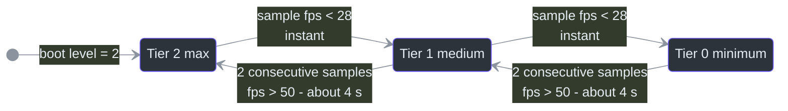
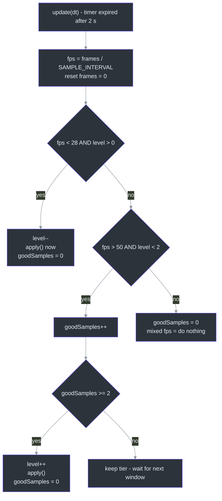
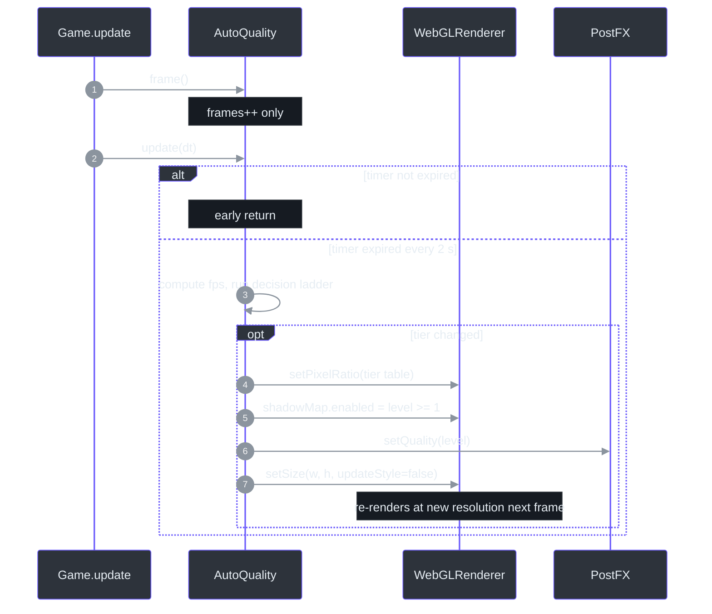

# AutoQuality — Frame-Timing-Driven Quality Tiers

## Overview

**Why does this exist?** CITY RUSH ships with **no user-facing graphics settings**. Instead, an "Edelweiss Optimizer pattern" scaler ([src/systems/AutoQuality.ts:8-12](https://github.com/noiz354/arena-city-try/blob/main/src/systems/AutoQuality.ts#L8-L12)) watches the frame rate and trades visual fidelity for playability automatically: it samples the FPS every 2 seconds, steps a 3-level quality tier down when frames drop below 28, and climbs back up only after sustained comfort above 50. The entire contract between AutoQuality, the renderer, and [PostFX](./postfx.md) is a **single integer** — the quality level 0–2 ([src/systems/AutoQuality.ts:14](https://github.com/noiz354/arena-city-try/blob/main/src/systems/AutoQuality.ts#L14)).

## Architecture

| Piece | Value / behavior | Source |
|---|---|---|
| `SAMPLE_INTERVAL` | `2` s sampling window | [`src/systems/AutoQuality.ts:4`](https://github.com/noiz354/arena-city-try/blob/main/src/systems/AutoQuality.ts#L4) |
| `QUALITY_UP_FPS` | `50` — above this, a sample counts toward upgrading | [`src/systems/AutoQuality.ts:5`](https://github.com/noiz354/arena-city-try/blob/main/src/systems/AutoQuality.ts#L5) |
| `QUALITY_DOWN_FPS` | `28` — below this, instant downgrade | [`src/systems/AutoQuality.ts:6`](https://github.com/noiz354/arena-city-try/blob/main/src/systems/AutoQuality.ts#L6) |
| Construction | `new AutoQuality(renderer, postfx)` in Game's constructor, immediately after PostFX; holds only those two references | [`src/game/Game.ts:150`](https://github.com/noiz354/arena-city-try/blob/main/src/game/Game.ts#L150), [`src/systems/AutoQuality.ts:19-22`](https://github.com/noiz354/arena-city-try/blob/main/src/systems/AutoQuality.ts#L19-L22) |
| Initial level | **2 (maximum)**; boot renderer setup mirrors tier-2 values (`setPixelRatio(min(devicePixelRatio, 2))`, shadows enabled), so AutoQuality's first downgrade is the only path that ever changes them | [`src/systems/AutoQuality.ts:14`](https://github.com/noiz354/arena-city-try/blob/main/src/systems/AutoQuality.ts#L14), [`src/game/Game.ts:123-125`](https://github.com/noiz354/arena-city-try/blob/main/src/game/Game.ts#L123-L125) |
| Pause behavior | The loop never runs while paused — `Game.update` is skipped entirely — so sampling pauses with gameplay | [`src/game/Game.ts:380`](https://github.com/noiz354/arena-city-try/blob/main/src/game/Game.ts#L380) |

<!-- Sources: src/systems/AutoQuality.ts:14,40-50 -->

The asymmetry is the design: **downgrades are instant**, upgrades are hysteresis-gated by requiring **2 consecutive good samples** (≥ 4 seconds of sustained >50 FPS) so the tier doesn't oscillate around the thresholds ([src/systems/AutoQuality.ts:40-50](https://github.com/noiz354/arena-city-try/blob/main/src/systems/AutoQuality.ts#L40-L50)). Mixed or medium FPS is treated as "don't touch" and resets the good-sample streak ([src/systems/AutoQuality.ts:51-53](https://github.com/noiz354/arena-city-try/blob/main/src/systems/AutoQuality.ts#L51-L53)).

## Data Flow — Sampling & Decision Ladder

Per frame, [Game](../core-loop/game-loop.md) makes two calls right after `postfx.update(delta)` ([src/game/Game.ts:455-456](https://github.com/noiz354/arena-city-try/blob/main/src/game/Game.ts#L455-L456)): `quality.frame()` increments only a counter ([src/systems/AutoQuality.ts:28-30](https://github.com/noiz354/arena-city-try/blob/main/src/systems/AutoQuality.ts#L28-L30)), and `quality.update(dt)` decrements the window timer and early-returns until it expires. When the timer fires, `fps = frames / SAMPLE_INTERVAL` is computed and the ladder below runs ([src/systems/AutoQuality.ts:32-38](https://github.com/noiz354/arena-city-try/blob/main/src/systems/AutoQuality.ts#L32-L38)).

<!-- Sources: src/systems/AutoQuality.ts:32-54 -->

<!-- Sources: src/game/Game.ts:455-456, src/systems/AutoQuality.ts:32-63 -->

### Tier effect matrix

| Concern | Level 2 | Level 1 | Level 0 | Source |
|---|---|---|---|---|
| Pixel ratio | `min(window.devicePixelRatio, 2)` | `1` | `0.7` | [`src/systems/AutoQuality.ts:57`](https://github.com/noiz354/arena-city-try/blob/main/src/systems/AutoQuality.ts#L57) |
| Shadow map | ✅ enabled | ✅ enabled | ❌ disabled | [`src/systems/AutoQuality.ts:59`](https://github.com/noiz354/arena-city-try/blob/main/src/systems/AutoQuality.ts#L59) |
| PostFX passes | GTAO + bloom(0.55) + LUT | bloom(0.3) + LUT | chain fully off | [`src/systems/PostFX.ts:111-117`](https://github.com/noiz354/arena-city-try/blob/main/src/systems/PostFX.ts#L111-L117) |
| Resolution re-apply | `renderer.setSize(innerWidth, innerHeight, false)` on every change | same | same | [`src/systems/AutoQuality.ts:61-62`](https://github.com/noiz354/arena-city-try/blob/main/src/systems/AutoQuality.ts#L61-L62) |

Note that AutoQuality delegates *all* post-effect decisions to `postfx.setQuality(level)` ([src/systems/AutoQuality.ts:60](https://github.com/noiz354/arena-city-try/blob/main/src/systems/AutoQuality.ts#L60)) — it owns pixel ratio and shadows, PostFX owns passes. Tier 0's `shadowMap.enabled = false` switches off the shadow-casting sun light configured by [World](../core-loop/game-loop.md)'s lighting rig ([src/game/World.ts:61-70](https://github.com/noiz354/arena-city-try/blob/main/src/game/World.ts#L61-L70)) — the scene keeps its directional light, just without shadow output.

## Components — Public API

| Method / member | Signature | Behavior | Source |
|---|---|---|---|
| `qualityLevel` | getter `(): number` | Read-only access to tier 0–2. No internal consumer anywhere in `src/`; intended for HUD/debug/QA | [`src/systems/AutoQuality.ts:24-26`](https://github.com/noiz354/arena-city-try/blob/main/src/systems/AutoQuality.ts#L24-L26) |
| `frame()` | `(): void` | Must be called exactly once per rendered frame or FPS math goes wrong | [`src/systems/AutoQuality.ts:28-30`](https://github.com/noiz354/arena-city-try/blob/main/src/systems/AutoQuality.ts#L28-L30) |
| `update(dt)` | `(dt: number): void` | Drives the sample window and all tier transitions | [`src/systems/AutoQuality.ts:32-54`](https://github.com/noiz354/arena-city-try/blob/main/src/systems/AutoQuality.ts#L32-L54) |
| `apply()` | private | Single funnel for every side effect — hook telemetry/notices here if needed | [`src/systems/AutoQuality.ts:56-63`](https://github.com/noiz354/arena-city-try/blob/main/src/systems/AutoQuality.ts#L56-L63) |

## Implementation Notes & Extension Points

- To make quality user-selectable: add a setter that writes `level` then calls `apply()` (the field is currently write-private; the getter already exists for UI display).
- To add a fourth tier: widen the `level` range in both branches of `update` and add a case to the ratio expression in `apply`.
- Resize interplay: normal window resizes flow through `Game.resize` → `postfx.setSize` ([src/game/Game.ts:619-628](https://github.com/noiz354/arena-city-try/blob/main/src/game/Game.ts#L619-L628)); tier changes additionally force a `setSize(..., false)` so the new pixel ratio takes effect on the next frame.
- QA visibility: the whole `game` object is exposed on `window` for console probing ([src/main.ts:78](https://github.com/noiz354/arena-city-try/blob/main/src/main.ts#L78)); `game.quality.qualityLevel` is the live tier.

## Unresolved Questions

(none recorded in the implementation wiki for this system)

## Related Pages

| Page | Relationship |
|------|-------------|
| [PostFX](./postfx.md) | Receives `setQuality(level)` and maps tiers onto pass enable flags |
| [ColorGrade](./color-grade.md) | Its LUT pass is the one effect never disabled by quality scaling |
| [Game Loop](../core-loop/game-loop.md) | Calls `frame()`/`update()` at steps 31 of the per-frame sequence; pause stops sampling |
