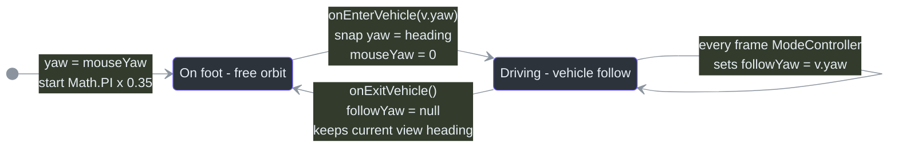
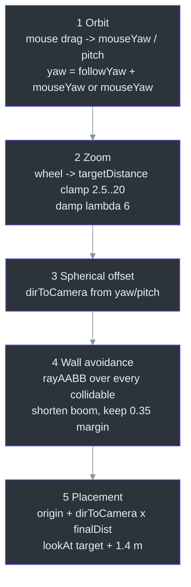
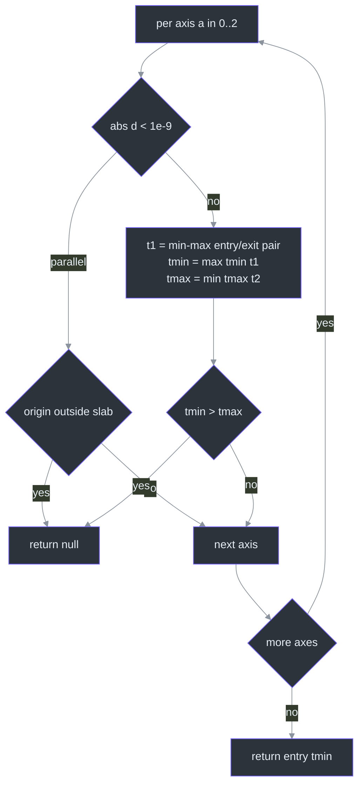
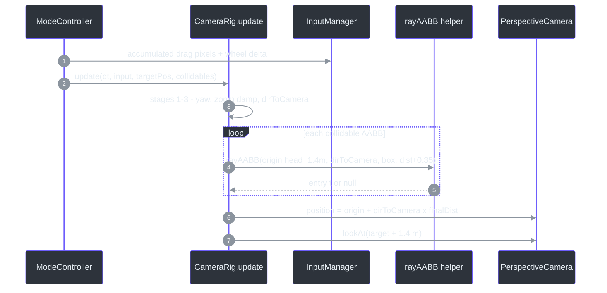

# CameraRig — Follow & Orbit Behavior

## Overview

**Why a custom rig?** A chase camera has to satisfy two contradictory masters: on foot the player owns the view (free orbit), while driving the camera must track a moving vehicle heading *plus* whatever offset the player drags in — GTA-style. CameraRig solves this with one field: `followYaw` is `null` on foot and the vehicle's heading while driving ([src/systems/CameraRig.ts:18-21](https://github.com/noiz354/arena-city-try/blob/main/src/systems/CameraRig.ts#L18-L21)). Around that it orbits a spherical offset behind the target, applies mouse-drag orbit and scroll zoom, shortens its boom when obstacles block the view via a ray-vs-AABB slab test, and smooth-damps zoom changes ([src/systems/CameraRig.ts:13-16](https://github.com/noiz354/arena-city-try/blob/main/src/systems/CameraRig.ts#L13-L16), adapted from "Edelweiss CameraControl.js and 3d-game camera.js").

The rig owns no objects besides the `PerspectiveCamera` reference (created at [src/game/Game.ts:133](https://github.com/noiz354/arena-city-try/blob/main/src/game/Game.ts#L133) with FOV 60, near 0.1, far 2000); it mutates only `camera.position` and the look-at each frame.

## Architecture — Dual Yaw Model

<!-- Sources: src/systems/CameraRig.ts:23-48, src/systems/ModeController.ts:88,155 -->

Mode transitions are driven by [ModeController](../gameplay-core/mode-controller.md): `onEnterVehicle(vehicleYaw)` snaps behind the car — sets `followYaw = vehicleYaw`, zeroes `mouseYaw`, copies heading into `yaw`, clamps current distance into `[MIN_DISTANCE + 2 = 4.5, MAX_DISTANCE]` ([src/systems/CameraRig.ts:38-43](https://github.com/noiz354/arena-city-try/blob/main/src/systems/CameraRig.ts#L38-L43)); `onExitVehicle()` clears `followYaw` so free orbit resumes keeping the current view heading ([src/systems/CameraRig.ts:46-48](https://github.com/noiz354/arena-city-try/blob/main/src/systems/CameraRig.ts#L46-L48)).

## Data Flow — The Five Update Stages

`update(dt, input, targetPos, collidables)` is called from ModeController once per tick in each mode — foot at [src/systems/ModeController.ts:89](https://github.com/noiz354/arena-city-try/blob/main/src/systems/ModeController.ts#L89), driving at [src/systems/ModeController.ts:156](https://github.com/noiz354/arena-city-try/blob/main/src/systems/ModeController.ts#L156) — and runs five stages ([src/systems/CameraRig.ts:50-85](https://github.com/noiz354/arena-city-try/blob/main/src/systems/CameraRig.ts#L50-L85)):

| Stage | What happens | Source |
|---|---|---|
| 1. Orbit | `mouseYaw -= input.mouseDelta.x × 0.0035`; pitch clamped to `[0.05, 0.55]` rad; then `yaw = followYaw === null ? mouseYaw : followYaw + mouseYaw` | [`src/systems/CameraRig.ts:52-54`](https://github.com/noiz354/arena-city-try/blob/main/src/systems/CameraRig.ts#L52-L54) |
| 2. Zoom | wheel scales `targetDistance += wheelDelta × 0.008`, clamped `[2.5, 20]`; actual `distance` exponential-damps toward it with lambda **6** (`MathUtils.damp`) | [`src/systems/CameraRig.ts:57-64`](https://github.com/noiz354/arena-city-try/blob/main/src/systems/CameraRig.ts#L57-L64) |
| 3. Spherical offset | `dirToCamera = (sin(yaw)·cos(pitch), sin(pitch), cos(yaw)·cos(pitch))`; desired point = target + dirToCamera × distance | [`src/systems/CameraRig.ts:66-69`](https://github.com/noiz354/arena-city-try/blob/main/src/systems/CameraRig.ts#L66-L69) |
| 4. Wall avoidance | Ray from target head height (+1.4 m); for every collidable AABB, slab test returns entry distance up to `distance + WALL_MARGIN (0.35)`; if hit is closer than current final distance minus 0.05 hysteresis, shorten to `max(hitT − 0.35, 2.5)` | [`src/systems/CameraRig.ts:71-80`](https://github.com/noiz354/arena-city-try/blob/main/src/systems/CameraRig.ts#L71-L80) |
| 5. Placement | Final position = ray origin + dirToCamera × finalDist; `lookAt(target.x, target.y + 1.4, target.z)`; rotation untouched beyond lookAt | [`src/systems/CameraRig.ts:82-84`](https://github.com/noiz354/arena-city-try/blob/main/src/systems/CameraRig.ts#L82-L84) |

<!-- Sources: src/systems/CameraRig.ts:50-85 -->

Screen shake is layered on top by [PostFX](./postfx.md) *after* this update, bracketing the render call ([src/game/Game.ts:460-466](https://github.com/noiz354/arena-city-try/blob/main/src/game/Game.ts#L460-L466)) — so shake never corrupts rig state.

### Wall avoidance detail — slab method

The module-private `rayAABB` helper ([src/systems/CameraRig.ts:92-118](https://github.com/noiz354/arena-city-try/blob/main/src/systems/CameraRig.ts#L92-L118)) is the classic slab test over x/y/z axes:

<!-- Sources: src/systems/CameraRig.ts:92-118 -->

Note stage 4 iterates **all** boxes even after a hit — later hits can only shorten the boom further, never lengthen it.

<!-- Sources: src/systems/CameraRig.ts:50-85, src/utils/InputManager.ts:45-66 -->

Input comes from `InputManager.mouseDelta` (accumulated drag pixels while left button held, [src/utils/InputManager.ts:45-54](https://github.com/noiz354/arena-city-try/blob/main/src/utils/InputManager.ts#L45-L54)) and `wheelDelta` (accumulated `deltaY`, [src/utils/InputManager.ts:64-66](https://github.com/noiz354/arena-city-try/blob/main/src/utils/InputManager.ts#L64-L66)), both cleared by `input.endFrame()` after the game update ([src/utils/InputManager.ts:171-173](https://github.com/noiz354/arena-city-try/blob/main/src/utils/InputManager.ts#L171-L173)). Mobile touch drag feeds the same accumulator via MobileControls ([src/systems/MobileControls.ts:133](https://github.com/noiz354/arena-city-try/blob/main/src/systems/MobileControls.ts#L133)).

## Components

| Member | Type | Meaning | Source |
|---|---|---|---|
| `yaw` | number (public) | Effective orbit angle around Y; starts `Math.PI × 0.35` (~63°). Read externally — `Player.update` uses it as movement basis | [`src/systems/CameraRig.ts:23`](https://github.com/noiz354/arena-city-try/blob/main/src/systems/CameraRig.ts#L23), [`src/systems/ModeController.ts:87`](https://github.com/noiz354/arena-city-try/blob/main/src/systems/ModeController.ts#L87) |
| `pitch` | number (public) | Boom elevation in radians, range `[0.05, 0.55]` | [`src/systems/CameraRig.ts:24`](https://github.com/noiz354/arena-city-try/blob/main/src/systems/CameraRig.ts#L24) |
| `followYaw` | `number \| null` (public) | Vehicle heading while driving, null on foot — the only shared state written externally mid-frame | [`src/systems/CameraRig.ts:25`](https://github.com/noiz354/arena-city-try/blob/main/src/systems/CameraRig.ts#L25) |
| `mouseYaw` | number (private) | Persistent user orbit offset; reset to 0 on vehicle entry | [`src/systems/CameraRig.ts:27`](https://github.com/noiz354/arena-city-try/blob/main/src/systems/CameraRig.ts#L27) |
| `distance` / `targetDistance` | number (private) | Current vs requested boom length, both start `START_DISTANCE = 9` | [`src/systems/CameraRig.ts:28-29`](https://github.com/noiz354/arena-city-try/blob/main/src/systems/CameraRig.ts#L28-L29) |
| `dirToCamera` / `origin` / `desired` | `Vector3` (private readonly) | Scratch vectors reused per frame to avoid allocation | [`src/systems/CameraRig.ts:31-33`](https://github.com/noiz354/arena-city-try/blob/main/src/systems/CameraRig.ts#L31-L33) |

Collidables come from World buildings ([src/game/World.ts:125-126](https://github.com/noiz354/arena-city-try/blob/main/src/game/World.ts#L125-L126)) plus parked vehicles ([src/systems/VehicleManager.ts:69-72](https://github.com/noiz354/arena-city-try/blob/main/src/systems/VehicleManager.ts#L69-L72)); while driving, the rig deliberately receives world + parked cars but **excludes traffic**, because moving cars would cause snap-jitter in the wall-avoidance ray (comment at [src/systems/ModeController.ts:83-84](https://github.com/noiz354/arena-city-try/blob/main/src/systems/ModeController.ts#L83-L84)).

### Tuning constants

| Constant | Value | Meaning | Source |
|---|---|---|---|
| `MIN_DISTANCE` | `2.5` | Closest boom (also floor for wall-shortened distance) | [`src/systems/CameraRig.ts:5`](https://github.com/noiz354/arena-city-try/blob/main/src/systems/CameraRig.ts#L5) |
| `MAX_DISTANCE` | `20` | Farthest zoom | [`src/systems/CameraRig.ts:6`](https://github.com/noiz354/arena-city-try/blob/main/src/systems/CameraRig.ts#L6) |
| `START_DISTANCE` | `9` | Initial boom length | [`src/systems/CameraRig.ts:7`](https://github.com/noiz354/arena-city-try/blob/main/src/systems/CameraRig.ts#L7) |
| `LOOK_HEIGHT` | `1.4` | Look-at height above target origin ("chest height") | [`src/systems/CameraRig.ts:8`](https://github.com/noiz354/arena-city-try/blob/main/src/systems/CameraRig.ts#L8) |
| `MOUSE_SENSITIVITY` | `0.0035` | Radians per pixel of drag | [`src/systems/CameraRig.ts:9`](https://github.com/noiz354/arena-city-try/blob/main/src/systems/CameraRig.ts#L9) |
| `PITCH_LIMIT` | `0.55` rad (~31.5°) | Max elevation above horizon; min hard-coded 0.05 | [`src/systems/CameraRig.ts:10`](https://github.com/noiz354/arena-city-try/blob/main/src/systems/CameraRig.ts#L10) |
| `WALL_MARGIN` | `0.35` | Gap kept between camera and obstructing geometry | [`src/systems/CameraRig.ts:11`](https://github.com/noiz354/arena-city-try/blob/main/src/systems/CameraRig.ts#L11) |

## Known Findings & Unresolved Questions

Preserved findings — verified against source:

- **Dead scratch vector:** `desired`, computed at [src/systems/CameraRig.ts:69](https://github.com/noiz354/arena-city-try/blob/main/src/systems/CameraRig.ts#L69), is never read afterward — placement recomputes from `origin + dirToCamera × finalDist` instead. It appears to be dead state kept from the source adaptation.
- Wall avoidance iterates every active collidable linearly per frame (no spatial query, unlike enemy LOS which uses chunk queries at [src/game/Game.ts:405](https://github.com/noiz354/arena-city-try/blob/main/src/game/Game.ts#L405)); whether that is a measured perf cost is not recorded.

Extension points: speed-based boom extension while driving would mutate `targetDistance` inside stage 2; non-AABB collision shapes would extend the loop at lines 75–80 with additional intersectors returning entry-t. The initial `yaw = Math.PI × 0.35` defines the opening shot framing.

## Related Pages

| Page | Relationship |
|------|-------------|
| [PostFX](./postfx.md) | Applies screen shake after rig update, bracketing the render call |
| [ModeController](../gameplay-core/mode-controller.md) | Owns mode transitions (`onEnterVehicle`/`onExitVehicle`) and calls `update` per mode |
| [VehicleManager](../vehicles-traffic/vehicle-manager.md) | Supplies parked-car collidables used by the wall-avoidance ray |
| [Game Loop](../core-loop/game-loop.md) | Constructs the rig at boot step 16 and defines where rendering happens relative to camera solve |
