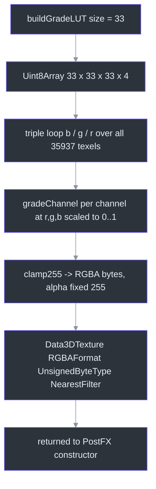
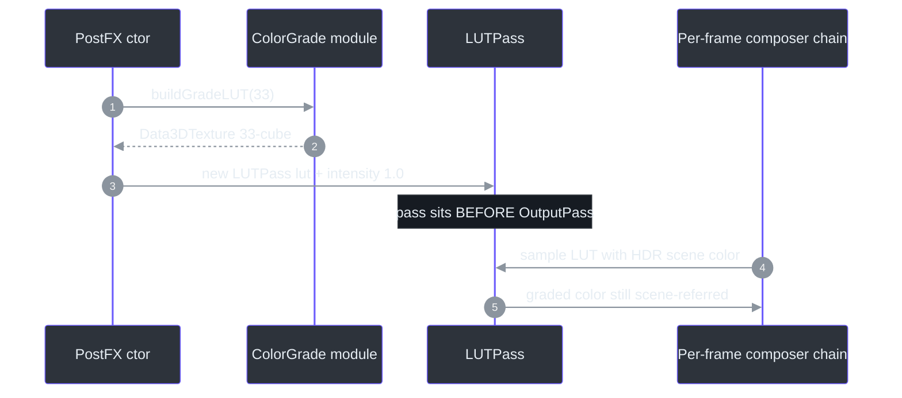
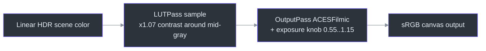

# ColorGrade — Full-Screen Grading Pass

## Overview

**Why a *generated* LUT instead of an image asset?** ColorGrade is a single exported function, `buildGradeLUT(size)`, that procedurally fills a 3D color-grading texture ([src/systems/ColorGrade.ts:10](https://github.com/noiz354/arena-city-try/blob/main/src/systems/ColorGrade.ts#L10)). Because it is pure data — plain loops over a `Uint8Array` — it needs **no GL context and no artist-authored PNG**: it is built at startup, unit-testable, and deterministic. The header describes its intent: *"a 33³ RGBA8 data texture encoding a subtle scene-referred creative grade — gentle contrast + saturation lift, warm shadow lift, slightly cool highlights"* ([src/systems/ColorGrade.ts:4-8](https://github.com/noiz354/arena-city-try/blob/main/src/systems/ColorGrade.ts#L4-L8)). ⚠️ As covered below, the shipped code implements only part of that promise.

It has exactly one consumer: [PostFX](./postfx.md), which calls `buildGradeLUT(33)` to feed an `LUTPass` with intensity 1.0 ([src/systems/PostFX.ts:53](https://github.com/noiz354/arena-city-try/blob/main/src/systems/PostFX.ts#L53)).

## Architecture

| Piece | What it is | Source |
|---|---|---|
| `buildGradeLUT(size = 33)` | Exported factory; allocates `size³ × 4` bytes, fills every texel per-channel, wraps in a `Data3DTexture` | [`src/systems/ColorGrade.ts:10-36`](https://github.com/noiz354/arena-city-try/blob/main/src/systems/ColorGrade.ts#L10-L36) |
| `gradeChannel(x)` | Module-private per-channel transform: linear contrast around 0.5 | [`src/systems/ColorGrade.ts:42-48`](https://github.com/noiz354/arena-city-try/blob/main/src/systems/ColorGrade.ts#L42-L48) |
| `clamp255(x)` | Maps `[0,1]` floats to clamped rounded bytes | [`src/systems/ColorGrade.ts:50-52`](https://github.com/noiz354/arena-city-try/blob/main/src/systems/ColorGrade.ts#L50-L52) |
| Texture config | `RGBAFormat`, `UnsignedByteType`, `NearestFilter` min+mag, `needsUpdate` | [`src/systems/ColorGrade.ts:29-34`](https://github.com/noiz354/arena-city-try/blob/main/src/systems/ColorGrade.ts#L29-L34) |


<!-- Sources: src/systems/ColorGrade.ts:10-36 -->

### The grade itself

The per-channel transform is intentionally minimal ([src/systems/ColorGrade.ts:42-48](https://github.com/noiz354/arena-city-try/blob/main/src/systems/ColorGrade.ts#L42-L48)):

```text
contrast = 1.07
c        = x * contrast - (contrast - 1) * 0.5   // pivot so mid-gray stays put
c        = clamp(c, 0, 1)
```

That is `c = 1.07x − 0.035` — a **linear contrast stretch pivoted on mid-gray**, clamped at both ends. The comment above it reads "gentle S-curve contrast around 0.5", but a linear multiply produces no curvature whatsoever; the docstring's saturation lift, warm shadow lift, and cool highlights are also absent from the code (channels are independent, so no cross-channel shaping exists). The channel-independence rationale is stated in the function's own doc comment ([src/systems/ColorGrade.ts:38-41](https://github.com/noiz354/arena-city-try/blob/main/src/systems/ColorGrade.ts#L38-L41)).

> **Known doc-vs-code finding:** the docstring promises an S-curve/split-toning style grade that the linear contrast code doesn't implement. Recorded in the implementation wiki index ([docs/wiki/index.md:74](https://github.com/noiz354/arena-city-try/blob/main/docs/wiki/index.md#L74)). Preserve this gap when editing either side.


<!-- Sources: src/systems/PostFX.ts:53, src/systems/ColorGrade.ts:10-36 -->

## Data Flow — Where the Grade Sits

Placement is the design decision here: the LUT runs **before tone mapping** (*scene-referred*), so grading happens in linear HDR light and never fights the renderer's ACES filmic curve, which remains the single owner of tone mapping inside `OutputPass` ([src/systems/PostFX.ts:18-21](https://github.com/noiz354/arena-city-try/blob/main/src/systems/PostFX.ts#L18-L21), [src/systems/PostFX.ts:56-57](https://github.com/noiz354/arena-city-try/blob/main/src/systems/PostFX.ts#L56-L57)).


<!-- Sources: src/systems/PostFX.ts:15-21, src/systems/PostFX.ts:53-57, src/game/Game.ts:453 -->

Exposure is applied by tone mapping, not by this pass — [Game](../core-loop/game-loop.md) writes `renderer.toneMappingExposure` each frame via PostFX's single knob ([src/game/Game.ts:453](https://github.com/noiz354/arena-city-try/blob/main/src/game/Game.ts#L453)), fed by the daylight amount from [DayNightSystem](../environment/day-night-system.md) ([src/systems/DayNightSystem.ts:37](https://github.com/noiz354/arena-city-try/blob/main/src/systems/DayNightSystem.ts#L37)).

## Implementation Reference

| API | Signature | Notes | Source |
|---|---|---|---|
| `buildGradeLUT` | `(size?: number): Data3DTexture` | Default 33³; caller owns disposal — PostFX disposes it in `dispose()` | [`src/systems/ColorGrade.ts:10`](https://github.com/noiz354/arena-city-try/blob/main/src/systems/ColorGrade.ts#L10), [`src/systems/PostFX.ts:119-122`](https://github.com/noiz354/arena-city-try/blob/main/src/systems/PostFX.ts#L119-L122) |
| `gradeChannel` | `(x: number): number` private | Contrast 1.07, clamp to `[0,1]` | [`src/systems/ColorGrade.ts:42-48`](https://github.com/noiz354/arena-city-try/blob/main/src/systems/ColorGrade.ts#L42-L48) |
| `clamp255` | `(x: number): number` private | `min(255, max(0, round(x*255)))` | [`src/systems/ColorGrade.ts:50-52`](https://github.com/noiz354/arena-city-try/blob/main/src/systems/ColorGrade.ts#L50-L52) |

Tuning knobs, if you want a stronger look: raise `contrast` past 1.07 (watch highlight clipping once `1.07x − 0.035 > 1`, i.e. `x > 0.967`); implement the promised S-curve by replacing the linear line with an actual curve function; add split-toning by making channels interact. All of it stays unit-testable because nothing here touches GL until the `Data3DTexture` wrapper at the end ([src/systems/ColorGrade.ts:29-35](https://github.com/noiz354/arena-city-try/blob/main/src/systems/ColorGrade.ts#L29-L35)).

## Unresolved Questions

- Whether the docstring (S-curve, saturation, warm shadows, cool highlights) describes an aspiration or a regression is not recorded anywhere in source.
- Saturation handling: the doc comment claims saturation is "applied at the LUT sampling stage" by `LUTPass` ([src/systems/ColorGrade.ts:39-40](https://github.com/noiz354/arena-city-try/blob/main/src/systems/ColorGrade.ts#L39-L40)); whether three.js's `LUTPass` actually performs any saturation adjustment beyond identity sampling is external to this repo (`three/examples/jsm/postprocessing/LUTPass.js`).

## Related Pages

| Page | Relationship |
|------|-------------|
| [PostFX](./postfx.md) | Sole consumer — builds the LUT into its pass chain and owns disposal |
| [AutoQuality](./auto-quality.md) | Keeps the LUT enabled at every quality tier while dropping costlier passes |
| [DayNightSystem](../environment/day-night-system.md) | Drives the exposure value tone mapping applies after this grade |
