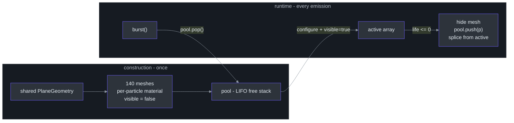
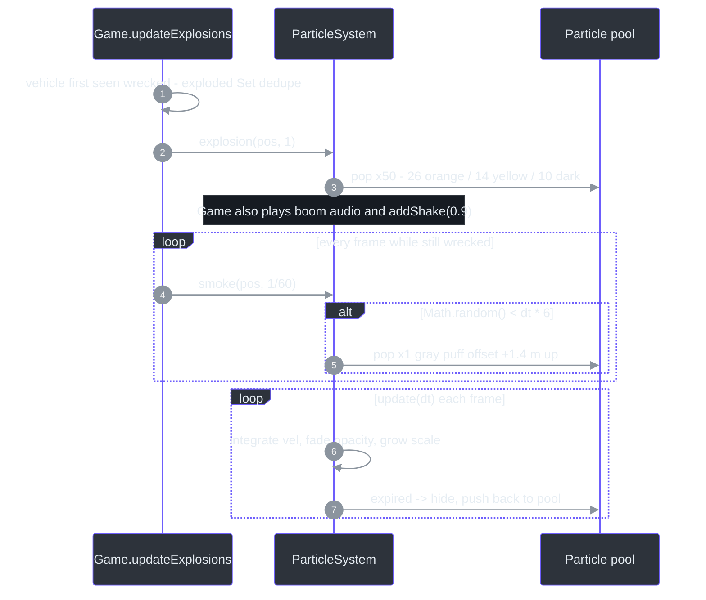
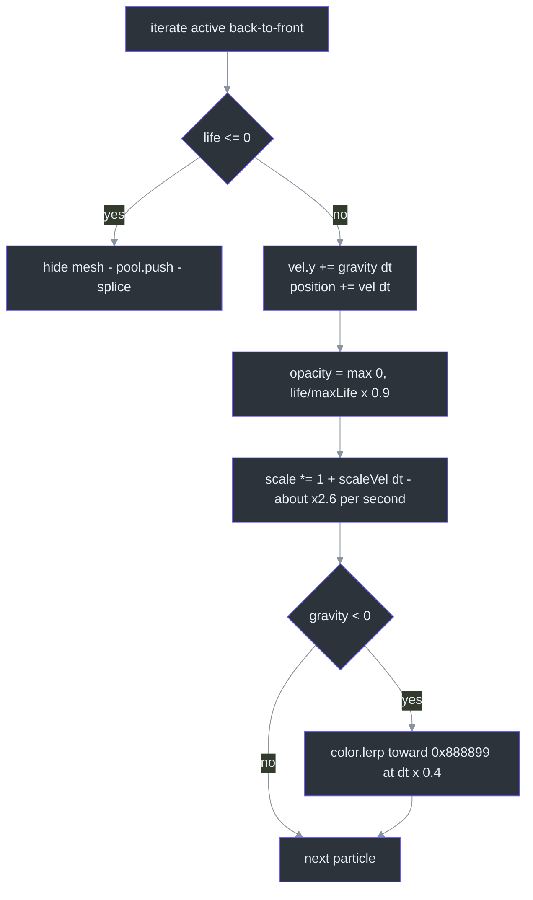

# ParticleSystem — 140-Particle Pool & Explosion Recipe

## Overview

**Why a pool?** Explosions are bursty by nature: one frame needs 50 particles, the next frame none. Allocating meshes/materials at burst time would stutter the exact frames that can least afford it (a vehicle just exploded, camera is shaking). So ParticleSystem pre-creates **140 particle records** at construction and never allocates during the hot update path afterwards — its header cites "interstellar-armada pools.js + SYNTHBLAST Particle patterns" with the explicit goal of zero allocation during gameplay ([src/systems/ParticleSystem.ts:15-19](https://github.com/noiz354/arena-city-try/blob/main/src/systems/ParticleSystem.ts#L15-L19)). All particles are additive-blended quads for explosions, sparks, and smoke.

The only consumer in the game is [Game](../core-loop/game-loop.md)'s wreck pass: vehicle explosions and burning-wreck smoke ([src/game/Game.ts:470-481](https://github.com/noiz354/arena-city-try/blob/main/src/game/Game.ts#L470-L481)).

## Architecture

| Piece | Design | Source |
|---|---|---|
| `Particle` record | `{ mesh, vel: Vector3, life, maxLife, gravity, scaleVel }` | [`src/systems/ParticleSystem.ts:3-10`](https://github.com/noiz354/arena-city-try/blob/main/src/systems/ParticleSystem.ts#L3-L10) |
| `pool` | Free list used as a **LIFO stack** (`pop`/`push`) | [`src/systems/ParticleSystem.ts:21`](https://github.com/noiz354/arena-city-try/blob/main/src/systems/ParticleSystem.ts#L21) |
| `active` | Live particles; spliced on expiry | [`src/systems/ParticleSystem.ts:22`](https://github.com/noiz354/arena-city-try/blob/main/src/systems/ParticleSystem.ts#L22) |
| Geometry | **One shared** `PlaneGeometry(0.5, 0.5)` for all 140 meshes | [`src/systems/ParticleSystem.ts:25`](https://github.com/noiz354/arena-city-try/blob/main/src/systems/ParticleSystem.ts#L25) |
| Material | Per-particle `MeshBasicMaterial`: `transparent`, `depthWrite: false`, blending `2` = AdditiveBlending, opacity 0 | [`src/systems/ParticleSystem.ts:27-31`](https://github.com/noiz354/arena-city-try/blob/main/src/systems/ParticleSystem.ts#L27-L31) |
| Scene presence | Every mesh added to the scene immediately but `visible = false`; toggling visibility is the only activation cost | [`src/systems/ParticleSystem.ts:33-35`](https://github.com/noiz354/arena-city-try/blob/main/src/systems/ParticleSystem.ts#L33-L35) |
| `POOL_SIZE` / `SMOKE_COLOR` | `140` / `0x888899` | [`src/systems/ParticleSystem.ts:12-13`](https://github.com/noiz354/arena-city-try/blob/main/src/systems/ParticleSystem.ts#L12-L13) |

<!-- Sources: src/systems/ParticleSystem.ts:21-45,63-78,95-113 -->

## Data Flow — Emission → Simulation → Recycle

### The explosion recipe

`explosion(pos, scale)` composes three `burst` layers totaling **50 particles** ([src/systems/ParticleSystem.ts:48-52](https://github.com/noiz354/arena-city-try/blob/main/src/systems/ParticleSystem.ts#L48-L52)):

| Layer | Count | Color | Speed | Life | Gravity | Reads as |
|---|---|---|---|---|---|---|
| Fire core | 26 | `0xff9933` orange | `8 × scale` | 0.9 s | `+6` (rise fast) | bright flash |
| Sparks | 14 | `0xffd166` yellow | `4 × scale` | 0.6 s | `+2` | mid-air glow |
| Smoke puffs | 10 | `0x555566` dark | `2 × scale` | 1.6 s | `−1.5` → smoke-tint lerp | lingering haze |

Pool exhaustion semantics: an explosion demands 50 free particles out of 140; if fewer remain, `burst` emits what it can and silently drops the rest — the early `return` per particle when `pool.pop()` comes up empty ([src/systems/ParticleSystem.ts:63-65](https://github.com/noiz354/arena-city-try/blob/main/src/systems/ParticleSystem.ts#L63-L65)). No error, no overdraw.

Per emitted particle: random azimuth over the full circle, speed `Math.random() * speed`, velocity `(cos(a)·v, (rand − 0.2)·speed, sin(a)·v)` — the y-bias makes ~80% of particles start rising ([src/systems/ParticleSystem.ts:66-68](https://github.com/noiz354/arena-city-try/blob/main/src/systems/ParticleSystem.ts#L66-L68)); lifetime jittered to `life × (0.6 + rand × 0.7)` ([src/systems/ParticleSystem.ts:69](https://github.com/noiz354/arena-city-try/blob/main/src/systems/ParticleSystem.ts#L69)); `scaleVel` fixed at 1.5 ([src/systems/ParticleSystem.ts:71](https://github.com/noiz354/arena-city-try/blob/main/src/systems/ParticleSystem.ts#L71)); initial scale `0.4 + rand × 0.8`, opacity 0.95 ([src/systems/ParticleSystem.ts:74-76](https://github.com/noiz354/arena-city-try/blob/main/src/systems/ParticleSystem.ts#L74-L76)).

<!-- Sources: src/game/Game.ts:470-481, src/systems/ParticleSystem.ts:82-93,95-113 -->

Wreck smoke uses probabilistic continuous emission: a single gray `0x777788` particle fires with probability `dt × 6` per call (expected ~6/s), spawned ±0.3 m around the source and +1.4 m up, speed 1.2, life 2.2 s, gravity +1.2 (rising) ([src/systems/ParticleSystem.ts:82-93](https://github.com/noiz354/arena-city-try/blob/main/src/systems/ParticleSystem.ts#L82-L93)).

### The update loop

Called once per frame from `Game.update` ([src/game/Game.ts:449](https://github.com/noiz354/arena-city-try/blob/main/src/game/Game.ts#L449)); iterates `active` back-to-front so splicing stays safe ([src/systems/ParticleSystem.ts:95-113](https://github.com/noiz354/arena-city-try/blob/main/src/systems/ParticleSystem.ts#L95-L113)):

<!-- Sources: src/systems/ParticleSystem.ts:95-113 -->

⚠️ **Sign convention gotcha:** positive `gravity` pushes particles *upward* here (`vel.y += gravity*dt` with y-up world). The negative-gravity third layer of `explosion` therefore decelerates/descends while getting smoke-tinted, whereas wreck smoke uses positive gravity and genuinely rises — the two "smoke" behaviors diverge visually ([src/systems/ParticleSystem.ts:51](https://github.com/noiz354/arena-city-try/blob/main/src/systems/ParticleSystem.ts#L51) vs [src/systems/ParticleSystem.ts:90](https://github.com/noiz354/arena-city-try/blob/main/src/systems/ParticleSystem.ts#L90)).

## Components — Public API

| Method | Signature | Behavior | Source |
|---|---|---|---|
| `explosion` | `(pos: Vector3, scale?: number): void` | Three-layer 26/14/10 burst (table above) | [`src/systems/ParticleSystem.ts:47-52`](https://github.com/noiz354/arena-city-try/blob/main/src/systems/ParticleSystem.ts#L47-L52) |
| `smoke` | `(pos: Vector3, dt: number): void` | Probabilistic gray puff for wrecks, `dt × 6` chance | [`src/systems/ParticleSystem.ts:81-93`](https://github.com/noiz354/arena-city-try/blob/main/src/systems/ParticleSystem.ts#L81-L93) |
| `update` | `(dt: number): void` | Integration / fade / grow / recycle loop | [`src/systems/ParticleSystem.ts:95`](https://github.com/noiz354/arena-city-try/blob/main/src/systems/ParticleSystem.ts#L95) |
| `dispose` | `(): void` | Hides and removes all meshes, disposes geometry and materials, clears arrays | [`src/systems/ParticleSystem.ts:115-124`](https://github.com/noiz354/arena-city-try/blob/main/src/systems/ParticleSystem.ts#L115-L124) |

New effects follow the `explosion` pattern: one public method composing existing `burst` calls with different color/speed/life/gravity arguments ([src/systems/ParticleSystem.ts:48-52](https://github.com/noiz354/arena-city-try/blob/main/src/systems/ParticleSystem.ts#L48-L52)). WeaponSystem deliberately does *not* use this system — it has its own non-pooled tracer/flash effects ([src/systems/WeaponSystem.ts:284-337](https://github.com/noiz354/arena-city-try/blob/main/src/systems/WeaponSystem.ts#L284-L337)); the two share no code.

### Interactions map

| Counterparty | Direction | What flows | Source |
|---|---|---|---|
| Game | creates / updates / disposes | constructed with the shared scene; `update(dt)` at step 26; wreck pass at step 27; disposed in `Game.destroy` | [`src/game/Game.ts:177`](https://github.com/noiz354/arena-city-try/blob/main/src/game/Game.ts#L177), [`src/game/Game.ts:449`](https://github.com/noiz354/arena-city-try/blob/main/src/game/Game.ts#L449), [`src/game/Game.ts:367`](https://github.com/noiz354/arena-city-try/blob/main/src/game/Game.ts#L367) |
| Vehicle entity | triggers via state | `Vehicle.wrecked` flips inside `takeDamage` when health hits 0, which is what the wreck pass watches | [`src/entities/Vehicle.ts:168-176`](https://github.com/noiz354/arena-city-try/blob/main/src/entities/Vehicle.ts#L168-L176) |
| PostFX | paired feedback | explosion frames also fire `addShake(0.9)` through the shake API | [`src/systems/PostFX.ts:71-73`](https://github.com/noiz354/arena-city-try/blob/main/src/systems/PostFX.ts#L71-L73), [`src/game/Game.ts:476`](https://github.com/noiz354/arena-city-try/blob/main/src/game/Game.ts#L476) |

## Known Findings & Unresolved Questions

Preserved from the implementation wiki — verified against source:

- **Quads never billboard**: `PlaneGeometry` faces +Z and nothing rotates it per-frame, so particles present edge-on from side views ([src/systems/ParticleSystem.ts:25](https://github.com/noiz354/arena-city-try/blob/main/src/systems/ParticleSystem.ts#L25)).
- **"Zero allocation" claim leaks slightly**: `smoke()` clones pos and news a `Vector3` per emitted particle ([src/systems/ParticleSystem.ts:85](https://github.com/noiz354/arena-city-try/blob/main/src/systems/ParticleSystem.ts#L85)); the hot `update` path itself is alloc-free.
- `dispose()` disposes the same shared geometry 140 times — harmless in three.js but redundant ([src/systems/ParticleSystem.ts:119](https://github.com/noiz354/arena-city-try/blob/main/src/systems/ParticleSystem.ts#L119)).
- Additive blending means smoke reads as glow, not obscuring fog — fine for night scenes, weak in daylight.
- The wreck-smoke caller hard-codes `1/60` as dt rather than passing real delta ([src/game/Game.ts:478](https://github.com/noiz354/arena-city-try/blob/main/src/game/Game.ts#L478)), so emission probability is tied to 60 FPS assumptions.

## Related Pages

| Page | Relationship |
|------|-------------|
| [PostFX](./postfx.md) | Explosion pairs with `addShake(0.9)` screen shake impulses |
| [Game Loop](../core-loop/game-loop.md) | Owns step 26 (`particles.update`) and step 27 (wreck explosion/smoke pass) of the frame sequence |
| [Entities](../core-loop/entities.md) | `Vehicle.wrecked` flips inside `takeDamage`, triggering the explosion consumer |
