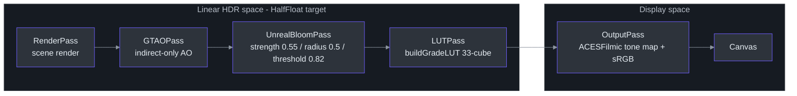
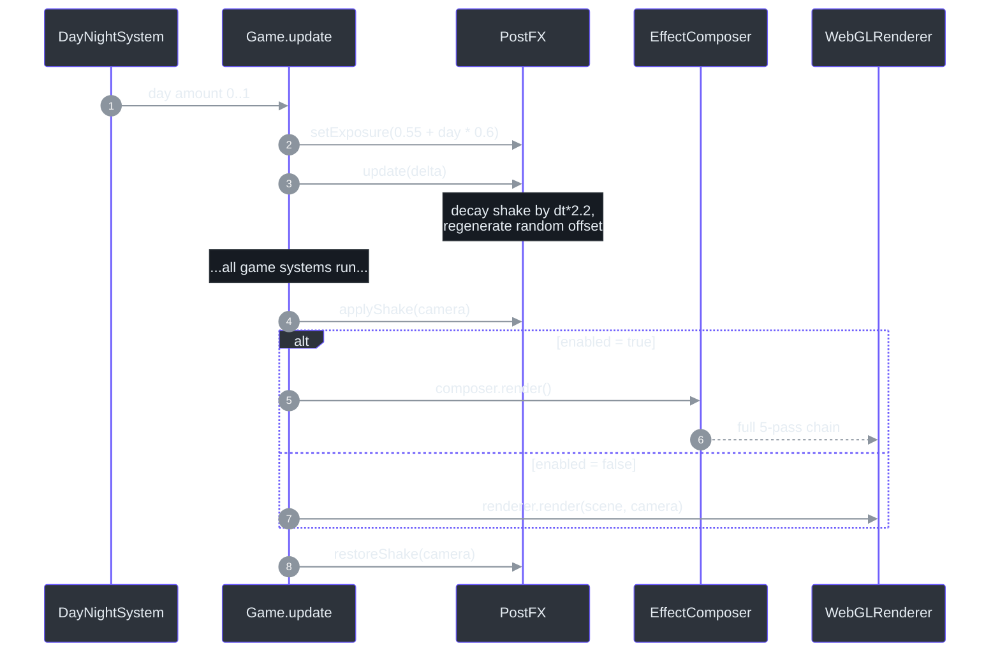
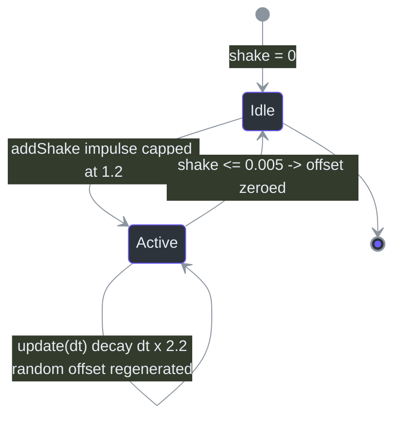

# PostFX — EffectComposer Pass Chain

## Overview

**Why does this exist?** Every visual between the raw 3D scene and your screen pixels flows through one object. PostFX owns an ordered, single-owner HDR post-processing chain built on three.js `EffectComposer`, running in linear HDR on the composer's default HalfFloat target ([src/systems/PostFX.ts:10-13](https://github.com/noiz354/arena-city-try/blob/main/src/systems/PostFX.ts#L10-L13)). It encapsulates four concerns that would otherwise scatter across the codebase:

1. **The pass chain** — RenderPass → GTAO ambient occlusion → HDR bloom → LUT color grade → OutputPass tone-map/sRGB ([src/systems/PostFX.ts:15-17](https://github.com/noiz354/arena-city-try/blob/main/src/systems/PostFX.ts#L15-L17))
2. **Screen shake** — a decaying energy accumulator applied directly to the camera around each render call
3. **The single exposure knob** — `renderer.toneMappingExposure`, driven by the day/night daylight model
4. **Quality tiers** — a `setQuality(level)` API consumed by [AutoQuality](./auto-quality.md)

Tone mapping has exactly one owner — the renderer's ACESFilmic setting, applied by `OutputPass` — and the LUT grade is placed *before* it so the two never fight ([src/systems/PostFX.ts:18-21](https://github.com/noiz354/arena-city-try/blob/main/src/systems/PostFX.ts#L18-L21)). Bloom likewise composites pre-tone-map.

## Architecture — The Pass Chain

| # | Pass | Key parameters | Role | Source |
|---|------|----------------|------|--------|
| 1 | `RenderPass(scene, camera)` | — | Renders the scene into the composer's HalfFloat HDR target | [`src/systems/PostFX.ts:40-41`](https://github.com/noiz354/arena-city-try/blob/main/src/systems/PostFX.ts#L40-L41) |
| 2 | `GTAOPass` | `output = GTAOPass.OUTPUT.Default` | Ambient occlusion; modulates *indirect* light only (visibility blend, not a dark multiply over emissive/direct) | [`src/systems/PostFX.ts:44-46`](https://github.com/noiz354/arena-city-try/blob/main/src/systems/PostFX.ts#L44-L46) |
| 3 | `UnrealBloomPass` | strength **0.55**, radius **0.5**, threshold **0.82** | HDR glow, composited pre-tone-map | [`src/systems/PostFX.ts:49`](https://github.com/noiz354/arena-city-try/blob/main/src/systems/PostFX.ts#L49) |
| 4 | `LUTPass` | `buildGradeLUT(33)`, intensity **1.0** | Scene-referred creative grade (see [ColorGrade](./color-grade.md)) before tone mapping | [`src/systems/PostFX.ts:53`](https://github.com/noiz354/arena-city-try/blob/main/src/systems/PostFX.ts#L53) |
| 5 | `OutputPass()` | renderer's ACESFilmic + sRGB | The sole owner of tone mapping and sRGB conversion; must stay last | [`src/systems/PostFX.ts:57`](https://github.com/noiz354/arena-city-try/blob/main/src/systems/PostFX.ts#L57) |

<!-- Sources: src/systems/PostFX.ts:40-57 -->

Construction happens once inside `Game`'s constructor (`new PostFX(renderer, scene, camera)` at [src/game/Game.ts:149](https://github.com/noiz354/arena-city-try/blob/main/src/game/Game.ts#L149)), after the renderer is configured with ACESFilmic tone mapping and initial exposure 1.1 ([src/game/Game.ts:127-128](https://github.com/noiz354/arena-city-try/blob/main/src/game/Game.ts#L127-L128)). The constructor immediately sizes all passes from `renderer.getSize()` to avoid persisting a stale 1×1-pass state until the first window resize ([src/systems/PostFX.ts:59-63](https://github.com/noiz354/arena-city-try/blob/main/src/systems/PostFX.ts#L59-L63)).

## Data Flow — Per-Frame Sequence

Rendering branches on the public `enabled` flag: `true` routes through `composer.render()` (full chain); `false` falls back to raw `renderer.render(scene, camera)` bypassing all passes ([src/systems/PostFX.ts:33](https://github.com/noiz354/arena-city-try/blob/main/src/systems/PostFX.ts#L33), [src/game/Game.ts:461-465](https://github.com/noiz354/arena-city-try/blob/main/src/game/Game.ts#L461-L465)). This is the QA on/off toggle reachable via `window.game.postfx` ([src/main.ts:78](https://github.com/noiz354/arena-city-try/blob/main/src/main.ts#L78)).

<!-- Sources: src/game/Game.ts:453-466, src/systems/PostFX.ts:75-104 -->

Because `EffectComposer` wraps the whole frame into one draw when `renderer.info.autoReset` is true, `renderer.info.render.calls` reads as **1 per composer render** — a documented runtime/QA observation recorded in [`tests/E2E_CHROME_DEVTOOLS.md:241`](https://github.com/noiz354/arena-city-try/blob/main/tests/E2E_CHROME_DEVTOOLS.md#L241). Don't mistake that reading for "the scene renders in one draw call".

On window resize, `Game.resize` forwards width/height to `postfx.setSize`, which resizes the composer plus the bloom and GTAO targets ([src/game/Game.ts:619-628](https://github.com/noiz354/arena-city-try/blob/main/src/game/Game.ts#L619-L628), [src/systems/PostFX.ts:65-69](https://github.com/noiz354/arena-city-try/blob/main/src/systems/PostFX.ts#L65-L69)).

## Components

### Screen shake

Shake is energy-based, not keyframed:

| Aspect | Value / behavior | Source |
|---|---|---|
| Accumulation | `addShake(intensity)` adds to `shake`, hard-capped at **1.2** | [`src/systems/PostFX.ts:71-73`](https://github.com/noiz354/arena-city-try/blob/main/src/systems/PostFX.ts#L71-L73) |
| Decay | `update(dt)` subtracts **dt × 2.2** per frame | [`src/systems/PostFX.ts:75-77`](https://github.com/noiz354/arena-city-try/blob/main/src/systems/PostFX.ts#L75-L77) |
| Offset while active (`shake > 0.005`) | random `(rand−0.5) × shake × 0.35` on x/y, `× 0.2` on z | [`src/systems/PostFX.ts:78-82`](https://github.com/noiz354/arena-city-try/blob/main/src/systems/PostFX.ts#L78-L82) |
| Application | `applyShake` adds offset to `camera.position` before render; `restoreShake` subtracts after — must bracket the render call | [`src/systems/PostFX.ts:97-104`](https://github.com/noiz354/arena-city-try/blob/main/src/systems/PostFX.ts#L97-L104) |

Impulse sources observed in code: vehicle wreck first-explosion `addShake(0.9)` ([src/game/Game.ts:476](https://github.com/noiz354/arena-city-try/blob/main/src/game/Game.ts#L476)), car-vs-pedestrian kills `0.5` / knockdowns `0.2` ([src/game/Game.ts:514](https://github.com/noiz354/arena-city-try/blob/main/src/game/Game.ts#L514)), traffic hitting the player `0.4` ([src/game/Game.ts:562](https://github.com/noiz354/arena-city-try/blob/main/src/game/Game.ts#L562)), enemy melee `0.3` ([src/systems/ModeController.ts:109](https://github.com/noiz354/arena-city-try/blob/main/src/systems/ModeController.ts#L109)).

<!-- Sources: src/systems/PostFX.ts:71-86 -->

### Quality tiers

`setQuality(level)` maps an FPS tier from [AutoQuality](./auto-quality.md) onto pass enable flags ([src/systems/AutoQuality.ts:60](https://github.com/noiz354/arena-city-try/blob/main/src/systems/AutoQuality.ts#L60)):

| Tier | GTAO | Bloom | Bloom strength | LUT | Whole chain |
|---|---|---|---|---|---|
| 2 (max) | ✅ | ✅ | 0.55 | ✅ always | ✅ |
| 1 (medium) | ❌ | ✅ | 0.3 | ✅ always | ✅ |
| 0 (min) | ❌ | ❌ | — | — | ❌ (`enabled = false`) |

Source: [`src/systems/PostFX.ts:111-117`](https://github.com/noiz354/arena-city-try/blob/main/src/systems/PostFX.ts#L111-L117). GTAO drops first because it is the most expensive effect; the LUT stays because it is cheap ([src/systems/PostFX.ts:106-110](https://github.com/noiz354/arena-city-try/blob/main/src/systems/PostFX.ts#L106-L110)).

### Exposure knob

`setExposure(value)` writes `renderer.toneMappingExposure` — nothing else touches it ([src/systems/PostFX.ts:88-95](https://github.com/noiz354/arena-city-try/blob/main/src/systems/PostFX.ts#L88-L95)). `Game.update` drives it from the daylight model: `postfx.setExposure(0.55 + dayNight.day * 0.6)` → range **0.55 (night) → 1.15 (noon)** ([src/game/Game.ts:453](https://github.com/noiz354/arena-city-try/blob/main/src/game/Game.ts#L453)); the `day` amount comes from [DayNightSystem](../environment/day-night-system.md) ([src/systems/DayNightSystem.ts:37](https://github.com/noiz354/arena-city-try/blob/main/src/systems/DayNightSystem.ts#L37)).

## Implementation Reference

| Member | Type | Meaning | Source |
|---|---|---|---|
| `composer` | `EffectComposer` (readonly) | The pass chain; publicly readable so `Game` can call `composer.render()` | [`src/systems/PostFX.ts:27`](https://github.com/noiz354/arena-city-try/blob/main/src/systems/PostFX.ts#L27) |
| `bloom` / `gtao` / `lut` | private readonly passes | The three toggleable middle passes | [`src/systems/PostFX.ts:28-30`](https://github.com/noiz354/arena-city-try/blob/main/src/systems/PostFX.ts#L28-L30) |
| `shakeOffset` | `Vector3` (private readonly) | Randomized per-frame displacement derived from `shake` | [`src/systems/PostFX.ts:31`](https://github.com/noiz354/arena-city-try/blob/main/src/systems/PostFX.ts#L31) |
| `shake` | number (private) | Accumulated shake energy, capped at 1.2 | [`src/systems/PostFX.ts:32`](https://github.com/noiz354/arena-city-try/blob/main/src/systems/PostFX.ts#L32) |
| `enabled` | boolean (public, default `true`) | Master toggle routing render calls | [`src/systems/PostFX.ts:33`](https://github.com/noiz354/arena-city-try/blob/main/src/systems/PostFX.ts#L33) |
| `dispose()` | method | Disposes the composer and generated LUT texture | [`src/systems/PostFX.ts:119-122`](https://github.com/noiz354/arena-city-try/blob/main/src/systems/PostFX.ts#L119-L122) |

## Known Doc-vs-Code Findings & Unresolved Questions

These are preserved findings from the implementation wiki — do not silently "fix" them in docs:

- The header comment says GTAO runs "half-res internally" ([src/systems/PostFX.ts:43](https://github.com/noiz354/arena-city-try/blob/main/src/systems/PostFX.ts#L43)) but the pass is constructed with `(scene, camera, 1, 1)` and resized full-frame in `setSize`; the half-res behavior lives inside `GTAOPass` itself and isn't visible from this file.
- `GTAOPass` receives no AO parameter tuning (radius/intensity/clamp are defaults); whether defaults were validated visually is not recorded.
- Nothing disposes `PostFX.composer` from `Game.destroy()` — `dispose()` exists but Game never calls it ([src/game/Game.ts:355-370](https://github.com/noiz354/arena-city-try/blob/main/src/game/Game.ts#L355-L370) vs [src/systems/PostFX.ts:119-122](https://github.com/noiz354/arena-city-try/blob/main/src/systems/PostFX.ts#L119-L122)). Harmless on page teardown, but leaks GPU targets if `Game` were recreated in-page.

## Related Pages

| Page | Relationship |
|------|-------------|
| [ColorGrade](./color-grade.md) | Supplies `buildGradeLUT(33)` consumed by the LUT pass |
| [AutoQuality](./auto-quality.md) | Drives `setQuality(level)` from frame timing |
| [CameraRig](./camera-rig.md) | Positions the camera; PostFX applies shake *after* rig update so rig state stays clean |
| [ParticleSystem](./particle-system.md) | Explosion visuals pair with `addShake(0.9)` impulses |
| [Game Loop](../core-loop/game-loop.md) | Owns the per-frame ordering: exposure → shake update → render branch → restore |
| [DayNightSystem](../environment/day-night-system.md) | Provides the `day` value feeding the exposure formula |
