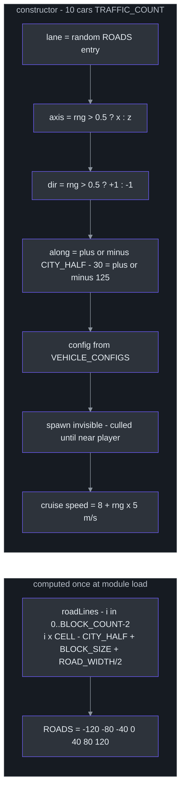
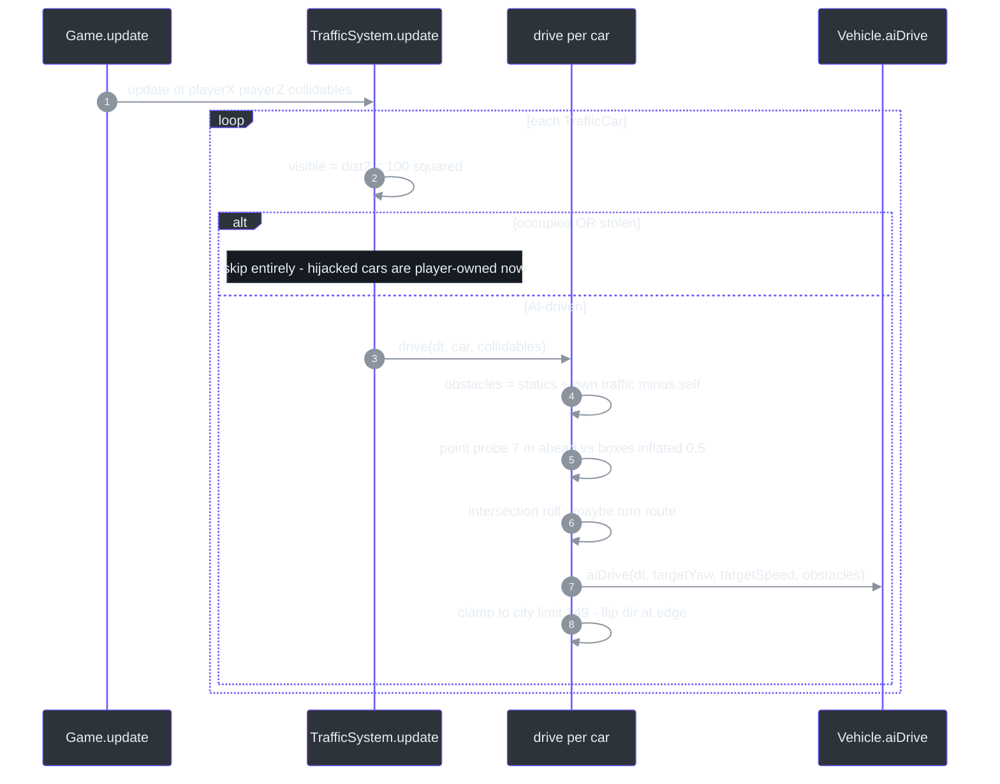
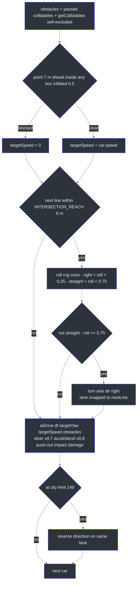
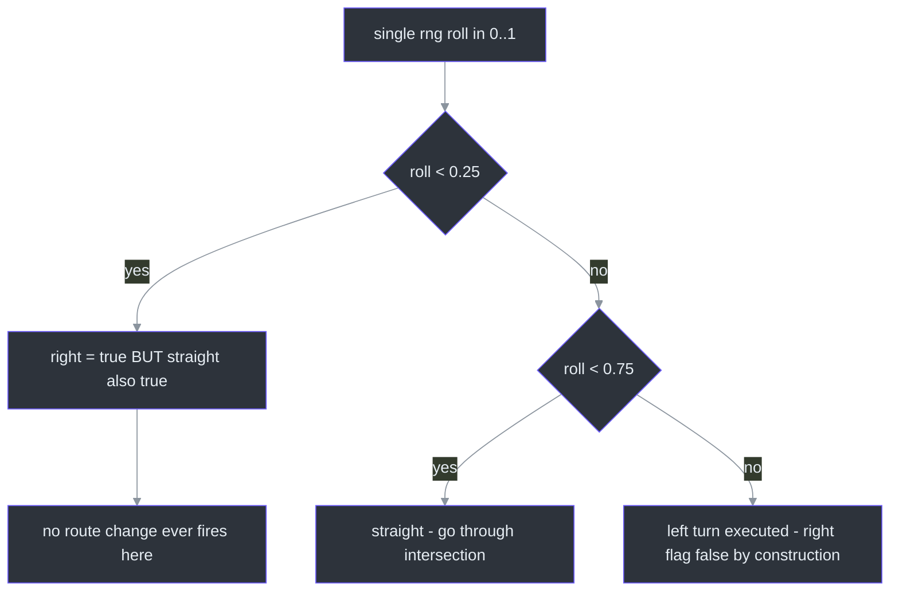
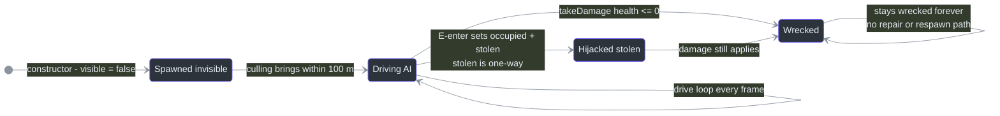

# TrafficSystem — AI Driving & the Right-Turn RNG Quirk

## Overview

**Why does this exist?** The city needs ambient life beyond parked cars: a fixed pool of AI cars that follow the road grid, choose turns at intersections, brake for obstacles ahead, get culled far from the player, and can be hijacked (player presses E → AI permanently releases the car). It also answers "nearest enterable traffic car" queries and exposes its cars as solid collidables so vehicles and players can't overlap ([src/systems/TrafficSystem.ts:50-54](https://github.com/noiz354/arena-city-try/blob/main/src/systems/TrafficSystem.ts#L50-L54)).

Everything is deterministic: spawn rolls come from a seeded mulberry32 PRNG (`0x7a11ca9`), so the traffic pattern is identical every run ([src/systems/TrafficSystem.ts:57](https://github.com/noiz354/arena-city-try/blob/main/src/systems/TrafficSystem.ts#L57)) — same determinism story as [CityGenerator](../world-generation/city-generator.md) and [VehicleManager](./vehicle-manager.md).

## Architecture — The Road Grid Model

`roadLines()` builds one center-line coordinate per axis for every gap between blocks: `i * CELL − CITY_HALF + BLOCK_SIZE + ROAD_WIDTH / 2` for `i` in `[0, BLOCK_COUNT−2]` ([src/systems/TrafficSystem.ts:8-14](https://github.com/noiz354/arena-city-try/blob/main/src/systems/TrafficSystem.ts#L8-L14)). With grid constants from CityGenerator (`CELL = 40`, `BLOCK_SIZE = 30`, `ROAD_WIDTH = 10`, `CITY_HALF = 155`, [src/systems/CityGenerator.ts:4-9](https://github.com/noiz354/arena-city-try/blob/main/src/systems/CityGenerator.ts#L4-L9)) this yields exactly **7 lanes per axis**:


<!-- Sources: src/systems/TrafficSystem.ts:8-21,59-80 -->

Heading convention: `yawFor(axis, dir)` maps `(x,+1)→π/2`, `(x,−1)→−π/2`, `(z,+1)→0`, `(z,−1)→π`, matching Vehicle's `forward = (sin yaw, cos yaw)` ([src/systems/TrafficSystem.ts:32-36](https://github.com/noiz354/arena-city-try/blob/main/src/systems/TrafficSystem.ts#L32-L36), [src/entities/Vehicle.ts:66-68](https://github.com/noiz354/arena-city-try/blob/main/src/entities/Vehicle.ts#L66-L68)). All cars drive exact center lines — opposing traffic shares one line and relies on the stop-ahead probe plus push-out to avoid head-ons.

### Data structures

| Structure | Shape | Meaning | Source |
|---|---|---|---|
| `Axis` | `'x' \| 'z'` | Travel axis | [`src/systems/TrafficSystem.ts:23`](https://github.com/noiz354/arena-city-try/blob/main/src/systems/TrafficSystem.ts#L23) |
| `Route` | `{ axis, dir: 1 \| -1, lane }` | Current road: axis, travel sign, fixed perpendicular coordinate (a `ROADS` value) | [`src/systems/TrafficSystem.ts:25-30`](https://github.com/noiz354/arena-city-try/blob/main/src/systems/TrafficSystem.ts#L25-L30) |
| `TrafficCar` | `{ vehicle, route, speed }` | One AI car + plan + desired cruise speed | [`src/systems/TrafficSystem.ts:44-48`](https://github.com/noiz354/arena-city-try/blob/main/src/systems/TrafficSystem.ts#L44-L48) |
| `cars` | readonly `TrafficCar[]`, length 10 forever | Fixed pool; never recycled or respawned elsewhere | [`src/systems/TrafficSystem.ts:56`](https://github.com/noiz354/arena-city-try/blob/main/src/systems/TrafficSystem.ts#L56) |

## Data Flow — Per-Car Drive Pipeline

[Game](../core-loop/game-loop.md) calls `traffic.update(delta, pos.x, pos.z, allCollidables)` where `allCollidables = world.getCollidables().concat(vehicles.getCollidables())` — buildings + parked cars ([src/game/Game.ts:397-398](https://github.com/noiz354/arena-city-try/blob/main/src/game/Game.ts#L397-L398), [src/game/Game.ts:408](https://github.com/noiz354/arena-city-try/blob/main/src/game/Game.ts#L408)). Traffic-vs-traffic collidables are added internally inside `drive()`.


<!-- Sources: src/systems/TrafficSystem.ts:117-187, src/game/Game.ts:397-408 -->

Inside `drive()` ([src/systems/TrafficSystem.ts:131-187](https://github.com/noiz354/arena-city-try/blob/main/src/systems/TrafficSystem.ts#L131-L187)):


<!-- Sources: src/systems/TrafficSystem.ts:140-186, src/entities/Vehicle.ts:133-153 -->

The blocked probe is a single point `SAFE_GAP = 7` m ahead along forward `(sin yaw, cos yaw)`, blocked if it falls inside any obstacle box inflated by 0.5 m on x/z ([src/systems/TrafficSystem.ts:142-154](https://github.com/noiz354/arena-city-try/blob/main/src/systems/TrafficSystem.ts#L142-L154)); `targetSpeed` is binary stop/go — no gradual slowdown ([src/systems/TrafficSystem.ts:156](https://github.com/noiz354/arena-city-try/blob/main/src/systems/TrafficSystem.ts#L156)).

### ⚠️ The turn-RNG quirk: right turns are unreachable

This is the headline finding preserved from the implementation wiki. At an intersection the code rolls the RNG **once** and derives both flags from that single roll ([src/systems/TrafficSystem.ts:167-169](https://github.com/noiz354/arena-city-try/blob/main/src/systems/TrafficSystem.ts#L167-L169)):

```text
roll   = this.rng()
right  = roll < 0.25     // implies straight === true below
straight = roll < 0.75
if (!straight) { ...turn(right)... }
```

A route change happens only when `!straight` (i.e. `roll ≥ 0.75`) — but `right === true` requires `roll < 0.25`. Those conditions can never hold together, so **every executed turn has `right = false`: all turns are left turns in practice, ~75% straight / ~25% left**, and the documented right-turn mapping ([src/systems/TrafficSystem.ts:38-42](https://github.com/noiz354/arena-city-try/blob/main/src/systems/TrafficSystem.ts#L38-L42)) is dead code at runtime ([docs/wiki/index.md:72](https://github.com/noiz354/arena-city-try/blob/main/docs/wiki/index.md#L72)). Source alone can't confirm whether 75/25 straight/left was intended or should be e.g. 50% straight / 25% right / 25% left.


<!-- Sources: src/systems/TrafficSystem.ts:165-176 -->

## Components — Public API & Lifecycle

| Method | Signature | Behavior | Source |
|---|---|---|---|
| `getNearest` | `(x: number, z: number): Vehicle \| null` | Nearest hijackable car within `ENTER_DIST² = 12.96` (3.6 m). Skips `occupied`, invisible, `wrecked`. Used only after [VehicleManager](./vehicle-manager.md)'s query misses, so parked cars win ties by priority | [`src/systems/TrafficSystem.ts:84-99`](https://github.com/noiz354/arena-city-try/blob/main/src/systems/TrafficSystem.ts#L84-L99) |
| `getCollidables` | `(exclude?: Vehicle): Collidable[]` | Visible non-excluded cars as `{ box }`. Wrecked cars **stay solid**; invisible ⇒ no collider | [`src/systems/TrafficSystem.ts:101-114`](https://github.com/noiz354/arena-city-try/blob/main/src/systems/TrafficSystem.ts#L101-L114) |
| `update` | `(dt, playerX, playerZ, collidables): void` | Culling + AI drive; `collidables` must be buildings+parked, traffic-vs-traffic added internally | [`src/systems/TrafficSystem.ts:117-129`](https://github.com/noiz354/arena-city-try/blob/main/src/systems/TrafficSystem.ts#L117-L129) |
| `dispose` | `(): void` | Per-car mesh/material dispose + group removal, empties `cars` | [`src/systems/TrafficSystem.ts:189-204`](https://github.com/noiz354/arena-city-try/blob/main/src/systems/TrafficSystem.ts#L189-L204) |


<!-- Sources: src/systems/TrafficSystem.ts:73,123,125, src/entities/Vehicle.ts:134,168-176 -->

Hijack semantics: entering sets `occupied = stolen = true` ([src/systems/ModeController.ts:177-178](https://github.com/noiz354/arena-city-try/blob/main/src/systems/ModeController.ts#L177-L178)) — `stolen` is one-way; TrafficSystem never resumes a stolen car ("hijacked — player controls now", [src/systems/TrafficSystem.ts:125](https://github.com/noiz354/arena-city-try/blob/main/src/systems/TrafficSystem.ts#L125)). Exiting leaves `stolen = true`, so the abandoned car sits forever ([src/systems/ModeController.ts:194](https://github.com/noiz354/arena-city-try/blob/main/src/systems/ModeController.ts#L194) clears only `occupied`). Wreckage doesn't free the driver either — `aiDrive` forces `targetSpeed = 0` while `wrecked` ([src/entities/Vehicle.ts:134](https://github.com/noiz354/arena-city-try/blob/main/src/entities/Vehicle.ts#L134)), and since the skip at [src/systems/TrafficSystem.ts:125](https://github.com/noiz354/arena-city-try/blob/main/src/systems/TrafficSystem.ts#L125) only checks `occupied || stolen`, a wrecked non-stolen AI car keeps running `drive()` every frame while never moving again.

### Interactions map

| Counterparty | Direction | What flows | Source |
|---|---|---|---|
| Game | consumes | scene wiring; per-frame update with combined collidables; run-over checks iterate `traffic.cars`; chase-mission target supplier | [`src/game/Game.ts:201-210`](https://github.com/noiz354/arena-city-try/blob/main/src/game/Game.ts#L201-L210), [`src/game/Game.ts:408`](https://github.com/noiz354/arena-city-try/blob/main/src/game/Game.ts#L408), [`src/game/Game.ts:549`](https://github.com/noiz354/arena-city-try/blob/main/src/game/Game.ts#L549) |
| Player hit rule | ← traffic | on-foot players hit by a visible car with `\|speed\| ≥ 2.5` take `min(40, round((speed−2.5)*6))` damage plus knockback along car heading with vy 3.5, gated by 400 ms cooldown | [`src/game/Game.ts:543-569`](https://github.com/noiz354/arena-city-try/blob/main/src/game/Game.ts#L543-L569) |
| MissionSystem | consumes | chase missions pick a target among `!occupied && !wrecked` cars and boost its speed to `max(speed, 14)` m/s | [`src/systems/MissionSystem.ts:100-107`](https://github.com/noiz354/arena-city-try/blob/main/src/systems/MissionSystem.ts#L100-L107) |
| ModeController | queries | fallback enter target; collidables appended to driving and foot collision sets | [`src/systems/ModeController.ts:86`](https://github.com/noiz354/arena-city-try/blob/main/src/systems/ModeController.ts#L86), [`src/systems/ModeController.ts:148`](https://github.com/noiz354/arena-city-try/blob/main/src/systems/ModeController.ts#L148) |

### Tuning table

| Constant | Value | Effect | Source |
|---|---|---|---|
| `TRAFFIC_COUNT` | `10` | Pool size; cars are never recycled or respawned elsewhere | [`src/systems/TrafficSystem.ts:18`](https://github.com/noiz354/arena-city-try/blob/main/src/systems/TrafficSystem.ts#L18) |
| Cruise speed | `8 + rng*5` m/s (~29–47 km/h) | Per-car target speed; chase missions override upward | [`src/systems/TrafficSystem.ts:78`](https://github.com/noiz354/arena-city-try/blob/main/src/systems/TrafficSystem.ts#L78) |
| `INTERSECTION_REACH` | `6` m | Distance before a crossing where the turn decision locks in | [`src/systems/TrafficSystem.ts:19`](https://github.com/noiz354/arena-city-try/blob/main/src/systems/TrafficSystem.ts#L19) |
| `SAFE_GAP` | `7` m (+0.5 box inflation) | Ahead-probe distance for stopping | [`src/systems/TrafficSystem.ts:20`](https://github.com/noiz354/arena-city-try/blob/main/src/systems/TrafficSystem.ts#L20) |
| `CITY_LIMIT` | `149` (`CITY_HALF − 6`) | Hard clamp + U-turn trigger | [`src/systems/TrafficSystem.ts:17`](https://github.com/noiz354/arena-city-try/blob/main/src/systems/TrafficSystem.ts#L17) |
| Cull radius | `100` m | Inline literal, not a named constant | [`src/systems/TrafficSystem.ts:123`](https://github.com/noiz354/arena-city-try/blob/main/src/systems/TrafficSystem.ts#L123) |
| Turn RNG thresholds | `roll < 0.25 → right`, `< 0.75 → straight`, else left | Effective distribution 75% straight / 25% left — right unreachable | [`src/systems/TrafficSystem.ts:168-169`](https://github.com/noiz354/arena-city-try/blob/main/src/systems/TrafficSystem.ts#L168-L169) |
| Seed | `0x7a11ca9` | Deterministic spawn pattern | [`src/systems/TrafficSystem.ts:57`](https://github.com/noiz354/arena-city-try/blob/main/src/systems/TrafficSystem.ts#L57) |

Safe extensions: push more entries into `cars` (all consumers iterate it); adjust `drive()` for lane offsets if you want opposing traffic on separate lines.

## Known Findings & Unresolved Questions

- **Turn-RNG quirk** (above): right turns unreachable; intent unknown from source alone.
- The blocked probe is a single point 7 m ahead; long vehicles (Truck length 6.4 m, [src/data/vehicles.ts:83](https://github.com/noiz354/arena-city-try/blob/main/src/data/vehicles.ts#L83)) can overlap an obstacle nose before the probe point enters the inflated box. No source evidence of a fix.
- Opposing traffic shares exact center lines with no lane offset; head-on avoidance relies entirely on the SAFE_GAP probe + physical push-out ([src/systems/TrafficSystem.ts:68](https://github.com/noiz354/arena-city-try/blob/main/src/systems/TrafficSystem.ts#L68) extension note).

## Related Pages

| Page | Relationship |
|------|-------------|
| [VehicleManager](./vehicle-manager.md) | Parked-car counterpart — its `getNearest` wins over this system's hijack fallback; duplicate `ENTER_DIST` must be kept in sync |
| [Entities](../core-loop/entities.md) | `Vehicle.aiDrive` performs all actual motion; `takeDamage` flips `wrecked` |
| [MissionSystem](../combat-missions/mission-system.md) | Chase missions select and boost targets from `traffic.cars` |
| [Game Loop](../core-loop/game-loop.md) | Feeds combined collidables each frame and runs the traffic-hit-player check |
