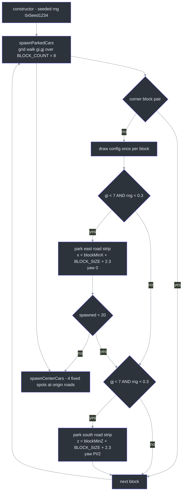
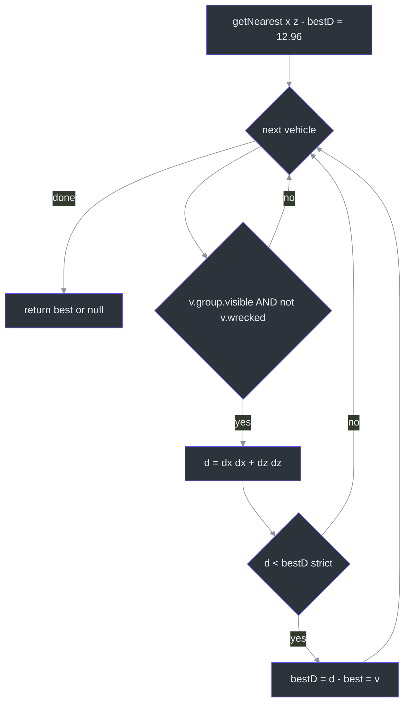
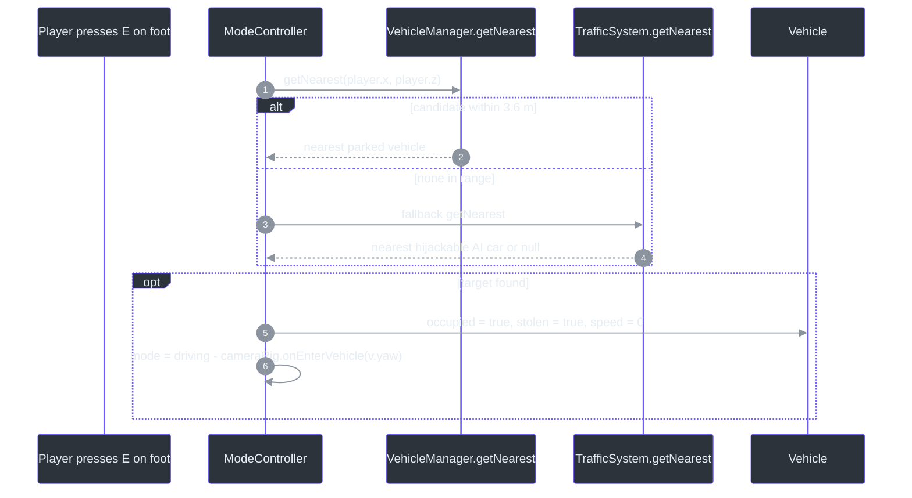

# VehicleManager — Spawned/Parked Cars & Enter Thresholds

## Overview

**Why does this exist as its own system?** The city's *parked* (statically placed, enterable) cars need exactly four services — placement, visibility culling, a nearest-enterable query for the E key, and collision boxes — and **none of them is driving**. Motion belongs to `Vehicle.update` (player) or [TrafficSystem](./traffic-system.md)/`Vehicle.aiDrive` (AI); this class is pure placement + queries. It deliberately owns no per-frame physics.

All randomness comes from an internal mulberry32 PRNG seeded with `0x5eed1234`, so the parking layout is identical every run ([src/systems/VehicleManager.ts:18](https://github.com/noiz354/arena-city-try/blob/main/src/systems/VehicleManager.ts#L18)) — the same determinism story as the rest of world generation (see [CityGenerator](../world-generation/city-generator.md)).

## Architecture — Two Spawn Passes

| Pass | What it places | Count | Source |
|---|---|---|---|
| `spawnParkedCars()` | Procedural spots on road strips east/south of blocks; skips the single corner block pair (`gi === BLOCK_COUNT-1 && gj === BLOCK_COUNT-1`) | up to `PARKED_COUNT = 20` | [`src/systems/VehicleManager.ts:81-109`](https://github.com/noiz354/arena-city-try/blob/main/src/systems/VehicleManager.ts#L81-L109) |
| `spawnCenterCars()` | Four hardcoded cars around the origin so the spawn intersection feels populated: `(0,7)` sedan yaw 0; `(0,-8)` taxi yaw π; `(8,0)` sedan yaw π/2; `(-9,0)` Muscle yaw −π/2 | 4 (total fleet ≤ 24) | [`src/systems/VehicleManager.ts:30-42`](https://github.com/noiz354/arena-city-try/blob/main/src/systems/VehicleManager.ts#L30-L42) |

<!-- Sources: src/systems/VehicleManager.ts:20-42,81-109 -->

Grid geometry comes from CityGenerator constants: `CELL = 40`, `BLOCK_SIZE = 30`, `CITY_HALF = 155` ([src/systems/CityGenerator.ts:4-9](https://github.com/noiz354/arena-city-try/blob/main/src/systems/CityGenerator.ts#L4-L9)). The `2.3 m` offset puts a car on the road strip just off the sidewalk edge; along-road jitter `3 + rng * (BLOCK_SIZE − 6)` keeps spots ≥3 m from intersections ([src/systems/VehicleManager.ts:93-94](https://github.com/noiz354/arena-city-try/blob/main/src/systems/VehicleManager.ts#L93-L94)). Configs draw from `VEHICLE_CONFIGS = [SEDAN, TAXI, MUSCLE, TRUCK]` ([src/data/vehicles.ts:88-93](https://github.com/noiz354/arena-city-try/blob/main/src/data/vehicles.ts#L88-L93)): Sedan 24 m/s / turnRate 1.7 / 100 HP; Taxi same spread but maxSpeed 22; Muscle 30 m/s / accel 16; Truck 17 m/s / accel 7 / 150 HP.

[Game](../core-loop/game-loop.md) then scene-adds every group: `for (const v of this.vehicles.vehicles) this.scene.add(v.group)` ([src/game/Game.ts:190-191](https://github.com/noiz354/arena-city-try/blob/main/src/game/Game.ts#L190-L191)).

## Data Flow — Per Frame & the Enter Query

### Visibility culling

`update(playerX, playerZ)` runs once from `Game.update` with the *active* (player-or-car) position, before ModeController ([src/game/Game.ts:395](https://github.com/noiz354/arena-city-try/blob/main/src/game/Game.ts#L395)). For each vehicle it recomputes `v.group.visible` from squared XZ distance vs `VISIBLE_DIST² = 95²` — an assignment, not a one-way hide, so cars reappear when approached; fog hides the pop-in (fog near = 90, [src/game/World.ts:40](https://github.com/noiz354/arena-city-try/blob/main/src/game/World.ts#L40)) ([src/systems/VehicleManager.ts:44-50](https://github.com/noiz354/arena-city-try/blob/main/src/systems/VehicleManager.ts#L44-L50)). That is the only per-frame work; parked cars have no physics tick.

### `getNearest` — the hard 3.6 m enter threshold

The E-key target selection walks all vehicles and keeps the closest candidate strictly inside a **3.6 m radius**, expressed as a squared-distance comparison against `ENTER_DIST² = 12.96` ([src/systems/VehicleManager.ts:52-66](https://github.com/noiz354/arena-city-try/blob/main/src/systems/VehicleManager.ts#L52-L66)):

<!-- Sources: src/systems/VehicleManager.ts:52-66 -->

⚠️ **This explains the runtime observation "null despite cars 7–10 units away":** 7–10 m exceeds the hard 3.6 m threshold, and the query never expands its radius — there is no second-chance or nearest-regardless-of-distance mode. A car at exactly 3.6 m also fails because `d < bestD` is strict. Two categories are skipped entirely: currently culled cars (`!v.group.visible`) and wrecked ones — wrecked also gates the HUD prompt ("WRECKED — cannot enter", [src/ui/hud.ts:140-143](https://github.com/noiz354/arena-city-try/blob/main/src/ui/hud.ts#L140-L143)). Ties break by first-found.

<!-- Sources: src/systems/ModeController.ts:120-133,176-183, src/systems/TrafficSystem.ts:84-99 -->

Parked cars therefore win ties by priority: TrafficSystem's query is only consulted when VehicleManager misses ([src/systems/ModeController.ts:122-132](https://github.com/noiz354/arena-city-try/blob/main/src/systems/ModeController.ts#L122-L132)).

## Components — Public API

| Method | Signature | Behavior | Source |
|---|---|---|---|
| `update` | `(playerX: number, playerZ: number): void` | Visibility toggle for all vehicles within 95 m of the given point | [`src/systems/VehicleManager.ts:44-50`](https://github.com/noiz354/arena-city-try/blob/main/src/systems/VehicleManager.ts#L44-L50) |
| `getNearest` | `(x: number, z: number): Vehicle \| null` | Nearest enterable car within the strict 3.6 m radius; skips culled + wrecked | [`src/systems/VehicleManager.ts:52-66`](https://github.com/noiz354/arena-city-try/blob/main/src/systems/VehicleManager.ts#L52-L66) |
| `getCollidables` | `(exclude?: Vehicle): Collidable[]` | `{ box }[]` from `Vehicle.getCollidableBox()` for visible vehicles only, skipping `exclude`. Invisible ⇒ no collider, so nothing off-screen blocks movement | [`src/systems/VehicleManager.ts:69-75`](https://github.com/noiz354/arena-city-try/blob/main/src/systems/VehicleManager.ts#L69-L75) |
| `dispose` | `(): void` | Traverses each group, disposes geometries + materials, removes groups, empties the array | [`src/systems/VehicleManager.ts:111-126`](https://github.com/noiz354/arena-city-try/blob/main/src/systems/VehicleManager.ts#L111-L126) |

Boxes are cached rotated-extent AABBs recomputed only after motion, y-range `[0, config.height]` ([src/entities/Vehicle.ts:78-92](https://github.com/noiz354/arena-city-try/blob/main/src/entities/Vehicle.ts#L78-L92)); per-vehicle state lives on `Vehicle` itself — `speed`, `yaw`, `health`, `wrecked`, `occupied`, `stolen` ([src/entities/Vehicle.ts:33-40](https://github.com/noiz354/arena-city-try/blob/main/src/entities/Vehicle.ts#L33-L40)).

### Interactions map

| Counterparty | Direction | What flows | Source |
|---|---|---|---|
| Game | consumes | scene-add groups; per-frame `update(activePos)`; collidables into weapon raycasts, traffic obstacle sets, F3 overlay; wreck detection loop; run-over checks; dispose on destroy | [`src/game/Game.ts:190-191`](https://github.com/noiz354/arena-city-try/blob/main/src/game/Game.ts#L190-L191), [`src/game/Game.ts:395-408`](https://github.com/noiz354/arena-city-try/blob/main/src/game/Game.ts#L395-L408), [`src/game/Game.ts:470-481`](https://github.com/noiz354/arena-city-try/blob/main/src/game/Game.ts#L470-L481), [`src/game/Game.ts:364`](https://github.com/noiz354/arena-city-try/blob/main/src/game/Game.ts#L364) |
| ModeController | queries | `getNearest` as primary enter target; `getCollidables()` foot solids; `getCollidables(v)` while driving excluding the driven car | [`src/systems/ModeController.ts:85`](https://github.com/noiz354/arena-city-try/blob/main/src/systems/ModeController.ts#L85), [`src/systems/ModeController.ts:147`](https://github.com/noiz354/arena-city-try/blob/main/src/systems/ModeController.ts#L147) |
| Vehicle entity | created by manager | `new Vehicle(config, x, z, yaw)`; `occupied` set by enter/exit; `wrecked` flips inside `takeDamage` gating entering | [`src/entities/Vehicle.ts:52`](https://github.com/noiz354/arena-city-try/blob/main/src/entities/Vehicle.ts#L52), [`src/entities/Vehicle.ts:168-176`](https://github.com/noiz354/arena-city-try/blob/main/src/entities/Vehicle.ts#L168-L176) |

### Tuning table

| Constant | Value | Effect | Source |
|---|---|---|---|
| `PARKED_COUNT` | `20` | Cap on procedural cars (center cars extra, total ≤ 24) | [`src/systems/VehicleManager.ts:7`](https://github.com/noiz354/arena-city-try/blob/main/src/systems/VehicleManager.ts#L7) |
| `VISIBLE_DIST` | `95` | Cull radius; fog near = 90 covers pop-in | [`src/systems/VehicleManager.ts:8`](https://github.com/noiz354/arena-city-try/blob/main/src/systems/VehicleManager.ts#L8) |
| `ENTER_DIST` | `3.6` | Max E-key enter range (squared `12.96`). Raise here *and* mirror the duplicate `ENTER_DIST = 3.6` in TrafficSystem to keep hijack range matching | [`src/systems/VehicleManager.ts:9`](https://github.com/noiz354/arena-city-try/blob/main/src/systems/VehicleManager.ts#L9) |
| Parking probability | `0.3` per side | Chance a block contributes an east/south spot | [`src/systems/VehicleManager.ts:92`](https://github.com/noiz354/arena-city-try/blob/main/src/systems/VehicleManager.ts#L92) |
| PRNG seed | `0x5eed1234` | Deterministic layout; change to reshuffle | [`src/systems/VehicleManager.ts:18`](https://github.com/noiz354/arena-city-try/blob/main/src/systems/VehicleManager.ts#L18) |

Wrecked cars are never removed or respawned at runtime — a cleanup pass would need to filter `vehicles` and remove groups like `dispose` does per-car.

## Known Findings & Unresolved Questions

- `spawnParkedCars` draws the per-block config *before* the two 0.3 rolls ([src/systems/VehicleManager.ts:89](https://github.com/noiz354/arena-city-try/blob/main/src/systems/VehicleManager.ts#L89) vs lines 92/101), so RNG stream alignment — and therefore which configs land where — depends on both rolls even when no car spawns. Deterministic but fragile if any earlier consumer of `seededRng` changes call counts.
- One config is shared by both potential spots of a block ([src/systems/VehicleManager.ts:89](https://github.com/noiz354/arena-city-try/blob/main/src/systems/VehicleManager.ts#L89)) — visible as paired same-model cars on some blocks.

## Related Pages

| Page | Relationship |
|------|-------------|
| [TrafficSystem](./traffic-system.md) | AI counterpart — supplies hijack fallback targets and shares grid constants plus the duplicated `ENTER_DIST` |
| [ModeController](../gameplay-core/mode-controller.md) | Consumes `getNearest`/`getCollidables` and sets `Vehicle.occupied` on enter/exit |
| [Entities](../core-loop/entities.md) | Defines `Vehicle` physics/state that this manager places but never drives |
| [Game Loop](../core-loop/game-loop.md) | Calls `update(activePos)` each frame and feeds collidables to weapons/F3/traffic |
