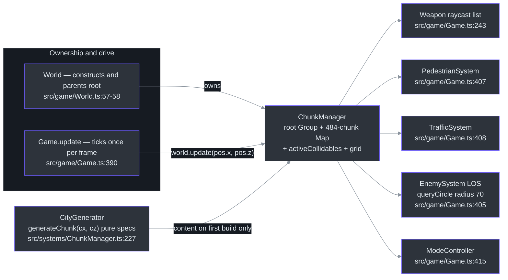
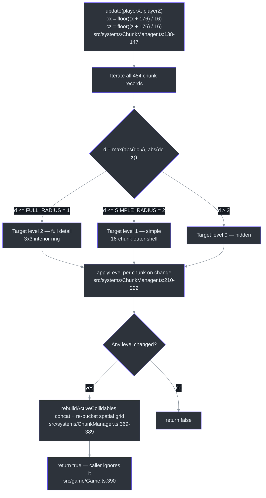
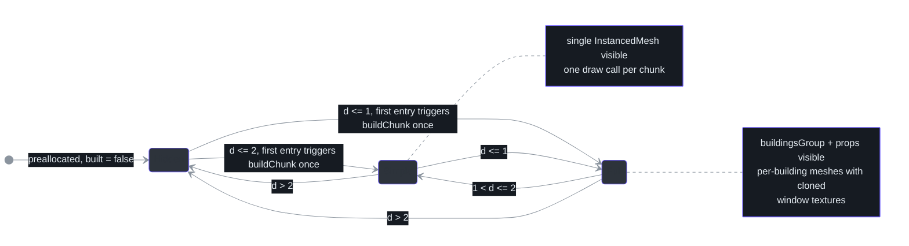
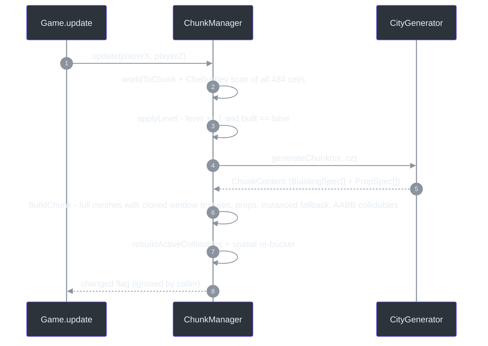

# ChunkManager — LOD Rings & Build-Once Chunk Cache

## Overview

The city feels endless but is actually a **fixed 22×22 grid of chunk cells** streamed around the player. ChunkManager owns one invisible `Group` per cell, decides per frame which chunks are visible via concentric Chebyshev-distance rings, builds each chunk's meshes and collision boxes **lazily and exactly once** on first activation (using [`generateChunk`](./city-generator.md)), and exposes the active building collidables both as a flat list (raycasting) and as a per-cell spatial hash (proximity queries) ([src/systems/ChunkManager.ts:89-103](https://github.com/noiz354/arena-city-try/blob/main/src/systems/ChunkManager.ts#L89-L103)). The source labels the pattern *"openworld-js DPZ pattern, simplified"* ([src/systems/ChunkManager.ts:90](https://github.com/noiz354/arena-city-try/blob/main/src/systems/ChunkManager.ts#L90)).

**Why this design:** a physics-free game cannot lean on broadphase acceleration structures, so collision culling must be cheap and hand-rolled; and a browser GPU budget cannot afford drawing the whole city. Rings + build-once caching solve both with two constants.

### At a glance

| Aspect | Value | Why it matters | Source |
|--------|-------|----------------|--------|
| Grid | 22×22 = 484 chunk records preallocated in a `Map` keyed `"cx_cz"` | O(1) lookup, nothing generated up front | [src/systems/ChunkManager.ts:105-126](https://github.com/noiz354/arena-city-try/blob/main/src/systems/ChunkManager.ts#L105-L126) |
| Cell size | `CHUNK_SIZE = 16` m | Streaming granularity | [src/systems/CityGenerator.ts:10](https://github.com/noiz354/arena-city-try/blob/main/src/systems/CityGenerator.ts#L10) |
| Active bubble | `(2·SIMPLE_RADIUS+1)² = 25` chunks (interior positions) | Matches runtime stat `chunksActive=25` | [src/systems/ChunkManager.ts:150-158](https://github.com/noiz354/arena-city-try/blob/main/src/systems/ChunkManager.ts#L150-L158), [165-169](https://github.com/noiz354/arena-city-try/blob/main/src/systems/ChunkManager.ts#L165-L169) |
| Full-detail ring | `FULL_RADIUS = 1` → 3×3 chunks | Detail where the player can see it | [src/systems/ChunkManager.ts:33-34](https://github.com/noiz354/arena-city-try/blob/main/src/systems/ChunkManager.ts#L33-L34) |
| Simple ring shell | 5×5 minus inner 3×3 → 16 chunks | Exactly **one** `InstancedMesh` draw call each | [src/systems/ChunkManager.ts:287-304](https://github.com/noiz354/arena-city-try/blob/main/src/systems/ChunkManager.ts#L287-L304) |
| Teardown | None during play; only global `dispose()` | Geometry accumulates as the player explores | [src/systems/ChunkManager.ts:198-202](https://github.com/noiz354/arena-city-try/blob/main/src/systems/ChunkManager.ts#L198-L202) |

## Architecture Position

<!-- Sources: src/systems/ChunkManager.ts:89-103, src/systems/ChunkManager.ts:227, src/game/World.ts:57-58, src/game/World.ts:121-127, src/game/Game.ts:243, src/game/Game.ts:390, src/game/Game.ts:405-408, src/game/Game.ts:415 -->

[World](../core-loop/game-loop.md) constructs the manager and parents `root` into its own scene graph ([src/game/World.ts:57-58](https://github.com/noiz354/arena-city-try/blob/main/src/game/World.ts#L57-L58)); `World.update` delegates straight through ([src/game/World.ts:121-123](https://github.com/noiz354/arena-city-try/blob/main/src/game/World.ts#L121-L123)) and `World.getCollidables()` proxies `getActiveCollidables()` ([src/game/World.ts:125-127](https://github.com/noiz354/arena-city-try/blob/main/src/game/World.ts#L125-L127)).

### Consumers of the collidable surface

| Consumer | What it pulls | Source |
|----------|---------------|--------|
| Weapon hitscan | `world.getCollidables().concat(vehicles...)` raycast list | [src/game/Game.ts:243](https://github.com/noiz354/arena-city-try/blob/main/src/game/Game.ts#L243) |
| Pedestrian steering | per-frame `buildings` / `allCollidables` feed | [src/game/Game.ts:407](https://github.com/noiz354/arena-city-try/blob/main/src/game/Game.ts#L407) |
| Traffic AI driving | same per-frame feed | [src/game/Game.ts:408](https://github.com/noiz354/arena-city-try/blob/main/src/game/Game.ts#L408) |
| Enemy LOS checks | spatial query `queryCircle(px, pz, 70)` → `ceil(70/16)=5` → up to 121 cell lookups instead of scanning the whole list | [src/game/Game.ts:405](https://github.com/noiz354/arena-city-try/blob/main/src/game/Game.ts#L405) |
| [ModeController](../gameplay-core/mode-controller.md) | re-concats the same lists with traffic colliders on foot and while driving | [src/systems/ModeController.ts:85-86](https://github.com/noiz354/arena-city-try/blob/main/src/systems/ModeController.ts#L85-L86), [147-148](https://github.com/noiz354/arena-city-try/blob/main/src/systems/ModeController.ts#L147-L148) |

## LOD Rings & the Activation Decision

Every `update(playerX, playerZ)` call converts world position to chunk coords with `floor((x + CHUNK_GRID_HALF) / CHUNK_SIZE)` ([src/systems/ChunkManager.ts:138-143](https://github.com/noiz354/arena-city-try/blob/main/src/systems/ChunkManager.ts#L138-L143), [147](https://github.com/noiz354/arena-city-try/blob/main/src/systems/ChunkManager.ts#L147)), then iterates **all 484 records**, scoring each by Chebyshev ring distance `d = max(|Δcx|, |Δcz|)` against the two radius constants ([src/systems/ChunkManager.ts:150-158](https://github.com/noiz354/arena-city-try/blob/main/src/systems/ChunkManager.ts#L150-L158); ring comment [src/systems/ChunkManager.ts:29-34](https://github.com/noiz354/arena-city-try/blob/main/src/systems/ChunkManager.ts#L29-L34)).

| Level | Condition | Rendering behavior | Source |
|-------|-----------|--------------------|--------|
| 2 — full detail | `d ≤ FULL_RADIUS (1)` | `buildingsGroup` + `props` visible | [src/systems/ChunkManager.ts:210-222](https://github.com/noiz354/arena-city-try/blob/main/src/systems/ChunkManager.ts#L210-L222) |
| 1 — simple | `d ≤ SIMPLE_RADIUS (2)` | single `simpleInstances` mesh visible only | [src/systems/ChunkManager.ts:287-304](https://github.com/noiz354/arena-city-try/blob/main/src/systems/ChunkManager.ts#L287-L304) |
| 0 — hidden | otherwise | `group.visible = false`, zero draw cost | [src/systems/ChunkManager.ts:210-222](https://github.com/noiz354/arena-city-try/blob/main/src/systems/ChunkManager.ts#L210-L222) |

<!-- Sources: src/systems/ChunkManager.ts:138-169, src/systems/ChunkManager.ts:210-222, src/systems/ChunkManager.ts:369-389, src/game/Game.ts:390 -->

### Chunk level state machine

<!-- Sources: src/systems/ChunkManager.ts:150-158, src/systems/ChunkManager.ts:210-222, src/systems/ChunkManager.ts:225-254, src/systems/ChunkManager.ts:287-304 -->

With radii 1/2, a fully interior player yields `(2·2+1)² = 25` visible chunks — matching the observed runtime value `chunksActive=25`; positions near grid edges qualify fewer cells ([src/systems/ChunkManager.ts:165-169](https://github.com/noiz354/arena-city-try/blob/main/src/systems/ChunkManager.ts#L165-L169)).

## Build-Once Chunk Cache & Geometry Accumulation

`buildChunk` runs **once per chunk ever activated**: it generates content, creates per-building full-detail meshes with *cloned* window textures, prop meshes, **and** the single instanced-mesh fallback — all upfront ([src/systems/ChunkManager.ts:225-254](https://github.com/noiz354/arena-city-try/blob/main/src/systems/ChunkManager.ts#L225-L254)). There is no per-chunk teardown during play; `disposeChunk` is only invoked from the global `dispose()` ([src/systems/ChunkManager.ts:198-202](https://github.com/noiz354/arena-city-try/blob/main/src/systems/ChunkManager.ts#L198-L202)).

<!-- Sources: src/systems/ChunkManager.ts:146-169, src/systems/ChunkManager.ts:210-254, src/systems/ChunkManager.ts:369-389, src/game/Game.ts:390 -->

**Consequences** (documented trade-off):

- GPU geometry accumulates as the player explores — runtime observation measured ≈1798 geometries in `renderer.info.memory.geometries` ([src/systems/ChunkManager.ts:225-254](https://github.com/noiz354/arena-city-try/blob/main/src/systems/ChunkManager.ts#L225-L254)).
- Draw calls stay bounded regardless: far/built chunks are merely `visible=false`, and mid-ring chunks render as exactly ONE `InstancedMesh` draw call each — the ~100+ far building draws collapse to ~16 for the 5×5 outer shell ([src/systems/ChunkManager.ts:287-304](https://github.com/noiz354/arena-city-try/blob/main/src/systems/ChunkManager.ts#L287-L304)).
- Per-building window-texture clones are the main memory sink if exploration grows; swapping clones for UV offsets or a texture array is the natural upgrade path ([src/systems/ChunkManager.ts:259-261](https://github.com/noiz354/arena-city-try/blob/main/src/systems/ChunkManager.ts#L259-L261)).

## Data Structures

| Member | Type / shape | Meaning | Source |
|--------|--------------|---------|--------|
| `Chunk` | interface with `key, cx, cz, group, level, built, collidables, buildingsGroup, materials, props, simpleInstances` | Per-cell record; `built` gates the one-time build | [src/systems/ChunkManager.ts:36-51](https://github.com/noiz354/arena-city-try/blob/main/src/systems/ChunkManager.ts#L36-L51) |
| `Chunk.materials` | `[fullMat, simpleMat]` pairs per building | `simpleMat` is created but never rendered — kept purely so `dispose()` is symmetric | [src/systems/ChunkManager.ts:46-47](https://github.com/noiz354/arena-city-try/blob/main/src/systems/ChunkManager.ts#L46-L47), [269](https://github.com/noiz354/arena-city-try/blob/main/src/systems/ChunkManager.ts#L269), [276](https://github.com/noiz354/arena-city-try/blob/main/src/systems/ChunkManager.ts#L276) |
| `chunks` | `Map<string, Chunk>` keyed `"cx_cz"` | Preallocated 484 entries | [src/systems/ChunkManager.ts:100](https://github.com/noiz354/arena-city-try/blob/main/src/systems/ChunkManager.ts#L100), [105-126](https://github.com/noiz354/arena-city-try/blob/main/src/systems/ChunkManager.ts#L105-L126) |
| `activeCollidables` | `Collidable[]` flat list | Handed to physics/raycast consumers, rebuilt on any level change | [src/systems/ChunkManager.ts:101](https://github.com/noiz354/arena-city-try/blob/main/src/systems/ChunkManager.ts#L101), [160](https://github.com/noiz354/arena-city-try/blob/main/src/systems/ChunkManager.ts#L160) |
| `grid` | `Map<string, Collidable[]>` | Static building boxes bucketed by the chunk cell of their box center | [src/systems/ChunkManager.ts:102-103](https://github.com/noiz354/arena-city-try/blob/main/src/systems/ChunkManager.ts#L102-L103), [369-389](https://github.com/noiz354/arena-city-try/blob/main/src/systems/ChunkManager.ts#L369-L389) |
| Scratch objects | `boxCenterTmp` / `instMatrix` / `instColor` | Module-level, keeps hot paths allocation-free | [src/systems/ChunkManager.ts:53-55](https://github.com/noiz354/arena-city-try/blob/main/src/systems/ChunkManager.ts#L53-L55) |
| `sharedWindowTexture` | lazy singleton `CanvasTexture` | 256 px canvas, 4×4 window grid, ~65% lit warm `rgba(255,214,130,.95)` vs cool `rgba(120,140,165,.9)`, RepeatWrapping, sRGB | [src/systems/ChunkManager.ts:58](https://github.com/noiz354/arena-city-try/blob/main/src/systems/ChunkManager.ts#L58), [60-87](https://github.com/noiz354/arena-city-try/blob/main/src/systems/ChunkManager.ts#L60-L87) |
| `Collidable` | `{ box: Box3 }` imported from World | Buildings get an AABB from ground to roof (`y: 0..h`); props/trees have **no** colliders | [src/game/World.ts:22-24](https://github.com/noiz354/arena-city-try/blob/main/src/game/World.ts#L22-L24), [src/systems/ChunkManager.ts:278-283](https://github.com/noiz354/arena-city-try/blob/main/src/systems/ChunkManager.ts#L278-L283) |

## Public API

| Member | Signature | Behavior | Source |
|--------|-----------|----------|--------|
| `root` | `readonly Group` | Attach point; World adds it to its own root | [src/systems/ChunkManager.ts:99](https://github.com/noiz354/arena-city-try/blob/main/src/systems/ChunkManager.ts#L99), [src/game/World.ts:57-58](https://github.com/noiz354/arena-city-try/blob/main/src/game/World.ts#L57-L58) |
| `update` | `(playerX, playerZ): boolean` | Recompute activation rings; true when any chunk's level changed | [src/systems/ChunkManager.ts:146](https://github.com/noiz354/arena-city-try/blob/main/src/systems/ChunkManager.ts#L146) |
| `chunkWorldX/Z` | `(cx|cz): number` | World position of a chunk-grid corner: `cx*16 − 176` | [src/systems/ChunkManager.ts:129-135](https://github.com/noiz354/arena-city-try/blob/main/src/systems/ChunkManager.ts#L129-L135) |
| `worldToChunk` | `(x, z): {cx, cz}` | World → chunk cell conversion | [src/systems/ChunkManager.ts:138](https://github.com/noiz354/arena-city-try/blob/main/src/systems/ChunkManager.ts#L138) |
| `activeCount` | getter `number` | Count of `level > 0` chunks — intended for a debug HUD | [src/systems/ChunkManager.ts:164-169](https://github.com/noiz354/arena-city-try/blob/main/src/systems/ChunkManager.ts#L164-L169) |
| `getActiveCollidables` | `(): Collidable[]` | The rebuilt-on-change flat list | [src/systems/ChunkManager.ts:171](https://github.com/noiz354/arena-city-try/blob/main/src/systems/ChunkManager.ts#L171) |
| `forEachNear` | `(x, z, radius, cb): void` | Zero-allocation spatial query visiting `ceil(radius/CHUNK_SIZE)` cells around the containing cell | [src/systems/ChunkManager.ts:180-189](https://github.com/noiz354/arena-city-try/blob/main/src/systems/ChunkManager.ts#L180-L189) |
| `queryCircle` | `(x, z, radius): Collidable[]` | Collecting variant; one array alloc per call | [src/systems/ChunkManager.ts:192-196](https://github.com/noiz354/arena-city-try/blob/main/src/systems/ChunkManager.ts#L192-L196) |
| `dispose` | `(): void` | Deep-traverses chunks, disposes geo/materials, resets `built=false`, disposes the shared window texture | [src/systems/ChunkManager.ts:198](https://github.com/noiz354/arena-city-try/blob/main/src/systems/ChunkManager.ts#L198), [391-410](https://github.com/noiz354/arena-city-try/blob/main/src/systems/ChunkManager.ts#L391-L410) |

## Implementation Details Worth Knowing

- **Tree variation is deterministic per world position**: `treeSeed(x,z)` hashes quantized 1/16 m coordinates ([src/systems/ChunkManager.ts:423-427](https://github.com/noiz354/arena-city-try/blob/main/src/systems/ChunkManager.ts#L423-L427)) driving trunk height `2.4+s*1.2`, branch count `2+floor(s*3)`, canopy radius `1.6+s*0.9` ([src/systems/ChunkManager.ts:434-483](https://github.com/noiz354/arena-city-try/blob/main/src/systems/ChunkManager.ts#L434-L483)).
- **Window texture repeat per building**: `repeat.set(max(1, round(w/4)), max(1, round(h/3)))`; lit-window ratio is `> 0.35` unlit ([src/systems/ChunkManager.ts:259-261](https://github.com/noiz354/arena-city-try/blob/main/src/systems/ChunkManager.ts#L259-L261), [74](https://github.com/noiz354/arena-city-try/blob/main/src/systems/ChunkManager.ts#L74)).
- **Materials**: full-detail roughness 0.75 / metalness 0.05; simple variant roughness 0.85 with `vertexColors:true` for instance colors ([src/systems/ChunkManager.ts:263-270](https://github.com/noiz354/arena-city-try/blob/main/src/systems/ChunkManager.ts#L263-L270), [290](https://github.com/noiz354/arena-city-try/blob/main/src/systems/ChunkManager.ts#L290)).
- **Six shared prop materials per chunk**: lamp emissive `0xffd166` @0.7, trunk `0x6b5b45`, foliage `0x3d8f52`, hydrant `0xc0392b`, bench `0x8a6b4a`, rock `0x8b8f96` ([src/systems/ChunkManager.ts:485-494](https://github.com/noiz354/arena-city-try/blob/main/src/systems/ChunkManager.ts#L485-L494)).

## Tuning Knobs

| Knob | Value / effect | Source |
|------|----------------|--------|
| `FULL_RADIUS`, `SIMPLE_RADIUS` | 1 / 2 (Chebyshev, chunk units) — reshape the streamed bubble | [src/systems/ChunkManager.ts:33-34](https://github.com/noiz354/arena-city-try/blob/main/src/systems/ChunkManager.ts#L33-L34) |
| Grid extents | `CHUNK_SIZE=16`, `CHUNK_COUNT=22`, `CHUNK_GRID_HALF=176` imported from CityGenerator | [src/systems/CityGenerator.ts:10-12](https://github.com/noiz354/arena-city-try/blob/main/src/systems/CityGenerator.ts#L10-L12) |
| Window repeat | `max(1, round(w/4)) × max(1, round(h/3))` per building face | [src/systems/ChunkManager.ts:259-261](https://github.com/noiz354/arena-city-try/blob/main/src/systems/ChunkManager.ts#L259-L261) |
| Lit-window ratio | `> 0.35` stays unlit (session-random, baked once) | [src/systems/ChunkManager.ts:74](https://github.com/noiz354/arena-city-try/blob/main/src/systems/ChunkManager.ts#L74) |

## Known Findings & Gaps

Preserved from the implementation wiki — do not treat these as features:

1. **`activeCount` has no consumer UI.** Documented "for the debug HUD" ([src/systems/ChunkManager.ts:164](https://github.com/noiz354/arena-city-try/blob/main/src/systems/ChunkManager.ts#L164)) but `src/ui/hud.ts` contains no chunk stats — reachable only programmatically.
2. **Phantom debug helper.** The doc comment at [src/systems/ColliderDebug.ts:10](https://github.com/noiz354/arena-city-try/blob/main/src/systems/ColliderDebug.ts#L10) mentions `window.game.debugColliders()`; no such helper exists — see [ColliderDebug](../ui-audio-support/collider-debug.md).
3. **Geometry accumulation is unbounded during a session** (bounded only by the small 484-cell map, never measured). A `disposeChunk` call when a chunk settles at level 0 would trade CPU for memory if profiling demands it ([src/systems/ChunkManager.ts:198-202](https://github.com/noiz354/arena-city-try/blob/main/src/systems/ChunkManager.ts#L198-L202)).

## References

- Hand-verified implementation doc: [docs/wiki/systems/ChunkManager.md](https://github.com/noiz354/arena-city-try/blob/main/docs/wiki/systems/ChunkManager.md)
- Primary sources: [src/systems/ChunkManager.ts](https://github.com/noiz354/arena-city-try/blob/main/src/systems/ChunkManager.ts), [src/systems/CityGenerator.ts](https://github.com/noiz354/arena-city-try/blob/main/src/systems/CityGenerator.ts), [src/game/World.ts](https://github.com/noiz354/arena-city-try/blob/main/src/game/World.ts), [src/game/Game.ts](https://github.com/noiz354/arena-city-try/blob/main/src/game/Game.ts)

## Related Pages

| Page | Relationship |
|------|-------------|
| [CityGenerator](./city-generator.md) | Pure spec generator this manager calls exactly once per chunk on first activation |
| [Vegetation](./vegetation.md) | Dresses the terrain **outside** the streamed city grid with its own single-draw-call trick |
| [Game Bootstrap & Update Loop](../core-loop/game-loop.md) | Owns the per-frame call site `world.update(pos.x, pos.z)` and the update order |
| [EnemySystem](../gameplay-core/enemy-system.md) | Uses `queryCircle` for LOS proximity queries against the spatial hash |
| [ModeController](../gameplay-core/mode-controller.md) | Consumes the active collidable lists for foot and vehicle collision |
| [ColliderDebug](../ui-audio-support/collider-debug.md) | Visualizes the building AABBs this system produces |
