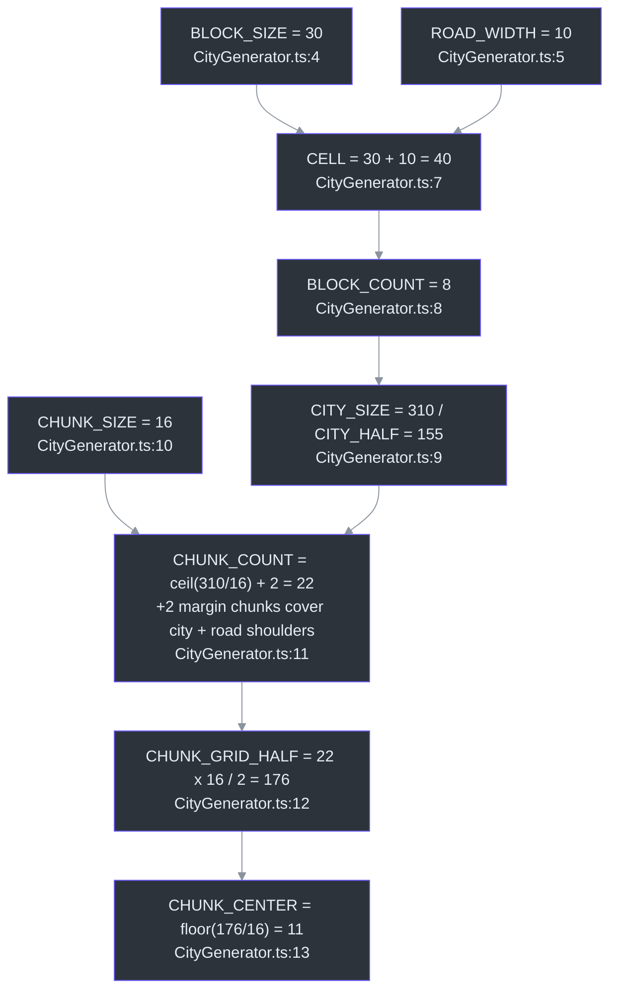
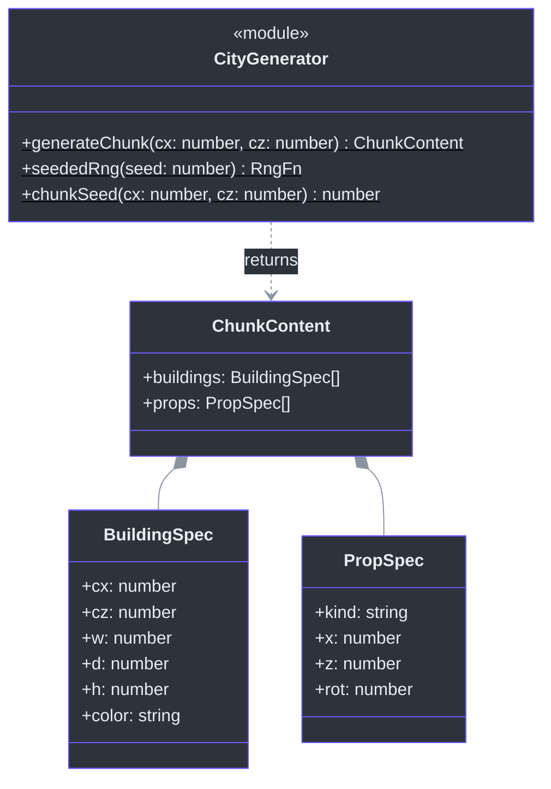

# CityGenerator — Seeded Layout Rules Per Chunk

## Overview

CityGenerator is a **pure, stateless module** — no class, no init, no per-frame behavior. Given chunk coordinates it deterministically emits building and prop specs (`ChunkContent`); it creates **no Three.js objects itself** ([src/systems/CityGenerator.ts:82-89](https://github.com/noiz354/arena-city-try/blob/main/src/systems/CityGenerator.ts#L82-L89)). Because generation is seeded from the chunk coordinates via a mulberry32 PRNG ([src/systems/CityGenerator.ts:33-43](https://github.com/noiz354/arena-city-try/blob/main/src/systems/CityGenerator.ts#L33-L43)), the same chunk always regenerates identical content across activate/deactivate cycles ([src/systems/CityGenerator.ts:90-91](https://github.com/noiz354/arena-city-try/blob/main/src/systems/CityGenerator.ts#L90-L91)). The module also exports every city-layout constant consumed by the rest of the game.

**Why this design:** determinism means the chunk cache never needs to *store* content — [ChunkManager](./chunk-manager.md) can discard specs freely because the entire city is reproducible from two integers.

### At a glance

| Aspect | Value | Source |
|--------|-------|--------|
| Input | `(cx, cz)` chunk cell integers | [src/systems/CityGenerator.ts:90](https://github.com/noiz354/arena-city-try/blob/main/src/systems/CityGenerator.ts#L90) |
| Output | `ChunkContent { buildings, props }` — plain data | [src/systems/CityGenerator.ts:68-71](https://github.com/noiz354/arena-city-try/blob/main/src/systems/CityGenerator.ts#L68-L71) |
| Seed | `mulberry32(chunkSeed(cx, cz))` | [src/systems/CityGenerator.ts:33-50](https://github.com/noiz354/arena-city-try/blob/main/src/systems/CityGenerator.ts#L33-L50) |
| Renderer coupling | none (only `MathUtils.lerp`) | [src/systems/CityGenerator.ts:1](https://github.com/noiz354/arena-city-try/blob/main/src/systems/CityGenerator.ts#L1) |
| Sole caller | `ChunkManager.buildChunk` | [src/systems/ChunkManager.ts:227](https://github.com/noiz354/arena-city-try/blob/main/src/systems/ChunkManager.ts#L227) |

## Layout Constants

Everything downstream derives from one 40 m cell:

<!-- Sources: src/systems/CityGenerator.ts:4-13 -->

| Constant | Value | Role | Source |
|----------|-------|------|--------|
| `BLOCK_SIZE` / `ROAD_WIDTH` | 30 / 10 m | Block + trailing road strip per axis | [src/systems/CityGenerator.ts:4-5](https://github.com/noiz354/arena-city-try/blob/main/src/systems/CityGenerator.ts#L4-L5) |
| `CELL` | 40 m | Block pitch; drives road classification | [src/systems/CityGenerator.ts:7](https://github.com/noiz354/arena-city-try/blob/main/src/systems/CityGenerator.ts#L7) |
| `BLOCK_COUNT` / `CITY_SIZE` / `CITY_HALF` | 8 / 310 / 155 | ~310 m flat city square | [src/systems/CityGenerator.ts:8-9](https://github.com/noiz354/arena-city-try/blob/main/src/systems/CityGenerator.ts#L8-L9) |
| `CHUNK_SIZE` / `CHUNK_COUNT` / `CHUNK_GRID_HALF` | 16 / 22 / 176 | Streaming lattice covering ±155 m plus shoulders to ±176 m | [src/systems/CityGenerator.ts:10-12](https://github.com/noiz354/arena-city-try/blob/main/src/systems/CityGenerator.ts#L10-L12) |
| `TOWER_X/Z`, `TOWER_SIZE`, `TOWER_HEIGHT` | 20 / 20 / 16 / 72 | Landmark tower deliberately NOT at origin so it doesn't block the spawn intersection (BUG-001/002 history comment) | [src/systems/CityGenerator.ts:15-25](https://github.com/noiz354/arena-city-try/blob/main/src/systems/CityGenerator.ts#L15-L25) |
| `ROADS_X` / `ROADS_Z` | 7 centerlines per axis at ±120, ±80, ±40, 0 | Exported; currently informational only — see [Unresolved Findings](#unresolved-findings) | [src/systems/CityGenerator.ts:28-31](https://github.com/noiz354/arena-city-try/blob/main/src/systems/CityGenerator.ts#L28-L31) |

External consumers of these constants: World's baked ground CanvasTexture uses `BLOCK_COUNT, CELL, CITY_HALF, CITY_SIZE, ROAD_WIDTH` ([src/game/World.ts:19](https://github.com/noiz354/arena-city-try/blob/main/src/game/World.ts#L19), [145-177](https://github.com/noiz354/arena-city-try/blob/main/src/game/World.ts#L145-L177)); WetSurfaceSystem imports `CITY_HALF` for its ripple spawn margin ([src/systems/WetSurfaceSystem.ts:112-113](https://github.com/noiz354/arena-city-try/blob/main/src/systems/WetSurfaceSystem.ts#L112-L113)).

## Determinism: mulberry32 Seeding

```mermaid
%%{init: {"theme":"base","themeVariables":{"background":"transparent","primaryColor":"#2d333b","primaryBorderColor":"#6d5dfc","primaryTextColor":"#e6edf3","secondaryColor":"#161b22","secondaryBorderColor":"#30363d","tertiaryColor":"#161b22","lineColor":"#8b949e","textColor":"#e6edf3","mainBkg":"#2d333b","nodeBorder":"#6d5dfc","clusterBkg":"#161b22","clusterBorder":"#30363d","titleColor":"#e6edf3","edgeLabelBackground":"#161b22","actorBkg":"#2d333b","actorBorder":"#6d5dfc","actorTextColor":"#e6edf3","actorLineColor":"#8b949e","signalColor":"#8b949e","signalTextColor":"#e6edf3","labelBoxBkgColor":"#2d333b","labelBoxBorderColor":"#6d5dfc","labelTextColor":"#e6edf3","loopTextColor":"#e6edf3","noteBkgColor":"#161b22","noteBorderColor":"#6d5dfc","noteTextColor":"#e6edf3","activationBkgColor":"#161b22","activationBorderColor":"#6d5dfc","sequenceNumberColor":"#e6edf3","stateBkg":"#2d333b","stateBorder":"#6d5dfc","compositeBackground":"#161b22","compositeBorder":"#30363d","compositeTitleBackground":"#161b22","altBackground":"#161b22","attributeBackgroundColorOdd":"#161b22","attributeBackgroundColorEven":"#2d333b","classText":"#e6edf3","arrowheadColor":"#8b949e"}}}%%
flowchart LR
    IN["cx, cz chunk coords"] --> H1["hash: x374761393 / x668265263<br>xor-shift 13<br>x1274126177<br>xor-shift 16<br>CityGenerator.ts:45-50"]
    H1 --> SEED["uint32 seed"]
    SEED --> RNG["mulberry32 factory returns 0..1 fn<br>CityGenerator.ts:33-43"]
    RNG --> GEN["generateChunk draws values in fixed order"]
    GEN --> OUT["identical ChunkContent for identical (cx, cz)<br>across activate/deactivate cycles"]
    linkStyle default stroke:#8b949e
```

<!-- Sources: src/systems/CityGenerator.ts:33-50, src/systems/CityGenerator.ts:82-91 -->

Every draw shifts all subsequent values, so the **consumption order inside `generateChunk` is load-bearing** — reordering any roll changes the whole city.

| Step | What happens | Source |
|------|--------------|--------|
| 1. Landmark tower | emitted into exactly one chunk — the cell containing world point `(20,20)`, found via `floor((TOWER_X + CHUNK_GRID_HALF)/CHUNK_SIZE)` | [src/systems/CityGenerator.ts:100-112](https://github.com/noiz354/arena-city-try/blob/main/src/systems/CityGenerator.ts#L100-L112) |
| 2. Block scan | 3×3 neighborhood of city blocks around the chunk's center block; out-of-city blocks skipped | [src/systems/CityGenerator.ts:115-120](https://github.com/noiz354/arena-city-try/blob/main/src/systems/CityGenerator.ts#L115-L120) |
| 3. Plot split | each valid 30 m block → 2×2 plots of `(30−3)/2 = 13.5` m with 1.5 m road margin; ownership guard means each plot is processed by exactly one chunk | [src/systems/CityGenerator.ts:127-135](https://github.com/noiz354/arena-city-try/blob/main/src/systems/CityGenerator.ts#L127-L135) |
| 4. Tower clearance | plots overlapping the footprint (clearance radius `8 + 6.75 = 14.75` m) skipped per-plot, not per-chunk | [src/systems/CityGenerator.ts:137-140](https://github.com/noiz354/arena-city-try/blob/main/src/systems/CityGenerator.ts#L137-L140) |
| 5. Building roll | 70% per plot; footprint lerp 75–95% of plot; height `floor(lerp(8,40,rng()**1.6)/3)*3+6` → discrete 12–42 m in 3 m steps biased low by the `**1.6`; color from fixed 7-entry palette | [src/systems/CityGenerator.ts:142-149](https://github.com/noiz354/arena-city-try/blob/main/src/systems/CityGenerator.ts#L142-L149) |
| 6. Plot props | streetlight always on block corner nearest plot(0,0); hydrant opposite corner on plot(1,1), 50% | [src/systems/CityGenerator.ts:154-160](https://github.com/noiz354/arena-city-try/blob/main/src/systems/CityGenerator.ts#L154-L160) |
| 7. Scatter props | once per valid neighborhood block — table below | [src/systems/CityGenerator.ts:166-195](https://github.com/noiz354/arena-city-try/blob/main/src/systems/CityGenerator.ts#L166-L195) |

### Scatter-prop rules

Scatter positions sample the chunk's own 16 m footprint (`worldMinX + rng()*CHUNK_SIZE`), not the block — neighboring chunks never duplicate scatter points ([src/systems/CityGenerator.ts:166-172](https://github.com/noiz354/arena-city-try/blob/main/src/systems/CityGenerator.ts#L166-L172)). Road classification: local coordinate inside the 40 m cell ≥ `BLOCK_SIZE` counts as road ([src/systems/CityGenerator.ts:74-80](https://github.com/noiz354/arena-city-try/blob/main/src/systems/CityGenerator.ts#L74-L80)).

| Prop | Count / rate | Kept only if… | Source |
|------|--------------|---------------|--------|
| Tree | `1 + floor(rng()*4)` | point IS on a road (`if (!inRoad(...)) continue`) | [src/systems/CityGenerator.ts:166-172](https://github.com/noiz354/arena-city-try/blob/main/src/systems/CityGenerator.ts#L166-L172) |
| Bush | `1 + floor(rng()*4)` | point is NOT on a road | [src/systems/CityGenerator.ts:175-181](https://github.com/noiz354/arena-city-try/blob/main/src/systems/CityGenerator.ts#L175-L181) |
| Rock | 40% chance | off-road | [src/systems/CityGenerator.ts:184-188](https://github.com/noiz354/arena-city-try/blob/main/src/systems/CityGenerator.ts#L184-L188) |
| Bench | 30% chance | ON road/sidewalk | [src/systems/CityGenerator.ts:191-195](https://github.com/noiz354/arena-city-try/blob/main/src/systems/CityGenerator.ts#L191-L195) |

## Spec Data Structures

<!-- Sources: src/systems/CityGenerator.ts:52-71 -->

- `BuildingSpec { cx, cz, w, d, h, color }` — center-world-x/z, footprint, height, hex color ([src/systems/CityGenerator.ts:52-59](https://github.com/noiz354/arena-city-try/blob/main/src/systems/CityGenerator.ts#L52-L59))
- `PropSpec { kind, x, z, rot }` — `kind ∈ 'streetlight'|'tree'|'bush'|'hydrant'|'bench'|'rock'` ([src/systems/CityGenerator.ts:61-66](https://github.com/noiz354/arena-city-try/blob/main/src/systems/CityGenerator.ts#L61-L66))
- `ChunkContent { buildings, props }` — return payload ([src/systems/CityGenerator.ts:68-71](https://github.com/noiz354/arena-city-try/blob/main/src/systems/CityGenerator.ts#L68-L71))

## Public API

| Member | Signature | Behavior | Source |
|--------|-----------|----------|--------|
| `generateChunk` | `(cx: number, cz: number): ChunkContent` | Deterministic content for chunk cell `(cx,cz)` | [src/systems/CityGenerator.ts:90](https://github.com/noiz354/arena-city-try/blob/main/src/systems/CityGenerator.ts#L90) |
| `seededRng` | `(seed: number): () => number` | mulberry32 PRNG factory returning a 0..1 function | [src/systems/CityGenerator.ts:34](https://github.com/noiz354/arena-city-try/blob/main/src/systems/CityGenerator.ts#L34) |
| `chunkSeed` | `(cx: number, cz: number): number` | 2D integer coords → uint32 seed hash | [src/systems/CityGenerator.ts:45](https://github.com/noiz354/arena-city-try/blob/main/src/systems/CityGenerator.ts#L45) |

## Tuning Knobs

| Knob | Effect | Source |
|------|--------|--------|
| `BLOCK_SIZE=30`, `ROAD_WIDTH=10` | City density/dimensions (`CELL=40`) | [src/systems/CityGenerator.ts:4-9](https://github.com/noiz354/arena-city-try/blob/main/src/systems/CityGenerator.ts#L4-L9) |
| `CHUNK_SIZE=16` (+2 margin chunks) | Streaming granularity; grid ±176 m covers city ±155 m | [src/systems/CityGenerator.ts:10-12](https://github.com/noiz354/arena-city-try/blob/main/src/systems/CityGenerator.ts#L10-L12) |
| Building probability `0.7`; height exponent `1.6`; 3 m quantization | Skyline shape | [src/systems/CityGenerator.ts:142](https://github.com/noiz354/arena-city-try/blob/main/src/systems/CityGenerator.ts#L142), [148](https://github.com/noiz354/arena-city-try/blob/main/src/systems/CityGenerator.ts#L148) |
| Prop rates — hydrant 0.5, rock 0.4, bench 0.3, tree/bush `1+floor(rng()*4)` | Street dressing density | [src/systems/CityGenerator.ts:158](https://github.com/noiz354/arena-city-try/blob/main/src/systems/CityGenerator.ts#L158), [166](https://github.com/noiz354/arena-city-try/blob/main/src/systems/CityGenerator.ts#L166), [175](https://github.com/noiz354/arena-city-try/blob/main/src/systems/CityGenerator.ts#L175), [184](https://github.com/noiz354/arena-city-try/blob/main/src/systems/CityGenerator.ts#L184), [191](https://github.com/noiz354/arena-city-try/blob/main/src/systems/CityGenerator.ts#L191) |
| Tower constants | Relocating moves emission + per-plot clearance together | [src/systems/CityGenerator.ts:22-25](https://github.com/noiz354/arena-city-try/blob/main/src/systems/CityGenerator.ts#L22-L25) |

## Unresolved Findings

Preserved from the implementation wiki:

1. **`ROADS_X`/`ROADS_Z` have no external consumer** — traffic/pedestrian systems don't import them; possibly reserved for future lane-following AI ([src/systems/CityGenerator.ts:28-31](https://github.com/noiz354/arena-city-try/blob/main/src/systems/CityGenerator.ts#L28-L31)).
2. **Frontier density varies ×9** — scatter yield scales with how many of the 9 neighborhood blocks pass the bounds test near the city edge; no normalization keeps density constant at the frontier.
3. **Determinism caveat** — content specs are stable, but the lit-window pattern baked once into the shared window texture uses `Math.random()` at creation time ([src/systems/ChunkManager.ts:74](https://github.com/noiz354/arena-city-try/blob/main/src/systems/ChunkManager.ts#L74)) and differs per session. Contrast with [Vegetation](./vegetation.md), which also places with raw `Math.random()` instead of `seededRng` ([src/systems/Vegetation.ts:48-50](https://github.com/noiz354/arena-city-try/blob/main/src/systems/Vegetation.ts#L48-L50)).

## References

- Hand-verified implementation doc: [docs/wiki/systems/CityGenerator.md](https://github.com/noiz354/arena-city-try/blob/main/docs/wiki/systems/CityGenerator.md)
- Primary sources: [src/systems/CityGenerator.ts](https://github.com/noiz354/arena-city-try/blob/main/src/systems/CityGenerator.ts), [src/systems/ChunkManager.ts](https://github.com/noiz354/arena-city-try/blob/main/src/systems/ChunkManager.ts), [src/game/World.ts](https://github.com/noiz354/arena-city-try/blob/main/src/game/World.ts)

## Related Pages

| Page | Relationship |
|------|-------------|
| [ChunkManager](./chunk-manager.md) | Sole caller — turns these specs into meshes, colliders, and LOD levels |
| [Vegetation](./vegetation.md) | Non-deterministic counterpart: grass placement uses raw `Math.random()`, not `seededRng` |
| [WetSurfaceSystem](../environment/wet-surface-system.md) | Imports `CITY_HALF` to bound ripple spawning 8 m inside the city edge |
| [Game Bootstrap & Update Loop](../core-loop/game-loop.md) | Where chunk activation happens relative to other systems each frame |
