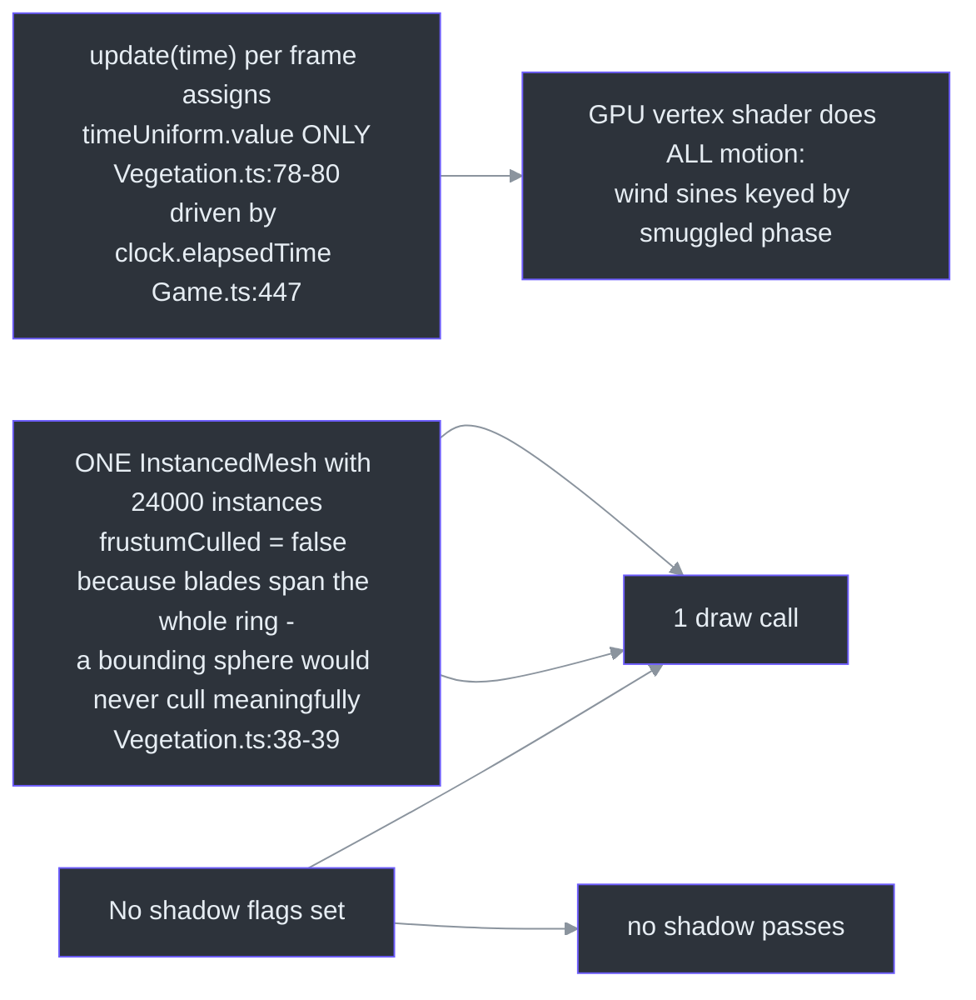
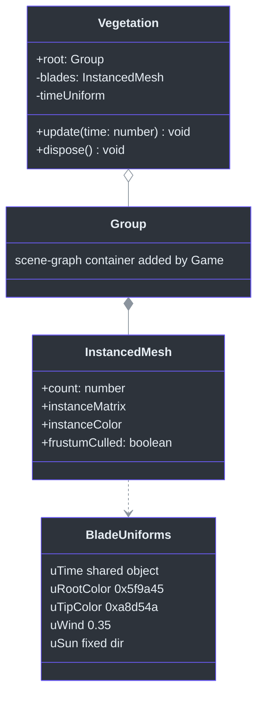

# Vegetation — 24k Grass Blades in One Draw Call

## Overview

Vegetation renders the outer meadow as **24,000 stylized cross-plane blades instanced in a single `InstancedMesh`** — one draw call — ringing the flat city square, animated by a custom wind vertex shader with per-blade phase ([src/systems/Vegetation.ts:21-27](https://github.com/noiz354/arena-city-try/blob/main/src/systems/Vegetation.ts#L21-L27)). Fully procedural ("sandbox-safe": no textures, no assets), purely cosmetic — **no colliders, no shadows, no gameplay coupling**.

**Why this design:** the terrain beyond the city would otherwise be empty void. Instancing collapses 24k objects into 1 draw call; moving all motion into a vertex shader keyed off one time uniform means the CPU does literally nothing after init.

### At a glance

| Aspect | Value | Source |
|--------|-------|--------|
| Blade count | `BLADE_COUNT = 24000` | [src/systems/Vegetation.ts:14](https://github.com/noiz354/arena-city-try/blob/main/src/systems/Vegetation.ts#L14) |
| Placement ring | `RING_MIN = 280` … `RING_MAX = 760` m annulus | [src/systems/Vegetation.ts:15-16](https://github.com/noiz354/arena-city-try/blob/main/src/systems/Vegetation.ts#L15-L16) |
| Draw calls | exactly 1 (`frustumCulled = false`) | [src/systems/Vegetation.ts:38-39](https://github.com/noiz354/arena-city-try/blob/main/src/systems/Vegetation.ts#L38-L39) |
| Per-instance geometry | 30 vertices / 24 triangles (derived: 3 planes × 4 segments) | [src/systems/Vegetation.ts:89-133](https://github.com/noiz354/arena-city-try/blob/main/src/systems/Vegetation.ts#L89-L133) |
| Per-frame CPU cost | one float assignment (`timeUniform.value = time`) | [src/systems/Vegetation.ts:78-80](https://github.com/noiz354/arena-city-try/blob/main/src/systems/Vegetation.ts#L78-L80) |
| Determinism | raw `Math.random()` — non-deterministic per session | [src/systems/Vegetation.ts:48-50](https://github.com/noiz354/arena-city-try/blob/main/src/systems/Vegetation.ts#L48-L50) |

## Architecture Position

Vegetation lives on `scene` directly — **not** on `world.root`. Game constructs it and adds `root` in its constructor ([src/game/Game.ts:167-168](https://github.com/noiz354/arena-city-try/blob/main/src/game/Game.ts#L167-L168)), ticks it before render ([src/game/Game.ts:447](https://github.com/noiz354/arena-city-try/blob/main/src/game/Game.ts#L447)), and disposes it on teardown ([src/game/Game.ts:361](https://github.com/noiz354/arena-city-try/blob/main/src/game/Game.ts#L361)). Its only cross-module dependency is importing `terrainSurfaceY` from World to snap blades onto the eased heightfield ([src/systems/Vegetation.ts:12](https://github.com/noiz354/arena-city-try/blob/main/src/systems/Vegetation.ts#L12); formula minus World's −0.2 plane offset at [src/game/World.ts:248-262](https://github.com/noiz354/arena-city-try/blob/main/src/game/World.ts#L248-L262)).

The ring constants are tuned against World's geometry: ground plane spans `CITY_SIZE+40` ([src/game/World.ts:193](https://github.com/noiz354/arena-city-try/blob/main/src/game/World.ts#L193)) and terrain eases into hills beyond radius 250 ([src/game/World.ts:220-228](https://github.com/noiz354/arena-city-try/blob/main/src/game/World.ts#L220-L228)). Hence `RING_MIN=280` starts blades beyond the flat city's half-diagonal (~250 m, comment at [src/systems/Vegetation.ts:15](https://github.com/noiz354/arena-city-try/blob/main/src/systems/Vegetation.ts#L15)); `RING_MAX=760` leaves margin inside the 800 m terrain extent.

## Init Pipeline (constructor-only placement)

All placement happens exactly once at construction ([src/systems/Vegetation.ts:34-76](https://github.com/noiz354/arena-city-try/blob/main/src/systems/Vegetation.ts#L34-L76)); matrices are never rewritten afterwards.

```mermaid
%%{init: {"theme":"base","themeVariables":{"background":"transparent","primaryColor":"#2d333b","primaryBorderColor":"#6d5dfc","primaryTextColor":"#e6edf3","secondaryColor":"#161b22","secondaryBorderColor":"#30363d","tertiaryColor":"#161b22","lineColor":"#8b949e","textColor":"#e6edf3","mainBkg":"#2d333b","nodeBorder":"#6d5dfc","clusterBkg":"#161b22","clusterBorder":"#30363d","titleColor":"#e6edf3","edgeLabelBackground":"#161b22","actorBkg":"#2d333b","actorBorder":"#6d5dfc","actorTextColor":"#e6edf3","actorLineColor":"#8b949e","signalColor":"#8b949e","signalTextColor":"#e6edf3","labelBoxBkgColor":"#2d333b","labelBoxBorderColor":"#6d5dfc","labelTextColor":"#e6edf3","loopTextColor":"#e6edf3","noteBkgColor":"#161b22","noteBorderColor":"#6d5dfc","noteTextColor":"#e6edf3","activationBkgColor":"#161b22","activationBorderColor":"#6d5dfc","sequenceNumberColor":"#e6edf3","stateBkg":"#2d333b","stateBorder":"#6d5dfc","compositeBackground":"#161b22","compositeBorder":"#30363d","compositeTitleBackground":"#161b22","altBackground":"#161b22","attributeBackgroundColorOdd":"#161b22","attributeBackgroundColorEven":"#2d333b","classText":"#e6edf3","arrowheadColor":"#8b949e"}}}%%
flowchart TD
    S["Constructor"] --> GEO["buildBladeGeometry - procedural cross-plane blade<br>Vegetation.ts:89-133"]
    GEO --> MAT["ShaderMaterial bound to single shared timeUniform object<br>Vegetation.ts:35-36, wiring at 139"]
    MAT --> LOOP{"Rejection-sample position<br>angle uniform in 0..2pi<br>radius = RING_MIN + sqrt(rand) x (RING_MAX - RING_MIN)<br>sqrt gives area-uniform density<br>Vegetation.ts:50-56"}
    LOOP --> DROP["Snap y = terrainSurfaceY(x, z)<br>grass follows eased heightfield incl. -0.2 offset<br>Vegetation.ts:58"]
    DROP --> XF["Compose matrix: scale jitter<br>(0.8+r0.5, 0.7+r0.7, 0.8+r0.5) + random Y rotation<br>Vegetation.ts:61-64"]
    XF --> SMUG["Per-blade data smuggled via instanceColor:<br>r = wind phase, g = heightScale (b unused)<br>Vegetation.ts:67-68"]
    SMUG --> GUARD{"attempts < BLADE_COUNT x 40?"}
    GUARD -->|"yes"| LOOP
    GUARD -->|"no"| DONE["Write final placed count back to blades.count<br>Vegetation.ts:48-50,71"]
    linkStyle default stroke:#8b949e
```



<!-- Sources: src/systems/Vegetation.ts:34-76, src/systems/Vegetation.ts:89-133 -->

### Why the sqrt matters

Sampling `radius = RING_MIN + sqrt(rand)*(RING_MAX−RING_MIN)` makes blade density uniform **per unit area**: naive linear radius sampling over-weights the inner edge because annulus area grows with r².

## Render Path: How 24k Blades Cost One Draw Call



<!-- Sources: src/systems/Vegetation.ts:38-39, src/systems/Vegetation.ts:78-80, src/game/Game.ts:447 -->

## Data Structures



<!-- Sources: src/systems/Vegetation.ts:29-30, src/systems/Vegetation.ts:75, src/systems/Vegetation.ts:138-144 -->

| Structure | Detail | Source |
|-----------|--------|--------|
| Blade geometry | 3 intersecting planes rotated 0°/60°/120° (`planes=3`, `angle=(p/planes)*π`); 4 vertical segments; unit height 1.0; base width 0.06; width taper `pow(1−t,1.4)`; forward lean `t²·0.12`; normals fixed per-plane `(sin,0.3,cos).normalize()`; UV.y carries normalized height for the root→tip gradient | [src/systems/Vegetation.ts:95-111](https://github.com/noiz354/arena-city-try/blob/main/src/systems/Vegetation.ts#L95-L111), [103](https://github.com/noiz354/arena-city-try/blob/main/src/systems/Vegetation.ts#L103) |
| Material uniforms | `uTime` (shared object), `uRootColor 0x5f9a45`, `uTipColor 0xa8d54a`, `uWind 0.35`, `uSun` = fixed `(-0.4,0.75,0.5)` normalized; `side: 2` (DoubleSide) set numerically | [src/systems/Vegetation.ts:138-145](https://github.com/noiz354/arena-city-try/blob/main/src/systems/Vegetation.ts#L138-L145) |
| Buffer usage | `instanceMatrix.setUsage(35048)` — raw enum for `DynamicDrawUsage` despite write-once data | [src/systems/Vegetation.ts:40](https://github.com/noiz354/arena-city-try/blob/main/src/systems/Vegetation.ts#L40) |
| `instanceColor` smuggling | r = random wind phase, g = heightScale, b unused | [src/systems/Vegetation.ts:67-68](https://github.com/noiz354/arena-city-try/blob/main/src/systems/Vegetation.ts#L67-L68) |

### Wind shader math

Gust frequency is hardwired as two summed sines; bend is `uWind*gust*(p.y*p.y)` so roots stay planted while tips sway, applied mostly on X with 40% bleed to Z ([src/systems/Vegetation.ts:159-163](https://github.com/noiz354/arena-city-try/blob/main/src/systems/Vegetation.ts#L159-L163)):

```text
gust  = sin(t*1.8 + phase)*0.6 + sin(t*3.1 + phase*1.7)*0.4
shade = 0.55 + 0.45*max(dot(n, sunDir), 0)
```

## Public API

| Member | Signature | Behavior | Source |
|--------|-----------|----------|--------|
| `root` | `readonly Group` | Added directly to the scene by Game | [src/systems/Vegetation.ts:29-30](https://github.com/noiz354/arena-city-try/blob/main/src/systems/Vegetation.ts#L29-L30), [75](https://github.com/noiz354/arena-city-try/blob/main/src/systems/Vegetation.ts#L75) |
| `update` | `(time: number): void` | Advance the wind clock — nothing else happens on CPU | [src/systems/Vegetation.ts:78](https://github.com/noiz354/arena-city-try/blob/main/src/systems/Vegetation.ts#L78) |
| `dispose` | `(): void` | Disposes blade geometry + material | [src/systems/Vegetation.ts:82-85](https://github.com/noiz354/arena-city-try/blob/main/src/systems/Vegetation.ts#L82-L85) |

## Tuning Knobs

| Knob | Value | Note | Source |
|------|-------|------|--------|
| `BLADE_COUNT` / `RING_MIN` / `RING_MAX` | 24000 / 280 / 760 | The three perf-vs-meadow-size knobs | [src/systems/Vegetation.ts:14-16](https://github.com/noiz354/arena-city-try/blob/main/src/systems/Vegetation.ts#L14-L16) |
| Palette | root `0x5f9a45`, tip `0xa8d54a` | Root→tip gradient | [src/systems/Vegetation.ts:18-19](https://github.com/noiz354/arena-city-try/blob/main/src/systems/Vegetation.ts#L18-L19) |
| Wind strength | `uWind: 0.35`; shading constant `0.55 + 0.45*max(dot(n,sun),0)` | Sway amplitude + static lambert | [src/systems/Vegetation.ts:142](https://github.com/noiz354/arena-city-try/blob/main/src/systems/Vegetation.ts#L142), [167](https://github.com/noiz354/arena-city-try/blob/main/src/systems/Vegetation.ts#L167) |
| Blade shape | segments 4, height 1.0, width 0.06, taper exponent 1.4, lean factor 0.12 | Silhouette | [src/systems/Vegetation.ts:96-111](https://github.com/noiz354/arena-city-try/blob/main/src/systems/Vegetation.ts#L96-L111) |
| Scale jitter | `(0.8+rand*0.5, 0.7+rand*0.7, 0.8+rand*0.5)` + random Y rotation | Per-blade variety | [src/systems/Vegetation.ts:61-64](https://github.com/noiz354/arena-city-try/blob/main/src/systems/Vegetation.ts#L61-L64) |

## Known Findings & Gaps

Preserved from the implementation wiki:

1. **Grass ignores weather/day-night entirely** — no rain flattening, no night darkening (the shade term is static). WetSurfaceSystem covers only the city ground material ([src/game/Game.ts:171](https://github.com/noiz354/arena-city-try/blob/main/src/game/Game.ts#L171); its roughnessMap targets the city ground only, [src/systems/WetSurfaceSystem.ts:50-51](https://github.com/noiz354/arena-city-try/blob/main/src/systems/WetSurfaceSystem.ts#L50-L51)).
2. **Duplicated sun-direction seam** — the lambert sun dir exists twice: as the `uSun` uniform ([src/systems/Vegetation.ts:143](https://github.com/noiz354/arena-city-try/blob/main/src/systems/Vegetation.ts#L143)) *and* hardcoded inline in the vertex shader ([src/systems/Vegetation.ts:167](https://github.com/noiz354/arena-city-try/blob/main/src/systems/Vegetation.ts#L167)). Hooking [DayNightSystem's](../environment/day-night-system.md) `sunDirection` field ([src/systems/DayNightSystem.ts:33-34](https://github.com/noiz354/arena-city-try/blob/main/src/systems/DayNightSystem.ts#L33-L34)) means updating both; the unused uniform suggests it was the intended seam.
3. **`DynamicDrawUsage` on a write-once buffer** is unnecessary — harmless but misleading ([src/systems/Vegetation.ts:40](https://github.com/noiz354/arena-city-try/blob/main/src/systems/Vegetation.ts#L40)).
4. **Steep slopes clip blades** — placement samples the analytic surface but blades stay upright (no slope-aligned tilt).
5. **Non-deterministic per session** — placement uses raw `Math.random()`, unlike chunk content's seeded `seededRng` factory ([src/systems/CityGenerator.ts:34](https://github.com/noiz354/arena-city-try/blob/main/src/systems/CityGenerator.ts#L34)) used by [CityGenerator](./city-generator.md) ([src/systems/Vegetation.ts:48-50](https://github.com/noiz354/arena-city-try/blob/main/src/systems/Vegetation.ts#L48-L50)).

## References

- Hand-verified implementation doc: [docs/wiki/systems/Vegetation.md](https://github.com/noiz354/arena-city-try/blob/main/docs/wiki/systems/Vegetation.md)
- Primary sources: [src/systems/Vegetation.ts](https://github.com/noiz354/arena-city-try/blob/main/src/systems/Vegetation.ts), [src/game/World.ts](https://github.com/noiz354/arena-city-try/blob/main/src/game/World.ts), [src/game/Game.ts](https://github.com/noiz354/arena-city-try/blob/main/src/game/Game.ts)

## Related Pages

| Page | Relationship |
|------|-------------|
| [ChunkManager](./chunk-manager.md) | Streams the *city interior* this meadow rings; contrast build-once determinism vs raw randomness |
| [CityGenerator](./city-generator.md) | Source of `seededRng` — the determinism pattern Vegetation deliberately does not use |
| [DayNightSystem](../environment/day-night-system.md) | Owns the real sun direction that Vegetation's duplicated `uSun` seam would consume |
| [WetSurfaceSystem](../environment/wet-surface-system.md) | Wets only the city ground — outer terrain and grass stay dry by design gap |
